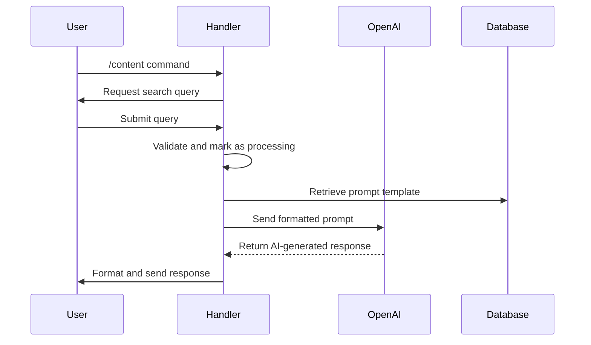
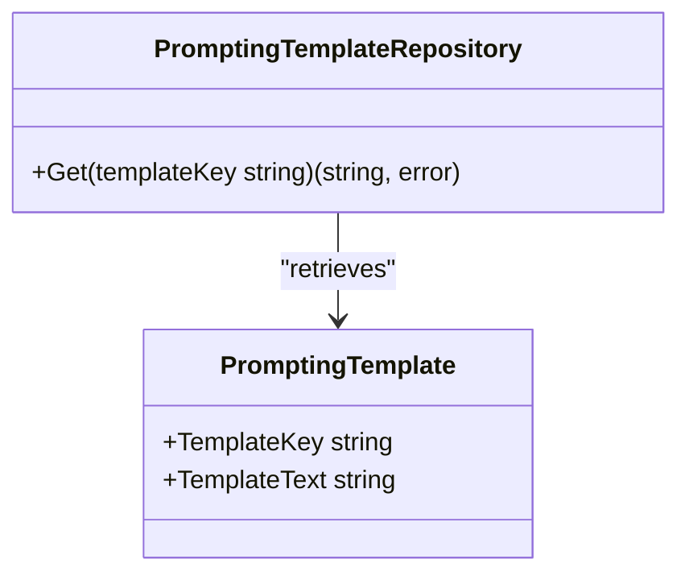
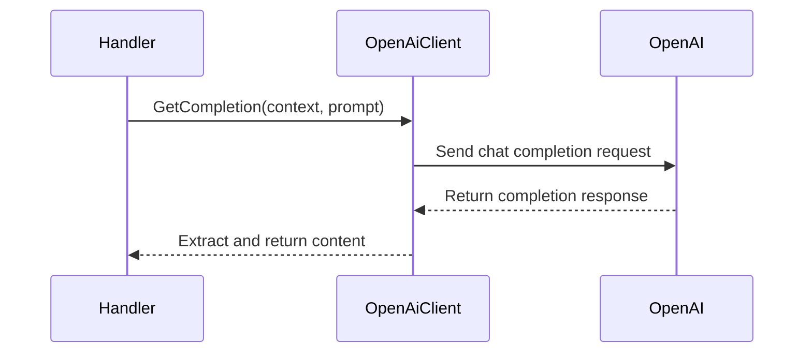
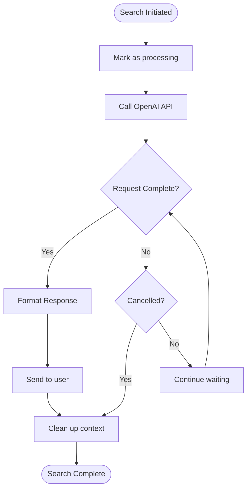

# AI-Powered Search

<cite>
**Referenced Files in This Document**   
- [content_handler.go](file://internal/handlers/privatehandlers/content_handler.go)
- [tools_handler.go](file://internal/handlers/privatehandlers/tools_handler.go)
- [intro_handler.go](file://internal/handlers/privatehandlers/intro_handler.go)
- [openai_client.go](file://internal/clients/openai_client.go)
- [content_prompt.go](file://internal/database/prompts/content_prompt.go)
- [tool_prompt.go](file://internal/database/prompts/tool_prompt.go)
- [intro_prompt.go](file://internal/database/prompts/intro_prompt.go)
- [prompting_templates_repository.go](file://internal/database/repositories/prompting_templates_repository.go)
- [config.go](file://internal/config/config.go)
</cite>

## Table of Contents
1. [Introduction](#introduction)
2. [Search Functionality Overview](#search-functionality-overview)
3. [Handler Invocation Flow](#handler-invocation-flow)
4. [Prompt Management System](#prompt-management-system)
5. [OpenAI Integration](#openai-integration)
6. [Configuration Options](#configuration-options)
7. [Search Parameters and Return Values](#search-parameters-and-return-values)
8. [Handling Ambiguous Queries](#handling-ambiguous-queries)
9. [Error Handling and Cancellation](#error-handling-and-cancellation)
10. [Implementation Examples](#implementation-examples)

## Introduction
The AI-Powered Search feature set in evocoders-bot-go provides three specialized search functionalities: content search (/content), tool search (/tool), and member introduction search (/intro). These features leverage OpenAI's language models to deliver intelligent, context-aware responses to user queries. The system follows a consistent pattern across all search types, using conversation-based handlers that guide users through query input, process requests with AI assistance, and return formatted responses. This documentation details the implementation architecture, component interactions, and operational characteristics of this search system.

## Search Functionality Overview
The AI-Powered Search system implements three distinct search capabilities through dedicated handlers:

1. **Content Search (/content)**: Searches for educational content and resources within the club's knowledge base
2. **Tool Search (/tool)**: Finds AI development tools and related resources shared in the community
3. **Member Introduction Search (/intro)**: Retrieves information about club members and their expertise

Each search functionality follows a two-step conversation pattern: first prompting the user for a query, then processing that query with AI assistance. The system ensures exclusive processing per user through state management, preventing concurrent requests from the same user. All searches are restricted to private chats and require club membership, enforcing access control through the permissions service.

**Section sources**
- [content_handler.go](file://internal/handlers/privatehandlers/content_handler.go#L37-L64)
- [tools_handler.go](file://internal/handlers/privatehandlers/tools_handler.go#L37-L64)
- [intro_handler.go](file://internal/handlers/privatehandlers/intro_handler.go#L37-L67)

## Handler Invocation Flow
The search system follows a consistent invocation pattern across all three search types. When a user invokes a search command, the following sequence occurs:

1. The command handler validates the chat type and user permissions
2. The system prompts the user to enter a search query
3. Upon receiving the query, the system processes it through the AI pipeline
4. Results are formatted and returned to the user

The conversation state machine ensures proper sequencing of these steps. Each handler uses a two-state conversation: an initial state that captures the user's query, and a processing state that handles the search operation. The system maintains user context through a UserDataStore, tracking processing status, cancellation functions, and message references.

**Diagram sources**
- [content_handler.go](file://internal/handlers/privatehandlers/content_handler.go#L105-L138)
- [tools_handler.go](file://internal/handlers/privatehandlers/tools_handler.go#L105-L138)
- [intro_handler.go](file://internal/handlers/privatehandlers/intro_handler.go#L105-L138)

## Prompt Management System
The search system utilizes a database-stored prompt template system that allows for dynamic prompt customization without code changes. Prompt templates are stored in the `prompting_templates` database table and retrieved by key during search operations.

Three primary prompt templates are used:
- `get_content_prompt`: For content search operations
- `get_tool_prompt`: For tool search operations  
- `get_intro_prompt`: For member introduction searches

Each template follows a structured format with placeholders for dynamic content insertion. The system retrieves the appropriate template using the PromptingTemplateRepository, which executes a parameterized SQL query to fetch the template text by its key. Default templates are inserted during database migration if they don't exist, ensuring system resilience.

**Section sources**
- [prompting_templates_repository.go](file://internal/database/repositories/prompting_templates_repository.go#L0-L41)
- [content_prompt.go](file://internal/database/prompts/content_prompt.go#L0-L38)
- [tool_prompt.go](file://internal/database/prompts/tool_prompt.go#L0-L42)
- [intro_prompt.go](file://internal/database/prompts/intro_prompt.go#L0-L23)

## OpenAI Integration
The system integrates with OpenAI through a dedicated OpenAiClient that abstracts the API interaction. The client is configured to use the o3-mini model for chat completions, providing a balance of capability and cost efficiency. The integration follows a clean separation of concerns, with the client handling authentication, request formatting, and response parsing.

When processing a search query, the system constructs a comprehensive prompt by combining the retrieved template with contextual data and the user's query. The prompt includes structured data in JSON format, providing the AI model with rich context for generating accurate responses. During processing, the system displays typing indicators every 5 seconds to maintain user engagement during potentially lengthy AI responses.

**Section sources**
- [openai_client.go](file://internal/clients/openai_client.go#L0-L49)
- [content_handler.go](file://internal/handlers/privatehandlers/content_handler.go#L170-L208)
- [tools_handler.go](file://internal/handlers/privatehandlers/tools_handler.go#L170-L207)
- [intro_handler.go](file://internal/handlers/privatehandlers/intro_handler.go#L162-L194)

## Configuration Options
The search system is highly configurable through environment variables defined in the Config structure. Key configuration options include:

- **API Keys**: OpenAIAPIKey for authenticating with the OpenAI service
- **Chat Identifiers**: SuperGroupChatID for constructing message links
- **Topic IDs**: ContentTopicID, ToolTopicID, and IntroTopicID for directing searches to specific conversation threads
- **Feature Flags**: Various boolean flags to enable or disable system components

These configuration values are loaded at startup from environment variables, allowing for environment-specific settings without code changes. The system validates critical configuration values and fails to start if required values are missing, ensuring operational reliability.

**Section sources**
- [config.go](file://internal/config/config.go#L0-L340)

## Search Parameters and Return Values
Each search operation processes user input through a standardized parameter flow. The primary input parameter is the user's search query, which is trimmed and validated before processing. Empty queries are rejected with appropriate user feedback.

The system returns AI-generated responses formatted according to the specific prompt template requirements. Content search results include content titles as clickable links with publication dates, while tool search results include tool descriptions and associated club content. Member introduction searches return participant information with links to their introductions.

All responses are limited to a maximum of 10 results by default, with the option for users to request different quantities. Results are sorted by relevance, with content and tools sorted by recency. The system preserves Markdown formatting in responses, enabling rich text presentation in the Telegram interface.

**Section sources**
- [content_prompt.go](file://internal/database/prompts/content_prompt.go#L0-L38)
- [tool_prompt.go](file://internal/database/prompts/tool_prompt.go#L0-L42)
- [intro_prompt.go](file://internal/database/prompts/intro_prompt.go#L0-L23)

## Handling Ambiguous Queries
The system employs several strategies to handle ambiguous or unclear queries. When a query could match multiple items, the AI model is instructed to return all relevant results rather than making an arbitrary selection. The prompt templates include specific guidance on handling partial matches, instructing the AI to explain why each result was selected when the connection is not exact.

For tool searches, the system handles case-insensitive matching, ensuring that queries for tools are not affected by capitalization differences. When no results are found, the system provides constructive feedback rather than simply stating that nothing was found, often suggesting alternative search terms or resources.

The AI model's natural language understanding capabilities allow it to interpret synonyms and related concepts, expanding the effective search scope without requiring exact keyword matches. This semantic search capability significantly improves the user experience by understanding the intent behind queries rather than just their literal content.

**Section sources**
- [tool_prompt.go](file://internal/database/prompts/tool_prompt.go#L0-L42)
- [content_prompt.go](file://internal/database/prompts/content_prompt.go#L0-L38)

## Error Handling and Cancellation
The search system implements comprehensive error handling and user cancellation capabilities. Each search operation runs within a cancellable context, allowing for graceful termination when users invoke the /cancel command. The system stores cancellation functions in the user context store, enabling the cancellation of ongoing AI requests.

When an error occurs during search processing, the system provides user-friendly error messages while logging detailed technical information for debugging. Common error conditions include template retrieval failures, AI service connectivity issues, and response formatting problems. The system ensures that error conditions do not leave users in a broken state by cleaning up conversation context and restoring normal bot functionality.

Users can cancel ongoing searches through either the /cancel command or a dedicated cancel button in the interface. The system acknowledges cancellation requests immediately and terminates the underlying AI request, preventing unnecessary API usage and costs.

**Section sources**
- [content_handler.go](file://internal/handlers/privatehandlers/content_handler.go#L238-L271)
- [tools_handler.go](file://internal/handlers/privatehandlers/tools_handler.go#L272-L305)
- [intro_handler.go](file://internal/handlers/privatehandlers/intro_handler.go#L238-L271)

## Implementation Examples
The three search handlers follow nearly identical implementation patterns with minor variations for their specific domains. The content_handler, tools_handler, and intro_handler each implement the same core structure: command registration, query processing, prompt construction, AI integration, and response delivery.

The primary differences between the handlers lie in the data preparation phase. The content and tools handlers prepare message data from chat topics, while the intro_handler retrieves profile data from the database. Despite these differences, the overall flow remains consistent, demonstrating the system's well-factored design.

All handlers write constructed prompts to temporary files (last-prompt-log.txt) for debugging and auditing purposes, enabling developers to analyze exactly what prompts were sent to the AI service. This logging capability is invaluable for optimizing prompt effectiveness and troubleshooting response quality issues.

**Section sources**
- [content_handler.go](file://internal/handlers/privatehandlers/content_handler.go#L0-L340)
- [tools_handler.go](file://internal/handlers/privatehandlers/tools_handler.go#L0-L325)
- [intro_handler.go](file://internal/handlers/privatehandlers/intro_handler.go#L0-L341)