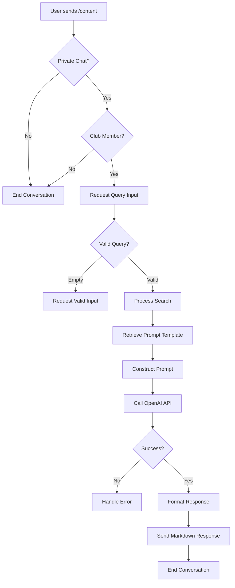
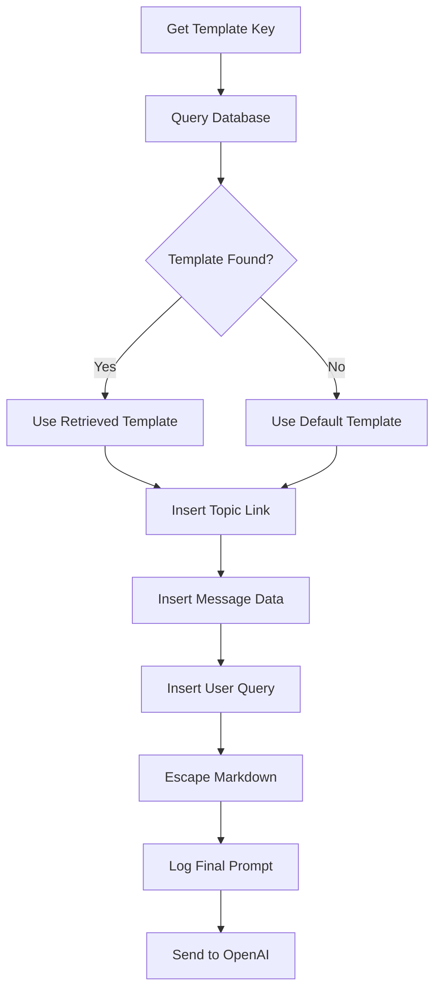

# Content Search

<cite>
**Referenced Files in This Document**   
- [content_handler.go](file://internal/handlers/privatehandlers/content_handler.go)
- [openai_client.go](file://internal/clients/openai_client.go)
- [content_prompt.go](file://internal/database/prompts/content_prompt.go)
- [config.go](file://internal/config/config.go)
- [prompting_templates_repository.go](file://internal/database/repositories/prompting_templates_repository.go)
</cite>

## Table of Contents
1. [Introduction](#introduction)
2. [Content Search Workflow](#content-search-workflow)
3. [Conversation State Management](#conversation-state-management)
4. [Query Validation and Processing](#query-validation-and-processing)
5. [Prompt Construction and Template Retrieval](#prompt-construction-and-template-retrieval)
6. [OpenAI Integration and Response Handling](#openai-integration-and-response-handling)
7. [Cancellation and Context Management](#cancellation-and-context-management)
8. [Configuration Parameters](#configuration-parameters)
9. [Error Handling and Common Issues](#error-handling-and-common-issues)
10. [Technical Deep Dive](#technical-deep-dive)

## Introduction
The Content Search feature (/content) in evocoders-bot-go enables users to search for content within the Evolution Code Club community using natural language queries. This document details the implementation of the contentHandler, which orchestrates the entire search process from user input to AI-generated responses. The system leverages OpenAI's language models with custom prompting templates stored in the database to deliver relevant, formatted results. The feature includes robust state management, cancellation capabilities, and user experience enhancements like typing indicators.

## Content Search Workflow
The content search process follows a structured conversation flow initiated by the /content command. The handler manages user interactions through distinct states, ensuring a seamless experience from query input to result delivery. The workflow begins with permission checks, proceeds through query processing, and concludes with response formatting and delivery.



**Diagram sources**
- [content_handler.go](file://internal/handlers/privatehandlers/content_handler.go#L105-L138)
- [content_handler.go](file://internal/handlers/privatehandlers/content_handler.go#L170-L208)

**Section sources**
- [content_handler.go](file://internal/handlers/privatehandlers/content_handler.go#L64-L105)

## Conversation State Management
The contentHandler implements a stateful conversation using the gotgbot/v2 framework's conversation system. It maintains state through user-specific data storage, tracking the progression from initial command invocation to final response delivery. The primary state, contentStateProcessQuery, manages the query processing phase after the user initiates the search.

The handler uses UserDataStore to maintain conversation context across multiple messages, storing critical information such as processing status, cancellation functions, and message identifiers. This approach prevents concurrent searches and enables proper cleanup of resources when conversations end.

**Section sources**
- [content_handler.go](file://internal/handlers/privatehandlers/content_handler.go#L39-L64)
- [content_handler.go](file://internal/handlers/privatehandlers/content_handler.go#L105-L138)

## Query Validation and Processing
The system implements comprehensive query validation to ensure robust operation. When a user submits a query, the handler first checks if another search is already in progress for that user, preventing resource exhaustion. Empty queries are rejected with a helpful message guiding the user to provide valid input or cancel the operation.

The validation process occurs in the processContentSearch method, which verifies the query's presence and non-empty status before proceeding. During processing, the handler marks the user as "processing" in the UserDataStore, creating a lock that prevents concurrent searches. This mechanism ensures system stability and provides clear feedback when users attempt to initiate multiple searches simultaneously.

**Section sources**
- [content_handler.go](file://internal/handlers/privatehandlers/content_handler.go#L105-L138)

## Prompt Construction and Template Retrieval
The prompt construction process begins with retrieving a template from the database using the GetContentPromptTemplateDbKey constant. The PromptingTemplateRepository queries the prompting_templates table for the template associated with this key, falling back to a default template if none is found.

Once retrieved, the template is populated with dynamic values including the topic link (constructed from SuperGroupChatID and ContentTopicID), formatted message data, and the user's query. The prepareTelegramMessages method converts raw message data into a JSON structure with properly formatted dates, which is then escaped for safe inclusion in the prompt. The complete prompt is logged to a temporary file for debugging purposes.



**Diagram sources**
- [content_handler.go](file://internal/handlers/privatehandlers/content_handler.go#L170-L208)
- [content_prompt.go](file://internal/database/prompts/content_prompt.go#L0-L38)
- [prompting_templates_repository.go](file://internal/database/repositories/prompting_templates_repository.go#L0-L42)

**Section sources**
- [content_handler.go](file://internal/handlers/privatehandlers/content_handler.go#L170-L208)
- [content_prompt.go](file://internal/database/prompts/content_prompt.go#L0-L38)

## OpenAI Integration and Response Handling
The system integrates with OpenAI through the OpenAiClient, which provides a clean interface for generating completions. The GetCompletion method sends the constructed prompt to OpenAI's API using the o3-mini model, with the request scoped to the cancellable context created for the operation.

While waiting for the OpenAI response, the system sends periodic typing indicators to the user every 5 seconds, enhancing the user experience during potentially long processing times. Upon receiving a response, the system validates that the context wasn't cancelled before proceeding. Successful responses are delivered to the user using ReplyMarkdown, preserving the formatting instructions from the prompt. Error responses are handled gracefully with appropriate user feedback and logging.

**Section sources**
- [content_handler.go](file://internal/handlers/privatehandlers/content_handler.go#L170-L208)
- [openai_client.go](file://internal/clients/openai_client.go#L49-L97)

## Cancellation and Context Management
The cancellation system provides users with control over long-running searches through both the /cancel command and an inline cancel button. When a search begins, the handler creates a cancellable context and stores its cancellation function in the UserDataStore using the contentCtxDataKeyCancelFunc key.

When cancellation is requested, the stored cancellation function is invoked, terminating the OpenAI API call at the context level. This approach ensures immediate termination of external requests while allowing proper cleanup of resources. The handler then removes any inline keyboards and clears the user's stored data, returning to a clean state. The context cancellation is checked after the OpenAI call to determine if the operation was terminated by user request.

**Section sources**
- [content_handler.go](file://internal/handlers/privatehandlers/content_handler.go#L245-L283)
- [content_handler.go](file://internal/handlers/privatehandlers/content_handler.go#L105-L138)

## Configuration Parameters
The Content Search feature relies on several configuration parameters defined in the Config struct. The SuperGroupChatID and ContentTopicID parameters are used to construct the topic link included in the prompt, enabling the AI to reference specific content locations. These values are loaded from environment variables during application startup, allowing for deployment-specific configuration without code changes.

Other relevant configuration includes the OpenAIAPIKey for authenticating with the OpenAI service and various timeout and rate-limiting parameters that affect the search behavior. The configuration system supports optional parameters with sensible defaults, ensuring the application remains functional even when certain environment variables are not set.

**Section sources**
- [config.go](file://internal/config/config.go#L0-L318)
- [content_handler.go](file://internal/handlers/privatehandlers/content_handler.go#L170-L208)

## Error Handling and Common Issues
The system implements comprehensive error handling for various failure scenarios. Empty queries are handled with user-friendly messages that guide the user toward valid input. Processing delays are mitigated through the typing indicator system, which provides feedback during long operations.

API errors from OpenAI are caught and translated into user-appropriate messages, with detailed logging for debugging. Template retrieval failures result in graceful degradation, allowing the system to continue with default templates. The context cancellation mechanism handles timeouts and user-initiated cancellations consistently. All errors are logged with contextual information to facilitate troubleshooting while maintaining a clean user experience.

**Section sources**
- [content_handler.go](file://internal/handlers/privatehandlers/content_handler.go#L105-L138)
- [content_handler.go](file://internal/handlers/privatehandlers/content_handler.go#L170-L208)
- [content_handler.go](file://internal/handlers/privatehandlers/content_handler.go#L245-L283)

## Technical Deep Dive
The content search implementation demonstrates several advanced patterns in bot development. The use of conversation states with the gotgbot framework enables complex multi-step interactions while maintaining code clarity. The UserDataStore abstraction provides a clean interface for managing user-specific state across the conversation lifecycle.

The integration with OpenAI showcases proper context management, using cancellable contexts to control external API calls and prevent resource leaks. The prompt templating system separates concerns between business logic and AI instruction design, allowing non-developers to modify prompt behavior through the database. The typing indicator system enhances user experience during potentially long-running operations, demonstrating attention to interaction design details.

```mermaid
classDiagram
class contentHandler {
+config *Config
+openaiClient *OpenAiClient
+promptingTemplateRepository *PromptingTemplateRepository
+messageSenderService *MessageSenderService
+userStore *UserDataStore
+permissionsService *PermissionsService
+startContentSearch(b *gotgbot.Bot, ctx *ext.Context) error
+processContentSearch(b *gotgbot.Bot, ctx *ext.Context) error
+handleCancel(b *gotgbot.Bot, ctx *ext.Context) error
+prepareTelegramMessages(messages []*GroupMessage) ([]byte, error)
}
class OpenAiClient {
+client *openai.Client
+GetCompletion(ctx context.Context, message string) (string, error)
+GetEmbedding(ctx context.Context, text string) ([]float64, error)
+GetBatchEmbeddings(ctx context.Context, texts []string) ([][]float64, error)
}
class PromptingTemplateRepository {
+db *sql.DB
+Get(templateKey string) (string, error)
}
contentHandler --> OpenAiClient : "uses"
contentHandler --> PromptingTemplateRepository : "uses"
contentHandler --> MessageSenderService : "uses"
contentHandler --> UserDataStore : "uses"
contentHandler --> PermissionsService : "uses"
OpenAiClient ..> "openai.Client" : "wraps"
```

**Diagram sources**
- [content_handler.go](file://internal/handlers/privatehandlers/content_handler.go#L39-L64)
- [openai_client.go](file://internal/clients/openai_client.go#L0-L49)
- [prompting_templates_repository.go](file://internal/database/repositories/prompting_templates_repository.go#L0-L42)

**Section sources**
- [content_handler.go](file://internal/handlers/privatehandlers/content_handler.go#L0-L340)
- [openai_client.go](file://internal/clients/openai_client.go#L0-L97)