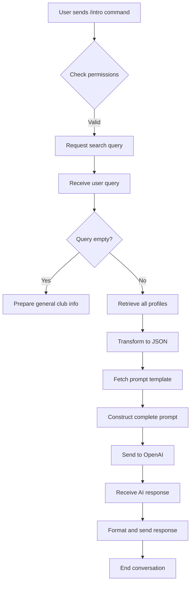
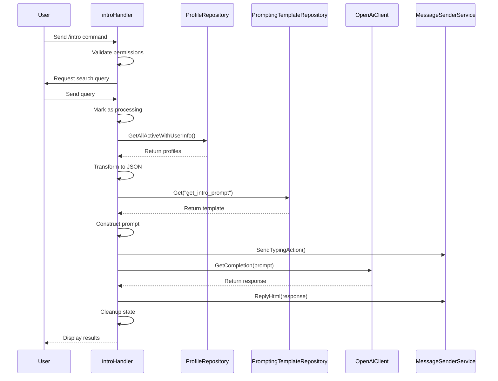
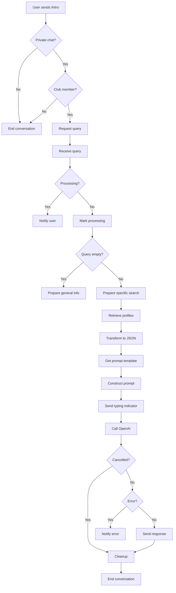
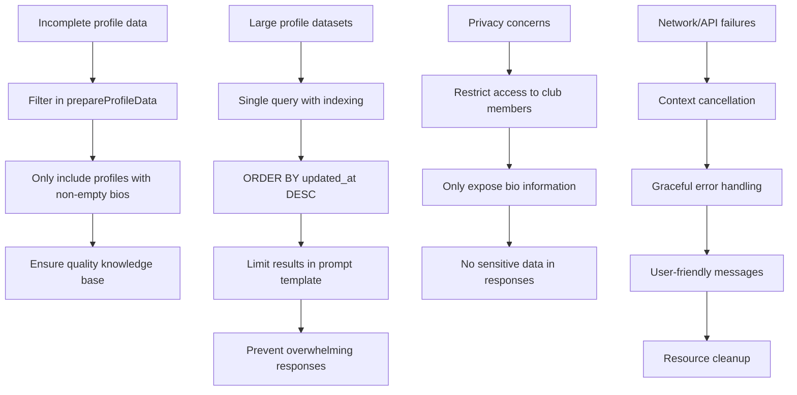

# Member Introduction Search

<cite>
**Referenced Files in This Document**   
- [intro_handler.go](file://internal/handlers/privatehandlers/intro_handler.go)
- [profile_repository.go](file://internal/database/repositories/profile_repository.go)
- [intro_prompt.go](file://internal/database/prompts/intro_prompt.go)
- [openai_client.go](file://internal/clients/openai_client.go)
- [prompting_templates_repository.go](file://internal/database/repositories/prompting_templates_repository.go)
</cite>

## Update Summary
**Changes Made**   
- Updated OpenAI client configuration to reflect the upgraded Go client v2.5.0
- Corrected AI model reference from GPT-5 to GPT-5 Mini based on recent changes
- Updated reasoning effort setting from minimal to medium in OpenAI API calls
- Modified import paths to align with the new OpenAI Go client version
- Ensured all documentation accurately reflects current AI model usage and configuration

## Table of Contents
1. [Introduction](#introduction)
2. [Core Components](#core-components)
3. [Data Flow and Processing](#data-flow-and-processing)
4. [Architecture Overview](#architecture-overview)
5. [Detailed Component Analysis](#detailed-component-analysis)
6. [Error Handling and User Experience](#error-handling-and-user-experience)
7. [Common Issues and Solutions](#common-issues-and-solutions)
8. [Conclusion](#conclusion)

## Introduction
The Member Introduction Search feature (/intro) in evocoders-bot-go enables users to search for information about club members through an AI-powered interface. This feature retrieves comprehensive profile data from the database, processes it into structured JSON format, and uses OpenAI to generate natural language responses based on user queries. The system is designed to handle both specific member searches and general club information requests, providing a seamless experience with real-time typing indicators and request cancellation capabilities. This documentation details the implementation of the introHandler, focusing on its data retrieval, transformation, and AI integration processes.

## Core Components

The Member Introduction Search feature is built around several key components that work together to deliver search functionality. The introHandler serves as the main controller, coordinating between data retrieval, prompt construction, and response generation. It interacts with the ProfileRepository to fetch member profiles, the PromptingTemplateRepository to retrieve AI instruction templates, and the OpenAiClient to generate responses. The feature also leverages the MessageSenderService for user communication and the UserDataStore for managing conversation state. These components work in concert to provide a responsive and reliable search experience that respects user permissions and handles edge cases appropriately.

**Section sources**
- [intro_handler.go](file://internal/handlers/privatehandlers/intro_handler.go#L37-L67)
- [profile_repository.go](file://internal/database/repositories/profile_repository.go#L223-L284)
- [openai_client.go](file://internal/clients/openai_client.go#L0-L49)

## Data Flow and Processing

The data flow for the Member Introduction Search feature follows a structured sequence from user input to AI-generated response. When a user invokes the /intro command, the introHandler initiates a conversation state and prompts for a search query. The system first validates user permissions and checks for any ongoing requests to prevent concurrent processing. Once a query is received, the handler retrieves all member profiles with associated user information through the GetAllActiveWithUserInfo method of the ProfileRepository. This data is then transformed into a structured JSON format by the prepareProfileData method, which extracts relevant fields like names, usernames, bios, and message IDs. The JSON data is incorporated into a prompt template retrieved from the database using the Get method of the PromptingTemplateRepository. This complete prompt, containing both the knowledge base and user query, is sent to OpenAI for processing. The resulting response is formatted in HTML and returned to the user, completing the search cycle.



**Diagram sources**
- [intro_handler.go](file://internal/handlers/privatehandlers/intro_handler.go#L111-L145)
- [profile_repository.go](file://internal/database/repositories/profile_repository.go#L223-L284)
- [intro_handler.go](file://internal/handlers/privatehandlers/intro_handler.go#L173-L210)

## Architecture Overview

The Member Introduction Search feature follows a clean separation of concerns architecture, with distinct layers for handling, data access, and external services. The introHandler in the handlers layer manages the conversation flow and user interaction, delegating data operations to repositories in the database layer. The ProfileRepository handles all profile-related database operations, while the PromptingTemplateRepository manages prompt templates. These repositories interact with the underlying PostgreSQL database through SQL queries. The clients layer contains the OpenAiClient, which provides a wrapper around the OpenAI API for generating responses. The services layer supports the feature with utilities like the MessageSenderService for Telegram communication and the UserDataStore for maintaining conversation state. This layered architecture ensures that each component has a single responsibility, making the system maintainable and testable.


**Diagram sources**
- [intro_handler.go](file://internal/handlers/privatehandlers/intro_handler.go#L37-L67)
- [profile_repository.go](file://internal/database/repositories/profile_repository.go#L223-L284)
- [prompting_templates_repository.go](file://internal/database/repositories/prompting_templates_repository.go#L0-L42)

## Detailed Component Analysis

### introHandler Analysis

The introHandler is the central component of the Member Introduction Search feature, implementing a stateful conversation pattern to guide users through the search process. It begins by validating that the user is in a private chat and has club member permissions before proceeding. The handler uses a conversation state machine with states like introStateProcessQuery to manage the interaction flow. It prevents concurrent requests by tracking processing status in the UserDataStore using the introCtxDataKeyProcessing key. When a query is received, the handler creates a cancellable context to allow for request interruption, stores the cancel function in the UserDataStore, and displays appropriate messaging to the user. The handler coordinates the entire search process, from data retrieval to response delivery, ensuring proper cleanup of resources and state regardless of the outcome.

#### For Object-Oriented Components:
```mermaid
classDiagram
class introHandler {
+config *Config
+openaiClient *OpenAiClient
+promptingTemplateRepository *PromptingTemplateRepository
+profileRepository *ProfileRepository
+messageSenderService *MessageSenderService
+userStore *UserDataStore
+permissionsService *PermissionsService
+startIntroSearch(b *Bot, ctx *Context) error
+processIntroSearch(b *Bot, ctx *Context) error
+handleCancel(b *Bot, ctx *Context) error
+prepareProfileData() ([]byte, error)
+MessageRemoveInlineKeyboard(b *Bot, userID *int64)
+SavePreviousMessageInfo(userID int64, sentMsg *Message)
}
class ProfileRepository {
+db *sql.DB
+GetAllActiveWithUserInfo() ([]ProfileWithUser, error)
}
class PromptingTemplateRepository {
+db *sql.DB
+Get(templateKey string) (string, error)
}
class OpenAiClient {
+client *openai.Client
+GetCompletion(ctx context.Context, message string) (string, error)
}
class MessageSenderService {
+Reply(msg *Message, text string, opts *SendMessageOpts) (*Message, error)
+SendTypingAction(chatId int64)
+RemoveInlineKeyboard(chatId int64, messageId int64)
}
class UserDataStore {
+Set(userID int64, key string, value interface{})
+Get(userID int64, key string) (interface{}, bool)
+Clear(userID int64)
}
introHandler --> ProfileRepository : "uses"
introHandler --> PromptingTemplateRepository : "uses"
introHandler --> OpenAiClient : "uses"
introHandler --> MessageSenderService : "uses"
introHandler --> UserDataStore : "uses"
```

**Diagram sources**
- [intro_handler.go](file://internal/handlers/privatehandlers/intro_handler.go#L37-L67)
- [profile_repository.go](file://internal/database/repositories/profile_repository.go#L223-L284)
- [prompting_templates_repository.go](file://internal/database/repositories/prompting_templates_repository.go#L0-L42)

#### For API/Service Components:


**Diagram sources**
- [intro_handler.go](file://internal/handlers/privatehandlers/intro_handler.go#L111-L145)
- [profile_repository.go](file://internal/database/repositories/profile_repository.go#L223-L284)
- [prompting_templates_repository.go](file://internal/database/repositories/prompting_templates_repository.go#L20-L41)

#### For Complex Logic Components:


**Diagram sources**
- [intro_handler.go](file://internal/handlers/privatehandlers/intro_handler.go#L111-L248)
- [profile_repository.go](file://internal/database/repositories/profile_repository.go#L223-L284)

**Section sources**
- [intro_handler.go](file://internal/handlers/privatehandlers/intro_handler.go#L0-L341)
- [profile_repository.go](file://internal/database/repositories/profile_repository.go#L223-L284)

## Error Handling and User Experience

The Member Introduction Search feature implements comprehensive error handling and user experience improvements to ensure reliability and usability. The system prevents concurrent requests by tracking processing status in the UserDataStore, notifying users if they attempt to initiate multiple searches simultaneously. It provides real-time feedback through typing indicators that are sent every 5 seconds while waiting for the OpenAI response, giving users confidence that their request is being processed. The feature supports request cancellation through both the /cancel command and a dedicated cancel button, which uses context cancellation to terminate the OpenAI API call and clean up conversation state. Error handling is implemented at multiple levels, with specific messages for database errors, template retrieval failures, OpenAI API issues, and response sending problems. All errors are logged for debugging purposes while user-friendly messages are displayed. The system also handles the special case of empty queries by providing general club information, enhancing usability for users exploring the feature.

```mermaid
flowchart TD
A[User action] --> B{Error occurs?}
B --> |No| C[Continue normally]
B --> |Yes| D[Log error details]
D --> E[Send user-friendly message]
E --> F[Cleanup resources]
F --> G[End conversation]
H[/cancel command] --> I[Check for cancel function]
I --> J{Exists?}
J --> |Yes| K[Call cancel function]
J --> |No| L[Send cancelled message]
K --> M[Stop OpenAI request]
L --> N[Remove keyboard]
M --> N
N --> O[Clear user data]
O --> P[End conversation]
Q[OpenAI request] --> R{Context cancelled?}
R --> |Yes| S[Return early]
R --> |No| T{Error?}
T --> |Yes| U[Handle error]
T --> |No| V[Process response]
```

**Diagram sources**
- [intro_handler.go](file://internal/handlers/privatehandlers/intro_handler.go#L247-L287)
- [intro_handler.go](file://internal/handlers/privatehandlers/intro_handler.go#L212-L248)
- [openai_client.go](file://internal/clients/openai_client.go#L48-L96)

**Section sources**
- [intro_handler.go](file://internal/handlers/privatehandlers/intro_handler.go#L111-L248)
- [openai_client.go](file://internal/clients/openai_client.go#L48-L96)

## Common Issues and Solutions

The Member Introduction Search feature addresses several common issues through thoughtful design and implementation. For incomplete profile data, the system filters out profiles with empty bios during the data preparation phase, ensuring only complete profiles are included in the knowledge base. This filtering occurs in the prepareProfileData method, which checks that the Bio field is non-empty before including a profile in the JSON output. To manage large profile datasets, the system retrieves all profiles in a single database query with appropriate indexing on the user_id field, minimizing database load. The prompt template itself includes a limit of 10 results to prevent overwhelming responses. For privacy concerns, the system only exposes information that members have explicitly included in their bios, and access is restricted to club members through the CheckClubMemberPermissions method. The feature also handles network and API failures gracefully, with retry mechanisms and user-friendly error messages. The use of context cancellation ensures that long-running OpenAI requests can be terminated promptly, preventing resource leaks and improving responsiveness.



**Diagram sources**
- [intro_handler.go](file://internal/handlers/privatehandlers/intro_handler.go#L247-L287)
- [profile_repository.go](file://internal/database/repositories/profile_repository.go#L223-L284)
- [intro_prompt.go](file://internal/database/prompts/intro_prompt.go#L0-L23)

**Section sources**
- [intro_handler.go](file://internal/handlers/privatehandlers/intro_handler.go#L287-L341)
- [profile_repository.go](file://internal/database/repositories/profile_repository.go#L223-L284)
- [intro_prompt.go](file://internal/database/prompts/intro_prompt.go#L0-L23)

## Conclusion

The Member Introduction Search feature in evocoders-bot-go demonstrates a well-architected approach to AI-powered information retrieval. By combining efficient data access, structured prompt engineering, and robust error handling, the feature provides a reliable and user-friendly search experience. The introHandler effectively orchestrates the entire process, from initial user interaction to final response delivery, while maintaining clean separation of concerns through its dependency on specialized repositories and services. The implementation addresses key challenges such as data quality, performance, privacy, and user experience through thoughtful design choices and comprehensive error handling. The use of cancellable contexts, typing indicators, and permission checks enhances usability and reliability. This feature serves as a strong example of how to integrate AI capabilities into a messaging application while maintaining code quality, performance, and user satisfaction.