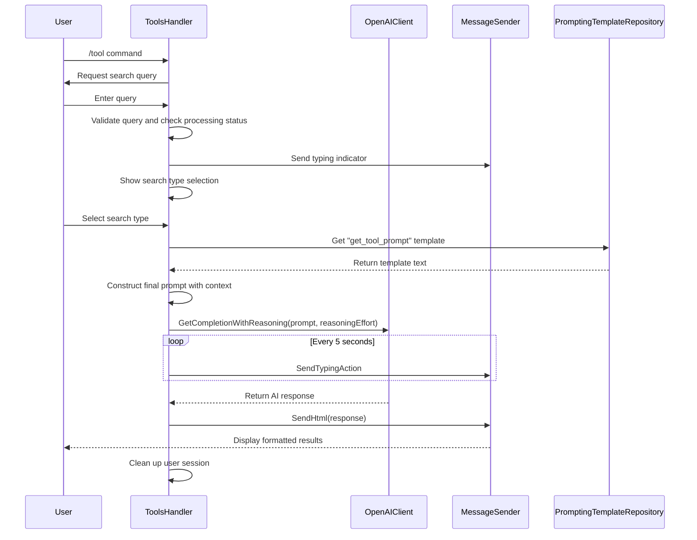

# Tool Search

<cite>
**Referenced Files in This Document**   
- [tools_handler.go](file://internal/handlers/privatehandlers/tools_handler.go) - *Updated in recent commit with search type selection*
- [tool_prompt.go](file://internal/database/prompts/tool_prompt.go) - *Prompt template definition*
- [openai_client.go](file://internal/clients/openai_client.go) - *Updated with reasoning effort support*
- [config.go](file://internal/config/config.go) - *Configuration parameters*
- [prompting_templates_repository.go](file://internal/database/repositories/prompting_templates_repository.go) - *Template retrieval logic*
- [message_sender_service.go](file://internal/services/message_sender_service.go) - *Message delivery and typing indicators*
</cite>

## Update Summary
**Changes Made**   
- Added comprehensive documentation for search type selection feature with inline keyboard
- Updated OpenAI integration details to reflect use of reasoning effort based on search type
- Modified message formatting to use HTML instead of Markdown
- Added new section on search type selection and processing
- Updated code examples to reflect current implementation with search type handling
- Enhanced error handling and state management documentation
- Updated diagram to reflect new conversation flow with search type selection

## Table of Contents
1. [Introduction](#introduction)
2. [Conversation Flow](#conversation-flow)
3. [State Management](#state-management)
4. [Search Type Selection](#search-type-selection)
5. [Prompt Template Retrieval and Construction](#prompt-template-retrieval-and-construction)
6. [OpenAI Integration and Response Processing](#openai-integration-and-response-processing)
7. [Message Formatting and Delivery](#message-formatting-and-delivery)
8. [Configuration Parameters](#configuration-parameters)
9. [Error Handling and Edge Cases](#error-handling-and-edge-cases)
10. [Performance and Concurrency](#performance-and-concurrency)

## Introduction
The Tool Search feature (/tool) in evocoders-bot-go enables users to search for AI development tools discussed in the "Tools" channel of the EvoCoders club. This functionality is powered by an AI assistant named Jenkins Webster, who acts as a butler for the club. The feature leverages OpenAI's language model to interpret user queries, search through a database of tool descriptions, and return relevant results in a structured HTML format. The implementation involves a conversation handler that manages user interaction, retrieves prompt templates from the database, constructs dynamic prompts with context, and handles the full lifecycle of the search request.

**Section sources**
- [tools_handler.go](file://internal/handlers/privatehandlers/tools_handler.go#L100-L130)

## Conversation Flow
The tool search process follows a structured conversation flow initiated by the `/tool` command. The handler first validates that the user is in a private chat and has club member permissions before proceeding. It then prompts the user to enter a search query, transitioning into the `toolsStateStartToolSearch` state. After receiving the query, the handler presents an inline keyboard with search type options (fast or deep), moving to the `toolsStateSelectSearchType` state. Users can select their preferred search type via callback buttons. Once a search type is selected, the handler transitions to `toolsStateProcessToolSearch` and initiates the search process. The conversation includes a cancel mechanism via the `/cancel` command or a cancel button, allowing users to terminate ongoing requests. Upon successful completion, the conversation ends with the delivery of search results, while errors or cancellations lead to appropriate user feedback and conversation termination.

**Section sources**
- [tools_handler.go](file://internal/handlers/privatehandlers/tools_handler.go#L100-L130)

## State Management
The toolsHandler implements state management using a combination of conversation states and user context storage. The primary states are `toolsStateStartToolSearch` for receiving queries, `toolsStateSelectSearchType` for choosing search type, and `toolsStateProcessToolSearch` for executing the search. User-specific data is stored in a UserDataStore, which tracks processing status, cancellation functions, previous message information, search queries, and selected search types. This prevents concurrent requests from the same user by checking the `toolsUserCtxDataKeyProcessing` flag. The handler also stores cancellation functions in the context, enabling graceful termination of ongoing operations when users cancel their requests. Previous message IDs and chat IDs are stored to allow cleanup of inline keyboards after interactions.

**Section sources**
- [tools_handler.go](file://internal/handlers/privatehandlers/tools_handler.go#L50-L60)
- [tools_handler.go](file://internal/handlers/privatehandlers/tools_handler.go#L170-L180)

## Search Type Selection
The tool search feature now includes a search type selection mechanism that allows users to choose between fast and deep search modes. After entering their query, users are presented with an inline keyboard containing "Fast Search" and "Deep Search" options. The selection is handled through callback queries with `toolsCallbackFastSearch` and `toolsCallbackDeepSearch` data. The selected search type is stored in the user context using the `toolsUserCtxDataKeySearchType` key. This selection directly impacts the reasoning effort used in the OpenAI API call: fast search uses `ReasoningEffortMinimal` while deep search uses `ReasoningEffortMedium`. The handler ensures that a search type is selected before processing by validating the presence of the search type in the user context, prompting users to make a selection if none has been made.

**Section sources**
- [tools_handler.go](file://internal/handlers/privatehandlers/tools_handler.go#L136-L199)
- [general_constants.go](file://internal/constants/general_constants.go#L13-L14)

## Prompt Template Retrieval and Construction
The handler retrieves the tool-specific prompt template using the `GetToolPromptKey` constant ("get_tool_prompt") to query the `prompting_templates` database table. This template defines Jenkins Webster's behavior, including formatting rules, response structure, and search logic. The final prompt is constructed by combining the retrieved template with dynamic elements: the link to the Tools channel (using `SuperGroupChatID` and `ToolTopicID`), the JSON-formatted message database, and the user's query. All dynamic content is properly escaped using `utils.EscapeMarkdown` to prevent formatting issues. The constructed prompt guides the AI to find relevant tools, format responses in HTML with proper linking, and include related club content when available.

**Section sources**
- [tools_handler.go](file://internal/handlers/privatehandlers/tools_handler.go#L220-L250)
- [tool_prompt.go](file://internal/database/prompts/tool_prompt.go#L2-L42)
- [prompting_templates_repository.go](file://internal/database/repositories/prompting_templates_repository.go#L25-L40)

## OpenAI Integration and Response Processing
The toolsHandler integrates with the OpenAI client through a cancellable context that allows for request termination when users cancel their queries. Before making the API call, the handler starts a periodic typing indicator that sends "typing" actions every 5 seconds to provide user feedback during potentially long-running searches. The `GetCompletionWithReasoning` method is called with the constructed prompt and the reasoning effort determined by the selected search type. The handler uses `ChatModelGPT5Mini` as the model. If the context is cancelled, the request terminates gracefully. Successful responses are delivered to the user via `SendHtml`, while various error conditions (API errors, context cancellation, message sending failures) are logged and reported to the user with appropriate messages.

**Section sources**
- [tools_handler.go](file://internal/handlers/privatehandlers/tools_handler.go#L250-L300)
- [openai_client.go](file://internal/clients/openai_client.go#L50-L70)
- [message_sender_service.go](file://internal/services/message_sender_service.go#L380-L390)

## Message Formatting and Delivery
The `preprocessingMessages` function plays a crucial role in formatting message data for the AI search. It transforms a slice of `GroupMessage` objects into a JSON array of message objects containing ID and message text. This JSON data is then embedded in the prompt as the knowledge base for the AI to search. The response is delivered using `SendHtml`, which parses HTML formatting in the AI's response, creating clickable links to tools and properly formatted lists with supported HTML tags (b, i, a, blockquote). The message sender service automatically disables link previews and sets the appropriate parse mode. After delivering the response, the handler cleans up any previous inline keyboards and clears the user's session data to prepare for future interactions.

**Diagram sources**
- [tools_handler.go](file://internal/handlers/privatehandlers/tools_handler.go#L270-L298)
- [message_sender_service.go](file://internal/services/message_sender_service.go#L380-L390)

**Section sources**
- [tools_handler.go](file://internal/handlers/privatehandlers/tools_handler.go#L270-L298)
- [message_sender_service.go](file://internal/services/message_sender_service.go#L137-L140)

## Configuration Parameters
The Tool Search feature relies on several configuration parameters defined in the Config struct and loaded from environment variables. The `ToolTopicID` parameter is critical as it determines which forum topic contains the tool information and is used to construct the channel link in the prompt. This ID is set via the `TG_EVO_BOT_TOOL_TOPIC_ID` environment variable. Other relevant parameters include `SuperGroupChatID` for constructing the full channel URL, and `OpenAIAPIKey` for authenticating with the OpenAI service. These configuration values are injected into the toolsHandler during initialization, allowing the feature to adapt to different deployment environments without code changes.

**Section sources**
- [config.go](file://internal/config/config.go#L21-L21)
- [tools_handler.go](file://internal/handlers/privatehandlers/tools_handler.go#L100-L120)

## Error Handling and Edge Cases
The implementation includes comprehensive error handling for various edge cases. Empty queries are rejected with a user-friendly message. Concurrent requests from the same user are prevented by checking the processing flag in the user store. Database errors when retrieving the prompt template result in appropriate user feedback and logging. OpenAI API errors are caught and reported to the user. The handler gracefully handles context cancellation when users cancel requests, ensuring resources are properly cleaned up. The message sender service includes logic to handle closed topics by temporarily reopening them to send messages, then closing them again. All errors are logged with contextual information using `utils.GetCurrentTypeName()` for easier debugging.

**Section sources**
- [tools_handler.go](file://internal/handlers/privatehandlers/tools_handler.go#L180-L300)
- [message_sender_service.go](file://internal/services/message_sender_service.go#L440-L480)

## Performance and Concurrency
The Tool Search feature implements several performance optimizations and concurrency controls. The periodic typing indicator maintains user engagement during potentially long-running AI requests without blocking the main execution thread, using a goroutine with a ticker. Context cancellation allows for immediate termination of ongoing requests when users cancel, preventing wasted API calls and resources. The user store prevents concurrent requests from the same user, avoiding rate limits and ensuring a coherent user experience. The handler uses defer statements to ensure cleanup operations (clearing user data, cancelling contexts) are performed regardless of the execution path. The message preparation and JSON marshaling are optimized to handle potentially large message datasets efficiently.

**Section sources**
- [tools_handler.go](file://internal/handlers/privatehandlers/tools_handler.go#L250-L270)
- [tools_handler.go](file://internal/handlers/privatehandlers/tools_handler.go#L170-L180)