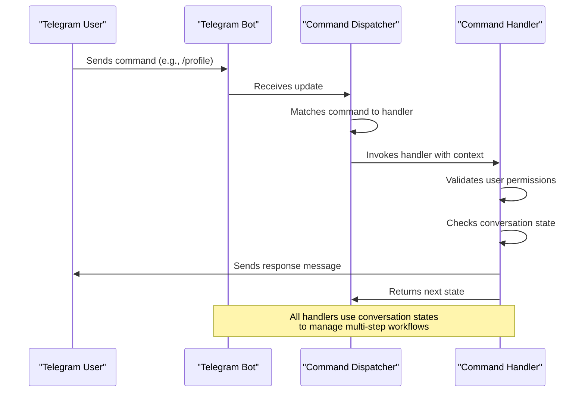
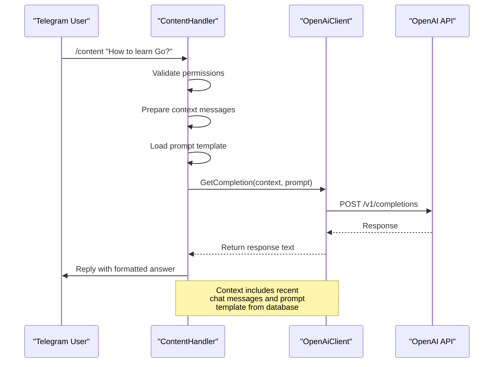
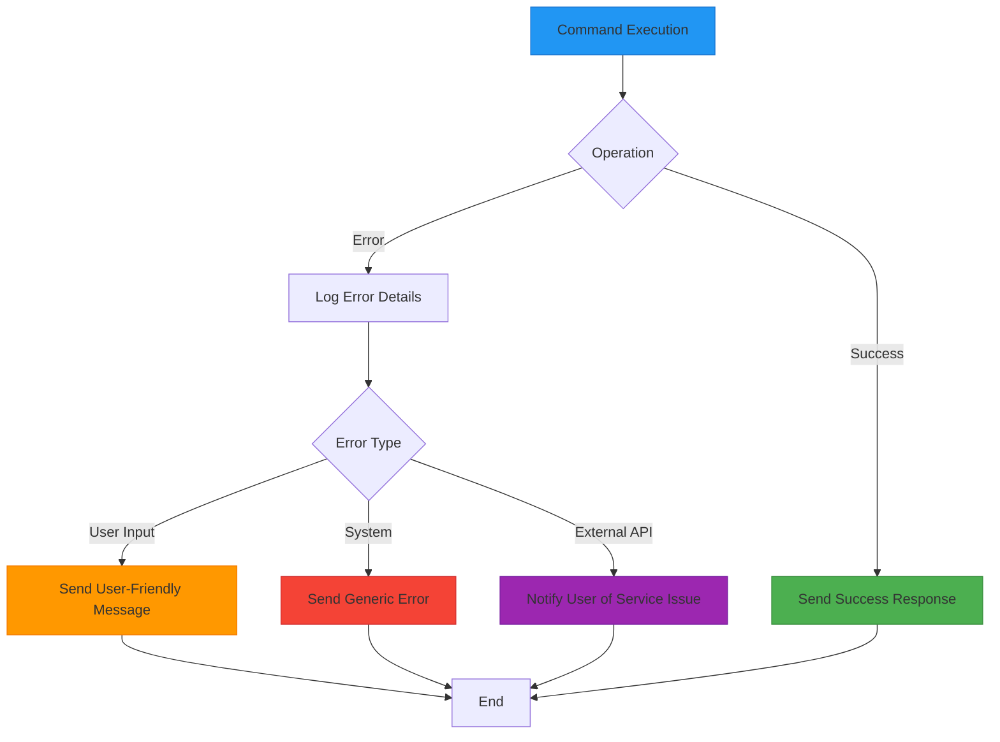

# Telegram Commands

<cite>
**Referenced Files in This Document**   
- [start_handler.go](file://internal/handlers/start_handler.go)
- [help_handler.go](file://internal/handlers/privatehandlers/help_handler.go)
- [profile_handler.go](file://internal/handlers/privatehandlers/profile_handler.go)
- [content_handler.go](file://internal/handlers/privatehandlers/content_handler.go)
- [intro_handler.go](file://internal/handlers/privatehandlers/intro_handler.go)
- [tools_handler.go](file://internal/handlers/privatehandlers/tools_handler.go)
- [events_handler.go](file://internal/handlers/privatehandlers/events_handler.go)
- [event_setup_handler.go](file://internal/handlers/adminhandlers/eventhandlers/event_setup_handler.go)
- [event_edit_handler.go](file://internal/handlers/adminhandlers/eventhandlers/event_edit_handler.go)
- [event_delete_handler.go](file://internal/handlers/adminhandlers/eventhandlers/event_delete_handler.go)
- [event_start_handler.go](file://internal/handlers/adminhandlers/eventhandlers/event_start_handler.go)
- [show_topics_handler.go](file://internal/handlers/adminhandlers/show_topics_handler.go)
- [profiles_manager_handler.go](file://internal/handlers/adminhandlers/profiles_manager_handler.go)
- [try_summarize_handler.go](file://internal/handlers/adminhandlers/testhandlers/try_summarize_handler.go)
- [try_create_coffee_pool_handler.go](file://internal/handlers/adminhandlers/testhandlers/try_create_coffee_pool_handler.go)
- [try_generate_coffee_pairs_handler.go](file://internal/handlers/adminhandlers/testhandlers/try_generate_coffee_pairs_handler.go)
- [general_constants.go](file://internal/constants/general_constants.go)
- [handlers_private_constants.go](file://internal/constants/handlers_private_constants.go)
- [handlers_admin_constants.go](file://internal/constants/handlers_admin_constants.go)
- [bot.go](file://internal/bot/bot.go)
- [permissions_service.go](file://internal/services/permissions_service.go)
- [profile_service.go](file://internal/services/profile_service.go)
- [summarization_service.go](file://internal/services/summarization_service.go)
- [openai_client.go](file://internal/clients/openai_client.go)
</cite>

## Table of Contents
1. [Introduction](#introduction)
2. [Command Processing Flow](#command-processing-flow)
3. [Public Commands](#public-commands)
4. [Admin Commands](#admin-commands)
5. [Test Commands](#test-commands)
6. [Command Workflows](#command-workflows)
7. [Service Integration](#service-integration)
8. [Error Handling and Rate Limiting](#error-handling-and-rate-limiting)
9. [Command Composition](#command-composition)
10. [Appendices](#appendices)

## Introduction
The evocoders-bot-go application provides a comprehensive Telegram bot interface for managing club activities, user profiles, and content discovery. This documentation details all available commands, their invocation syntax, access levels, and expected behavior. The bot serves both regular club members and administrators, offering distinct functionality based on user permissions. Commands are organized into public, admin, and test categories, with corresponding handlers implemented as conversation states that guide users through multi-step processes.

**Section sources**
- [start_handler.go](file://internal/handlers/start_handler.go#L1-L133)
- [help_handler.go](file://internal/handlers/privatehandlers/help_handler.go#L1-L55)
- [formatters/help_message_formatter.go](file://internal/formatters/help_message_formatter.go#L1-L58)

## Command Processing Flow
The bot processes Telegram updates through a structured flow that begins with webhook reception and ends with handler dispatch. The TgBotClient initializes the dispatcher and updater components, registering all command handlers during startup. When a user sends a command, the dispatcher matches it to the appropriate handler based on the command name. The bot uses conversation states to manage multi-step interactions, storing user context between messages. Each command execution follows a consistent pattern: permission validation, state management, business logic execution, and response generation.



**Diagram sources**
- [bot.go](file://internal/bot/bot.go#L45-L383)
- [start_handler.go](file://internal/handlers/start_handler.go#L1-L133)

## Public Commands
Public commands are available to all authenticated club members and provide essential functionality for profile management, content discovery, and event information.

### /start
Initializes the user session and displays a personalized greeting message. The command checks club membership status and presents different content for members and non-members. For members, it offers a help button to access the full command list.

- **Invocation**: `/start`
- **Access Level**: Public (club members)
- **Parameters**: None
- **Handler**: `startHandler.handleStart`
- **State Management**: Begins conversation with `startHandlerStateProcessCallback`

**Section sources**
- [start_handler.go](file://internal/handlers/start_handler.go#L51-L80)

### /help
Displays a comprehensive list of available commands based on the user's permission level. The help text is dynamically generated to include only commands the user can access, with separate sections for public, admin, and test commands.

- **Invocation**: `/help`
- **Access Level**: Public (club members)
- **Parameters**: None
- **Handler**: `helpHandler.handleCommand`
- **Response**: HTML-formatted message with command categories

**Section sources**
- [help_handler.go](file://internal/handlers/privatehandlers/help_handler.go#L1-L55)
- [formatters/help_message_formatter.go](file://internal/formatters/help_message_formatter.go#L1-L58)

### /profile
Enables users to manage their personal profiles, including viewing, editing, and publishing profile information. This command initiates a multi-state conversation that guides users through profile management tasks.

- **Invocation**: `/profile`
- **Access Level**: Public (club members)
- **Parameters**: None
- **Handler**: `profileHandler.handleCommand`
- **Workflow States**: 
  - `profileStateViewOptions`: Main menu display
  - `profileStateEditMyProfile`: Profile editing mode
  - `profileStateAwaitQueryForSearch`: Username search input
  - `profileStateAwaitBio`: Bio text input
  - `profileStateAwaitFirstname`: First name input
  - `profileStateAwaitLastname`: Last name input

**Section sources**
- [profile_handler.go](file://internal/handlers/privatehandlers/profile_handler.go#L1-L799)

### /content
Searches video content in the club's video channel using AI-powered semantic search. The command processes user queries through OpenAI to find relevant content based on meaning rather than exact keyword matching.

- **Invocation**: `/content`
- **Access Level**: Public (club members)
- **Parameters**: Search query
- **Handler**: `contentHandler.startContentSearch`
- **AI Integration**: Uses OpenAI completion with content prompt template
- **Rate Limiting**: Single concurrent request per user

**Section sources**
- [content_handler.go](file://internal/handlers/privatehandlers/content_handler.go#L1-L340)

### /intro
Performs intelligent search across member profiles to find users based on skills, experience, or interests. This command leverages AI to understand natural language queries and match them against profile bios.

- **Invocation**: `/intro`
- **Access Level**: Public (club members)
- **Parameters**: Search query
- **Handler**: `introHandler.startIntroSearch`
- **AI Integration**: Uses OpenAI completion with intro prompt template

**Section sources**
- [intro_handler.go](file://internal/handlers/privatehandlers/intro_handler.go#L1-L340)

### /tools
Searches for tools and resources in the club's tools channel. Similar to /content and /intro, this command uses AI to interpret user queries and find relevant tool recommendations.

- **Invocation**: `/tools`
- **Access Level**: Public (club members)
- **Parameters**: Search query
- **Handler**: `toolsHandler.startToolsSearch`
- **AI Integration**: Uses OpenAI completion with tool prompt template

**Section sources**
- [tools_handler.go](file://internal/handlers/privatehandlers/tools_handler.go#L1-L340)

### /events
Displays a list of upcoming events with details such as name, type, and start time. This command retrieves event data from the database and formats it for presentation.

- **Invocation**: `/events`
- **Access Level**: Public (club members)
- **Parameters**: None
- **Handler**: `eventsHandler.handleCommand`
- **Data Source**: EventRepository

**Section sources**
- [events_handler.go](file://internal/handlers/privatehandlers/events_handler.go#L1-L150)

## Admin Commands
Admin commands are restricted to authorized administrators and provide management capabilities for events, topics, and user profiles.

### /eventSetup
Initiates the process of creating a new event through a multi-step conversation. Administrators provide the event name, select the event type, and specify the start date.

- **Invocation**: `/eventSetup`
- **Access Level**: Admin
- **Parameters**: None
- **Handler**: `eventSetupHandler.startSetup`
- **Workflow States**:
  - `eventSetupStateAskEventName`: Event name input
  - `eventSetupStateAskEventType`: Event type selection
  - `eventSetupStateAskEventStartedAt`: Start date and time input
- **Validation**: Date format (DD.MM.YYYY HH:MM), non-empty name

**Section sources**
- [event_setup_handler.go](file://internal/handlers/adminhandlers/eventhandlers/event_setup_handler.go#L1-L357)

### /eventEdit
Allows administrators to modify existing event details such as name, type, or start time. The command first displays a list of recent events for selection.

- **Invocation**: `/eventEdit`
- **Access Level**: Admin
- **Parameters**: None
- **Handler**: `eventEditHandler.startEdit`
- **Limit**: Shows last 10 events by default
- **State Management**: Uses user context to track selected event

**Section sources**
- [event_edit_handler.go](file://internal/handlers/adminhandlers/eventhandlers/event_edit_handler.go#L1-L300)

### /eventDelete
Removes an event from the system after confirmation. This command provides a safety mechanism to prevent accidental deletion.

- **Invocation**: `/eventDelete`
- **Access Level**: Admin
- **Parameters**: None
- **Handler**: `eventDeleteHandler.startDelete`
- **Confirmation**: Requires explicit confirmation before deletion

**Section sources**
- [event_delete_handler.go](file://internal/handlers/adminhandlers/eventhandlers/event_delete_handler.go#L1-L200)

### /eventStart
Marks an event as active, triggering associated workflows such as topic creation or notifications. This command updates the event status in the database.

- **Invocation**: `/eventStart`
- **Access Level**: Admin
- **Parameters**: None
- **Handler**: `eventStartHandler.handleCommand`
- **Effect**: Changes event status to "started"

**Section sources**
- [event_start_handler.go](file://internal/handlers/adminhandlers/eventhandlers/event_start_handler.go#L1-L150)

### /showTopics
Displays all topics and questions submitted for upcoming events with administrative controls. Administrators can view, edit, or delete topics through this interface.

- **Invocation**: `/showTopics`
- **Access Level**: Admin
- **Parameters**: None
- **Handler**: `showTopicsHandler.handleCommand`
- **Features**: Topic listing with deletion capabilities

**Section sources**
- [show_topics_handler.go](file://internal/handlers/adminhandlers/show_topics_handler.go#L1-L200)

### /profilesManager
Provides administrative interface for managing user profiles. Administrators can search for profiles by various criteria and perform management actions.

- **Invocation**: `/profilesManager`
- **Access Level**: Admin
- **Parameters**: None
- **Handler**: `profilesManagerHandler.handleCommand`
- **Search Options**: Username, Telegram ID, full name
- **Management Actions**: Edit profile fields, toggle coffee ban, publish profile

**Section sources**
- [profiles_manager_handler.go](file://internal/handlers/adminhandlers/profiles_manager_handler.go#L1-L400)

## Test Commands
Test commands are available to administrators for manual execution of background tasks and system testing.

### /trySummarize
Manually triggers the daily summarization task to generate a summary of club discussions. This command bypasses the scheduled execution for testing purposes.

- **Invocation**: `/trySummarize`
- **Access Level**: Admin
- **Parameters**: Optional `-dm` flag for direct message response
- **Handler**: `trySummarizeHandler.handleCommand`
- **Service Integration**: SummarizationService
- **AI Usage**: Processes recent messages with OpenAI

**Section sources**
- [try_summarize_handler.go](file://internal/handlers/adminhandlers/testhandlers/try_summarize_handler.go#L1-L200)

### /tryCreateCoffeePool
Manually creates a new Random Coffee poll for the current week. This command is used to test the poll creation workflow.

- **Invocation**: `/tryCreateCoffeePool`
- **Access Level**: Admin
- **Parameters**: None
- **Handler**: `tryCreateCoffeePoolHandler.handleCommand`
- **Effect**: Generates poll in Random Coffee topic

**Section sources**
- [try_create_coffee_pool_handler.go](file://internal/handlers/adminhandlers/testhandlers/try_create_coffee_pool_handler.go#L1-L150)

### /tryGenerateCoffeePairs
Manually generates pairing matches for Random Coffee participants. This command executes the pairing algorithm outside the scheduled task.

- **Invocation**: `/tryGenerateCoffeePairs`
- **Access Level**: Admin
- **Parameters**: None
- **Handler**: `tryGenerateCoffeePairsHandler.handleCommand`
- **Logic**: Matches participants while respecting coffee bans

**Section sources**
- [try_generate_coffee_pairs_handler.go](file://internal/handlers/adminhandlers/testhandlers/try_generate_coffee_pairs_handler.go#L1-L250)

## Command Workflows
Command workflows represent the multi-step processes that guide users through complex interactions. These workflows use conversation states to maintain context between messages.

### Profile Creation Workflow
The /profile command initiates a comprehensive workflow for managing user profiles:

```mermaid
flowchart TD
Start[/profile] --> Menu{Main Menu}
Menu --> View[View My Profile]
Menu --> Edit[Edit My Profile]
Menu --> Search[Search Other Profiles]
Menu --> BioSearch[Search by Bio]
Edit --> FirstName[Enter First Name]
Edit --> LastName[Enter Last Name]
Edit --> Bio[Enter Bio]
Edit --> Publish[Publish Profile]
FirstName --> ValidateFirstName{Valid Length?}
ValidateFirstName --> |Yes| SaveFirstName[Save First Name]
ValidateFirstName --> |No| ErrorFirstName[Show Error]
LastName --> ValidateLastName{Valid Length?}
ValidateLastName --> |Yes| SaveLastName[Save Last Name]
ValidateLastName --> |No| ErrorLastName[Show Error]
Bio --> ValidateBio{Within Limit?}
ValidateBio --> |Yes| SaveBio[Save Bio]
ValidateBio --> |No| ErrorBio[Show Error]
Publish --> CheckComplete{Profile Complete?}
CheckComplete --> |Yes| PublishToChannel[Publish to Intro Channel]
CheckComplete --> |No| ShowMissing[Show Missing Fields]
SaveFirstName --> ReturnMenu[Return to Menu]
SaveLastName --> ReturnMenu
SaveBio --> ReturnMenu
PublishToChannel --> Success[Publish Success]
Success --> ReturnMenu
ErrorFirstName --> FirstName
ErrorLastName --> LastName
ErrorBio --> Bio
ShowMissing --> Edit
style Start fill:#4CAF50,stroke:#388E3C
style Success fill:#4CAF50,stroke:#388E3C
style ErrorFirstName fill:#F44336,stroke:#D32F2F
style ErrorLastName fill:#F44336,stroke:#D32F2F
style ErrorBio fill:#F44336,stroke:#D32F2F
```

**Diagram sources**
- [profile_handler.go](file://internal/handlers/privatehandlers/profile_handler.go#L1-L799)

### Event Setup Workflow
The /eventSetup command guides administrators through creating a new event:

```mermaid
flowchart TD
Start[/eventSetup] --> Name[Enter Event Name]
Name --> ValidateName{Name Valid?}
ValidateName --> |Yes| Type[Select Event Type]
ValidateName --> |No| ErrorName[Show Error]
Type --> ValidateType{Type Valid?}
ValidateType --> |Yes| Date[Enter Start Date]
ValidateType --> |No| ErrorType[Show Error]
Date --> ValidateDate{Date Valid?}
ValidateDate --> |Yes| Create[Create Event in DB]
ValidateDate --> |No| ErrorDate[Show Error]
Create --> Success[Show Success Message]
Success --> End
ErrorName --> Name
ErrorType --> Type
ErrorDate --> Date
style Start fill:#2196F3,stroke:#1976D2
style Success fill:#4CAF50,stroke:#388E3C
style ErrorName fill:#F44336,stroke:#D32F2F
style ErrorType fill:#F44336,stroke:#D32F2F
style ErrorDate fill:#F44336,stroke:#D32F2F
```

**Diagram sources**
- [event_setup_handler.go](file://internal/handlers/adminhandlers/eventhandlers/event_setup_handler.go#L1-L357)

## Service Integration
Commands interact with various services to provide their functionality, creating a layered architecture that separates concerns.

### Permissions Service
The PermissionsService validates user access rights for protected commands and chat types:

```mermaid
classDiagram
class PermissionsService {
+CheckAdminPermissions(msg, commandName) bool
+CheckPrivateChatType(msg) bool
+CheckClubMemberPermissions(msg, commandName) bool
+CheckAdminAndPrivateChat(msg, commandName) bool
}
class MessageSenderService {
+Reply(msg, text, opts) error
+ReplyHtml(msg, text, opts) error
+ReplyMarkdown(msg, text, opts) error
+SendTypingAction(chatId) error
+RemoveInlineKeyboard(chatId, messageId) error
}
class ProfileService {
+IsProfileComplete(user, profile) bool
+PublishProfile(user, profile) error
+UpdateProfile(user, profile) error
}
class SummarizationService {
+GenerateDailySummary() error
+GetRecentMessages() []*GroupMessage
+ProcessWithOpenAI(messages) string
}
class RandomCoffeeService {
+CreateWeeklyPoll() error
+GeneratePairs() error
+ValidateParticipants() bool
}
PermissionsService --> MessageSenderService : "uses"
ProfileService --> MessageSenderService : "uses"
SummarizationService --> OpenAiClient : "uses"
SummarizationService --> MessageSenderService : "uses"
RandomCoffeeService --> PollSenderService : "uses"
RandomCoffeeService --> MessageSenderService : "uses"
note right of PermissionsService
Validates user roles and chat types
Returns false and sends error message
if permissions are insufficient
end
note right of MessageSenderService
Centralized message sending
Handles formatting and delivery
Manages typing indicators
end
```

**Diagram sources**
- [services/permissions_service.go](file://internal/services/permissions_service.go#L1-L45)
- [services/message_sender_service.go](file://internal/services/message_sender_service.go#L1-L100)
- [services/profile_service.go](file://internal/services/profile_service.go#L1-L200)
- [services/summarization_service.go](file://internal/services/summarization_service.go#L1-L150)
- [services/random_coffee_service.go](file://internal/services/random_coffee_service.go#L1-L180)

### OpenAI Integration
AI-powered commands integrate with OpenAI through a dedicated client and service layer:



**Diagram sources**
- [content_handler.go](file://internal/handlers/privatehandlers/content_handler.go#L1-L340)
- [openai_client.go](file://internal/clients/openai_client.go#L1-L120)
- [summarization_service.go](file://internal/services/summarization_service.go#L1-L150)

## Error Handling and Rate Limiting
The bot implements comprehensive error handling and rate limiting to ensure reliability and prevent abuse.

### Error Handling Strategy
Commands follow a consistent error handling pattern that provides user feedback while logging technical details:



**Section sources**
- [content_handler.go](file://internal/handlers/privatehandlers/content_handler.go#L1-L340)
- [profile_handler.go](file://internal/handlers/privatehandlers/profile_handler.go#L1-L799)
- [event_setup_handler.go](file://internal/handlers/adminhandlers/eventhandlers/event_setup_handler.go#L1-L357)

### Rate Limiting for AI Commands
AI-powered commands implement rate limiting to manage API costs and prevent abuse:

- **Concurrency Control**: Only one active AI request per user
- **State Tracking**: Uses UserDataStore to track processing status
- **Cancellation Support**: Allows users to cancel long-running requests
- **Typing Indicators**: Sends periodic typing actions during processing

The content, intro, and tools handlers use a processing flag in the user store to prevent concurrent requests. If a user attempts to start a new search while another is in progress, they receive a message asking them to wait or cancel the current operation.

**Section sources**
- [content_handler.go](file://internal/handlers/privatehandlers/content_handler.go#L1-L340)
- [utils/user_data_store.go](file://internal/utils/user_data_store.go#L1-L50)

## Command Composition
Commands can be used in sequence to accomplish complex tasks, enabling advanced workflows for experienced users.

### Profile Publication Sequence
Users can complete their profile and publish it through a specific command sequence:

1. `/profile` - Enter profile management
2. `Edit My Profile` - Navigate to editing mode
3. `Edit First Name` - Update first name
4. `Edit Last Name` - Update last name  
5. `Edit Bio` - Update bio information
6. `Publish` - Publish complete profile to Intro channel

The system validates that all required fields (first name, last name, bio) are filled before allowing publication.

### Event Management Sequence
Administrators manage events through a lifecycle of commands:

1. `/eventSetup` - Create new event
2. `/topicAdd` - Add discussion topics
3. `/eventEdit` - Modify event details if needed
4. `/eventStart` - Activate event
5. `/showTopics` - Monitor submitted topics

This sequence ensures proper event preparation and execution.

## Appendices

### Command Reference Table
| Command | Access Level | Parameters | Handler File | Description |
|--------|-------------|-----------|-------------|-------------|
| /start | Public | None | start_handler.go | Initialize user session |
| /help | Public | None | help_handler.go | Display command list |
| /profile | Public | None | profile_handler.go | Manage user profile |
| /content | Public | Query | content_handler.go | Search video content |
| /intro | Public | Query | intro_handler.go | Search member profiles |
| /tools | Public | Query | tools_handler.go | Search tools and resources |
| /events | Public | None | events_handler.go | List upcoming events |
| /eventSetup | Admin | None | event_setup_handler.go | Create new event |
| /eventEdit | Admin | None | event_edit_handler.go | Edit existing event |
| /eventDelete | Admin | None | event_delete_handler.go | Delete event |
| /eventStart | Admin | None | event_start_handler.go | Start event |
| /showTopics | Admin | None | show_topics_handler.go | Manage event topics |
| /profilesManager | Admin | None | profiles_manager_handler.go | Manage user profiles |
| /trySummarize | Admin | -dm flag | try_summarize_handler.go | Manual summarization |
| /tryCreateCoffeePool | Admin | None | try_create_coffee_pool_handler.go | Create coffee poll |
| /tryGenerateCoffeePairs | Admin | None | try_generate_coffee_pairs_handler.go | Generate coffee pairs |

**Section sources**
- [handlers_private_constants.go](file://internal/constants/handlers_private_constants.go#L1-L29)
- [handlers_admin_constants.go](file://internal/constants/handlers_admin_constants.go#L1-L58)
- [general_constants.go](file://internal/constants/general_constants.go#L1-L8)

### State Management Constants
The bot uses conversation states to manage multi-step interactions. Key state constants include:

- **Profile Handler States**:
  - `profileStateViewOptions`: Main menu display
  - `profileStateEditMyProfile`: Profile editing mode
  - `profileStateAwaitQueryForSearch`: Username search input
  - `profileStateAwaitBio`: Bio text input
  - `profileStateAwaitFirstname`: First name input
  - `profileStateAwaitLastname`: Last name input

- **Event Setup Handler States**:
  - `eventSetupStateAskEventName`: Event name input
  - `eventSetupStateAskEventType`: Event type selection
  - `eventSetupStateAskEventStartedAt`: Start date and time input

- **Content Handler States**:
  - `contentStateProcessQuery`: Content search processing

**Section sources**
- [profile_handler.go](file://internal/handlers/privatehandlers/profile_handler.go#L1-L799)
- [event_setup_handler.go](file://internal/handlers/adminhandlers/eventhandlers/event_setup_handler.go#L1-L357)
- [content_handler.go](file://internal/handlers/privatehandlers/content_handler.go#L1-L340)