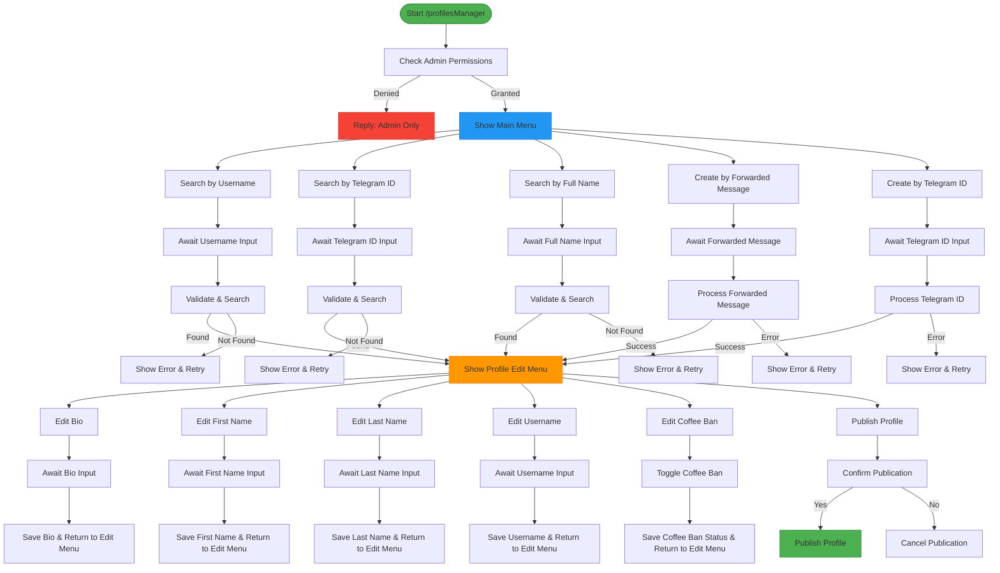
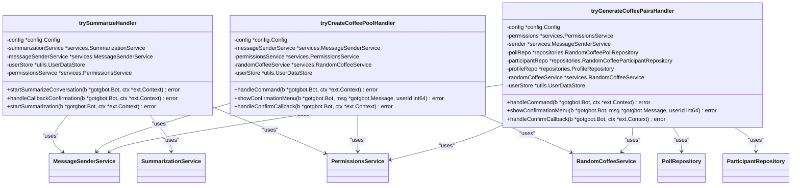
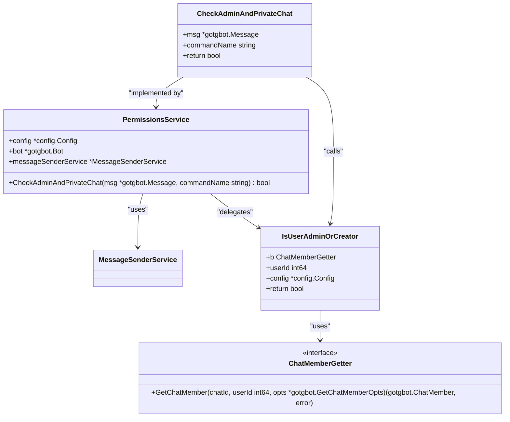
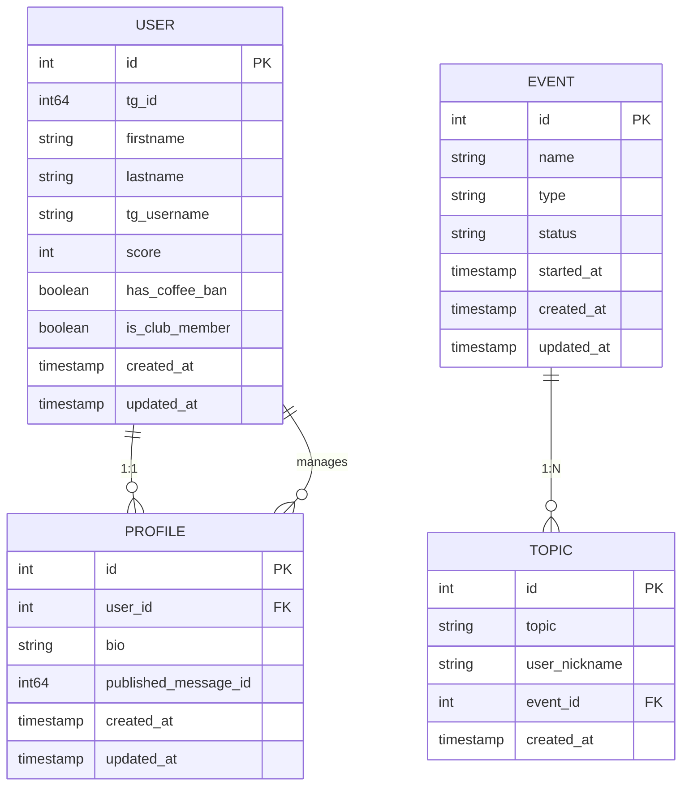
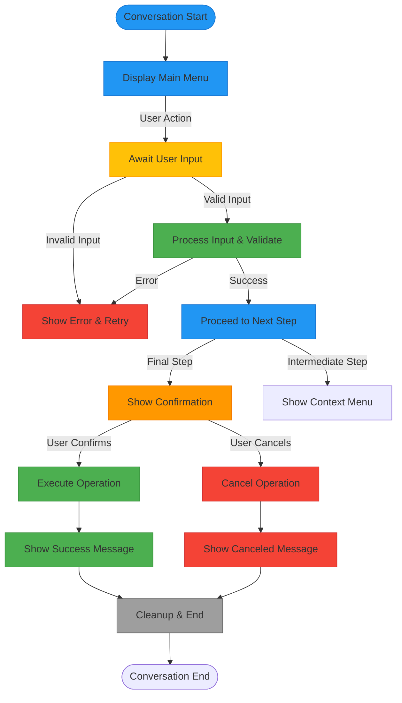

<docs>
# Administrative Controls

<cite>
**Referenced Files in This Document**   
- [profiles_manager_handler.go](file://internal/handlers/adminhandlers/profiles_manager_handler.go)
- [show_topics_handler.go](file://internal/handlers/adminhandlers/show_topics_handler.go)
- [event_setup_handler.go](file://internal/handlers/adminhandlers/eventhandlers/event_setup_handler.go)
- [event_edit_handler.go](file://internal/handlers/adminhandlers/eventhandlers/event_edit_handler.go)
- [event_delete_handler.go](file://internal/handlers/adminhandlers/eventhandlers/event_delete_handler.go)
- [event_start_handler.go](file://internal/handlers/adminhandlers/eventhandlers/event_start_handler.go)
- [try_summarize_handler.go](file://internal/handlers/adminhandlers/testhandlers/try_summarize_handler.go)
- [try_create_coffee_pool_handler.go](file://internal/handlers/adminhandlers/testhandlers/try_create_coffee_pool_handler.go)
- [try_generate_coffee_pairs_handler.go](file://internal/handlers/adminhandlers/testhandlers/try_generate_coffee_pairs_handler.go)
- [handlers_admin_constants.go](file://internal/constants/handlers_admin_constants.go)
- [permissions_service.go](file://internal/services/permissions_service.go)
- [message_sender_service.go](file://internal/services/message_sender_service.go)
- [profile_repository.go](file://internal/database/repositories/profile_repository.go)
- [event_repository.go](file://internal/database/repositories/event_repository.go)
- [topic_repository.go](file://internal/database/repositories/topic_repository.go)
- [user_repository.go](file://internal/database/repositories/user_repository.go)
- [formatters.go](file://internal/formatters/event_formatters.go)
- [buttons.go](file://internal/buttons/profiles_manager_handler_buttons.go)
- [UserDataStore.go](file://internal/utils/datastore_utils.go)
</cite>

## Table of Contents
1. [Introduction](#introduction)
2. [Core Administrative Components](#core-administrative-components)
3. [Profiles Management System](#profiles-management-system)
4. [Event Management System](#event-management-system)
5. [Topics Management System](#topics-management-system)
6. [Testing and Diagnostic Tools](#testing-and-diagnostic-tools)
7. [Access Control and Permissions](#access-control-and-permissions)
8. [Data Flow and Domain Models](#data-flow-and-domain-models)
9. [User Interface and Interaction Patterns](#user-interface-and-interaction-patterns)
10. [Error Handling and Troubleshooting](#error-handling-and-troubleshooting)
11. [Integration Patterns](#integration-patterns)
12. [Conclusion](#conclusion)

## Introduction

The Administrative Controls system in evocoders-bot-go provides a comprehensive suite of privileged operations for managing the Evocoders Club Telegram community. This documentation details the implementation of administrative functionality that enables authorized users to manage user profiles, events, discussion topics, and community engagement features. The system follows a conversation-based pattern using the gotgbot/v2 library, guiding administrators through multi-step workflows with state management. All administrative commands are restricted to users with administrative privileges and must be executed in private chats to ensure security and privacy. The controls are organized into distinct handlers for different administrative domains, including profile management, event lifecycle management, topic moderation, and testing utilities. The system leverages dependency injection for loose coupling between components and uses a UserDataStore to maintain conversation state across multiple user interactions.

## Core Administrative Components

The Administrative Controls system consists of specialized handlers that provide distinct functionality for different administrative domains. These handlers are conversation-based components that guide administrators through multi-step processes using a state machine pattern. Each handler is initialized with dependencies including configuration, services, repositories, and a UserDataStore for maintaining conversation context. The core components include the profiles manager for user profile administration, event handlers for managing the event lifecycle, topics management for moderating discussion topics, and testing utilities for diagnostic operations. All handlers implement consistent patterns for permission checking, error handling, and user interface management. They are registered in the bot's main initialization process and are only accessible to users with administrative privileges. The handlers use callback queries to implement interactive menus and forms, providing a user-friendly interface for complex administrative operations.

**Section sources**
- [profiles_manager_handler.go](file://internal/handlers/adminhandlers/profiles_manager_handler.go#L1-L100)
- [event_setup_handler.go](file://internal/handlers/adminhandlers/eventhandlers/event_setup_handler.go#L1-L100)
- [show_topics_handler.go](file://internal/handlers/adminhandlers/show_topics_handler.go#L1-L100)
- [try_summarize_handler.go](file://internal/handlers/adminhandlers/testhandlers/try_summarize_handler.go#L1-L100)

## Profiles Management System

The Profiles Management System provides comprehensive functionality for administrators to manage user profiles within the Evocoders Club. This system enables administrators to search for existing profiles by username, Telegram ID, or full name, as well as create new profiles either by forwarding a user's message or by specifying a Telegram ID. The system implements a conversation flow with multiple states, allowing administrators to edit various profile fields including first name, last name, username, bio, and coffee ban status. When creating a profile from a forwarded message, the system extracts user information and uses the message text as the initial bio content. The handler also provides functionality to publish profiles to the community with or without message preview. All operations are protected by admin permission checks, and the system maintains conversation state using a UserDataStore to track the current user's interaction context across multiple messages.



**Diagram sources**
- [profiles_manager_handler.go](file://internal/handlers/adminhandlers/profiles_manager_handler.go#L100-L1000)

**Section sources**
- [profiles_manager_handler.go](file://internal/handlers/adminhandlers/profiles_manager_handler.go#L1-L1322)
- [profile_repository.go](file://internal/database/repositories/profile_repository.go#L1-L286)
- [user_repository.go](file://internal/database/repositories/user_repository.go#L1-L200)
- [formatters.go](file://internal/formatters/event_formatters.go#L1-L150)
- [buttons.go](file://internal/buttons/profiles_manager_handler_buttons.go#L1-L171)

## Event Management System

The Event Management System provides a comprehensive suite of handlers for managing the lifecycle of events within the Evocoders Club. This system includes four specialized handlers: event setup, event editing, event deletion, and event starting. The event setup handler guides administrators through creating a new event by collecting the event name, type, and start date. The event editing handler allows administrators to modify existing event properties including name, start date, and type. The event deletion handler provides a safe mechanism for removing events with confirmation to prevent accidental deletion. The event starting handler enables administrators to announce an event by providing a link that will be posted to the announcement topic. All event handlers follow a consistent conversation pattern with state management and permission checks, ensuring data integrity and security throughout the event lifecycle.

```mermaid
classDiagram
class eventSetupHandler {
-config *config.Config
-eventRepository *repositories.EventRepository
-messageSenderService *services.MessageSenderService
-userStore *utils.UserDataStore
-permissionsService *services.PermissionsService
+startSetup(b *gotgbot.Bot, ctx *ext.Context) error
+handleEventName(b *gotgbot.Bot, ctx *ext.Context) error
+handleEventType(b *gotgbot.Bot, ctx *ext.Context) error
+handleEventStartedAt(b *gotgbot.Bot, ctx *ext.Context) error
}
class eventEditHandler {
-config *config.Config
-eventRepository *repositories.EventRepository
-messageSenderService *services.MessageSenderService
-userStore *utils.UserDataStore
-permissionsService *services.PermissionsService
+startEdit(b *gotgbot.Bot, ctx *ext.Context) error
+handleSelectEvent(b *gotgbot.Bot, ctx *ext.Context) error
+handleSelectEditType(b *gotgbot.Bot, ctx *ext.Context) error
+handleEditName(b *gotgbot.Bot, ctx *ext.Context) error
+handleEditStartedAt(b *gotgbot.Bot, ctx *ext.Context) error
+handleEditType(b *gotgbot.Bot, ctx *ext.Context) error
}
class eventDeleteHandler {
-config *config.Config
-eventRepository *repositories.EventRepository
-messageSenderService *services.MessageSenderService
-userStore *utils.UserDataStore
-permissionsService *services.PermissionsService
+startDelete(b *gotgbot.Bot, ctx *ext.Context) error
+handleSelectEvent(b *gotgbot.Bot, ctx *ext.Context) error
+handleCallbackConfirmYes(b *gotgbot.Bot, ctx *ext.Context) error
}
class eventStartHandler {
-config *config.Config
-eventRepository *repositories.EventRepository
-messageSenderService *services.MessageSenderService
-userStore *utils.UserDataStore
-permissionsService *services.PermissionsService
+startEvent(b *gotgbot.Bot, ctx *ext.Context) error
+handleSelectEvent(b *gotgbot.Bot, ctx *ext.Context) error
+handleEnterLink(b *gotgbot.Bot, ctx *ext.Context) error
+handleCallbackYes(b *gotgbot.Bot, ctx *ext.Context) error
}
eventSetupHandler --> MessageSenderService : "uses"
eventSetupHandler --> EventRepository : "uses"
eventSetupHandler --> PermissionsService : "uses"
eventEditHandler --> MessageSenderService : "uses"
eventEditHandler --> EventRepository : "uses"
eventEditHandler --> PermissionsService : "uses"
eventDeleteHandler --> MessageSenderService : "uses"
eventDeleteHandler --> EventRepository : "uses"
eventDeleteHandler --> PermissionsService : "uses"
eventStartHandler --> MessageSenderService : "uses"
eventStartHandler --> EventRepository : "uses"
eventStartHandler --> PermissionsService : "uses"
```



**Diagram sources**
- [event_setup_handler.go](file://internal/handlers/adminhandlers/eventhandlers/event_setup_handler.go#L75-L90)
- [event_edit_handler.go](file://internal/handlers/adminhandlers/eventhandlers/event_edit_handler.go#L75-L90)
- [event_delete_handler.go](file://internal/handlers/adminhandlers/eventhandlers/event_delete_handler.go#L75-L90)
- [event_start_handler.go](file://internal/handlers/adminhandlers/eventhandlers/event_start_handler.go#L75-L90)

**Section sources**
- [event_setup_handler.go](file://internal/handlers/adminhandlers/eventhandlers/event_setup_handler.go#L1-L358)
- [event_edit_handler.go](file://internal/handlers/adminhandlers/eventhandlers/event_edit_handler.go#L1-L539)
- [event_delete_handler.go](file://internal/handlers/adminhandlers/eventhandlers/event_delete_handler.go#L1-L315)
- [event_start_handler.go](file://internal/handlers/adminhandlers/eventhandlers/event_start_handler.go#L1-L418)
- [event_repository.go](file://internal/database/repositories/event_repository.go#L1-L253)

## Topics Management System

The Topics Management System enables administrators to view and manage discussion topics associated with events in the Evocoders Club. This system follows a two-step conversation process: first, the administrator selects an event from a list of recent events, and then can view all topics associated with that event. Administrators can delete specific topics by providing the topic ID. The system retrieves the last 10 events from the database and displays them in a formatted list, allowing the administrator to select an event by its ID. Once an event is selected, the system fetches all topics associated with that event and displays them in a formatted HTML message. The handler includes validation to ensure that the topic being deleted belongs to the selected event, preventing accidental deletion of topics from other events. The conversation maintains state using a UserDataStore to track the selected event ID across multiple interaction steps, ensuring data integrity during the deletion process.

```mermaid
sequenceDiagram
participant Admin as Administrator
participant Handler as ShowTopicsHandler
participant Repo as TopicRepository
participant Formatter as Formatters
participant Sender as MessageSenderService
Admin->>Handler : Send /showTopics command
Handler->>Handler : CheckAdminAndPrivateChat()
alt Not Authorized
Handler->>Admin : Reply "Admin only" message
deactivate Handler
else Authorized
Handler->>Repo : GetLastEvents(10)
alt No Events
Handler->>Admin : Reply "No events available"
deactivate Handler
else Events Found
Formatter->>Formatter : FormatEventListForAdmin()
Sender->>Admin : Send event selection message
Handler->>Handler : Store previous message info
Admin->>Handler : Send event ID
Handler->>Repo : GetEventByID(eventID)
Handler->>Repo : GetTopicsByEventID(eventID)
Handler->>Handler : Store eventID in UserDataStore
Formatter->>Formatter : FormatHtmlTopicListForAdmin()
Sender->>Admin : Reply with topics list
alt Topics Exist
Sender->>Admin : Send deletion instructions
Admin->>Handler : Send topic ID to delete
Handler->>Repo : GetTopicByID(topicID)
alt Topic Exists & Matches Event
Handler->>Repo : DeleteTopic(topicID)
Handler->>Repo : GetTopicsByEventID(eventID)
Formatter->>Formatter : FormatHtmlTopicListForAdmin()
Sender->>Admin : Reply with updated topics list
alt More Topics
Sender->>Admin : Send deletion instructions again
end
else Invalid Topic
Sender->>Admin : Reply "Topic not found" error
end
end
end
end
```

**Diagram sources**
- [show_topics_handler.go](file://internal/handlers/adminhandlers/show_topics_handler.go#L1-L355)

**Section sources**
- [show_topics_handler.go](file://internal/handlers/adminhandlers/show_topics_handler.go#L1-L355)
- [topic_repository.go](file://internal/database/repositories/topic_repository.go#L1-L115)
- [formatters.go](file://internal/formatters/event_formatters.go#L1-L150)

## Testing and Diagnostic Tools

The Testing and Diagnostic Tools provide specialized functionality for administrators to test and verify various system components. These tools are designed for development and debugging purposes and include handlers for summarization testing, coffee pool creation, and coffee pairs generation. The summarization testing handler allows administrators to manually trigger the daily summarization process and receive the results in direct messages. The coffee pool creation handler enables administrators to manually create a poll for the Random Coffee feature, which is typically automated. The coffee pairs generation handler allows administrators to manually generate and send coffee pairs, which is also normally an automated process. All testing handlers include prominent warnings indicating their purpose for testing only and require explicit confirmation before execution to prevent accidental use in production.



**Diagram sources**
- [try_summarize_handler.go](file://internal/handlers/adminhandlers/testhandlers/try_summarize_handler.go#L75-L90)
- [try_create_coffee_pool_handler.go](file://internal/handlers/adminhandlers/testhandlers/try_create_coffee_pool_handler.go#L75-L90)
- [try_generate_coffee_pairs_handler.go](file://internal/handlers/adminhandlers/testhandlers/try_generate_coffee_pairs_handler.go#L75-L90)

**Section sources**
- [try_summarize_handler.go](file://internal/handlers/adminhandlers/testhandlers/try_summarize_handler.go#L1-L246)
- [try_create_coffee_pool_handler.go](file://internal/handlers/adminhandlers/testhandlers/try_create_coffee_pool_handler.go#L1-L245)
- [try_generate_coffee_pairs_handler.go](file://internal/handlers/adminhandlers/testhandlers/try_generate_coffee_pairs_handler.go#L1-L267)
- [summarization_service.go](file://internal/services/summarization_service.go#L1-L200)
- [random_coffee_service.go](file://internal/services/random_coffee_service.go#L1-L150)

## Access Control and Permissions

Access control for administrative controls is implemented through a layered permission system that verifies both user role and conversation context. The permissions system provides the core CheckAdminAndPrivateChat method that validates whether a user has administrative privileges in the target group chat. This method uses the Telegram Bot API's GetChatMember to retrieve the user's status and checks if it is either "administrator" or "creator". The permission check is integrated into the entry point of each administrative handler, such as the handleCommand method in profiles_manager_handler and the startShowTopics method in show_topics_handler. If a user without proper permissions attempts to access an administrative command, the system logs the unauthorized access attempt and sends a polite error message indicating that the command is restricted to administrators. The permission system is designed to be reusable across all administrative handlers, promoting consistency in access control enforcement. Additionally, the system ensures that administrative commands can only be executed in private chats, preventing sensitive operations from being performed in public channels.



**Diagram sources**
- [permissions_service.go](file://internal/services/permissions_service.go#L1-L45)
- [permission_utils.go](file://internal/utils/permission_utils.go#L1-L50)

**Section sources**
- [permissions_service.go](file://internal/services/permissions_service.go#L1-L45)
- [permission_utils.go](file://internal/utils/permission_utils.go#L1-L50)
- [profiles_manager_handler.go](file://internal/handlers/adminhandlers/profiles_manager_handler.go#L200-L250)
- [show_topics_handler.go](file://internal/handlers/adminhandlers/show_topics_handler.go#L150-L200)
- [event_setup_handler.go](file://internal/handlers/adminhandlers/eventhandlers/event_setup_handler.go#L150-L200)

## Data Flow and Domain Models

The administrative controls interact with several key domain models that represent the core entities in the Evocoders Club system. The Event model represents club events with properties such as name, type, status, and start time. The Topic model represents discussion topics associated with events, containing the topic text, user nickname, and reference to the parent event. The Profile model stores user profile information including bio and publication status, while the User model contains personal information like first name, last name, and Telegram identifiers. These models are managed by corresponding repositories that provide CRUD operations with proper error handling. The data flow begins with user input through Telegram commands, passes through the handler's conversation states, interacts with repositories for database operations, and returns formatted responses to the user. The handlers use formatters to transform raw data into user-friendly messages and rely on the message sender service for reliable message delivery, including handling edge cases like closed topics.



**Diagram sources**
- [event_repository.go](file://internal/database/repositories/event_repository.go#L1-L253)
- [topic_repository.go](file://internal/database/repositories/topic_repository.go#L1-L115)
- [profile_repository.go](file://internal/database/repositories/profile_repository.go#L1-L286)
- [user_repository.go](file://internal/database/repositories/user_repository.go#L1-L200)

**Section sources**
- [event_repository.go](file://internal/database/repositories/event_repository.go#L1-L253)
- [topic_repository.go](file://internal/database/repositories/topic_repository.go#L1-L115)
- [profile_repository.go](file://internal/database/repositories/profile_repository.go#L1-L286)
- [user_repository.go](file://internal/database/repositories/user_repository.go#L1-L200)

## User Interface and Interaction Patterns

The administrative controls implement a consistent user interface and interaction pattern across all handlers. Each handler uses a conversation-based approach with clearly defined states that guide the administrator through multi-step processes. The interface design follows a hierarchical menu structure, starting with a main menu that presents available actions, followed by context-specific menus for editing or creating entities. All handlers use inline keyboards with callback queries to provide interactive buttons for navigation and actions. The system maintains context by storing temporary data in the UserDataStore, including previous message IDs for cleanup and entity IDs for reference during the conversation. Input validation is performed at each step, with handlers providing specific error messages for invalid inputs. The message sender service is used consistently across all handlers to send messages, reply to users, and handle message formatting in HTML or Markdown. The interface also includes confirmation steps for destructive operations like event deletion or profile publication, requiring explicit user confirmation before proceeding.



**Diagram sources**
- [profiles_manager_handler.go](file://internal/handlers/adminhandlers/profiles_manager_handler.go#L1-L1322)
- [event_setup_handler.go](file://internal/handlers/adminhandlers/eventhandlers/event_setup_handler.go#L1-L358)
- [show_topics_handler.go](file://internal/handlers/adminhandlers/show_topics_handler.go#L1-L355)

**Section sources**
- [profiles_manager_handler.go](file://internal/handlers/adminhandlers/profiles_manager_handler.go#L1-L1322)
- [event_setup_handler.go](file://internal/handlers/adminhandlers/eventhandlers/event_setup_handler.go#L1-L358)
- [show_topics_handler.go](file://internal/handlers/adminhandlers/show_topics_handler.go#L1-L355)
- [message_sender_service.go](file://internal/services/message_sender_service.go#L1-L481)
- [UserDataStore.go](file://internal/utils/datastore_utils.go#L1-L100)

## Error Handling and Troubleshooting

The administrative controls implement comprehensive error handling to provide a robust user experience and maintain system stability. When unauthorized access is detected, the system logs the attempt with user details and command name while providing a user-friendly error message. Input validation is performed at multiple stages, with handlers providing specific error messages for invalid IDs, empty inputs, or format errors. Database operations include proper error handling for cases like record not found (sql.ErrNoRows) or constraint violations, with appropriate user feedback. The conversation system includes automatic cleanup of temporary state data when a conversation ends, whether through completion or cancellation. For operations that modify data, such as profile publishing or topic deletion, the system provides confirmation feedback to the user. The message sender service includes retry logic for transient errors like closed topics, automatically attempting to reopen the topic before sending the message. Common issues like unauthorized access can be resolved by ensuring the user is an administrator in the target group chat, while input-related errors can be addressed by following the format