# Contribution Guide

<cite>
**Referenced Files in This Document**   
- [main.go](file://main.go)
- [bot.go](file://internal/bot/bot.go)
- [config.go](file://internal/config/config.go)
- [content_handler.go](file://internal/handlers/privatehandlers/content_handler.go)
- [tools_handler.go](file://internal/handlers/privatehandlers/tools_handler.go)
- [intro_handler.go](file://internal/handlers/privatehandlers/intro_handler.go)
- [profile_handler.go](file://internal/handlers/privatehandlers/profile_handler.go)
- [random_coffee_poll_answer_handler.go](file://internal/handlers/grouphandlers/random_coffee_poll_answer_handler.go)
- [try_create_coffee_pool_handler.go](file://internal/handlers/adminhandlers/testhandlers/try_create_coffee_pool_handler.go)
- [random_coffee_poll_task.go](file://internal/tasks/random_coffee_poll_task.go)
- [random_coffee_pairs_task.go](file://internal/tasks/random_coffee_pairs_task.go)
- [content_prompt.go](file://internal/database/prompts/content_prompt.go)
- [tool_prompt.go](file://internal/database/prompts/tool_prompt.go)
- [intro_prompt.go](file://internal/database/prompts/intro_prompt.go)
- [profile_prompt.go](file://internal/database/prompts/profile_prompt.go)
- [README.md](file://README.md)
- [CLAUDE.md](file://CLAUDE.md)
</cite>

## Table of Contents
1. [Introduction](#introduction)
2. [Project Structure](#project-structure)
3. [Core Components](#core-components)
4. [Architecture Overview](#architecture-overview)
5. [Detailed Component Analysis](#detailed-component-analysis)
6. [Dependency Analysis](#dependency-analysis)
7. [Performance Considerations](#performance-considerations)
8. [Troubleshooting Guide](#troubleshooting-guide)
9. [Conclusion](#conclusion)

## Introduction
This Contribution Guide provides comprehensive documentation for community development practices in the evocoders-bot-go project. The guide explains the purpose, architecture, and relationships of contribution workflows, documenting code style standards as implied by the existing codebase. It covers pull request processes, issue reporting guidelines, and testing requirements for contributions. The document includes practical examples demonstrating the feature development workflow from fork to merge, along with code review expectations. It addresses common issues in contribution onboarding and their solutions, providing both conceptual overviews for beginners and technical details for experienced developers.

## Project Structure

The evocoders-bot-go project follows a well-organized directory structure that separates concerns and facilitates maintainability. The core functionality is organized within the `internal` directory, which contains all application-specific code that should not be imported by external packages.

**Diagram sources**
- [main.go](file://main.go)
- [internal/bot/bot.go](file://internal/bot/bot.go)
- [internal/database/db.go](file://internal/database/db.go)

**Section sources**
- [main.go](file://main.go)
- [README.md](file://README.md)

## Core Components

The evocoders-bot-go application consists of several core components that work together to provide Telegram bot functionality for the Evocoders Club. The entry point is `main.go`, which initializes the configuration, OpenAI client, and bot client with graceful shutdown capabilities. The central orchestration is handled by `internal/bot/bot.go`, which implements the `TgBotClient` struct responsible for dependency injection, bot instance management, database connection initialization, service layer setup, handler registration, and scheduled task management.

The configuration system in `internal/config/` handles environment variable loading and validation for all bot features. The database layer uses PostgreSQL with an automated migration system that initializes the schema on startup. The repositories in `internal/database/repositories/` provide a data access layer for various entities including users, profiles, events, and random coffee data. The services layer contains business logic for key features such as random coffee pairing, profile management, chat summarization, permissions, and message sending.

**Section sources**
- [main.go](file://main.go)
- [internal/bot/bot.go](file://internal/bot/bot.go)
- [internal/config/config.go](file://internal/config/config.go)

## Architecture Overview

The evocoders-bot-go application follows a layered architecture pattern with clear separation of concerns. The architecture is designed to be modular, maintainable, and testable, with dependency injection used throughout to facilitate loose coupling between components.

**Diagram sources**
- [main.go](file://main.go)
- [internal/bot/bot.go](file://internal/bot/bot.go)
- [internal/handlers/privatehandlers/content_handler.go](file://internal/handlers/privatehandlers/content_handler.go)

## Detailed Component Analysis

### Feature Handlers Analysis

The application implements a comprehensive handler system organized by context and functionality. Handlers are responsible for processing Telegram updates and orchestrating the appropriate business logic through service layer calls.

#### Private Handlers for AI-Powered Features

```mermaid
classDiagram
class ContentHandler {
+config *config.Config
+openaiClient *clients.OpenAiClient
+promptingTemplateRepository *repositories.PromptingTemplateRepository
+messageSenderService *services.MessageSenderService
+userStore *utils.UserDataStore
+permissionsService *services.PermissionsService
+NewContentHandler(config, openaiClient, messageSenderService, promptingTemplateRepository, permissionsService) ext.Handler
}
class ToolsHandler {
+config *config.Config
+openaiClient *clients.OpenAiClient
+promptingTemplateRepository *repositories.PromptingTemplateRepository
+messageSenderService *services.MessageSenderService
+userStore *utils.UserDataStore
+permissionsService *services.PermissionsService
+NewToolsHandler(config, openaiClient, messageSenderService, promptingTemplateRepository, permissionsService) ext.Handler
}
class IntroHandler {
+config *config.Config
+openaiClient *clients.OpenAiClient
+promptingTemplateRepository *repositories.PromptingTemplateRepository
+profileRepository *repositories.ProfileRepository
+messageSenderService *services.MessageSenderService
+userStore *utils.UserDataStore
+permissionsService *services.PermissionsService
+NewIntroHandler(config, openaiClient, messageSenderService, promptingTemplateRepository, profileRepository, permissionsService) ext.Handler
}
class ProfileHandler {
+config *config.Config
+openaiClient *clients.OpenAiClient
+promptingTemplateRepository *repositories.PromptingTemplateRepository
+profileRepository *repositories.ProfileRepository
+profileService *services.ProfileService
+messageSenderService *services.MessageSenderService
+userStore *utils.UserDataStore
+permissionsService *services.PermissionsService
+NewProfileHandler(config, openaiClient, messageSenderService, promptingTemplateRepository, profileRepository, profileService, permissionsService) ext.Handler
}
ContentHandler --> messageSenderService : "uses"
ContentHandler --> permissionsService : "uses"
ToolsHandler --> messageSenderService : "uses"
ToolsHandler --> permissionsService : "uses"
IntroHandler --> messageSenderService : "uses"
IntroHandler --> permissionsService : "uses"
IntroHandler --> profileRepository : "uses"
ProfileHandler --> messageSenderService : "uses"
ProfileHandler --> permissionsService : "uses"
ProfileHandler --> profileRepository : "uses"
ProfileHandler --> profileService : "uses"
```

**Diagram sources**
- [internal/handlers/privatehandlers/content_handler.go](file://internal/handlers/privatehandlers/content_handler.go#L37-L64)
- [internal/handlers/privatehandlers/tools_handler.go](file://internal/handlers/privatehandlers/tools_handler.go#L37-L64)
- [internal/handlers/privatehandlers/intro_handler.go](file://internal/handlers/privatehandlers/intro_handler.go#L37-L67)
- [internal/handlers/privatehandlers/profile_handler.go](file://internal/handlers/privatehandlers/profile_handler.go)

**Section sources**
- [internal/handlers/privatehandlers/content_handler.go](file://internal/handlers/privatehandlers/content_handler.go)
- [internal/handlers/privatehandlers/tools_handler.go](file://internal/handlers/privatehandlers/tools_handler.go)
- [internal/handlers/privatehandlers/intro_handler.go](file://internal/handlers/privatehandlers/intro_handler.go)
- [internal/handlers/privatehandlers/profile_handler.go](file://internal/handlers/privatehandlers/profile_handler.go)

### Random Coffee System Analysis

The Random Coffee feature implements a sophisticated system for facilitating weekly virtual meetings among club members through automated polls and smart pairing algorithms.

#### Random Coffee Poll Workflow

**Diagram sources**
- [internal/tasks/random_coffee_poll_task.go](file://internal/tasks/random_coffee_poll_task.go)
- [internal/handlers/grouphandlers/random_coffee_poll_answer_handler.go](file://internal/handlers/grouphandlers/random_coffee_poll_answer_handler.go)
- [internal/services/random_coffee_service.go](file://internal/services/random_coffee_service.go)
- [internal/database/repositories/random_coffee_poll_repository.go](file://internal/database/repositories/random_coffee_poll_repository.go)

**Section sources**
- [internal/tasks/random_coffee_poll_task.go](file://internal/tasks/random_coffee_poll_task.go)
- [internal/handlers/grouphandlers/random_coffee_poll_answer_handler.go](file://internal/handlers/grouphandlers/random_coffee_poll_answer_handler.go)

#### Random Coffee Pairs Generation

**Diagram sources**
- [internal/tasks/random_coffee_pairs_task.go](file://internal/tasks/random_coffee_pairs_task.go)
- [internal/services/random_coffee_service.go](file://internal/services/random_coffee_service.go)
- [internal/database/repositories/random_coffee_pair_repository.go](file://internal/database/repositories/random_coffee_pair_repository.go)

**Section sources**
- [internal/tasks/random_coffee_pairs_task.go](file://internal/tasks/random_coffee_pairs_task.go)

### AI-Powered Search System Analysis

The application implements an AI-powered search system that leverages OpenAI to provide intelligent responses to user queries about tools, content, and member introductions.

#### AI Search Prompt Structure

**Diagram sources**
- [internal/database/prompts/content_prompt.go](file://internal/database/prompts/content_prompt.go)
- [internal/database/prompts/tool_prompt.go](file://internal/database/prompts/tool_prompt.go)
- [internal/database/prompts/intro_prompt.go](file://internal/database/prompts/intro_prompt.go)
- [internal/database/prompts/profile_prompt.go](file://internal/database/prompts/profile_prompt.go)
- [internal/handlers/privatehandlers/content_handler.go](file://internal/handlers/privatehandlers/content_handler.go)
- [internal/handlers/privatehandlers/tools_handler.go](file://internal/handlers/privatehandlers/tools_handler.go)
- [internal/handlers/privatehandlers/intro_handler.go](file://internal/handlers/privatehandlers/intro_handler.go)
- [internal/handlers/privatehandlers/profile_handler.go](file://internal/handlers/privatehandlers/profile_handler.go)

**Section sources**
- [internal/database/prompts/content_prompt.go](file://internal/database/prompts/content_prompt.go)
- [internal/database/prompts/tool_prompt.go](file://internal/database/prompts/tool_prompt.go)
- [internal/database/prompts/intro_prompt.go](file://internal/database/prompts/intro_prompt.go)
- [internal/database/prompts/profile_prompt.go](file://internal/database/prompts/profile_prompt.go)

## Dependency Analysis

The evocoders-bot-go application demonstrates a well-structured dependency graph that follows the dependency inversion principle, with higher-level modules depending on abstractions rather than concrete implementations.

**Diagram sources**
- [main.go](file://main.go)
- [internal/bot/bot.go](file://internal/bot/bot.go)
- [internal/config/config.go](file://internal/config/config.go)
- [internal/clients/openai_client.go](file://internal/clients/openai_client.go)
- [internal/database/db.go](file://internal/database/db.go)
- [internal/services/](file://internal/services/)
- [internal/handlers/](file://internal/handlers/)
- [internal/tasks/](file://internal/tasks/)

**Section sources**
- [main.go](file://main.go)
- [internal/bot/bot.go](file://internal/bot/bot.go)
- [internal/config/config.go](file://internal/config/config.go)

## Performance Considerations

The evocoders-bot-go application incorporates several performance considerations to ensure efficient operation and responsiveness. The architecture is designed to handle scheduled tasks efficiently through ticker-based polling with appropriate intervals to minimize resource consumption. Database operations are optimized through the use of prepared statements and connection pooling. The application implements graceful shutdown procedures to ensure proper cleanup of resources and prevent data loss during termination.

The AI-powered features are designed with timeout contexts to prevent indefinite blocking when communicating with external APIs. The random coffee system efficiently manages participant data by only retrieving necessary information for current polls rather than loading all historical data. Message handling is optimized by using appropriate Telegram API methods for different scenarios, such as editing existing messages when possible rather than creating new ones.

For high-traffic scenarios, the application could benefit from additional caching mechanisms for frequently accessed data, such as user profiles and prompting templates. The current implementation makes direct database queries for these items on each request, which could be optimized with an in-memory cache for improved response times.

## Troubleshooting Guide

When contributing to the evocoders-bot-go project, developers may encounter several common issues during setup and development. This section addresses these issues and provides solutions to help contributors get started quickly.

**Section sources**
- [README.md](file://README.md)
- [CLAUDE.md](file://CLAUDE.md)
- [main.go](file://main.go)

## Conclusion

The evocoders-bot-go project demonstrates a well-architected Go application with clear separation of concerns, modular design, and comprehensive functionality for managing a Telegram-based community. The contribution workflow is supported by a robust codebase that follows established Go patterns and best practices. The layered architecture with distinct components for configuration, database access, business logic, and user interface handling makes the codebase maintainable and extensible.

The project's implementation of dependency injection through the handler system enables easy testing and promotes loose coupling between components. The use of scheduled tasks for automated features like daily summarization and random coffee pairing demonstrates thoughtful design for background processing. The AI-powered search features leverage external APIs effectively while maintaining a clean separation between the integration code and the application logic.

For contributors, the project provides clear documentation and a well-organized structure that facilitates onboarding and productive contribution. The combination of comprehensive README documentation, architectural guidance in CLAUDE.md, and consistent code patterns throughout the codebase creates an environment conducive to collaborative development.