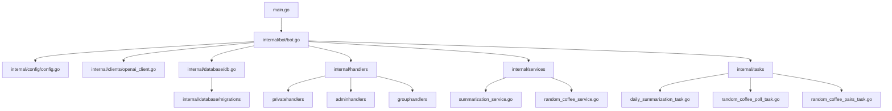
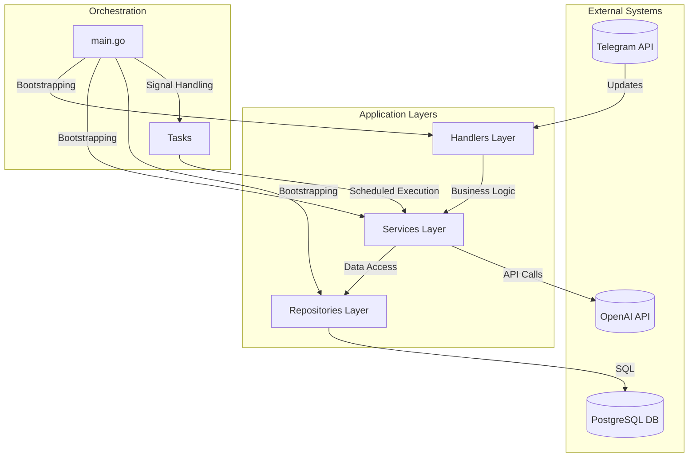
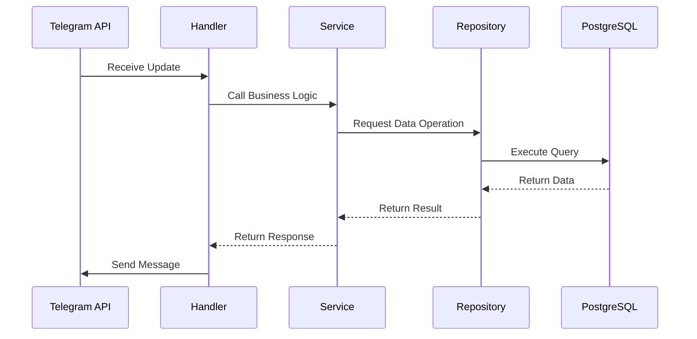
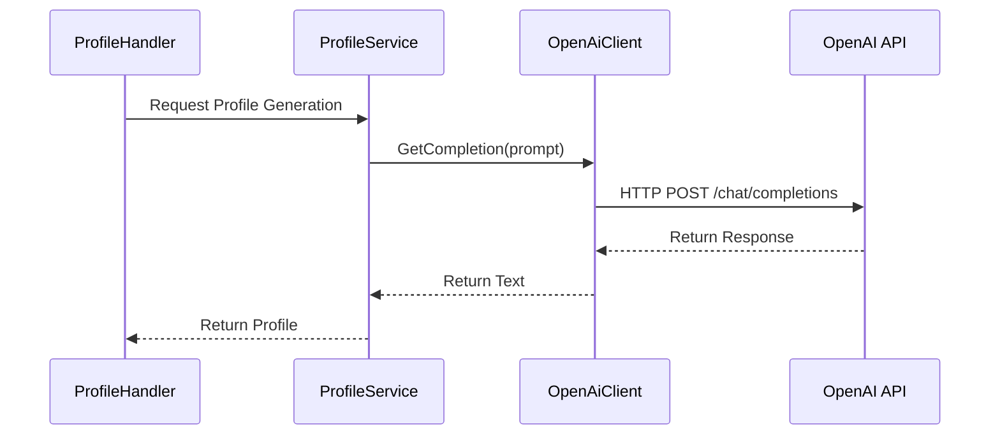
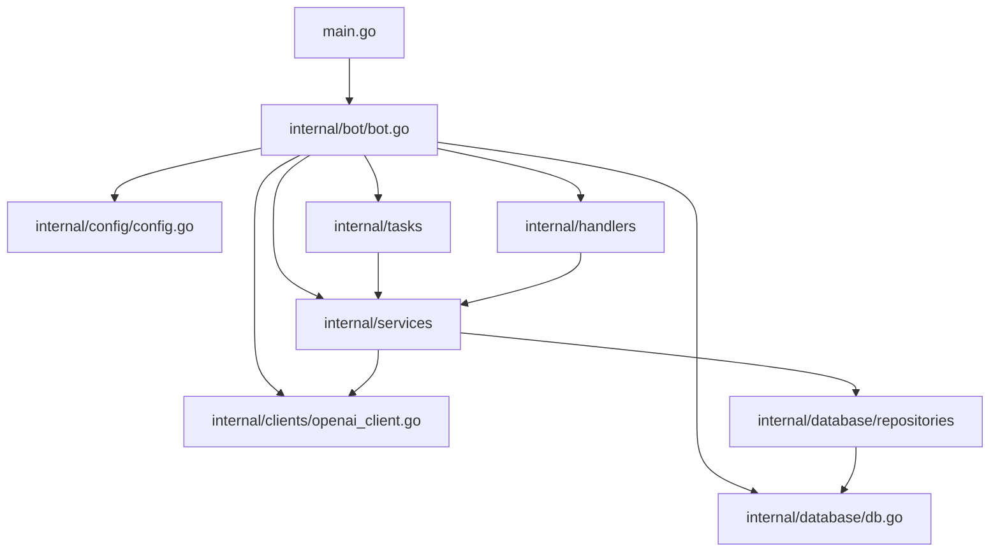
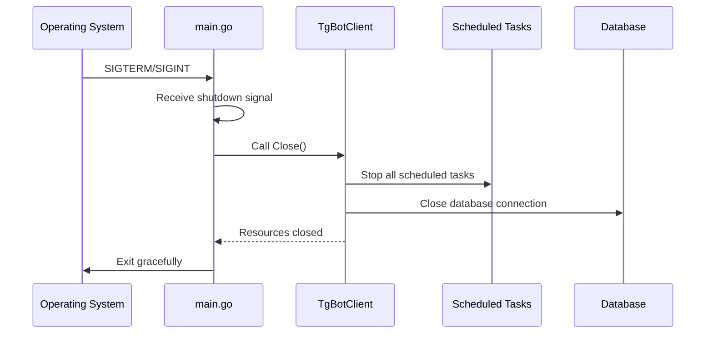

# Core Architecture

<cite>
**Referenced Files in This Document**   
- [main.go](file://main.go) - *Updated in recent commit*
- [internal/bot/bot.go](file://internal/bot/bot.go) - *Updated in recent commit*
- [internal/config/config.go](file://internal/config/config.go)
- [internal/clients/openai_client.go](file://internal/clients/openai_client.go)
- [internal/database/db.go](file://internal/database/db.go)
- [internal/services/summarization_service.go](file://internal/services/summarization_service.go)
- [internal/services/random_coffee_service.go](file://internal/services/random_coffee_service.go)
- [internal/services/message_sender_service.go](file://internal/services/message_sender_service.go)
- [internal/services/permissions_service.go](file://internal/services/permissions_service.go)
- [internal/database/repositories/user_repository.go](file://internal/database/repositories/user_repository.go)
- [internal/database/repositories/group_message_repository.go](file://internal/database/repositories/group_message_repository.go)
- [internal/database/repositories/random_coffee_poll_repository.go](file://internal/database/repositories/random_coffee_poll_repository.go)
- [internal/handlers/privatehandlers/profile_handler.go](file://internal/handlers/privatehandlers/profile_handler.go)
- [internal/tasks/daily_summarization_task.go](file://internal/tasks/daily_summarization_task.go)
- [internal/tasks/random_coffee_poll_task.go](file://internal/tasks/random_coffee_poll_task.go)
- [internal/tasks/random_coffee_pairs_task.go](file://internal/tasks/random_coffee_pairs_task.go)
- [internal/tasks/task.go](file://internal/tasks/task.go)
</cite>

## Update Summary
**Changes Made**   
- Updated dependency injection pattern to use new constructors with service dependencies
- Enhanced HandlerDependencies struct with additional group handler services
- Updated architecture overview to reflect refactored handler registration
- Added detailed analysis of graceful shutdown implementation
- Updated system context diagram to include all dependency relationships
- Refined component interaction diagrams to show current data flow

## Table of Contents
1. [Introduction](#introduction)
2. [Project Structure](#project-structure)
3. [Core Components](#core-components)
4. [Architecture Overview](#architecture-overview)
5. [Detailed Component Analysis](#detailed-component-analysis)
6. [Dependency Analysis](#dependency-analysis)
7. [Performance Considerations](#performance-considerations)
8. [Troubleshooting Guide](#troubleshooting-guide)
9. [Conclusion](#conclusion)

## Introduction
The evocoders-bot-go application is a Telegram bot designed to facilitate community engagement through automated summarization, profile management, and social interaction features such as random coffee pairings. The system follows a clean, layered architecture with clear separation of concerns between handlers, services, and repositories. This documentation provides a comprehensive overview of the core architectural design, focusing on component interactions, dependency injection patterns, external integrations, and operational workflows.

## Project Structure

**Diagram sources**
- [main.go](file://main.go#L1-L53)
- [internal/bot/bot.go](file://internal/bot/bot.go#L1-L440)

**Section sources**
- [main.go](file://main.go#L1-L53)
- [internal/bot/bot.go](file://internal/bot/bot.go#L1-L440)

## Core Components

The application is structured around a layered architecture where each layer has a distinct responsibility:

- **Handlers**: Process incoming Telegram updates and route them to appropriate services.
- **Services**: Contain business logic and coordinate operations between repositories and external clients.
- **Repositories**: Handle data persistence and retrieval from the database.
- **Clients**: Interface with external APIs (e.g., OpenAI).
- **Tasks**: Orchestrate scheduled background operations.

This separation ensures modularity, testability, and maintainability.

**Section sources**
- [internal/bot/bot.go](file://internal/bot/bot.go#L17-L440)
- [internal/services/summarization_service.go](file://internal/services/summarization_service.go#L1-L150)
- [internal/services/random_coffee_service.go](file://internal/services/random_coffee_service.go#L1-L200)

## Architecture Overview

**Diagram sources**
- [main.go](file://main.go#L1-L53)
- [internal/bot/bot.go](file://internal/bot/bot.go#L1-L440)
- [internal/clients/openai_client.go](file://internal/clients/openai_client.go#L1-L98)
- [internal/database/db.go](file://internal/database/db.go#L1-L45)

## Detailed Component Analysis

### Handler Dependencies and Dependency Injection

The `HandlerDependencies` struct in `bot.go` serves as a dependency injection container that provides all necessary services and repositories to handlers. This pattern enables loose coupling, facilitates testing, and centralizes dependency management. The recent refactoring has expanded this container to include specialized services for group chat handling.

```mermaid
classDiagram
class HandlerDependencies {
+OpenAiClient *OpenAiClient
+AppConfig *Config
+ProfileService *ProfileService
+SummarizationService *SummarizationService
+RandomCoffeeService *RandomCoffeeService
+MessageSenderService *MessageSenderService
+PermissionsService *PermissionsService
+EventRepository *EventRepository
+TopicRepository *TopicRepository
+GroupTopicRepository *GroupTopicRepository
+PromptingTemplateRepository *PromptingTemplateRepository
+UserRepository *UserRepository
+ProfileRepository *ProfileRepository
+RandomCoffeePollRepository *RandomCoffeePollRepository
+RandomCoffeeParticipantRepository *RandomCoffeeParticipantRepository
+RandomCoffeePairRepository *RandomCoffeePairRepository
+GroupMessageRepository *GroupMessageRepository
+RandomCoffeePollAnswersService *RandomCoffeePollAnswersService
+JoinLeftService *JoinLeftService
+CleanClosedThreadsService *CleanClosedThreadsService
+RepliesFromClosedThreadsService *RepliesFromClosedThreadsService
+DeleteJoinLeftMessagesService *DeleteJoinLeftMessagesService
+SaveTopicService *SaveTopicService
+AdminSaveMessageService *AdminSaveMessageService
+SaveMessageService *SaveMessageService
+SaveUpdateMessageService *SaveUpdateMessageService
}
class TgBotClient {
-bot *gotgbot.Bot
-dispatcher *ext.Dispatcher
-updater *ext.Updater
-db *DB
-tasks []Task
+Start()
+Close()
}
TgBotClient --> HandlerDependencies : "creates"
HandlerDependencies --> OpenAiClient : "uses"
HandlerDependencies --> Config : "uses"
HandlerDependencies --> ProfileService : "uses"
HandlerDependencies --> SummarizationService : "uses"
HandlerDependencies --> RandomCoffeeService : "uses"
HandlerDependencies --> MessageSenderService : "uses"
HandlerDependencies --> PermissionsService : "uses"
HandlerDependencies --> EventRepository : "uses"
HandlerDependencies --> TopicRepository : "uses"
HandlerDependencies --> GroupTopicRepository : "uses"
HandlerDependencies --> PromptingTemplateRepository : "uses"
HandlerDependencies --> UserRepository : "uses"
HandlerDependencies --> ProfileRepository : "uses"
HandlerDependencies --> RandomCoffeePollRepository : "uses"
HandlerDependencies --> RandomCoffeeParticipantRepository : "uses"
HandlerDependencies --> RandomCoffeePairRepository : "uses"
HandlerDependencies --> GroupMessageRepository : "uses"
HandlerDependencies --> RandomCoffeePollAnswersService : "uses"
HandlerDependencies --> JoinLeftService : "uses"
HandlerDependencies --> CleanClosedThreadsService : "uses"
HandlerDependencies --> RepliesFromClosedThreadsService : "uses"
HandlerDependencies --> DeleteJoinLeftMessagesService : "uses"
HandlerDependencies --> SaveTopicService : "uses"
HandlerDependencies --> AdminSaveMessageService : "uses"
HandlerDependencies --> SaveMessageService : "uses"
HandlerDependencies --> SaveUpdateMessageService : "uses"
```

**Diagram sources**
- [internal/bot/bot.go](file://internal/bot/bot.go#L26-L53)

**Section sources**
- [internal/bot/bot.go](file://internal/bot/bot.go#L26-L53)

### Data Flow from Telegram Update to Repository

The data flow begins with a Telegram update and proceeds through handlers to services and repositories:

**Diagram sources**
- [internal/bot/bot.go](file://internal/bot/bot.go#L238-L393)
- [internal/handlers/privatehandlers/profile_handler.go](file://internal/handlers/privatehandlers/profile_handler.go#L1-L123)
- [internal/services/profile_service.go](file://internal/services/profile_service.go#L1-L150)
- [internal/database/repositories/user_repository.go](file://internal/database/repositories/user_repository.go#L1-L80)

### Integration with External APIs

The bot integrates with OpenAI for content generation and summarization:

**Diagram sources**
- [internal/clients/openai_client.go](file://internal/clients/openai_client.go#L1-L98)
- [internal/services/profile_service.go](file://internal/services/profile_service.go#L1-L150)

### System Context and Component Interactions

The system context diagram illustrates the complete architecture with all components and their interactions:

```mermaid
graph TD
main[main.go] --> bot[internal/bot/bot.go]
bot --> config[internal/config/config.go]
bot --> openai[internal/clients/openai_client.go]
bot --> db[internal/database/db.go]
bot --> handlers[internal/handlers]
bot --> services[internal/services]
bot --> tasks[internal/tasks]
services --> repositories[internal/database/repositories]
repositories --> db
tasks --> services
handlers --> services
services --> openai
bot --> HandlerDependencies
HandlerDependencies --> profileService[ProfileService]
HandlerDependencies --> summarizationService[SummarizationService]
HandlerDependencies --> randomCoffeeService[RandomCoffeeService]
HandlerDependencies --> messageSenderService[MessageSenderService]
HandlerDependencies --> permissionsService[PermissionsService]
HandlerDependencies --> eventRepository[EventRepository]
HandlerDependencies --> topicRepository[TopicRepository]
HandlerDependencies --> groupTopicRepository[GroupTopicRepository]
HandlerDependencies --> promptingTemplateRepository[PromptingTemplateRepository]
HandlerDependencies --> userRepository[UserRepository]
HandlerDependencies --> profileRepository[ProfileRepository]
HandlerDependencies --> randomCoffeePollRepository[RandomCoffeePollRepository]
HandlerDependencies --> randomCoffeeParticipantRepository[RandomCoffeeParticipantRepository]
HandlerDependencies --> randomCoffeePairRepository[RandomCoffeePairRepository]
HandlerDependencies --> groupMessageRepository[GroupMessageRepository]
HandlerDependencies --> randomCoffeePollAnswersService[RandomCoffeePollAnswersService]
HandlerDependencies --> joinLeftService[JoinLeftService]
HandlerDependencies --> cleanClosedThreadsService[CleanClosedThreadsService]
HandlerDependencies --> repliesFromClosedThreadsService[RepliesFromClosedThreadsService]
HandlerDependencies --> deleteJoinLeftMessagesService[DeleteJoinLeftMessagesService]
HandlerDependencies --> saveTopicService[SaveTopicService]
HandlerDependencies --> adminSaveMessageService[AdminSaveMessageService]
HandlerDependencies --> saveMessageService[SaveMessageService]
HandlerDependencies --> saveUpdateMessageService[SaveUpdateMessageService]
handlers --> HandlerDependencies
TgBotClient --> HandlerDependencies
```

**Diagram sources**
- [internal/bot/bot.go](file://internal/bot/bot.go#L65-L221)
- [main.go](file://main.go#L13-L37)

## Dependency Analysis

**Diagram sources**
- [main.go](file://main.go#L1-L53)
- [internal/bot/bot.go](file://internal/bot/bot.go#L1-L440)
- [internal/config/config.go](file://internal/config/config.go#L1-L341)
- [internal/clients/openai_client.go](file://internal/clients/openai_client.go#L1-L98)
- [internal/database/db.go](file://internal/database/db.go#L1-L45)

**Section sources**
- [main.go](file://main.go#L1-L53)
- [internal/bot/bot.go](file://internal/bot/bot.go#L1-L440)

## Performance Considerations

The architecture prioritizes responsiveness and scalability through:

- **Goroutine-based concurrency**: Scheduled tasks run in separate goroutines to avoid blocking the main event loop.
- **Connection pooling**: Database connections are managed efficiently via sql.DB.
- **Caching strategies**: While not explicitly implemented, the separation of services allows for easy addition of caching layers.
- **Rate limiting awareness**: External API calls (e.g., OpenAI) are wrapped with context timeouts to prevent hanging requests.
- **Efficient dependency injection**: The HandlerDependencies struct provides centralized access to all services, reducing initialization overhead.

The system is designed to handle multiple concurrent Telegram updates while maintaining scheduled task execution without interference.

## Troubleshooting Guide

Common issues and their resolutions:

**Graceful Shutdown Implementation**
The application implements a robust graceful shutdown mechanism that ensures proper cleanup of resources:

**Section sources**
- [main.go](file://main.go#L40-L52)
- [internal/bot/bot.go](file://internal/bot/bot.go#L431-L439)
- [internal/tasks/daily_summarization_task.go](file://internal/tasks/daily_summarization_task.go#L44-L87)
- [internal/tasks/random_coffee_poll_task.go](file://internal/tasks/random_coffee_poll_task.go#L48-L91)
- [internal/tasks/random_coffee_pairs_task.go](file://internal/tasks/random_coffee_pairs_task.go#L47-L87)

## Conclusion

The evocoders-bot-go application demonstrates a well-structured Go application with clean architectural boundaries. The layered design (handlers → services → repositories), combined with dependency injection through the `HandlerDependencies` struct, enables maintainable and testable code. External integrations with Telegram and OpenAI are properly abstracted, while scheduled tasks provide automated functionality without disrupting real-time message processing. The graceful shutdown mechanism ensures data integrity during termination, and the configuration system allows for flexible deployment across environments. The recent refactoring has enhanced the dependency injection pattern by incorporating specialized services for group chat handling, improving modularity and maintainability.