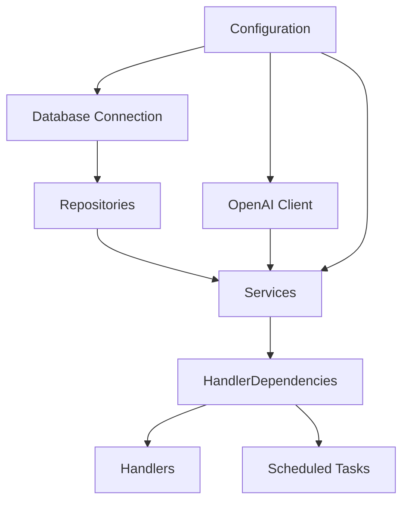
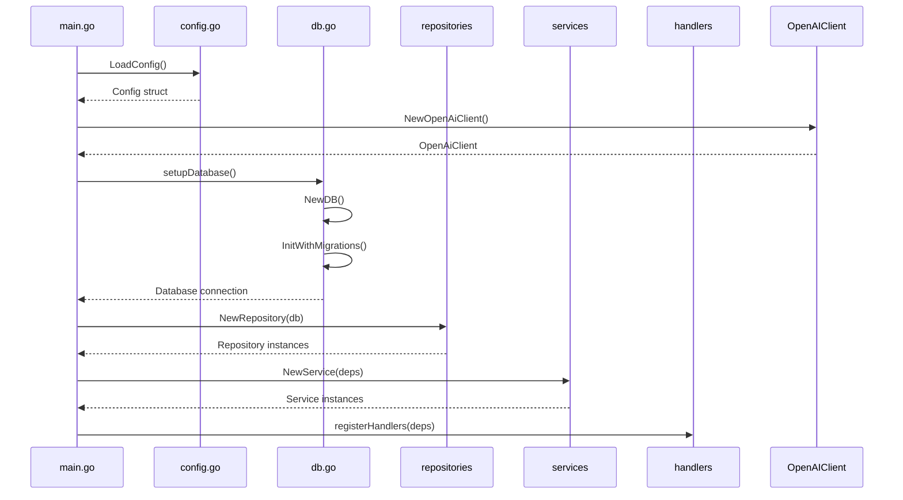
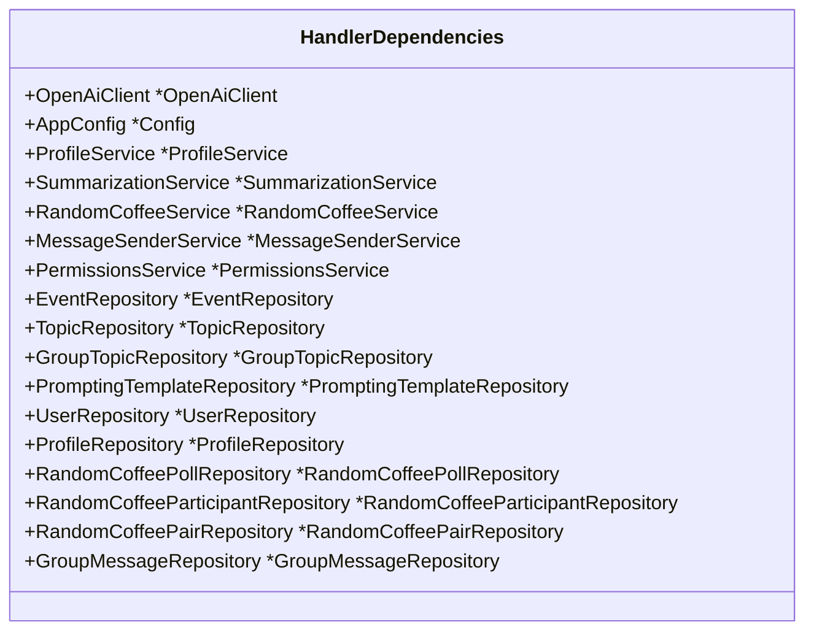
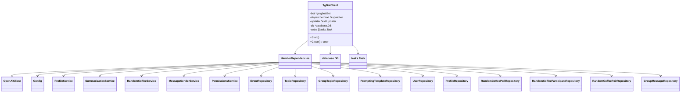
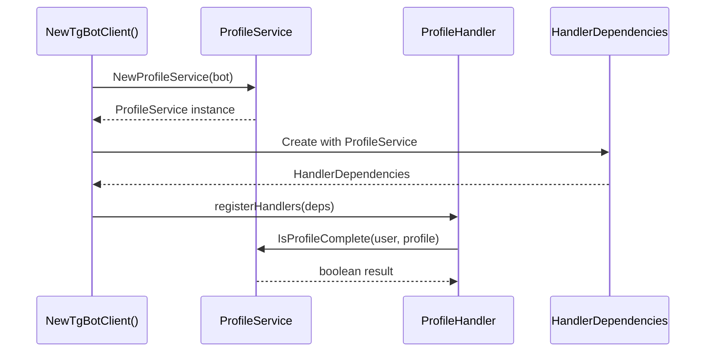

# Dependency Injection

<cite>
**Referenced Files in This Document**   
- [main.go](file://main.go)
- [internal/bot/bot.go](file://internal/bot/bot.go)
- [internal/config/config.go](file://internal/config/config.go)
- [internal/clients/openai_client.go](file://internal/clients/openai_client.go)
- [internal/database/db.go](file://internal/database/db.go)
- [internal/services/profile_service.go](file://internal/services/profile_service.go)
- [internal/services/summarization_service.go](file://internal/services/summarization_service.go)
- [internal/services/random_coffee_service.go](file://internal/services/random_coffee_service.go)
- [internal/services/message_sender_service.go](file://internal/services/message_sender_service.go)
- [internal/services/permissions_service.go](file://internal/services/permissions_service.go)
- [internal/handlers/privatehandlers/profile_handler.go](file://internal/handlers/privatehandlers/profile_handler.go)
- [internal/handlers/adminhandlers/testhandlers/try_summarize_handler.go](file://internal/handlers/adminhandlers/testhandlers/try_summarize_handler.go)
</cite>

## Table of Contents
1. [Introduction](#introduction)
2. [Dependency Injection Architecture](#dependency-injection-architecture)
3. [Construction Order and Initialization Flow](#construction-order-and-initialization-flow)
4. [HandlerDependencies Structure](#handlerdependencies-structure)
5. [Centralized Dependency Management in TgBotClient](#centralized-dependency-management-in-tgbotclient)
6. [Dependency Injection in Action](#dependency-injection-in-action)
7. [Benefits of Manual Dependency Injection](#benefits-of-manual-dependency-injection)
8. [Trade-offs vs DI Frameworks](#trade-offs-vs-di-frameworks)
9. [Conclusion](#conclusion)

## Introduction
The evocoders-bot-go application implements a manual dependency injection (DI) system that provides a clean, maintainable architecture for managing component dependencies. This documentation details the implementation of dependency injection through the HandlerDependencies struct, which aggregates all required services, repositories, and configuration. The system follows a hierarchical construction order starting from configuration loading, through external client initialization, database setup, repository creation, service instantiation, and finally dependency aggregation. This approach ensures loose coupling, improved testability, and clear component boundaries while avoiding the complexity of external DI frameworks.

**Section sources**
- [main.go](file://main.go#L1-L53)
- [internal/bot/bot.go](file://internal/bot/bot.go#L25-L43)

## Dependency Injection Architecture
The dependency injection architecture in evocoders-bot-go is built around a hierarchical composition pattern where dependencies are explicitly passed from higher-level components to lower-level ones. The system uses a manual DI approach without external frameworks, relying on Go's struct composition and constructor functions to manage dependencies. At the core of this architecture is the HandlerDependencies struct, which serves as a dependency container that aggregates all services, repositories, and configuration needed by the application's handlers.

The architecture follows the dependency inversion principle, where high-level modules (handlers) depend on abstractions (interfaces) rather than concrete implementations. This allows for flexible component substitution and easier testing. The dependency graph is constructed in a bottom-up manner, starting with infrastructure components like configuration and database connections, then building up to business logic services, and finally aggregating everything for the handlers.

**Diagram sources**
- [main.go](file://main.go#L1-L53)
- [internal/bot/bot.go](file://internal/bot/bot.go#L25-L161)

**Section sources**
- [internal/bot/bot.go](file://internal/bot/bot.go#L25-L43)
- [internal/config/config.go](file://internal/config/config.go#L1-L318)

## Construction Order and Initialization Flow
The dependency injection system follows a strict construction order that ensures all dependencies are properly initialized before they are used. The initialization flow begins in main.go with configuration loading, followed by external client initialization, database setup, repository creation, service instantiation, and finally dependency aggregation in HandlerDependencies.

The process starts with the LoadConfig function in config.go, which reads environment variables and creates a Config struct containing all application settings. Next, the OpenAI client is initialized using the API key from the configuration. The database connection is established and migrations are applied to ensure the schema is up-to-date. With the database ready, all repositories are instantiated, each receiving the database connection as a dependency.

After repositories are created, services are initialized, receiving their required dependencies including repositories, configuration, and external clients. Finally, the HandlerDependencies struct is populated with all services and repositories, and this dependency container is passed to the handler registration system. This sequential construction ensures that circular dependencies are impossible and that each component receives fully initialized dependencies.

**Diagram sources**
- [main.go](file://main.go#L1-L53)
- [internal/config/config.go](file://internal/config/config.go#L1-L318)
- [internal/database/db.go](file://internal/database/db.go#L1-L44)
- [internal/bot/bot.go](file://internal/bot/bot.go#L55-L161)

**Section sources**
- [main.go](file://main.go#L1-L53)
- [internal/config/config.go](file://internal/config/config.go#L1-L318)
- [internal/database/db.go](file://internal/database/db.go#L1-L44)
- [internal/bot/bot.go](file://internal/bot/bot.go#L55-L161)

## HandlerDependencies Structure
The HandlerDependencies struct is the central dependency container in the evocoders-bot-go application, aggregating all services, repositories, and configuration needed by the bot's handlers. This struct serves as a dependency injection container that provides a single point of access to all required components, eliminating the need for individual handlers to manage their own dependencies.

The structure contains fields for the OpenAI client, application configuration, various services (ProfileService, SummarizationService, RandomCoffeeService, etc.), and all repositories (EventRepository, TopicRepository, ProfileRepository, etc.). By grouping these dependencies together, the system ensures that handlers receive all their required components through a single parameter, simplifying handler constructors and improving code readability.

The HandlerDependencies struct enables loose coupling between components by allowing handlers to depend on the dependency container rather than specific implementations. This design makes it easy to modify or replace individual components without affecting the handlers that use them. The explicit nature of the dependencies also improves code maintainability by making the component relationships clear and visible in the struct definition.

**Diagram sources**
- [internal/bot/bot.go](file://internal/bot/bot.go#L25-L43)

**Section sources**
- [internal/bot/bot.go](file://internal/bot/bot.go#L25-L43)

## Centralized Dependency Management in TgBotClient
The TgBotClient struct serves as the orchestrator of the entire dependency graph in evocoders-bot-go, centralizing dependency management and ensuring proper initialization order. This struct is responsible for creating and wiring together all components of the application, from configuration loading to handler registration. The NewTgBotClient constructor function implements the composition root pattern, where all dependencies are assembled and connected in one place.

The TgBotClient follows the Hollywood Principle ("don't call us, we'll call you") by controlling the flow of dependency injection. It creates instances of all services and repositories in the correct order, ensuring that each component receives its dependencies before being passed to the next level. This centralized approach prevents circular dependencies by enforcing a strict hierarchy where lower-level components (repositories) are created before higher-level ones (services), and services are created before handlers.

The dependency management in TgBotClient also handles lifecycle concerns, such as graceful shutdown through the Close method, which ensures proper cleanup of resources like database connections. By centralizing dependency management, the TgBotClient provides a clear entry point for the application's object graph and makes it easy to understand how components are related and initialized.

**Diagram sources**
- [internal/bot/bot.go](file://internal/bot/bot.go#L55-L161)

**Section sources**
- [internal/bot/bot.go](file://internal/bot/bot.go#L55-L161)

## Dependency Injection in Action
The dependency injection system in evocoders-bot-go is demonstrated clearly in components like the ProfileService and its usage in handlers. The ProfileService is a simple service that depends only on the Telegram bot client, receiving this dependency through its constructor function NewProfileService. This service provides functionality to check if a user's profile is complete by verifying required fields.

When the ProfileService is used in the ProfileHandler, it receives its dependencies through the HandlerDependencies container. The ProfileHandler constructor takes a HandlerDependencies parameter and extracts the ProfileService along with other required components. This approach allows the ProfileHandler to focus on its business logic without concerning itself with how its dependencies are created or configured.

The dependency injection pattern is also evident in more complex services like SummarizationService, which depends on multiple components including configuration, OpenAI client, message sender service, and prompting template repository. These dependencies are passed to the service through its constructor, making the service's requirements explicit and allowing for easy testing by substituting mock implementations.

**Diagram sources**
- [internal/services/profile_service.go](file://internal/services/profile_service.go#L8-L38)
- [internal/handlers/privatehandlers/profile_handler.go](file://internal/handlers/privatehandlers/profile_handler.go#L65-L80)
- [internal/bot/bot.go](file://internal/bot/bot.go#L55-L161)

**Section sources**
- [internal/services/profile_service.go](file://internal/services/profile_service.go#L8-L38)
- [internal/handlers/privatehandlers/profile_handler.go](file://internal/handlers/privatehandlers/profile_handler.go#L65-L80)

## Benefits of Manual Dependency Injection
The manual dependency injection approach in evocoders-bot-go provides several significant benefits over implicit or framework-based DI systems. First, it offers compile-time safety, as all dependencies are explicitly declared and checked by the Go compiler. This eliminates runtime errors related to missing dependencies that can occur with reflection-based DI frameworks.

The approach also provides explicit dependency visibility, making it immediately clear what components a service or handler depends on by examining its constructor parameters or the HandlerDependencies struct. This transparency improves code maintainability and makes it easier for developers to understand the system's architecture.

Configuration flexibility is another key benefit, as the manual approach allows for fine-grained control over how and when dependencies are created. This is particularly useful for components that require complex initialization logic or conditional creation based on configuration settings.

The system also promotes loose coupling by enforcing clear component boundaries and preventing circular dependencies through its hierarchical construction order. This makes the codebase more modular and easier to test, as components can be easily replaced with mocks or stubs during testing.

Finally, the manual DI approach improves testability by making it straightforward to inject test doubles into components. Since dependencies are passed through constructors or the HandlerDependencies container, unit tests can easily provide mock implementations without requiring complex test-specific configuration.

**Section sources**
- [internal/bot/bot.go](file://internal/bot/bot.go#L55-L161)
- [internal/services/profile_service.go](file://internal/services/profile_service.go#L8-L38)
- [internal/services/summarization_service.go](file://internal/services/summarization_service.go#L15-L35)

## Trade-offs vs DI Frameworks
The manual dependency injection approach in evocoders-bot-go represents a deliberate trade-off between simplicity and automation compared to using a DI framework. The primary advantage is compile-time safety and explicit dependency visibility, as all dependencies are declared in code and checked by the compiler. This eliminates the runtime errors that can occur with reflection-based frameworks when dependencies are misconfigured.

However, this approach requires more boilerplate code, as each component must be manually instantiated and wired together in the composition root (NewTgBotClient). As the application grows, this could become more complex to manage compared to a framework that automatically resolves dependencies.

The manual approach also lacks some advanced features found in DI frameworks, such as automatic circular dependency detection, lifecycle management (singleton vs transient instances), and conditional binding. However, these limitations are mitigated by the application's architecture, which prevents circular dependencies through its hierarchical construction order.

Another trade-off is reduced flexibility in configuration, as dependency wiring is hardcoded rather than configurable through external files or annotations. However, this is balanced by the improved performance, as there is no runtime reflection or dynamic resolution overhead.

The choice of manual DI aligns with Go's philosophy of simplicity and explicitness, favoring code that is easy to understand and debug over automation that might obscure the dependency graph. For this application's size and complexity, the manual approach provides an optimal balance of maintainability, performance, and developer experience.

**Section sources**
- [internal/bot/bot.go](file://internal/bot/bot.go#L55-L161)
- [main.go](file://main.go#L1-L53)
- [internal/clients/openai_client.go](file://internal/clients/openai_client.go#L15-L35)

## Conclusion
The dependency injection system in evocoders-bot-go demonstrates a well-structured manual approach to managing component dependencies. By using the HandlerDependencies struct as a dependency container and the TgBotClient as the composition root, the application achieves loose coupling, improved testability, and clear component boundaries. The hierarchical construction order ensures proper initialization and prevents circular dependencies, while the explicit nature of the dependencies provides compile-time safety and clear visibility into component relationships.

This manual DI approach, while requiring more boilerplate than framework-based solutions, aligns with Go's philosophy of simplicity and explicitness. It provides excellent performance, easy debugging, and straightforward testing, making it well-suited for the application's requirements. The system effectively balances the benefits of dependency injection—such as improved maintainability and flexibility—with the practical considerations of a real-world application, resulting in a robust and maintainable architecture.