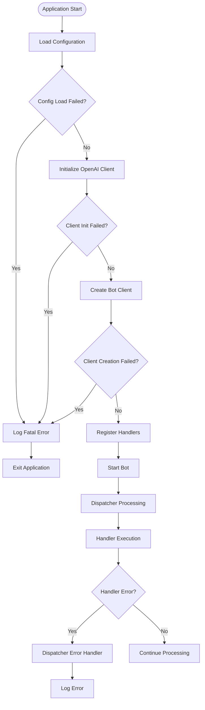
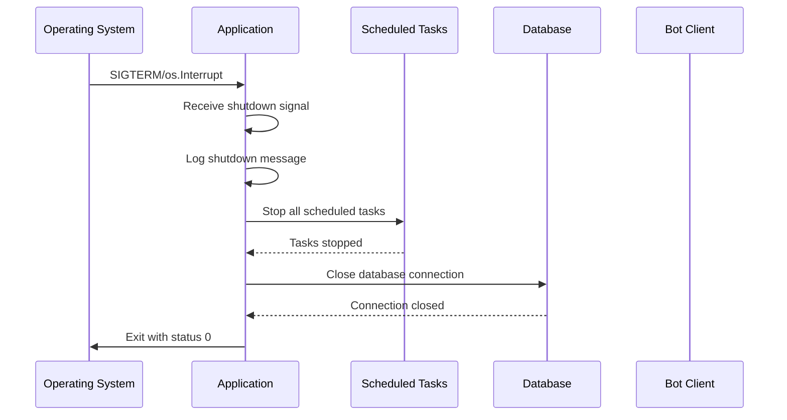
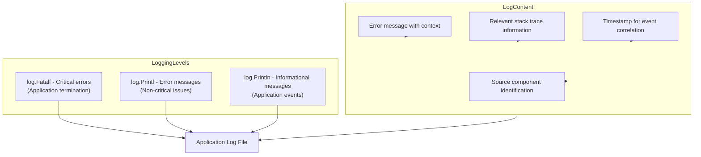
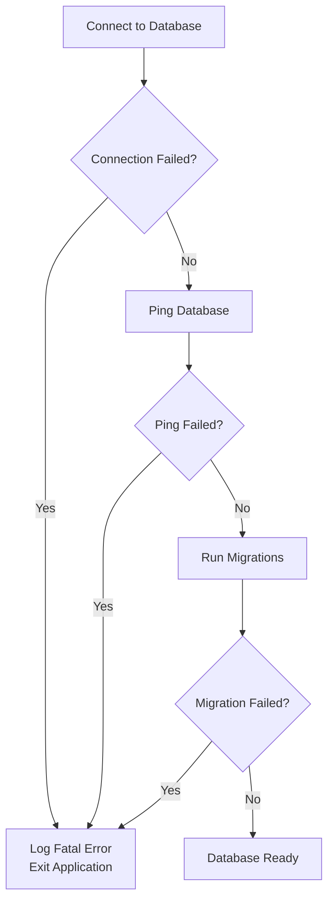
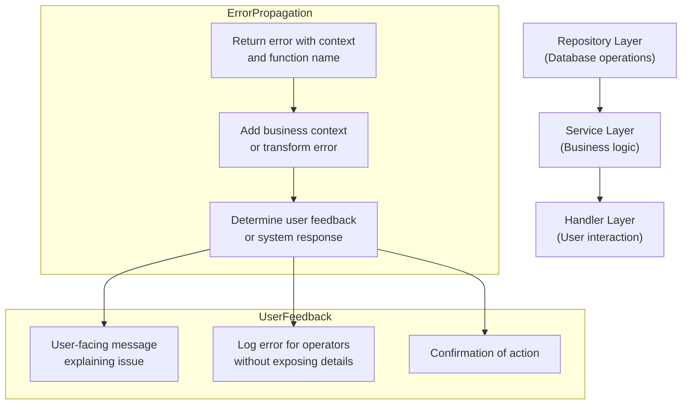
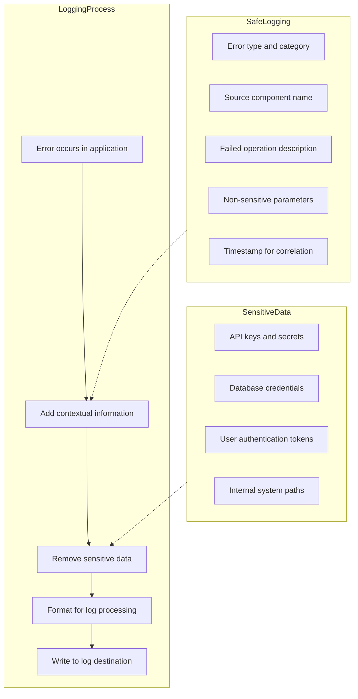

# Error Handling and Graceful Shutdown

<cite>
**Referenced Files in This Document**   
- [main.go](file://main.go)
- [internal/bot/bot.go](file://internal/bot/bot.go)
- [internal/database/db.go](file://internal/database/db.go)
- [internal/config/config.go](file://internal/config/config.go)
- [internal/clients/openai_client.go](file://internal/clients/openai_client.go)
- [internal/handlers/privatehandlers/profile_handler.go](file://internal/handlers/privatehandlers/profile_handler.go)
- [internal/database/repositories/profile_repository.go](file://internal/database/repositories/profile_repository.go)
- [internal/database/repositories/user_repository.go](file://internal/database/repositories/user_repository.go)
- [internal/services/profile_service.go](file://internal/services/profile_service.go)
- [internal/utils/type_utils.go](file://internal/utils/type_utils.go)
</cite>

## Table of Contents
1. [Introduction](#introduction)
2. [Error Handling Strategy](#error-handling-strategy)
3. [Graceful Shutdown Implementation](#graceful-shutdown-implementation)
4. [Logging Strategy](#logging-strategy)
5. [Critical Error Scenarios](#critical-error-scenarios)
6. [Error Propagation and User Feedback](#error-propagation-and-user-feedback)
7. [Best Practices for Error Logging](#best-practices-for-error-logging)
8. [Conclusion](#conclusion)

## Introduction
The evocoders-bot-go application implements a comprehensive error handling and graceful shutdown mechanism to ensure reliability, stability, and operational visibility. This document details the multi-layered error handling strategy, graceful shutdown implementation using Go's signal package, logging approach using the standard log package, and best practices for error management. The system is designed to handle errors at multiple levels, from dispatcher-level panic recovery to application-level initialization errors, while providing appropriate user feedback and maintaining data integrity during shutdown.

## Error Handling Strategy

The evocoders-bot-go application employs a multi-layered error handling strategy that spans from the dispatcher level to individual handler and service methods. This comprehensive approach ensures that errors are caught, handled appropriately, and propagated through the system while maintaining application stability.

At the dispatcher level, the application implements error handling through the `ext.DispatcherOpts.Error` function in the `NewTgBotClient` method. This function serves as a global error handler that catches any panics or unhandled errors that occur within bot handlers. When an error occurs, it is logged using Go's standard log package, and the dispatcher continues processing without terminating the application. This prevents a single handler error from bringing down the entire bot.

**Diagram sources**
- [main.go](file://main.go#L10-L50)
- [internal/bot/bot.go](file://internal/bot/bot.go#L45-L79)

**Section sources**
- [main.go](file://main.go#L10-L50)
- [internal/bot/bot.go](file://internal/bot/bot.go#L45-L79)

At the handler and service level, the application implements explicit error checking and handling. Each handler method returns an error that is either handled locally or propagated up the call stack. For example, in the profile handler, database operations are wrapped in error checks that provide appropriate user feedback while logging detailed error information for debugging. The error handling follows a consistent pattern where business logic errors result in user-facing messages, while system errors are logged for operational visibility.

The application also implements error handling during component initialization in the `main.go` file. Critical components such as configuration loading, OpenAI client initialization, and bot client creation are all wrapped in error checks that use `log.Fatalf` to terminate the application if initialization fails. This ensures that the application does not start in a compromised state and provides clear error messages to operators.

## Graceful Shutdown Implementation

The evocoders-bot-go application implements a robust graceful shutdown mechanism using Go's signal package to handle termination signals and ensure proper resource cleanup. This implementation prevents data loss and maintains system integrity when the application is terminated.

The graceful shutdown is configured in the `setupGracefulShutdown` function in `main.go`, which sets up signal handling for `os.Interrupt` (typically triggered by Ctrl+C) and `syscall.SIGTERM` (typically sent by process managers). When one of these signals is received, the application initiates a shutdown sequence that stops scheduled tasks, closes database connections, and terminates the process in an orderly manner.

**Diagram sources**
- [main.go](file://main.go#L40-L52)
- [internal/bot/bot.go](file://internal/bot/bot.go#L370-L383)

The shutdown sequence begins when the signal channel receives a termination signal. The application logs a message indicating that a shutdown signal has been received, then calls the `botClient.Close()` method to initiate the shutdown process. Within the `Close` method, the application first stops all scheduled tasks by calling the `Stop()` method on each task in the `b.tasks` slice. This ensures that background processes such as daily summarization and random coffee pair generation are properly terminated before the application exits.

After stopping scheduled tasks, the application closes the database connection by calling `b.db.Close()`. This method closes the underlying SQL database connection, releasing resources and ensuring that any pending transactions are properly handled by the database driver. The graceful shutdown implementation ensures that all pending operations have a chance to complete before the process terminates, preventing data corruption and maintaining data integrity.

**Section sources**
- [main.go](file://main.go#L40-L52)
- [internal/bot/bot.go](file://internal/bot/bot.go#L370-L383)

## Logging Strategy

The evocoders-bot-go application employs a comprehensive logging strategy using Go's standard log package to provide operational visibility and facilitate debugging. The logging approach is designed to capture critical information about application behavior, errors, and operational events while maintaining readability and usefulness for monitoring and troubleshooting.

The application uses different logging levels and approaches depending on the context and severity of the message. For critical initialization errors that prevent the application from starting, the application uses `log.Fatalf` to log the error and terminate the process. This ensures that operators are immediately aware of configuration issues or dependency failures that would compromise the application's functionality.

**Diagram sources**
- [main.go](file://main.go#L15-L35)
- [internal/bot/bot.go](file://internal/bot/bot.go#L55-L60)

For non-critical errors that occur during handler execution, the application uses `log.Printf` or `log.Println` to log error details without terminating the application. These logs include contextual information such as the handler name, error type, and relevant parameters to aid in debugging. The application leverages the `utils.GetTypeName` and `utils.GetCurrentTypeName` functions to include the source component in error messages, making it easier to trace issues to their origin.

The logging strategy also includes informational messages that provide visibility into application operations. For example, when the bot starts successfully, it logs a message indicating that the bot has been started along with the bot's username and current server time. Similarly, during graceful shutdown, the application logs a message when it receives a shutdown signal and when resources are being closed.

**Section sources**
- [main.go](file://main.go#L15-L35)
- [internal/bot/bot.go](file://internal/bot/bot.go#L55-L60)
- [internal/utils/type_utils.go](file://internal/utils/type_utils.go#L0-L78)

## Critical Error Scenarios

The evocoders-bot-go application is designed to handle several critical error scenarios that could prevent proper operation or compromise data integrity. These scenarios are addressed through comprehensive error handling and appropriate user feedback mechanisms.

One critical scenario is database connection failure during startup. When the application initializes, it attempts to establish a connection to the PostgreSQL database using the connection string from environment variables. If this connection fails, the application logs a fatal error and terminates. This prevents the application from running in a state where it cannot persist data or retrieve necessary information. The error handling in the `setupDatabase` function ensures that both connection establishment and ping verification are successful before proceeding.

**Diagram sources**
- [internal/database/db.go](file://internal/database/db.go#L15-L30)
- [internal/bot/bot.go](file://internal/bot/bot.go#L136-L175)

Another critical scenario is OpenAI client initialization errors. During application startup, the bot attempts to create an OpenAI client using API credentials from environment variables. If this initialization fails due to invalid credentials or network issues, the application logs a fatal error and terminates. This ensures that the bot does not start without access to its AI capabilities, which are essential for core functionality.

Configuration loading errors represent another critical scenario. The application relies on environment variables for configuration, and missing or invalid values can prevent proper operation. The `config.LoadConfig` function validates required environment variables and returns descriptive error messages when values are missing or invalid. This allows operators to quickly identify and resolve configuration issues.

**Section sources**
- [internal/database/db.go](file://internal/database/db.go#L15-L30)
- [internal/bot/bot.go](file://internal/bot/bot.go#L136-L175)
- [internal/config/config.go](file://internal/config/config.go#L102-L142)

## Error Propagation and User Feedback

The evocoders-bot-go application implements a sophisticated error propagation mechanism that ensures errors are appropriately handled at each layer while providing meaningful feedback to users. This approach maintains a clear separation between system errors that require operator attention and user-facing issues that can be resolved through user action.

Error propagation follows a consistent pattern from lower layers (repositories) to higher layers (handlers). Repository methods return errors with contextual information, including the source function name obtained through reflection using `utils.GetTypeName`. These errors are then propagated up through service methods, which may add additional context or transform the error for higher-level consumption. Finally, handler methods receive these errors and determine the appropriate response based on the error type and severity.

**Diagram sources**
- [internal/database/repositories/profile_repository.go](file://internal/database/repositories/profile_repository.go#L50-L100)
- [internal/services/profile_service.go](file://internal/services/profile_service.go#L25-L35)
- [internal/handlers/privatehandlers/profile_handler.go](file://internal/handlers/privatehandlers/profile_handler.go#L200-L250)

User feedback mechanisms are carefully designed to provide helpful information without exposing sensitive system details. When a user action fails due to a business rule violation (such as attempting to publish an incomplete profile), the application returns a clear message explaining the specific requirements that must be met. For example, when a user tries to publish a profile without completing all required fields, the application lists exactly which fields are missing.

For system errors that occur during user interactions, the application provides generic error messages to users while logging detailed information for operators. This protects sensitive information and prevents users from seeing technical details that might be confusing or concerning. The error messages are localized in Russian to match the application's primary user base, ensuring that users can understand the issues they encounter.

**Section sources**
- [internal/database/repositories/profile_repository.go](file://internal/database/repositories/profile_repository.go#L50-L100)
- [internal/services/profile_service.go](file://internal/services/profile_service.go#L25-L35)
- [internal/handlers/privatehandlers/profile_handler.go](file://internal/handlers/privatehandlers/profile_handler.go#L200-L250)

## Best Practices for Error Logging

The evocoders-bot-go application follows several best practices for error logging to ensure that logs are useful for debugging and monitoring while protecting sensitive information and maintaining performance.

One key practice is including contextual information in error messages without exposing sensitive data. The application uses reflection to automatically include the source function name in error messages through the `utils.GetTypeName` and `utils.GetCurrentTypeName` functions. This provides valuable context for debugging without requiring developers to manually add component identifiers to each error message.

**Diagram sources**
- [internal/utils/type_utils.go](file://internal/utils/type_utils.go#L0-L78)
- [internal/handlers/privatehandlers/profile_handler.go](file://internal/handlers/privatehandlers/profile_handler.go#L300-L350)

The application avoids logging sensitive information such as API keys, database credentials, and user tokens. When errors involve external services, the application logs error categories and operational impacts rather than raw response data that might contain sensitive information. This protects user privacy and complies with security best practices.

Error messages are structured consistently throughout the application, following the pattern of including the component name, operation description, and specific error details. This consistency makes it easier to search and analyze logs when troubleshooting issues. The application also uses appropriate log levels, with fatal errors reserved for unrecoverable conditions that require application restart, and regular errors used for recoverable issues that don't compromise overall system stability.

The logging implementation balances verbosity with performance considerations. While detailed error information is valuable for debugging, the application avoids excessive logging that could impact performance or generate unmanageable log volumes. Error logs include enough information to diagnose issues without creating unnecessary overhead.

**Section sources**
- [internal/utils/type_utils.go](file://internal/utils/type_utils.go#L0-L78)
- [internal/handlers/privatehandlers/profile_handler.go](file://internal/handlers/privatehandlers/profile_handler.go#L300-L350)

## Conclusion

The evocoders-bot-go application demonstrates a comprehensive approach to error handling and graceful shutdown that prioritizes reliability, operational visibility, and user experience. The multi-layered error handling strategy effectively catches and manages errors at various levels, from dispatcher-level panic recovery to explicit error checking in handlers and services. The graceful shutdown implementation ensures proper resource cleanup and data integrity when the application terminates.

The logging strategy provides valuable operational insights while protecting sensitive information and maintaining performance. By following best practices for error logging, the application generates useful diagnostic information without compromising security or creating excessive log volume. The error propagation mechanism ensures that errors are appropriately handled at each layer, with meaningful feedback provided to users while detailed information is available to operators.

Critical error scenarios such as database connection failures and OpenAI client initialization errors are handled through application termination with clear error messages, preventing the bot from running in a compromised state. The combination of these error handling and shutdown mechanisms contributes to a robust and reliable application that can recover from failures and maintain data integrity during normal operation and termination.