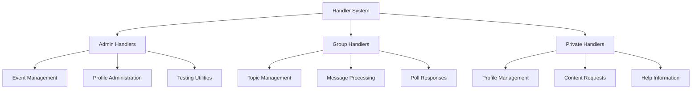
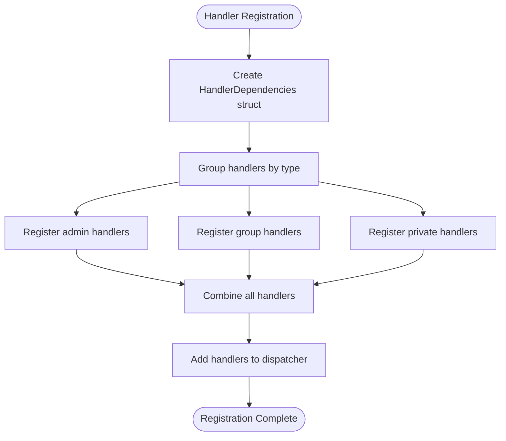
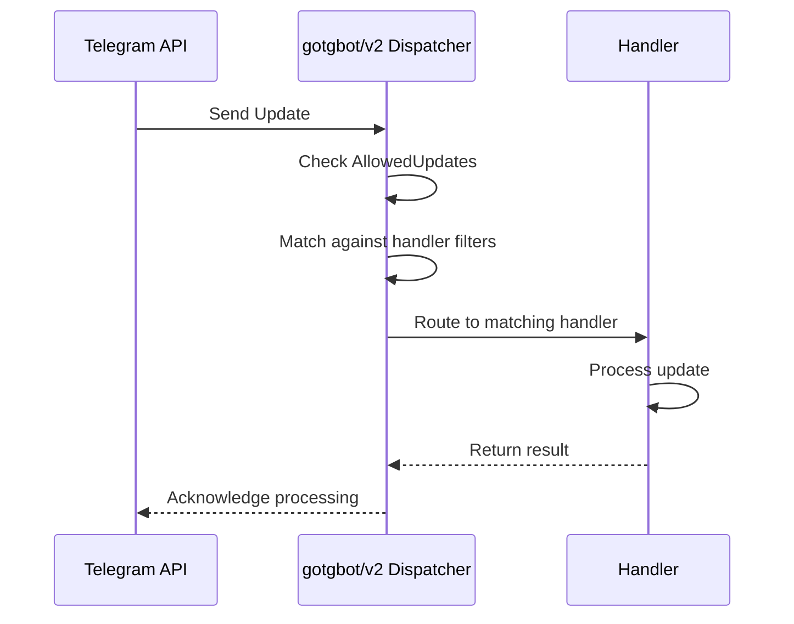
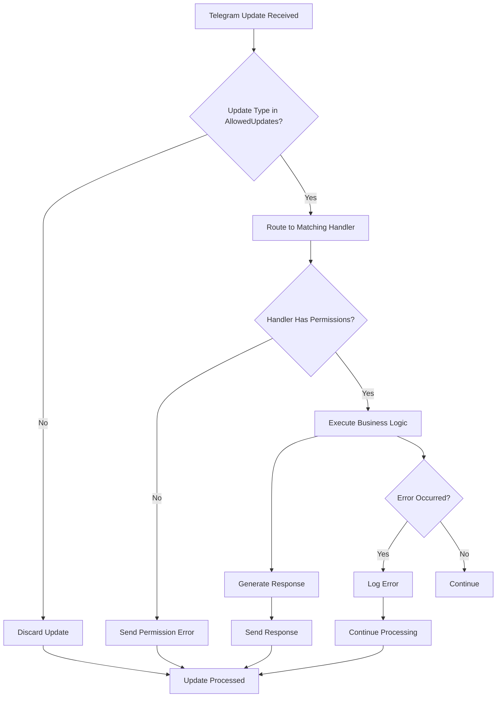
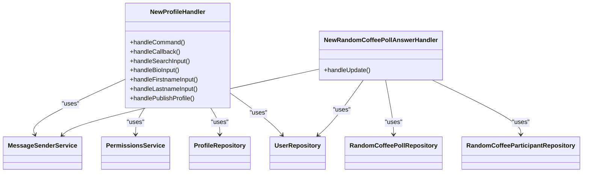
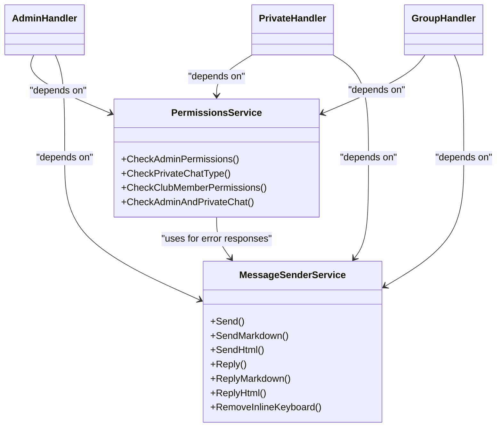

# Handler System

<cite>
**Referenced Files in This Document**   
- [bot.go](file://internal/bot/bot.go)
- [random_coffee_poll_answer_handler.go](file://internal/handlers/grouphandlers/random_coffee_poll_answer_handler.go)
- [profile_handler.go](file://internal/handlers/privatehandlers/profile_handler.go)
- [permissions_service.go](file://internal/services/permissions_service.go)
- [message_sender_service.go](file://internal/services/message_sender_service.go)
- [handlers_admin_constants.go](file://internal/constants/handlers_admin_constants.go)
- [handlers_private_constants.go](file://internal/constants/handlers_private_constants.go)
</cite>

## Table of Contents
1. [Introduction](#introduction)
2. [Handler Classification](#handler-classification)
3. [Handler Registration Process](#handler-registration-process)
4. [Update Routing Mechanism](#update-routing-mechanism)
5. [Handler Execution Flow](#handler-execution-flow)
6. [Handler Implementation Examples](#handler-implementation-examples)
7. [Cross-Cutting Concerns](#cross-cutting-concerns)
8. [Integration Patterns](#integration-patterns)
9. [Handler Ordering](#handler-ordering)
10. [Conclusion](#conclusion)

## Introduction
The Handler System in evocoders-bot-go is responsible for processing incoming Telegram updates and executing appropriate actions based on the update type and content. The system is organized into a three-tiered classification of handlers: admin handlers for privileged operations, group handlers for supergroup message processing, and private handlers for direct user interactions. This documentation provides a comprehensive overview of the handler system architecture, registration process, execution flow, and integration patterns.

**Section sources**
- [bot.go](file://internal/bot/bot.go#L170-L383)

## Handler Classification
The handler system is divided into three distinct categories based on their operational scope and target audience:

### Admin Handlers
Admin handlers are designed for privileged operations and are accessible only to users with administrative permissions. These handlers are located in the `internal/handlers/adminhandlers` directory and include functionality for event management, profile administration, and testing utilities. Examples include `eventDeleteHandler`, `eventEditHandler`, and `adminProfilesHandler`.

### Group Handlers
Group handlers process messages and events within supergroups and are located in the `internal/handlers/grouphandlers` directory. These handlers manage forum topics, message persistence, and poll responses in group contexts. Key handlers include `saveTopicsHandler`, `saveMessagesHandler`, and `randomCoffeePollAnswerHandler`.

### Private Handlers
Private handlers handle direct interactions with users in private chats and are located in the `internal/handlers/privatehandlers` directory. These handlers manage user profiles, content requests, and help information. Examples include `profileHandler`, `contentHandler`, and `helpHandler`.

**Diagram sources **
- [bot.go](file://internal/bot/bot.go#L170-L383)
- [handlers_admin_constants.go](file://internal/constants/handlers_admin_constants.go#L1-L59)
- [handlers_private_constants.go](file://internal/constants/handlers_private_constants.go#L1-L30)

**Section sources**
- [bot.go](file://internal/bot/bot.go#L170-L383)

## Handler Registration Process
The handler registration process is managed by the `TgBotClient.registerHandlers` method in `bot.go`. All handlers receive dependencies through the `HandlerDependencies` struct, which contains services and repositories required for their operation. This dependency injection pattern enables clean separation of concerns and facilitates testing.

The registration process follows a structured approach:
1. The `HandlerDependencies` struct is created with all necessary services and repositories
2. Handlers are grouped by type (admin, group, private)
3. Each handler is instantiated with its required dependencies
4. All handlers are registered with the dispatcher

**Diagram sources **
- [bot.go](file://internal/bot/bot.go#L170-L383)

**Section sources**
- [bot.go](file://internal/bot/bot.go#L170-L383)

## Update Routing Mechanism
The update routing mechanism is implemented using the gotgbot/v2 dispatcher, which receives Telegram updates and routes them to appropriate handlers based on update type. The bot is configured to accept specific update types through the `AllowedUpdates` field in the polling options.

The allowed update types include:
- message
- edited_message
- chat_member
- callback_query
- poll_answer
- my_chat_member

The dispatcher processes updates by matching them against registered handlers' filters. Each handler specifies the types of updates it can handle, and the dispatcher ensures that updates are delivered to the appropriate handlers based on these filters.

**Diagram sources **
- [bot.go](file://internal/bot/bot.go#L332-L383)

**Section sources**
- [bot.go](file://internal/bot/bot.go#L332-L383)

## Handler Execution Flow
The handler execution flow begins with the reception of a Telegram update and proceeds through several stages to generate a response:

1. **Update Reception**: The bot receives an update from Telegram through long polling
2. **Routing**: The dispatcher routes the update to matching handlers based on filters
3. **Permission Checking**: Handlers verify user permissions before processing
4. **Business Logic Execution**: The handler executes its specific business logic
5. **Response Generation**: The handler generates an appropriate response
6. **Error Handling**: Any errors during processing are handled by the dispatcher

The dispatcher includes error handling that logs errors but continues processing other updates, ensuring the bot remains operational even if individual handlers fail.

**Diagram sources **
- [bot.go](file://internal/bot/bot.go#L332-L383)
- [permissions_service.go](file://internal/services/permissions_service.go#L1-L97)

**Section sources**
- [bot.go](file://internal/bot/bot.go#L332-L383)
- [permissions_service.go](file://internal/services/permissions_service.go#L1-L97)

## Handler Implementation Examples
This section provides examples of specific handler implementations to illustrate the patterns used in the system.

### NewProfileHandler
The `NewProfileHandler` in `profile_handler.go` demonstrates a private handler for managing user profiles. It uses conversation states to guide users through profile viewing, editing, and publishing workflows. The handler receives dependencies including the `MessageSenderService`, `PermissionsService`, and various repositories for data access.

Key features:
- Conversation-based interaction flow
- Permission checking for club members
- Integration with profile formatting and message sending services
- Support for both viewing and editing operations

### NewRandomCoffeePollAnswerHandler
The `NewRandomCoffeePollAnswerHandler` in `random_coffee_poll_answer_handler.go` processes poll responses in group contexts. This handler specifically handles `poll_answer` updates and validates that the voting user is not a bot.

Key features:
- Poll answer filtering
- Bot user detection and rejection
- Database operations to record votes
- Integration with message sending service for admin notifications

**Diagram sources **
- [profile_handler.go](file://internal/handlers/privatehandlers/profile_handler.go#L0-L799)
- [random_coffee_poll_answer_handler.go](file://internal/handlers/grouphandlers/random_coffee_poll_answer_handler.go#L0-L69)

**Section sources**
- [profile_handler.go](file://internal/handlers/privatehandlers/profile_handler.go#L0-L799)
- [random_coffee_poll_answer_handler.go](file://internal/handlers/grouphandlers/random_coffee_poll_answer_handler.go#L0-L69)

## Cross-Cutting Concerns
The handler system addresses several cross-cutting concerns through dedicated services and patterns.

### Permission Checks
Permission checks are implemented through the `PermissionsService` which provides methods to verify user roles and chat types. The service includes methods such as `CheckAdminPermissions`, `CheckPrivateChatType`, and `CheckClubMemberPermissions` that handlers can use to validate access before processing requests.

### Message Formatting
Message formatting is handled by the `MessageSenderService` which provides methods for sending messages in different formats (plain text, Markdown, HTML). The service also handles link preview options and ensures consistent message formatting across the application.

**Diagram sources **
- [permissions_service.go](file://internal/services/permissions_service.go#L1-L97)
- [message_sender_service.go](file://internal/services/message_sender_service.go#L1-L481)

**Section sources**
- [permissions_service.go](file://internal/services/permissions_service.go#L1-L97)
- [message_sender_service.go](file://internal/services/message_sender_service.go#L1-L481)

## Integration Patterns
Handlers integrate with services and repositories through dependency injection via the `HandlerDependencies` struct. This pattern ensures that handlers have access to the necessary components without creating tight coupling.

The integration follows these patterns:
- **Service Integration**: Handlers use services like `MessageSenderService` and `PermissionsService` for common operations
- **Repository Integration**: Handlers access data through repository interfaces for database operations
- **Configuration Access**: Handlers receive configuration through the `AppConfig` parameter
- **Dependency Container**: The `HandlerDependencies` struct acts as a dependency container passed to all handlers

This approach enables loose coupling, making the system more maintainable and testable.

**Section sources**
- [bot.go](file://internal/bot/bot.go#L170-L383)

## Handler Ordering
Handler ordering is critical for proper system operation, particularly for group handlers. The `SaveTopicsHandler` must execute first to ensure that forum topics are properly recorded before other handlers process messages within those topics.

The handler registration process in `registerHandlers` maintains a specific order:
1. Start handler (available to all users)
2. Admin handlers
3. Group handlers (with `SaveTopicsHandler` first)
4. Private handlers

This ordering ensures that foundational operations are completed before dependent handlers process updates, preventing race conditions and data inconsistencies.

**Section sources**
- [bot.go](file://internal/bot/bot.go#L209-L269)

## Conclusion
The Handler System in evocoders-bot-go provides a robust framework for processing Telegram updates through a well-organized three-tiered classification. The system leverages dependency injection, proper error handling, and careful handler ordering to ensure reliable operation. By separating concerns through dedicated services and repositories, the system maintains clean architecture while providing comprehensive functionality for admin, group, and private interactions.