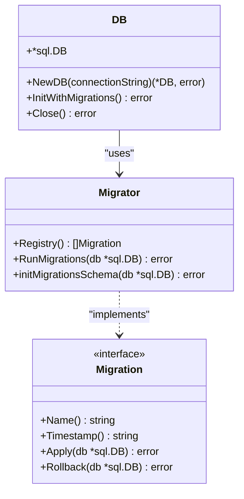
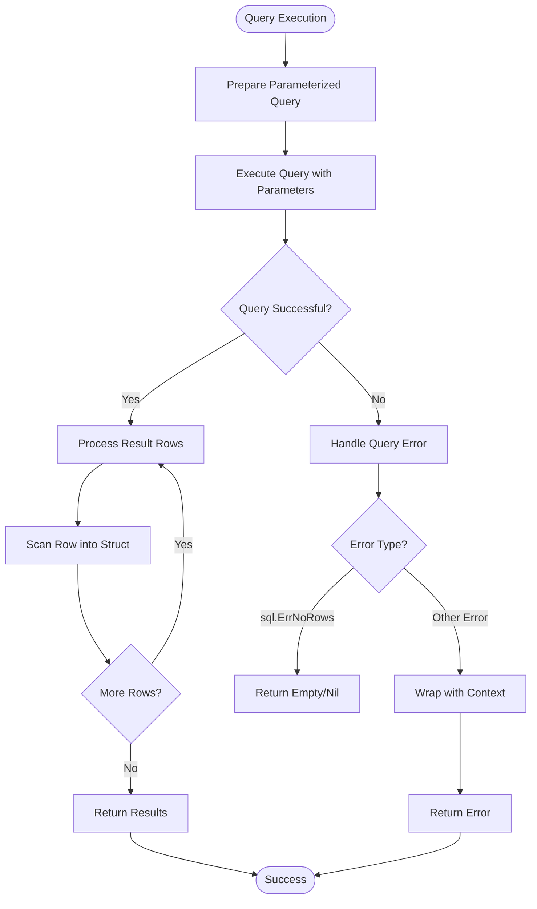
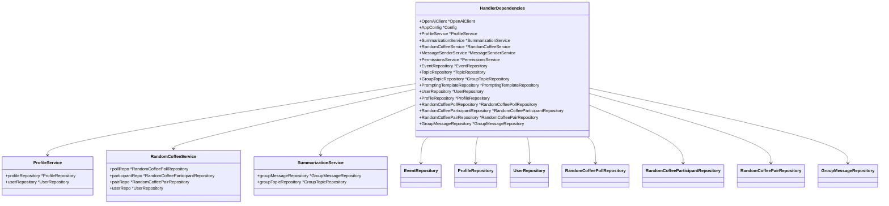

# Repository Layer

<cite>
**Referenced Files in This Document**   
- [db.go](file://internal/database/db.go)
- [event_repository.go](file://internal/database/repositories/event_repository.go)
- [profile_repository.go](file://internal/database/repositories/profile_repository.go)
- [random_coffee_poll_repository.go](file://internal/database/repositories/random_coffee_poll_repository.go)
- [random_coffee_participant_repository.go](file://internal/database/repositories/random_coffee_participant_repository.go)
- [random_coffee_pair_repository.go](file://internal/database/repositories/random_coffee_pair_repository.go)
- [group_message_repository.go](file://internal/database/repositories/group_message_repository.go)
- [user_repository.go](file://internal/database/repositories/user_repository.go)
- [migrator.go](file://internal/database/migrations/migrator.go)
- [bot.go](file://internal/bot/bot.go)
</cite>

## Table of Contents
1. [Introduction](#introduction)
2. [Database Connection and Initialization](#database-connection-and-initialization)
3. [Repository Pattern Implementation](#repository-pattern-implementation)
4. [Core Repository Components](#core-repository-components)
5. [Data Access and Query Patterns](#data-access-and-query-patterns)
6. [Transaction Management and Error Handling](#transaction-management-and-error-handling)
7. [Performance Considerations](#performance-considerations)
8. [Dependency Injection and Service Integration](#dependency-injection-and-service-integration)
9. [Conclusion](#conclusion)

## Introduction

The Repository Layer in evocoders-bot-go provides a clean abstraction over the PostgreSQL database, implementing the repository pattern to isolate data access logic from business logic. This architectural approach enables separation of concerns, improves testability, and allows for potential database abstraction in the future. The repository layer consists of specialized repository types for managing different domain entities, each encapsulating CRUD operations and complex queries specific to their respective domains.

**Section sources**
- [db.go](file://internal/database/db.go#L1-L44)
- [bot.go](file://internal/bot/bot.go#L25-L43)

## Database Connection and Initialization

The database connection is managed through the DB struct, which wraps the standard sql.DB connection and provides a clean interface for database operations. The NewDB function creates a new database connection using the PostgreSQL driver and validates connectivity through a ping operation. Database initialization is handled by the InitWithMigrations method, which orchestrates the migration process through the migrations package.

Database migrations are managed through a structured migration system that tracks applied migrations in a dedicated migrations table. The migration system uses a registry pattern to maintain an ordered list of migration implementations, ensuring consistent application of schema changes across environments. Each migration is implemented as a transactional operation with rollback capabilities, providing safety during schema evolution.

**Diagram sources**
- [db.go](file://internal/database/db.go#L1-L44)
- [migrator.go](file://internal/database/migrations/migrator.go#L0-L149)

**Section sources**
- [db.go](file://internal/database/db.go#L1-L44)
- [migrator.go](file://internal/database/migrations/migrator.go#L0-L149)

## Repository Pattern Implementation

The repository pattern is implemented through a collection of specialized repository types, each responsible for a specific domain entity. Each repository encapsulates the data access logic for its entity, providing a clean API that abstracts the underlying database operations. The repositories follow a consistent design pattern, with each repository type containing a reference to the database connection and implementing methods for common operations.

The repository pattern enables separation of concerns by isolating data access logic from business logic, making the codebase more maintainable and testable. By providing a clear boundary between the data layer and the service layer, the repository pattern allows for easier modification of data access strategies without affecting business logic. This design also facilitates unit testing, as repositories can be mocked to test service logic in isolation.

```mermaid
classDiagram
class Repository {
<<interface>>
}
class EventRepository {
+*sql.DB
+*TopicRepository
+CreateEvent(name, eventType) (int, error)
+GetLastActualEvents(limit) ([]Event, error)
+UpdateEventName(id, newName) error
+DeleteEvent(id) error
}
class ProfileRepository {
+*sql.DB
+GetByID(id) (*Profile, error)
+Create(userID, bio) (int, error)
+Update(id, fields) error
+GetOrCreate(userID) (*Profile, error)
}
class UserRepository {
+*sql.DB
+GetByID(id) (*User, error)
+Create(tgID, firstname, lastname, username) (int, error)
+Update(id, fields) error
+GetOrCreate(tgUser) (*User, error)
}
class RandomCoffeePollRepository {
+*sql.DB
+CreatePoll(poll) (int64, error)
+GetPollByTelegramPollID(telegramPollID) (*RandomCoffeePoll, error)
}
class RandomCoffeeParticipantRepository {
+*sql.DB
+UpsertParticipant(participant) error
+GetParticipatingUsers(pollID) ([]User, error)
}
class RandomCoffeePairRepository {
+*sql.DB
+CreatePair(pollID, user1ID, user2ID) error
+GetPairsHistoryForUsers(userIDs, lastNPolls) (map[string][]int, error)
}
class GroupMessageRepository {
+*sql.DB
+Create(messageID, messageText, replyToMessageID, userTgID, groupTopicID) (*GroupMessage, error)
+GetByGroupTopicID(groupTopicID, limit, offset) ([]*GroupMessage, error)
}
Repository <|-- EventRepository
Repository <|-- ProfileRepository
Repository <|-- UserRepository
Repository <|-- RandomCoffeePollRepository
Repository <|-- RandomCoffeeParticipantRepository
Repository <|-- RandomCoffeePairRepository
Repository <|-- GroupMessageRepository
```

**Diagram sources**
- [event_repository.go](file://internal/database/repositories/event_repository.go#L1-L253)
- [profile_repository.go](file://internal/database/repositories/profile_repository.go#L1-L286)
- [user_repository.go](file://internal/database/repositories/user_repository.go#L1-L424)
- [random_coffee_poll_repository.go](file://internal/database/repositories/random_coffee_poll_repository.go#L1-L97)
- [random_coffee_participant_repository.go](file://internal/database/repositories/random_coffee_participant_repository.go#L1-L87)
- [random_coffee_pair_repository.go](file://internal/database/repositories/random_coffee_pair_repository.go#L1-L126)
- [group_message_repository.go](file://internal/database/repositories/group_message_repository.go#L1-L264)

**Section sources**
- [event_repository.go](file://internal/database/repositories/event_repository.go#L1-L253)
- [profile_repository.go](file://internal/database/repositories/profile_repository.go#L1-L286)
- [user_repository.go](file://internal/database/repositories/user_repository.go#L1-L424)

## Core Repository Components

### EventRepository

The EventRepository manages event entities, providing methods for creating, retrieving, updating, and deleting events. It includes specialized methods for retrieving the last actual events ordered by start time, which is used to display upcoming events. The repository also handles cascading deletion of related topics when an event is deleted, maintaining referential integrity.

### ProfileRepository

The ProfileRepository handles user profile data, including bio information and published message IDs. It provides methods for creating and updating profiles, as well as specialized methods for retrieving or creating profiles with default values. The repository also implements a method to retrieve all profiles with associated user information, enabling comprehensive profile management.

### RandomCoffee System Repositories

The random coffee system is implemented through three interconnected repositories:
- RandomCoffeePollRepository: Manages poll entities, storing information about coffee pairing polls
- RandomCoffeeParticipantRepository: Tracks user participation in polls, allowing for upsert operations to record participation status
- RandomCoffeePairRepository: Stores the resulting pairs from coffee matching, with methods to retrieve pairing history and prevent duplicate pairings

### GroupMessageRepository

The GroupMessageRepository persists chat messages from the group, including message text, sender information, and threading context through reply-to message IDs. It provides methods for retrieving messages by various criteria, including by user, by group topic, and by message ID, supporting the chat history and summarization features.

**Section sources**
- [event_repository.go](file://internal/database/repositories/event_repository.go#L1-L253)
- [profile_repository.go](file://internal/database/repositories/profile_repository.go#L1-L286)
- [random_coffee_poll_repository.go](file://internal/database/repositories/random_coffee_poll_repository.go#L1-L97)
- [random_coffee_participant_repository.go](file://internal/database/repositories/random_coffee_participant_repository.go#L1-L87)
- [random_coffee_pair_repository.go](file://internal/database/repositories/random_coffee_pair_repository.go#L1-L126)
- [group_message_repository.go](file://internal/database/repositories/group_message_repository.go#L1-L264)

## Data Access and Query Patterns

The repository layer employs several consistent query patterns to ensure efficient and reliable data access. Parameterized queries are used throughout to prevent SQL injection attacks and improve query plan caching. The repositories use the standard database/sql package's QueryRow and Query methods for single and multiple row retrieval, respectively, with proper error handling for cases where no rows are found.

Complex queries often involve JOIN operations to retrieve related data, such as retrieving profiles with associated user information. These queries are carefully constructed to minimize the data transferred and optimize performance. For example, the ProfileRepository's GetAllWithUsers method uses an INNER JOIN to retrieve profile and user data in a single query, reducing the number of database round trips.

Pagination is implemented for queries that may return large result sets, such as retrieving messages by user or by group topic. These methods accept limit and offset parameters to enable efficient pagination of results. The queries are ordered by creation time in descending order to provide the most recent items first.

**Diagram sources**
- [event_repository.go](file://internal/database/repositories/event_repository.go#L1-L253)
- [profile_repository.go](file://internal/database/repositories/profile_repository.go#L1-L286)
- [group_message_repository.go](file://internal/database/repositories/group_message_repository.go#L1-L264)

**Section sources**
- [event_repository.go](file://internal/database/repositories/event_repository.go#L1-L253)
- [profile_repository.go](file://internal/database/repositories/profile_repository.go#L1-L286)
- [group_message_repository.go](file://internal/database/repositories/group_message_repository.go#L1-L264)

## Transaction Management and Error Handling

The repository layer implements robust error handling to ensure data integrity and provide meaningful error messages. Each repository method wraps database errors with contextual information using Go's error wrapping functionality, making it easier to diagnose issues in higher layers. The error messages include the repository type name and the specific operation being performed, providing clear context for troubleshooting.

While most operations are implemented as single SQL statements without explicit transactions, the design allows for future enhancement with transaction support where needed. The migration system demonstrates transaction usage, wrapping schema changes in transactions with rollback capabilities. This pattern could be extended to repository methods that require multiple related operations to be performed atomically.

Error handling follows a consistent pattern across repositories:
- Database errors are wrapped with contextual information
- sql.ErrNoRows is handled as a special case, often indicating a not-found condition
- Rows affected are checked after UPDATE and DELETE operations to verify the operation affected the expected number of rows
- Errors during row scanning are properly handled and wrapped

**Section sources**
- [event_repository.go](file://internal/database/repositories/event_repository.go#L1-L253)
- [profile_repository.go](file://internal/database/repositories/profile_repository.go#L1-L286)
- [user_repository.go](file://internal/database/repositories/user_repository.go#L1-L424)

## Performance Considerations

The repository layer incorporates several performance optimizations to ensure efficient database operations. Indexes are created on frequently queried columns, such as user_id in the profiles table, to speed up lookups. The migration files show explicit creation of indexes where appropriate, indicating a deliberate approach to query optimization.

Connection pooling is provided by the underlying database/sql package, which manages a pool of database connections and reuses them across requests. This reduces the overhead of establishing new connections for each database operation. The DB struct maintains a single connection pool that is shared across all repositories, ensuring efficient resource utilization.

Query optimization is achieved through several techniques:
- Selecting only required columns rather than using SELECT *
- Using appropriate WHERE clauses to filter results at the database level
- Implementing pagination for large result sets
- Using parameterized queries to enable query plan caching
- Minimizing the number of database round trips through JOIN operations

The design also considers future scalability, with the repository pattern enabling potential replacement of the PostgreSQL backend with alternative storage solutions without affecting the service layer.

**Section sources**
- [migrator.go](file://internal/database/migrations/migrator.go#L0-L149)
- [event_repository.go](file://internal/database/repositories/event_repository.go#L1-L253)
- [profile_repository.go](file://internal/database/repositories/profile_repository.go#L1-L286)

## Dependency Injection and Service Integration

Repositories are integrated into the application through dependency injection via the HandlerDependencies struct. This struct contains references to all repository instances and is passed to services and handlers that require data access. The dependency injection pattern enables loose coupling between components and facilitates testing by allowing repositories to be replaced with mocks.

The repository instances are created during application initialization and injected into the HandlerDependencies struct, which is then passed to service constructors. This ensures that all components use the same repository instances, maintaining consistency across the application. The pattern also makes the dependencies explicit, improving code readability and maintainability.

**Diagram sources**
- [bot.go](file://internal/bot/bot.go#L25-L43)
- [services/profile_service.go](file://internal/services/profile_service.go)
- [services/random_coffee_service.go](file://internal/services/random_coffee_service.go)
- [services/summarization_service.go](file://internal/services/summarization_service.go)

**Section sources**
- [bot.go](file://internal/bot/bot.go#L25-L43)

## Conclusion

The Repository Layer in evocoders-bot-go provides a well-structured abstraction over the PostgreSQL database, implementing the repository pattern to isolate data access logic from business logic. The design follows consistent patterns across repositories, making the codebase predictable and maintainable. Key strengths include proper error handling, efficient query patterns, and thoughtful integration with the rest of the application through dependency injection.

The repository layer effectively balances simplicity with functionality, providing the necessary operations for the application while maintaining clean separation of concerns. The use of parameterized queries, proper error handling, and connection pooling ensures reliable and secure database operations. The migration system provides a robust mechanism for schema evolution, while the repository pattern enables future flexibility in data storage implementation.