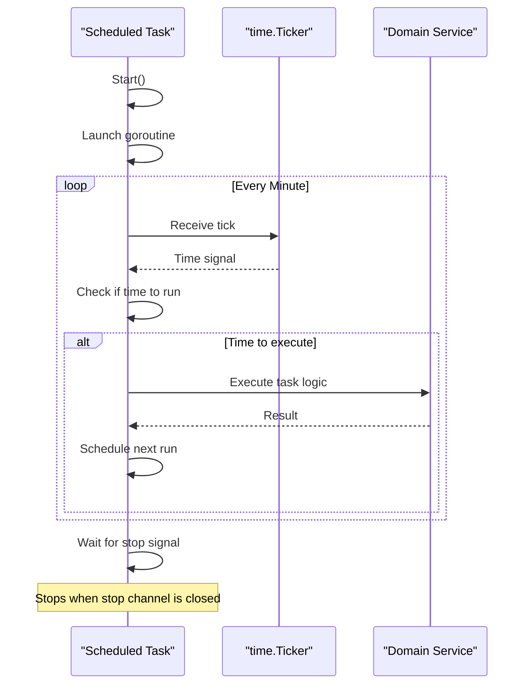
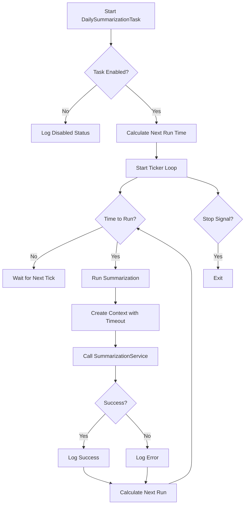
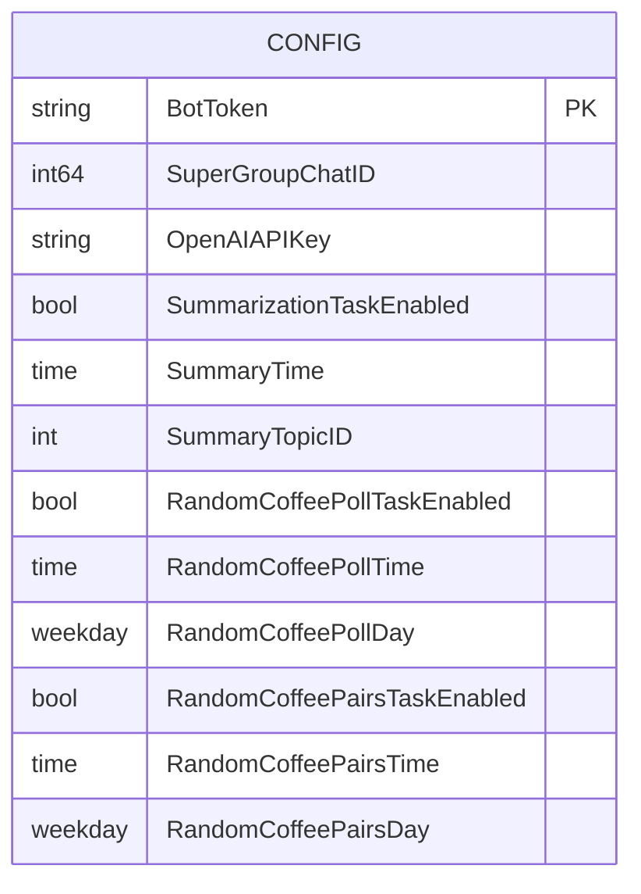
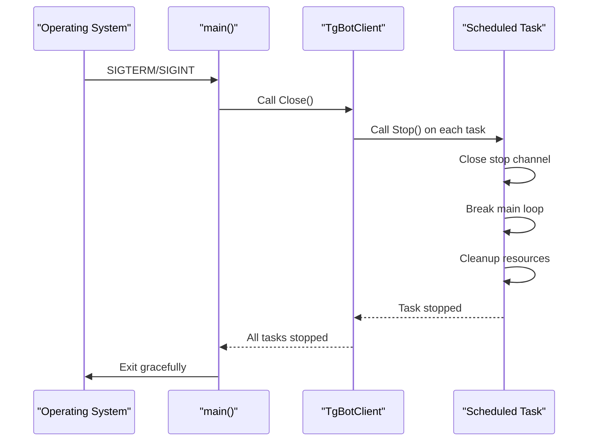
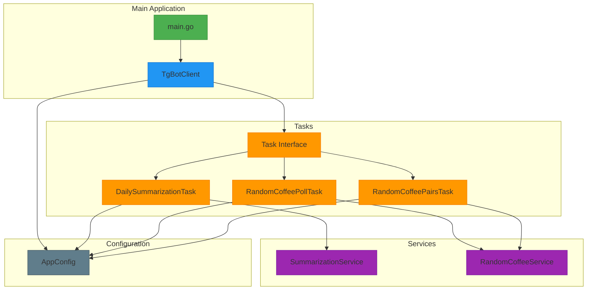

# Scheduled Tasks

<cite>
**Referenced Files in This Document**   
- [task.go](file://internal/tasks/task.go)
- [daily_summarization_task.go](file://internal/tasks/daily_summarization_task.go)
- [random_coffee_poll_task.go](file://internal/tasks/random_coffee_poll_task.go)
- [random_coffee_pairs_task.go](file://internal/tasks/random_coffee_pairs_task.go)
- [config.go](file://internal/config/config.go)
- [main.go](file://main.go)
- [bot.go](file://internal/bot/bot.go)
- [summarization_service.go](file://internal/services/summarization_service.go)
- [random_coffee_service.go](file://internal/services/random_coffee_service.go)
</cite>

## Table of Contents
1. [Introduction](#introduction)
2. [Task Interface and Lifecycle Management](#task-interface-and-lifecycle-management)
3. [Task Scheduling Mechanism](#task-scheduling-mechanism)
4. [Primary Scheduled Tasks](#primary-scheduled-tasks)
5. [Task Initialization and Registration](#task-initialization-and-registration)
6. [Concurrency Model](#concurrency-model)
7. [Configuration-Driven Scheduling](#configuration-driven-scheduling)
8. [Error Handling and Recovery](#error-handling-and-recovery)
9. [Service Integration](#service-integration)
10. [Graceful Shutdown Process](#graceful-shutdown-process)
11. [Architecture Overview](#architecture-overview)

## Introduction
The Scheduled Tasks system in evocoders-bot-go implements a robust task scheduling mechanism for executing periodic background operations in a Telegram bot environment. This system manages three primary scheduled tasks: daily chat summarization, weekly coffee poll creation, and coffee pair generation. The architecture leverages Go's concurrency model with time.Ticker for efficient time-based scheduling, ensuring non-blocking execution alongside the main bot polling loop. Tasks are controlled through a standardized interface with Start() and Stop() methods, enabling lifecycle management and graceful shutdown.

## Task Interface and Lifecycle Management
The task system is built around a simple interface that standardizes task behavior across the application. All scheduled tasks implement this interface to ensure consistent lifecycle management.

```mermaid
classDiagram
class Task {
<<interface>>
+Start()
+Stop()
}
class DailySummarizationTask {
-config *Config
-summarizationService *SummarizationService
-stop chan struct{}
+Start()
+Stop()
}
class RandomCoffeePollTask {
-config *Config
-randomCoffeeService *RandomCoffeeService
-stop chan struct{}
+Start()
+Stop()
}
class RandomCoffeePairsTask {
-config *Config
-randomCoffeeService *RandomCoffeeService
-stop chan struct{}
+Start()
+Stop()
}
Task <|-- DailySummarizationTask
Task <|-- RandomCoffeePollTask
Task <|-- RandomCoffeePairsTask
```

**Diagram sources**
- [task.go](file://internal/tasks/task.go#L2-L5)
- [daily_summarization_task.go](file://internal/tasks/daily_summarization_task.go#L8-L15)
- [random_coffee_poll_task.go](file://internal/tasks/random_coffee_poll_task.go#L8-L15)
- [random_coffee_pairs_task.go](file://internal/tasks/random_coffee_pairs_task.go#L8-L15)

The Task interface defines two essential methods for lifecycle control:
- **Start()**: Begins task execution and scheduling
- **Stop()**: Signals the task to terminate gracefully

Each task implementation maintains a stop channel of type `chan struct{}` to signal termination. When Stop() is called, the channel is closed, which is detected in the task's main loop to exit cleanly. This pattern ensures that tasks can be properly terminated during application shutdown without leaving goroutines running.

**Section sources**
- [task.go](file://internal/tasks/task.go#L2-L5)
- [daily_summarization_task.go](file://internal/tasks/daily_summarization_task.go#L40-L50)
- [random_coffee_poll_task.go](file://internal/tasks/random_coffee_poll_task.go#L40-L50)
- [random_coffee_pairs_task.go](file://internal/tasks/random_coffee_pairs_task.go#L40-L50)

## Task Scheduling Mechanism
The scheduling mechanism uses Go's time.Ticker to implement periodic checking for task execution. Rather than scheduling tasks at exact times, each task runs a goroutine with a ticker that checks every minute whether it's time to execute the task.



**Diagram sources**
- [daily_summarization_task.go](file://internal/tasks/daily_summarization_task.go#L52-L99)
- [random_coffee_poll_task.go](file://internal/tasks/random_coffee_poll_task.go#L52-L105)
- [random_coffee_pairs_task.go](file://internal/tasks/random_coffee_pairs_task.go#L52-L101)

Each task creates a time.Ticker with a one-minute interval using `time.NewTicker(time.Minute)`. The task's run() method contains a select statement that listens for both the ticker channel and the stop channel. This design allows the task to check frequently whether it should execute while remaining responsive to shutdown signals. The ticker is properly stopped using defer to prevent resource leaks.

The calculateNextRun() method determines when the task should next execute based on configuration settings. For daily tasks, it calculates the next occurrence of the configured time, advancing to the next day if the time has already passed. For weekly tasks, it calculates the next occurrence of the specified weekday and time.

**Section sources**
- [daily_summarization_task.go](file://internal/tasks/daily_summarization_task.go#L52-L99)
- [random_coffee_poll_task.go](file://internal/tasks/random_coffee_poll_task.go#L52-L105)
- [random_coffee_pairs_task.go](file://internal/tasks/random_coffee_pairs_task.go#L52-L101)

## Primary Scheduled Tasks
The system implements three primary scheduled tasks, each serving a distinct purpose in the bot's functionality.

### DailySummarizationTask
This task generates daily summaries of chat activity in monitored topics. It is configured to run once per day at a specified time.



**Diagram sources**
- [daily_summarization_task.go](file://internal/tasks/daily_summarization_task.go#L17-L99)

The task checks the SummarizationTaskEnabled configuration flag and logs its startup with the configured execution time. When triggered, it calls the SummarizationService with a 30-minute context timeout to prevent indefinite execution. The task is designed to send summaries to the main chat rather than direct messages.

**Section sources**
- [daily_summarization_task.go](file://internal/tasks/daily_summarization_task.go#L17-L99)
- [summarization_service.go](file://internal/services/summarization_service.go#L15-L45)

### RandomCoffeePollTask
This weekly task creates polling events to gauge interest in virtual coffee meetings. It runs on a specified day of the week at a configured time.

The task checks the RandomCoffeePollTaskEnabled flag and logs startup with the configured day and time. When executed, it invokes the RandomCoffeeService to send a poll to the designated coffee topic. The service call is wrapped in a 5-minute context timeout to prevent hanging operations.

**Section sources**
- [random_coffee_poll_task.go](file://internal/tasks/random_coffee_poll_task.go#L17-L105)
- [random_coffee_service.go](file://internal/services/random_coffee_service.go#L25-L55)

### RandomCoffeePairsTask
This task generates and announces pairings of participants for virtual coffee meetings. It runs weekly on a specified day at a configured time.

Unlike the other tasks, this task does not use a context with timeout, directly calling the GenerateAndSendPairs method on the RandomCoffeeService. The task handles any errors returned by the service and logs them appropriately. This task is responsible for the actual pairing logic and announcement of matches.

**Section sources**
- [random_coffee_pairs_task.go](file://internal/tasks/random_coffee_pairs_task.go#L17-L101)
- [random_coffee_service.go](file://internal/services/random_coffee_service.go#L60-L90)

## Task Initialization and Registration
Tasks are initialized and registered within the bot's main client structure during application startup. The NewTgBotClient function in bot.go is responsible for creating and configuring all scheduled tasks.

When the TgBotClient is created, it receives the application configuration and service dependencies needed by the tasks. The client initializes each task using its respective constructor function (NewDailySummarizationTask, NewRandomCoffeePollTask, NewRandomCoffeePairsTask), passing the required configuration and service dependencies.

The TgBotClient maintains a collection of all tasks and provides methods to start and stop them collectively. This centralized management allows for coordinated task lifecycle control, ensuring all scheduled operations can be started or stopped as a group.

**Section sources**
- [bot.go](file://internal/bot/bot.go#L25-L80)
- [daily_summarization_task.go](file://internal/tasks/daily_summarization_task.go#L17-L35)
- [random_coffee_poll_task.go](file://internal/tasks/random_coffee_poll_task.go#L17-L35)
- [random_coffee_pairs_task.go](file://internal/tasks/random_coffee_pairs_task.go#L17-L35)

## Concurrency Model
The system employs Go's goroutines to achieve non-blocking execution of scheduled tasks alongside the main bot polling loop. Each task runs in its own goroutine, allowing the main application to continue processing Telegram updates without interruption.

When a task determines it's time to execute, it launches another goroutine to perform the actual work. This nested goroutine pattern prevents the main task loop from being blocked by long-running operations such as API calls or database operations. For example, the DailySummarizationTask launches a goroutine to call RunDailySummarization, allowing the task to immediately continue its ticker loop.

This concurrency model ensures that:
- The main bot polling loop remains responsive
- Tasks can execute independently without interfering with each other
- Long-running operations don't block task scheduling accuracy
- The application can handle multiple concurrent task executions

The use of channels for signaling (the stop channel) provides a safe mechanism for goroutine communication and coordination, following Go's principle of "don't communicate by sharing memory; share memory by communicating."

**Section sources**
- [daily_summarization_task.go](file://internal/tasks/daily_summarization_task.go#L70-L78)
- [random_coffee_poll_task.go](file://internal/tasks/random_coffee_poll_task.go#L70-L78)
- [random_coffee_pairs_task.go](file://internal/tasks/random_coffee_pairs_task.go#L70-L78)

## Configuration-Driven Scheduling
Task scheduling is fully configurable through environment variables, allowing deployment-specific settings without code changes. The Config struct in config.go defines all configurable parameters for the scheduled tasks.



**Diagram sources**
- [config.go](file://internal/config/config.go#L10-L80)

Key configuration options include:
- **SummarizationTaskEnabled**: Controls whether daily summarization runs
- **SummaryTime**: Sets the daily execution time in HH:MM format
- **RandomCoffeePollTaskEnabled**: Enables/disables weekly poll creation
- **RandomCoffeePollTime**: Sets the time for poll creation
- **RandomCoffeePollDay**: Specifies the day of week for poll creation
- **RandomCoffeePairsTaskEnabled**: Controls pair generation
- **RandomCoffeePairsTime**: Sets the time for pair generation
- **RandomCoffeePairsDay**: Specifies the day of week for pair generation

Each configuration field has sensible defaults if not specified in environment variables. For example, the summary time defaults to 03:00 if not configured, and the coffee poll day defaults to Friday. This design allows for flexible deployment across different environments while maintaining reasonable default behavior.

**Section sources**
- [config.go](file://internal/config/config.go#L10-L318)

## Error Handling and Recovery
The task system implements robust error handling to ensure reliability and graceful degradation when issues occur.

Each task includes error handling around its core service calls, logging any errors that occur during execution. For example, the DailySummarizationTask logs errors from RunDailySummarization, and the RandomCoffeePollTask logs errors from SendPoll. This logging provides visibility into task failures without stopping the task from continuing its schedule.

The tasks employ a fire-and-forget retry strategy: after an error, the task continues to the next scheduled execution rather than attempting immediate retries. This prevents error loops while ensuring the operation will be attempted again at the next scheduled time.

Context timeouts are used to prevent tasks from hanging indefinitely. The DailySummarizationTask uses a 30-minute timeout, and the RandomCoffeePollTask uses a 5-minute timeout. These timeouts ensure that if a service call becomes unresponsive, it will be terminated and the error logged.

The system also handles configuration errors during startup, validating environment variables and providing clear error messages when required settings are missing or invalid.

**Section sources**
- [daily_summarization_task.go](file://internal/tasks/daily_summarization_task.go#L75-L77)
- [random_coffee_poll_task.go](file://internal/tasks/random_coffee_poll_task.go#L75-L77)
- [random_coffee_pairs_task.go](file://internal/tasks/random_coffee_pairs_task.go#L75-L77)
- [config.go](file://internal/config/config.go#L50-L318)

## Service Integration
Scheduled tasks integrate with domain-specific services to execute their business logic, maintaining separation of concerns between scheduling and functionality.

The DailySummarizationTask integrates with the SummarizationService, which handles the complex logic of retrieving chat messages, processing them through OpenAI, and formatting the summary. This separation allows the task to focus on scheduling while delegating domain logic to a specialized service.

Both coffee-related tasks integrate with the RandomCoffeeService, which encapsulates all logic related to the random coffee feature. The RandomCoffeePollTask calls SendPoll to create weekly polls, while the RandomCoffeePairsTask calls GenerateAndSendPairs to create and announce participant pairings.

This service integration pattern promotes:
- Code reuse across different triggers (scheduled and manual)
- Testability of business logic independent of scheduling
- Clear separation of concerns
- Flexibility to trigger the same functionality through different mechanisms

The services are injected into tasks during construction, enabling dependency injection and making the system more modular and testable.

**Section sources**
- [daily_summarization_task.go](file://internal/tasks/daily_summarization_task.go#L12-L15)
- [random_coffee_poll_task.go](file://internal/tasks/random_coffee_poll_task.go#L12-L15)
- [random_coffee_pairs_task.go](file://internal/tasks/random_coffee_pairs_task.go#L12-L15)
- [summarization_service.go](file://internal/services/summarization_service.go#L10-L50)
- [random_coffee_service.go](file://internal/services/random_coffee_service.go#L10-L60)

## Graceful Shutdown Process
The system implements a graceful shutdown process to ensure proper termination of all scheduled tasks when the application receives a termination signal.



**Diagram sources**
- [main.go](file://main.go#L40-L53)
- [bot.go](file://internal/bot/bot.go#L100-L120)
- [task.go](file://internal/tasks/task.go#L4-L5)

In main.go, the setupGracefulShutdown function configures signal handling for os.Interrupt and syscall.SIGTERM. When a signal is received, it triggers the bot client's Close() method. This method calls Stop() on each registered task, closing their stop channels and allowing their goroutines to exit cleanly.

The use of signal.Notify with a buffered channel ensures that the application can handle termination signals even if the main goroutine is busy. Once all tasks have stopped, the application exits cleanly, preventing abrupt termination that could leave resources in an inconsistent state.

This graceful shutdown process is essential for maintaining data integrity and ensuring that the bot can be safely restarted or redeployed without losing scheduled task state.

**Section sources**
- [main.go](file://main.go#L40-L53)
- [bot.go](file://internal/bot/bot.go#L100-L120)

## Architecture Overview
The Scheduled Tasks system follows a clean architectural pattern that separates concerns and promotes maintainability.



**Diagram sources**
- [main.go](file://main.go#L1-L53)
- [bot.go](file://internal/bot/bot.go#L1-L120)
- [task.go](file://internal/tasks/task.go#L1-L5)
- [config.go](file://internal/config/config.go#L1-L318)

The architecture follows a dependency flow from the main application down to the specific task implementations, with services and configuration injected as dependencies. This design enables independent development and testing of components while maintaining a clear execution flow. The system balances simplicity with robustness, using Go's built-in concurrency primitives to create a reliable scheduling mechanism that integrates seamlessly with the broader bot application.