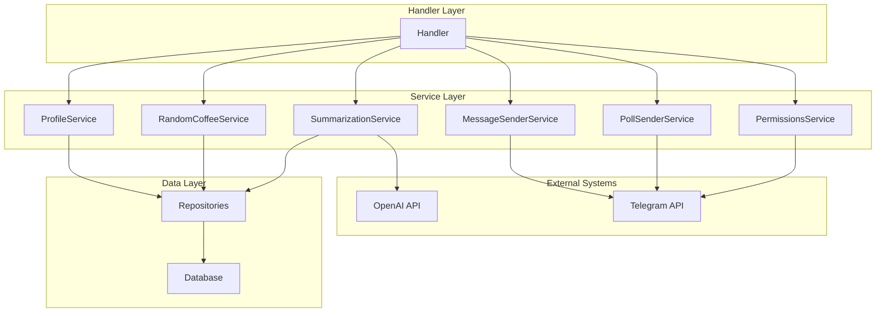
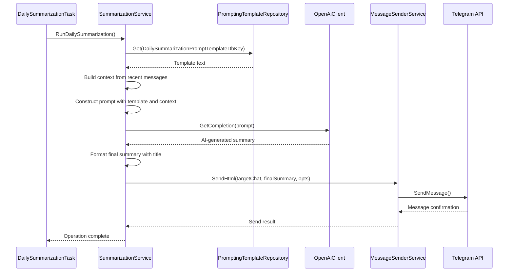

# Service Layer

<cite>
**Referenced Files in This Document**   
- [profile_service.go](file://internal/services/profile_service.go)
- [random_coffee_service.go](file://internal/services/random_coffee_service.go)
- [summarization_service.go](file://internal/services/summarization_service.go)
- [message_sender_service.go](file://internal/services/message_sender_service.go)
- [poll_sender_service.go](file://internal/services/poll_sender_service.go)
- [permissions_service.go](file://internal/services/permissions_service.go)
- [bot.go](file://internal/bot/bot.go)
- [main.go](file://main.go)
</cite>

## Table of Contents
1. [Introduction](#introduction)
2. [Service Layer Architecture](#service-layer-architecture)
3. [Core Service Implementations](#core-service-implementations)
4. [Service Initialization and Dependency Injection](#service-initialization-and-dependency-injection)
5. [Service Interaction Patterns](#service-interaction-patterns)
6. [Error Handling and Performance Considerations](#error-handling-and-performance-considerations)
7. [Service Interface Design Principles](#service-interface-design-principles)
8. [Conclusion](#conclusion)

## Introduction
The Service Layer in evocoders-bot-go serves as the central orchestrator of business logic, positioned between the handler layer and data repositories. This layer encapsulates complex application logic, coordinates interactions between different components, and provides a clean abstraction for business operations. The services are designed to be stateless, testable, and loosely coupled, following the dependency inversion principle. Each service focuses on a specific domain concern, enabling clear separation of responsibilities and facilitating maintenance and extension of the codebase.

## Service Layer Architecture

**Diagram sources**
- [bot.go](file://internal/bot/bot.go#L45-L79)
- [profile_service.go](file://internal/services/profile_service.go#L1-L38)

**Section sources**
- [bot.go](file://internal/bot/bot.go#L45-L79)
- [profile_service.go](file://internal/services/profile_service.go#L1-L38)

## Core Service Implementations

### ProfileService
The ProfileService manages user profile operations and validation. It provides functionality to check if a user's profile is complete based on minimum required fields such as firstname, lastname, and bio. This service acts as a gatekeeper for profile publishing operations, ensuring data quality before profiles are made visible in the system.

**Section sources**
- [profile_service.go](file://internal/services/profile_service.go#L1-L38)

### RandomCoffeeService
The RandomCoffeeService orchestrates the entire Random Coffee pairing process. It handles creating polls to gather participants, generating smart pairings that consider historical pairings to avoid repetition, and sending the final pairing results to the group. The service implements sophisticated pairing logic that prioritizes new pairings while falling back to random assignment if needed.

**Section sources**
- [random_coffee_service.go](file://internal/services/random_coffee_service.go#L1-L480)

### SummarizationService
The SummarizationService coordinates daily chat summaries using AI-powered processing. It retrieves recent messages from monitored topics, constructs prompts using templates from the database, and interfaces with the OpenAI API to generate human-readable summaries. The service handles rate limiting between topics and supports sending summaries to either a dedicated topic or directly to users via DM.

**Section sources**
- [summarization_service.go](file://internal/services/summarization_service.go#L1-L176)

### MessageSenderService
The MessageSenderService abstracts all Telegram message operations, providing a unified interface for sending various message types (text, markdown, HTML) with consistent formatting and error handling. It includes specialized functionality for handling closed topics by automatically reopening them, sending messages, and then closing them again to maintain the original state.

**Section sources**
- [message_sender_service.go](file://internal/services/message_sender_service.go#L1-L480)

### PollSenderService
The PollSenderService manages the creation and management of Telegram polls. It provides methods for sending polls with configurable options (anonymous, multiple answers) and stopping polls when needed. The service includes comprehensive logging to track poll lifecycle events and error conditions.

**Section sources**
- [poll_sender_service.go](file://internal/services/poll_sender_service.go#L1-L71)

### PermissionsService
The PermissionsService handles access control across the application. It provides methods to verify user permissions for various operations, including admin-only commands and club member restrictions. The service also validates command context, ensuring that certain operations are only performed in private chats.

**Section sources**
- [permissions_service.go](file://internal/services/permissions_service.go#L1-L96)

## Service Initialization and Dependency Injection

```mermaid
classDiagram
class TgBotClient {
+bot *gotgbot.Bot
+dispatcher *ext.Dispatcher
+updater *ext.Updater
+db *database.DB
+tasks []tasks.Task
+NewTgBotClient(openaiClient *clients.OpenAiClient, appConfig *config.Config) (*TgBotClient, error)
+Start()
+Close() error
}
class HandlerDependencies {
+OpenAiClient *clients.OpenAiClient
+AppConfig *config.Config
+ProfileService *services.ProfileService
+SummarizationService *services.SummarizationService
+RandomCoffeeService *services.RandomCoffeeService
+MessageSenderService *services.MessageSenderService
+PermissionsService *services.PermissionsService
+EventRepository *repositories.EventRepository
+TopicRepository *repositories.TopicRepository
+GroupTopicRepository *repositories.GroupTopicRepository
+PromptingTemplateRepository *repositories.PromptingTemplateRepository
+UserRepository *repositories.UserRepository
+ProfileRepository *repositories.ProfileRepository
+RandomCoffeePollRepository *repositories.RandomCoffeePollRepository
+RandomCoffeeParticipantRepository *repositories.RandomCoffeeParticipantRepository
+RandomCoffeePairRepository *repositories.RandomCoffeePairRepository
+GroupMessageRepository *repositories.GroupMessageRepository
}
class ProfileService {
+bot *gotgbot.Bot
+NewProfileService(bot *gotgbot.Bot) *ProfileService
+IsProfileComplete(user *repositories.User, profile *repositories.Profile) bool
}
class RandomCoffeeService {
+bot *gotgbot.Bot
+config *config.Config
+pollSender *PollSenderService
+messageSender *MessageSenderService
+pollRepo *repositories.RandomCoffeePollRepository
+participantRepo *repositories.RandomCoffeeParticipantRepository
+profileRepo *repositories.ProfileRepository
+pairRepo *repositories.RandomCoffeePairRepository
+userRepo *repositories.UserRepository
+NewRandomCoffeeService(...) *RandomCoffeeService
+SendPoll(ctx context.Context) error
+GenerateAndSendPairs() error
}
class SummarizationService {
+config *config.Config
+openaiClient *clients.OpenAiClient
+messageSenderService *MessageSenderService
+promptingTemplateRepository *repositories.PromptingTemplateRepository
+NewSummarizationService(...) *SummarizationService
+RunDailySummarization(ctx context.Context, sendToDM bool) error
}
class MessageSenderService {
+bot *gotgbot.Bot
+NewMessageSenderService(bot *gotgbot.Bot) *MessageSenderService
+SendWithReturnMessage(chatId int64, text string, opts *gotgbot.SendMessageOpts) (*gotgbot.Message, error)
+SendHtml(chatId int64, text string, opts *gotgbot.SendMessageOpts) error
+PinMessage(chatID int64, messageID int64, withNotification bool) error
}
class PollSenderService {
+bot *gotgbot.Bot
+NewPollSenderService(bot *gotgbot.Bot) *PollSenderService
+SendPoll(chatID int64, question string, answers []gotgbot.InputPollOption, options *gotgbot.SendPollOpts) (*gotgbot.Message, error)
+StopPoll(chatID int64, messageID int64, options *gotgbot.StopPollOpts) (*gotgbot.Poll, error)
}
class PermissionsService {
+config *config.Config
+bot *gotgbot.Bot
+messageSenderService *MessageSenderService
+NewPermissionsService(...) *PermissionsService
+CheckAdminPermissions(msg *gotgbot.Message, commandName string) bool
+CheckPrivateChatType(msg *gotgbot.Message) bool
}
TgBotClient --> HandlerDependencies : "creates"
TgBotClient --> ProfileService : "initializes"
TgBotClient --> RandomCoffeeService : "initializes"
TgBotClient --> SummarizationService : "initializes"
TgBotClient --> MessageSenderService : "initializes"
TgBotClient --> PollSenderService : "initializes"
TgBotClient --> PermissionsService : "initializes"
HandlerDependencies --> ProfileService : "contains"
HandlerDependencies --> RandomCoffeeService : "contains"
HandlerDependencies --> SummarizationService : "contains"
HandlerDependencies --> MessageSenderService : "contains"
HandlerDependencies --> PollSenderService : "contains"
HandlerDependencies --> PermissionsService : "contains"
main --> TgBotClient : "creates"
```

**Diagram sources**
- [bot.go](file://internal/bot/bot.go#L45-L79)
- [main.go](file://main.go#L0-L52)

**Section sources**
- [bot.go](file://internal/bot/bot.go#L45-L79)
- [main.go](file://main.go#L0-L52)

## Service Interaction Patterns

### Summarization Workflow

**Diagram sources**
- [summarization_service.go](file://internal/services/summarization_service.go#L1-L176)
- [message_sender_service.go](file://internal/services/message_sender_service.go#L1-L480)

**Section sources**
- [summarization_service.go](file://internal/services/summarization_service.go#L1-L176)

## Error Handling and Performance Considerations

### Error Handling Strategies
The service layer implements comprehensive error handling strategies to ensure reliability and graceful degradation. Services use structured error wrapping with context to provide detailed error information while maintaining clean error propagation. For example, the MessageSenderService handles the specific case of closed topics by automatically reopening them, sending the message, and then closing them again, all while logging the operation for audit purposes.

### Retry Mechanisms
The SummarizationService implements rate limiting between processing different monitored topics, with a 20-second delay between topics to avoid hitting Telegram API rate limits. This approach ensures stable operation even when multiple topics need summarization. The service continues processing remaining topics even if one fails, preventing a single failure from blocking the entire daily summarization process.

### Performance Optimizations
Services are designed with performance in mind, minimizing database queries and API calls. The RandomCoffeeService, for example, batches user information updates when generating pairs, reducing the number of individual database operations. The MessageSenderService optimizes message sending by setting default options (like disabled link previews) to reduce payload size and improve delivery speed.

**Section sources**
- [summarization_service.go](file://internal/services/summarization_service.go#L1-L176)
- [message_sender_service.go](file://internal/services/message_sender_service.go#L1-L480)
- [random_coffee_service.go](file://internal/services/random_coffee_service.go#L1-L480)

## Service Interface Design Principles

### Separation of Concerns
Each service in the evocoders-bot-go application follows the single responsibility principle, focusing on a specific domain area. This separation enables independent development, testing, and deployment of service components. The clear boundaries between services make the codebase more maintainable and reduce the risk of unintended side effects when modifying functionality.

### Testability
The service layer is designed with testability as a primary concern. Services depend on interfaces rather than concrete implementations, allowing for easy mocking during unit tests. The dependency injection pattern used in the HandlerDependencies struct enables complete control over service dependencies during testing, facilitating isolated component testing.

### Loose Coupling
Services are loosely coupled through well-defined interfaces and dependency injection. This design allows services to be modified or replaced without affecting other components. For example, the MessageSenderService could be replaced with a different implementation that uses a different Telegram client library without requiring changes to the services that depend on it.

**Section sources**
- [bot.go](file://internal/bot/bot.go#L45-L79)
- [profile_service.go](file://internal/services/profile_service.go#L1-L38)

## Conclusion
The Service Layer in evocoders-bot-go provides a robust foundation for business logic orchestration, effectively separating concerns between handlers, services, and data repositories. Through careful design of service interfaces, comprehensive dependency injection, and thoughtful error handling, the layer enables reliable and maintainable application functionality. The services work together seamlessly to deliver complex features like AI-powered chat summarization and intelligent user pairing while maintaining clean separation of responsibilities. This architectural approach ensures the application remains scalable and adaptable to future requirements.