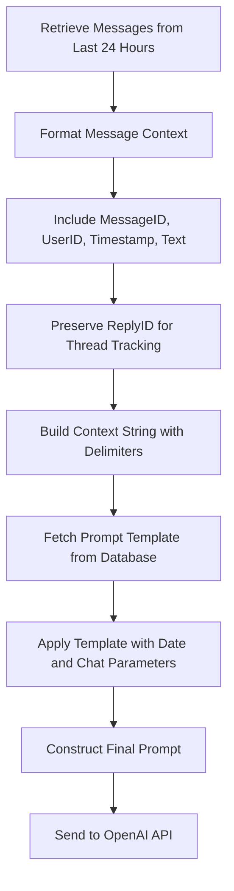
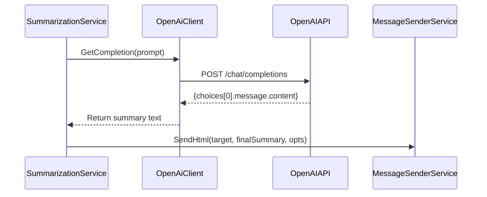
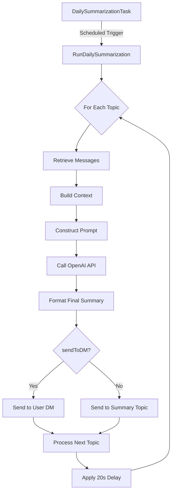

# AI Processing Pipeline

<cite>
**Referenced Files in This Document**   
- [summarization_service.go](file://internal/services/summarization_service.go)
- [openai_client.go](file://internal/clients/openai_client.go)
- [summarization_prompt.go](file://internal/database/prompts/summarization_prompt.go)
- [daily_summarization_task.go](file://internal/tasks/daily_summarization_task.go)
- [try_summarize_handler.go](file://internal/handlers/adminhandlers/testhandlers/try_summarize_handler.go)
</cite>

## Table of Contents
1. [Introduction](#introduction)
2. [Core Components](#core-components)
3. [Prompt Construction and Message Context Formatting](#prompt-construction-and-message-context-formatting)
4. [OpenAI API Interaction](#openai-api-interaction)
5. [Data Flow and Processing Pipeline](#data-flow-and-processing-pipeline)
6. [Error Handling and Rate Limiting](#error-handling-and-rate-limiting)
7. [Common Issues and Mitigation Strategies](#common-issues-and-mitigation-strategies)
8. [Configuration and Optimization](#configuration-and-optimization)

## Introduction
The Daily Summarization feature in evocoders-bot-go leverages an AI processing pipeline to automatically generate daily summaries of chat discussions. This document details the architecture and implementation of this pipeline, focusing on how the summarization_service constructs prompts using the summarization_prompt template, formats message context for OpenAI's API, and manages the end-to-end summarization workflow. The system is designed to extract meaningful discussion threads from raw chat logs, preserve conversation context, and deliver structured summaries back to users via Telegram. This documentation provides both conceptual overviews for beginners and technical details for advanced developers seeking to optimize or extend the system.

## Core Components
The AI processing pipeline consists of several interconnected components that work together to generate daily summaries. The SummarizationService orchestrates the entire process, retrieving message data, constructing prompts, and coordinating with external services. It depends on the OpenAiClient for LLM interactions, the PromptingTemplateRepository for dynamic prompt management, and the MessageSenderService for delivering results. The pipeline is triggered either by a scheduled task (DailySummarizationTask) or manually through the TrySummarizeHandler. Message context is built directly from GroupMessage entities without using RAG (Retrieval-Augmented Generation), ensuring simplicity and predictability in the summarization process.

**Section sources**
- [summarization_service.go](file://internal/services/summarization_service.go#L0-L47)
- [openai_client.go](file://internal/clients/openai_client.go#L0-L15)
- [daily_summarization_task.go](file://internal/tasks/daily_summarization_task.go#L0-L25)

## Prompt Construction and Message Context Formatting
The summarization_service constructs prompts using a template-based approach, where the core logic resides in the DailySummarizationPromptTemplateDbKey. The service retrieves this template from the database with a fallback to a default template defined in code. The prompt template is designed to guide the LLM in analyzing chat logs and identifying main discussion topics. Message context is formatted with critical metadata including MessageID, UserID, Timestamp, and Text, separated by clear delimiters. Each message is presented in a structured format that enables the AI to track conversation threads through ReplyID fields and identify discussion starters. The context assembly process iterates through all messages from the past 24 hours, preserving temporal relationships and user identities (anonymized as user_X) to maintain conversation integrity.

**Diagram sources**
- [summarization_service.go](file://internal/services/summarization_service.go#L82-L115)
- [summarization_prompt.go](file://internal/database/prompts/summarization_prompt.go#L0-L12)

**Section sources**
- [summarization_service.go](file://internal/services/summarization_service.go#L82-L115)
- [summarization_prompt.go](file://internal/database/prompts/summarization_prompt.go#L0-L42)

## OpenAI API Interaction
The interaction between summarization_service and openai_client follows a straightforward request-response pattern using the Chat Completions API. The GetCompletion method sends the constructed prompt as a user message to OpenAI, specifying the o3-mini model (openai.ChatModelO3Mini). The service does not set explicit temperature or max_tokens parameters, relying on OpenAI's defaults for balanced creativity and coherence. After receiving the completion, the response is parsed and formatted into a final summary with a title that includes the topic name and date. The summary is then sent to the target chat via the MessageSenderService, either to a designated summary topic or directly to a user's DM based on the sendToDM parameter. The system saves the complete prompt to a temporary file (last-prompt-log.txt) for debugging and auditing purposes.

**Diagram sources**
- [summarization_service.go](file://internal/services/summarization_service.go#L117-L153)
- [openai_client.go](file://internal/clients/openai_client.go#L35-L49)

**Section sources**
- [summarization_service.go](file://internal/services/summarization_service.go#L117-L153)
- [openai_client.go](file://internal/clients/openai_client.go#L35-L49)

## Data Flow and Processing Pipeline
The data flow begins with the DailySummarizationTask scheduler, which triggers the RunDailySummarization method at a configured time. For each monitored topic, the service retrieves messages from the past 24 hours and processes them sequentially with 20-second delays between topics to prevent rate limiting. The message context is built by iterating through GroupMessage entities and formatting them with timestamps and user identifiers. This context is injected into the prompt template along with dynamic parameters like current date and chat IDs. The completed prompt is sent to OpenAI, and upon receiving the summary, it is formatted with a title and sent to the appropriate destination. The pipeline supports both scheduled execution (sendToDM=false) and manual invocation with DM delivery (sendToDM=true), with the latter using context values to identify the recipient user.

**Diagram sources**
- [summarization_service.go](file://internal/services/summarization_service.go#L46-L80)
- [daily_summarization_task.go](file://internal/tasks/daily_summarization_task.go#L40-L60)

**Section sources**
- [summarization_service.go](file://internal/services/summarization_service.go#L46-L80)
- [daily_summarization_task.go](file://internal/tasks/daily_summarization_task.go#L40-L60)

## Error Handling and Rate Limiting
The pipeline implements several error handling and rate limiting strategies to ensure reliability. The RunDailySummarization method continues processing other topics even if one fails, preventing complete workflow interruption. Between topic processing, a 20-second delay is enforced to avoid overwhelming the OpenAI API. The service uses context cancellation to handle timeouts, with a 30-minute timeout for scheduled tasks and a 10-minute timeout for manual summarization attempts. API failures are wrapped with descriptive error messages and logged for debugging. The system also implements graceful degradation when user IDs are missing from context during DM delivery. Additionally, the TrySummarizeHandler provides user-facing error messages and cleanup routines to maintain conversation state integrity when operations are cancelled or fail.

**Section sources**
- [summarization_service.go](file://internal/services/summarization_service.go#L60-L75)
- [try_summarize_handler.go](file://internal/handlers/adminhandlers/testhandlers/try_summarize_handler.go#L139-L176)

## Common Issues and Mitigation Strategies
Common issues in the AI processing pipeline include token limit overflows, degraded summary quality, and API cost management. Token overflows can occur when message context exceeds model limits; this is mitigated by processing only 24 hours of messages and could be further addressed by implementing message sampling or summarization chaining. Degraded quality may result from ambiguous message context or prompt template limitations; maintaining clear message formatting and regularly refining the prompt template can improve output quality. API costs are managed through the use of the efficient o3-mini model and rate limiting between requests. For high-volume scenarios, additional cost controls could include caching summaries, implementing usage quotas, or adding content filtering to exclude low-value messages from processing.

**Section sources**
- [summarization_service.go](file://internal/services/summarization_service.go#L82-L115)
- [summarization_prompt.go](file://internal/database/prompts/summarization_prompt.go#L0-L42)

## Configuration and Optimization
The pipeline can be optimized through configuration adjustments and code enhancements. Key configuration points include the SummaryTime setting in the config, which determines when daily summaries are generated, and the MonitoredTopicsIDs array that specifies which chat topics to summarize. The OpenAI model can be changed by modifying the GetCompletion method, though o3-mini is currently optimized for this use case. Performance can be improved by implementing message batching, adding preprocessing filters to exclude system messages, or introducing a message prioritization system based on engagement metrics. For advanced optimization, the prompt template could be enhanced with few-shot examples or dynamic temperature adjustment based on message volume. The current implementation provides a solid foundation that balances simplicity, reliability, and effectiveness for daily chat summarization.

**Section sources**
- [summarization_service.go](file://internal/services/summarization_service.go#L0-L47)
- [openai_client.go](file://internal/clients/openai_client.go#L40-L42)
- [daily_summarization_task.go](file://internal/tasks/daily_summarization_task.go#L50-L55)