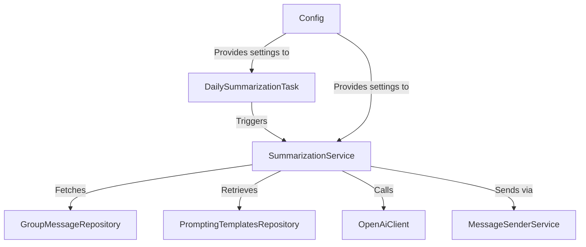
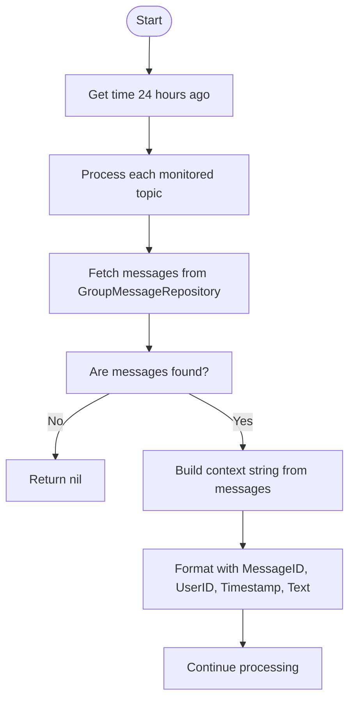
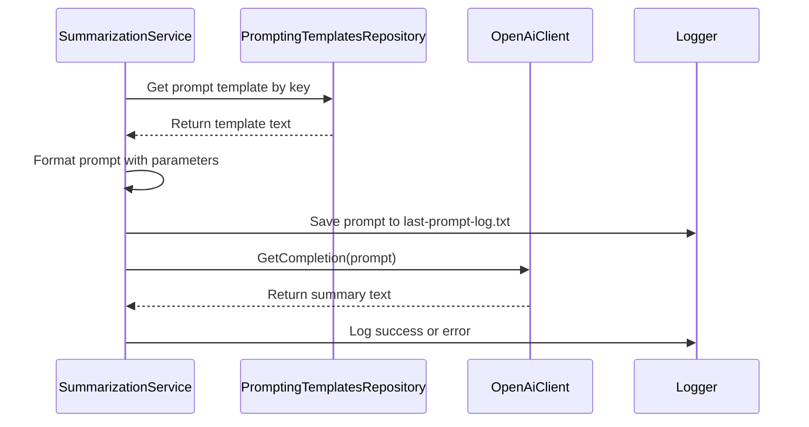
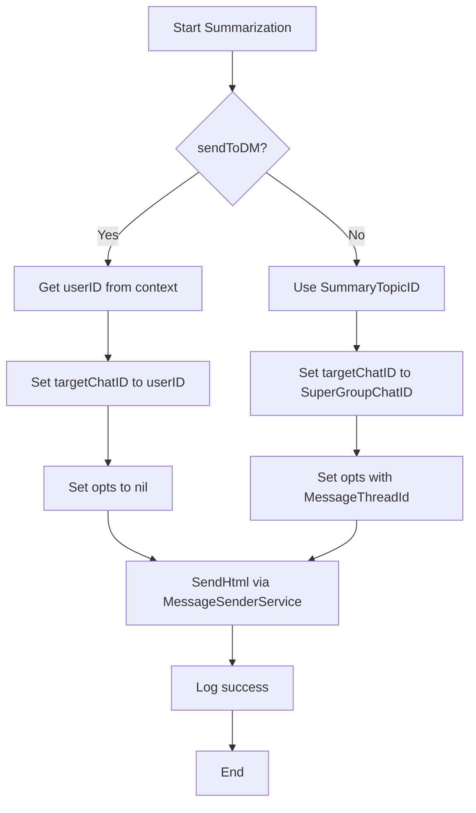
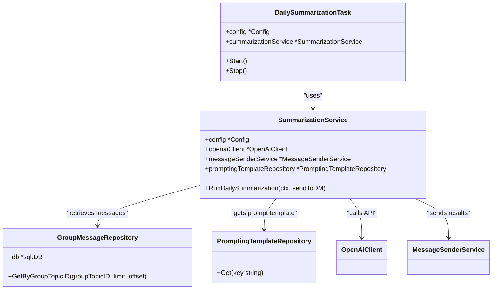

# Daily Summarization

<cite>
**Referenced Files in This Document**   
- [daily_summarization_task.go](file://internal/tasks/daily_summarization_task.go)
- [summarization_service.go](file://internal/services/summarization_service.go)
- [config.go](file://internal/config/config.go)
- [summarization_prompt.go](file://internal/database/prompts/summarization_prompt.go)
- [group_message_repository.go](file://internal/database/repositories/group_message_repository.go)
- [try_summarize_handler.go](file://internal/handlers/adminhandlers/testhandlers/try_summarize_handler.go)
</cite>

## Table of Contents
1. [Introduction](#introduction)
2. [Architecture Overview](#architecture-overview)
3. [Message Collection Process](#message-collection-process)
4. [AI Processing Pipeline](#ai-processing-pipeline)
5. [Summary Generation Workflow](#summary-generation-workflow)
6. [Configuration Options](#configuration-options)
7. [Invocation Relationships](#invocation-relationships)
8. [Common Issues and Solutions](#common-issues-and-solutions)
9. [Conclusion](#conclusion)

## Introduction
The Daily Summarization feature in evocoders-bot-go automatically analyzes chat messages from monitored topics and generates concise summaries using AI. This document explains the complete workflow from message collection to summary delivery, including the interaction between key components like the daily_summarization_task, summarization_service, and message repositories. The system leverages OpenAI's API to process message context and create structured summaries that highlight main discussion topics with direct links to original messages.

## Architecture Overview

**Diagram sources**
- [daily_summarization_task.go](file://internal/tasks/daily_summarization_task.go)
- [summarization_service.go](file://internal/services/summarization_service.go)
- [config.go](file://internal/config/config.go)

## Message Collection Process

The message collection process begins with the `DailySummarizationTask` scheduler, which triggers the summarization at a configured time. The `SummarizationService` then processes each topic specified in the `MonitoredTopicsIDs` configuration. For each topic, the service retrieves messages from the past 24 hours using the `GroupMessageRepository`. The repository queries the database for messages associated with specific topic IDs, building a comprehensive context string that includes message metadata such as MessageID, UserID, Timestamp, and Text content. This context preserves the chronological order and relationships between messages through reply chains.

**Diagram sources**
- [summarization_service.go](file://internal/services/summarization_service.go#L43-L80)
- [group_message_repository.go](file://internal/database/repositories/group_message_repository.go)

**Section sources**
- [summarization_service.go](file://internal/services/summarization_service.go#L43-L115)
- [group_message_repository.go](file://internal/database/repositories/group_message_repository.go)

## AI Processing Pipeline

The AI processing pipeline uses OpenAI's API to analyze the collected message context and generate structured summaries. The pipeline begins by retrieving a prompt template from the database using the `PromptingTemplatesRepository`, with a fallback to a default template if needed. The template is dynamically populated with current date, chat ID, topic ID, and the full message context. This constructed prompt is then sent to OpenAI's API through the `OpenAiClient`. The system implements error handling and logging throughout the process, including saving the final prompt to a temporary file for debugging purposes. The AI model processes the input according to specific instructions about grouping messages, identifying topics, and formatting the output with HTML links to original messages.

**Diagram sources**
- [summarization_service.go](file://internal/services/summarization_service.go#L117-L153)
- [summarization_prompt.go](file://internal/database/prompts/summarization_prompt.go)

**Section sources**
- [summarization_service.go](file://internal/services/summarization_service.go#L117-L153)
- [summarization_prompt.go](file://internal/database/prompts/summarization_prompt.go)

## Summary Generation Workflow

The summary generation workflow orchestrates all components to produce and deliver the final summary. After the AI generates the content, the service formats it with a title that includes the topic name and current date. The system determines the target destination based on the `sendToDM` parameter - either sending to a direct message with the user who triggered the summary or posting to the designated summary topic in the group chat. The `MessageSenderService` handles the delivery using Telegram's API, with appropriate message options including the message thread ID for proper topic placement. The workflow includes safeguards such as context timeouts (30 minutes for scheduled tasks, 10 minutes for manual requests) and rate limiting delays between processing multiple topics.

**Diagram sources**
- [summarization_service.go](file://internal/services/summarization_service.go#L155-L175)
- [try_summarize_handler.go](file://internal/handlers/adminhandlers/testhandlers/try_summarize_handler.go)

**Section sources**
- [summarization_service.go](file://internal/services/summarization_service.go#L155-L175)

## Configuration Options

The Daily Summarization feature is highly configurable through environment variables that control both timing and content parameters. The system supports configuration of monitored topics, summary delivery timing, AI model parameters, and operational flags.

### Summary Timing and Topic Configuration
The following configuration options control when and what gets summarized:

| Configuration Key | Environment Variable | Description | Default Value |
|-------------------|----------------------|-------------|---------------|
| MonitoredTopicsIDs | TG_EVO_BOT_MONITORED_TOPICS_IDS | Comma-separated list of topic IDs to monitor | Required |
| SummaryTopicID | TG_EVO_BOT_SUMMARY_TOPIC_ID | Topic ID where summaries are posted | Required |
| SummaryTime | TG_EVO_BOT_SUMMARY_TIME | Daily time (HH:MM) for automatic summarization | 03:00 |
| SummarizationTaskEnabled | TG_EVO_BOT_SUMMARIZATION_TASK_ENABLED | Flag to enable/disable scheduled summarization | true |

### AI Model Parameters
While specific AI model parameters are not directly exposed in the configuration, the prompt template provides control over the output format and analysis instructions. The prompt template can be modified in the database to adjust:

- Output format requirements (markdown, HTML tags allowed)
- Time period for analysis
- Message grouping logic
- Topic identification criteria
- Link formatting for original messages

**Section sources**
- [config.go](file://internal/config/config.go#L100-L140)

## Invocation Relationships

The invocation relationships between components follow a clear hierarchy where higher-level components depend on lower-level services. The `DailySummarizationTask` depends on the `SummarizationService` to execute the core logic, while the `SummarizationService` itself depends on multiple repositories and clients for data access and external communication. This dependency chain ensures separation of concerns, with the task handler managing scheduling, the service coordinating the workflow, and specialized components handling specific operations like database access or API calls.

**Diagram sources**
- [daily_summarization_task.go](file://internal/tasks/daily_summarization_task.go#L15-L15)
- [summarization_service.go](file://internal/services/summarization_service.go#L10-L25)

**Section sources**
- [daily_summarization_task.go](file://internal/tasks/daily_summarization_task.go)
- [summarization_service.go](file://internal/services/summarization_service.go)

## Common Issues and Solutions

### Handling Large Message Volumes
When processing topics with high message volume, the system may encounter performance issues or hit API rate limits. The current implementation addresses this through several mechanisms:

1. **Rate Limiting Delays**: The service implements a 20-second delay between processing different topics to prevent overwhelming external APIs.
2. **Contextual Filtering**: The prompt instructs the AI to focus only on main discussion topics and ignore brief exchanges like greetings.
3. **Time-based Segmentation**: By analyzing only the past 24 hours of messages, the system limits the context size.

However, a known limitation exists in the current implementation where all messages are loaded into memory without pagination or filtering, which could lead to memory issues with extremely large datasets.

### Error Handling and Recovery
The system includes comprehensive error handling:
- If no messages are found for a topic, the service logs this information and continues to the next topic.
- Database errors when retrieving prompt templates are caught and returned as formatted errors.
- OpenAI API failures are wrapped with context and returned to the caller.
- Context cancellation is properly handled throughout the call chain.

### Manual vs Automated Execution
The system supports both manual and automated summarization:
- **Automated**: Triggered daily by `DailySummarizationTask` with `sendToDM=false`
- **Manual**: Initiated by administrators through the `try_summarize_handler` with `sendToDM=true`

The manual process includes user confirmation via inline buttons and periodic typing indicators to improve user experience during the potentially long AI processing time.

**Section sources**
- [summarization_service.go](file://internal/services/summarization_service.go)
- [try_summarize_handler.go](file://internal/handlers/adminhandlers/testhandlers/try_summarize_handler.go)

## Conclusion
The Daily Summarization feature in evocoders-bot-go provides a robust system for automatically generating chat summaries using AI analysis. The architecture cleanly separates concerns between scheduling, message collection, AI processing, and result delivery. By leveraging configurable parameters and a well-defined component hierarchy, the system offers flexibility in both operation and customization. While the current implementation effectively handles typical use cases, opportunities exist to enhance message retrieval efficiency and provide more granular control over AI model parameters. The feature demonstrates a practical application of AI in community management, transforming large volumes of chat messages into actionable insights.