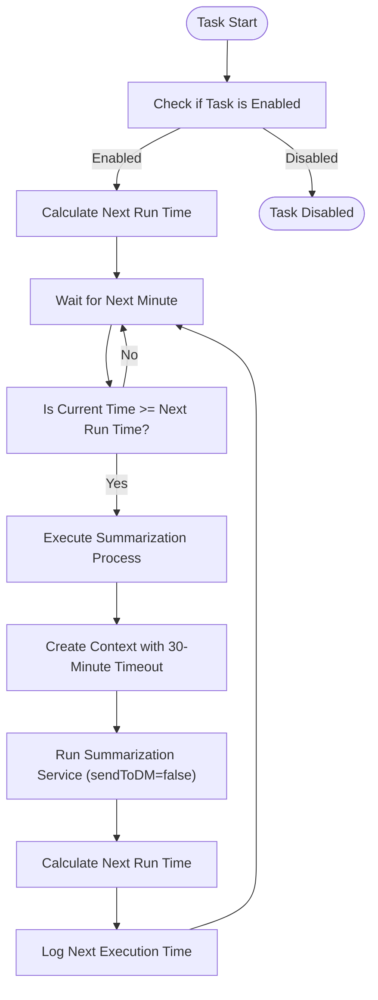
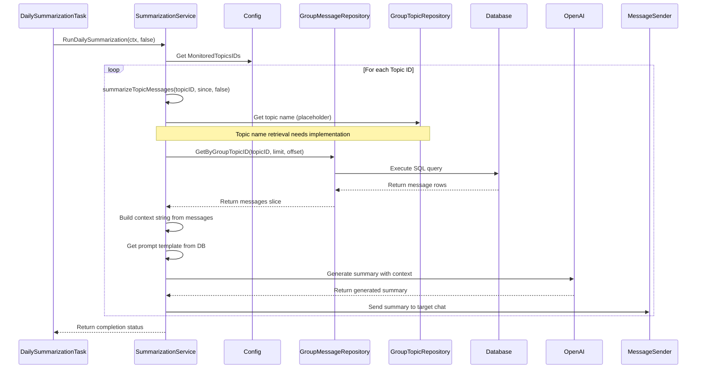
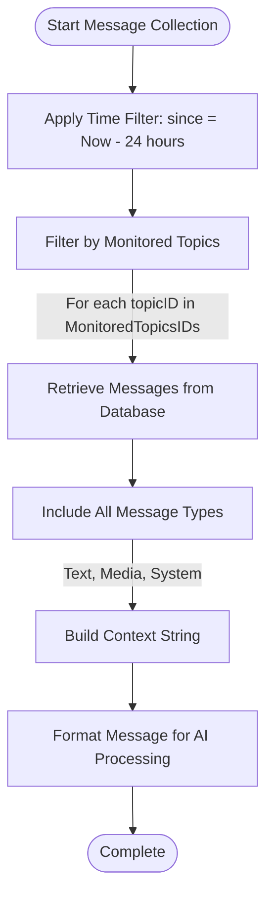
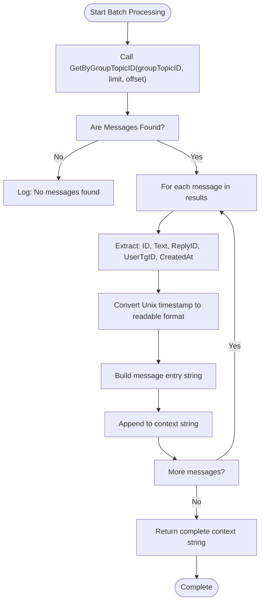
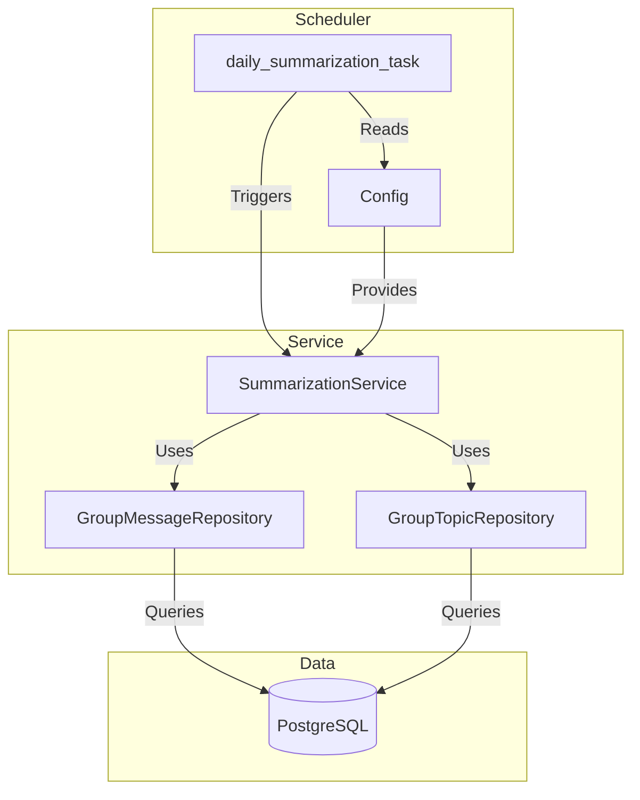
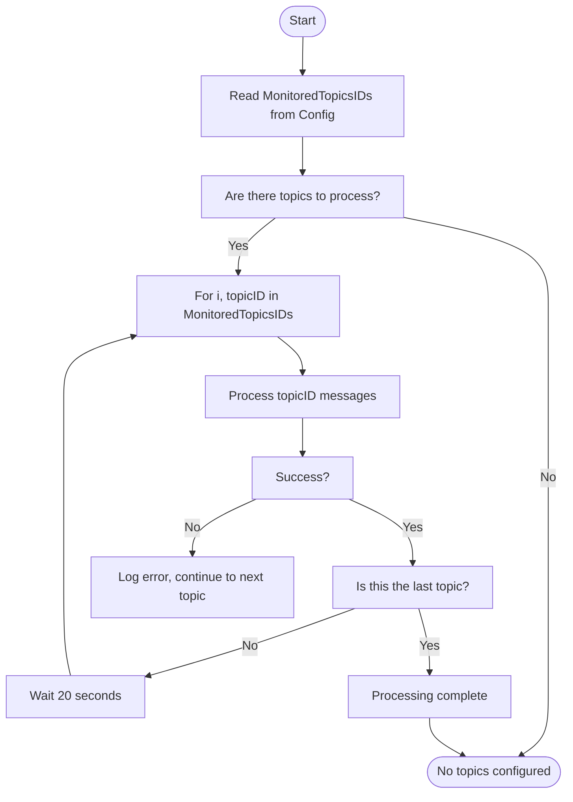
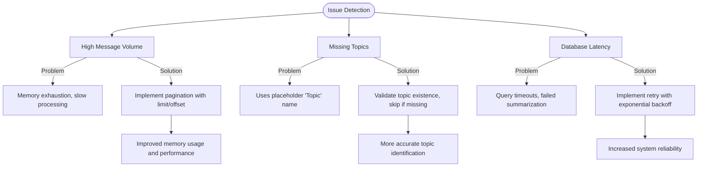

# Message Collection

<cite>
**Referenced Files in This Document**   
- [daily_summarization_task.go](file://internal/tasks/daily_summarization_task.go)
- [config.go](file://internal/config/config.go)
- [summarization_service.go](file://internal/services/summarization_service.go)
- [group_message_repository.go](file://internal/database/repositories/group_message_repository.go)
- [group_topic_repository.go](file://internal/database/repositories/group_topic_repository.go)
</cite>

## Table of Contents
1. [Introduction](#introduction)
2. [Task Orchestration](#task-orchestration)
3. [Message Retrieval Logic](#message-retrieval-logic)
4. [Data Filtering Criteria](#data-filtering-criteria)
5. [Message Batch Processing](#message-batch-processing)
6. [Scheduler-Database Integration](#scheduler-database-integration)
7. [Topic Configuration Handling](#topic-configuration-handling)
8. [Common Issues and Solutions](#common-issues-and-solutions)
9. [Performance Considerations](#performance-considerations)

## Introduction
The message collection component of the Daily Summarization system in evocoders-bot-go is responsible for gathering messages from monitored Telegram group topics for daily summary generation. This system orchestrates the retrieval process through a scheduled task that coordinates with database repositories to collect relevant messages based on time windows, topic configurations, and message types. The collected messages are then structured and formatted for processing by the summarization service, which uses AI to generate comprehensive daily summaries of group discussions.

## Task Orchestration
The daily_summarization_task orchestrates the message collection process through a scheduled execution model that runs at a configured time each day. The task is implemented as a long-running goroutine that checks every minute whether it's time to execute the summarization process.

**Diagram sources**
- [daily_summarization_task.go](file://internal/tasks/daily_summarization_task.go#L30-L99)

**Section sources**
- [daily_summarization_task.go](file://internal/tasks/daily_summarization_task.go#L1-L99)

## Message Retrieval Logic
The message retrieval process is managed by the summarization_service, which coordinates between the group_message_repository and group_topic_repository to collect messages from monitored topics. The service iterates through each topic ID specified in the configuration and retrieves messages that meet the time-based criteria.

**Diagram sources**
- [summarization_service.go](file://internal/services/summarization_service.go#L46-L80)
- [group_message_repository.go](file://internal/database/repositories/group_message_repository.go#L178-L222)

**Section sources**
- [summarization_service.go](file://internal/services/summarization_service.go#L46-L80)

## Data Filtering Criteria
The message collection process applies several filtering criteria to ensure relevant messages are included in the daily summary. The primary filter is a time window that collects messages from the past 24 hours relative to the current time.

The system respects topic exclusions through the configuration, where only topics listed in the MonitoredTopicsIDs array are processed. Messages from topics not included in this list are automatically excluded from the summarization process.

Regarding message types, the system collects all message types stored in the database, including text messages, media captions, and system messages represented by placeholders like "[Photo]" or "[Video]". The current implementation does not filter by message content type, meaning all stored message types are included in the summary context.

**Diagram sources**
- [summarization_service.go](file://internal/services/summarization_service.go#L46-L80)
- [config.go](file://internal/config/config.go#L172-L205)

**Section sources**
- [summarization_service.go](file://internal/services/summarization_service.go#L46-L80)
- [config.go](file://internal/config/config.go#L172-L205)

## Message Batch Processing
Message batches are fetched from the database using the GetByGroupTopicID method of the group_message_repository, which retrieves messages ordered by creation time in descending order. The repository method accepts limit and offset parameters for pagination, though the current implementation in the summarization service does not utilize pagination and retrieves all messages within the time window.

The retrieved messages are structured into a context string that includes key information for AI processing: MessageID, ReplyID (when available), UserID, Timestamp, and Text content. This structured format enables the AI to analyze conversation threads and identify discussion topics effectively.

**Diagram sources**
- [group_message_repository.go](file://internal/database/repositories/group_message_repository.go#L178-L222)
- [summarization_service.go](file://internal/services/summarization_service.go#L82-L115)

**Section sources**
- [group_message_repository.go](file://internal/database/repositories/group_message_repository.go#L178-L222)
- [summarization_service.go](file://internal/services/summarization_service.go#L82-L115)

## Scheduler-Database Integration
The integration between the task scheduler and database layer is facilitated through the configuration system and repository pattern. The daily_summarization_task reads scheduling parameters from the Config struct, particularly the SummaryTime setting, to determine when to execute the summarization process.

When the task executes, it delegates message retrieval to the SummarizationService, which uses injected repository instances to interact with the database. This separation of concerns allows the scheduler to focus on timing and execution while the service handles data access and business logic.

**Diagram sources**
- [daily_summarization_task.go](file://internal/tasks/daily_summarization_task.go#L30-L99)
- [summarization_service.go](file://internal/services/summarization_service.go#L1-L47)

**Section sources**
- [daily_summarization_task.go](file://internal/tasks/daily_summarization_task.go#L30-L99)
- [summarization_service.go](file://internal/services/summarization_service.go#L1-L47)

## Topic Configuration Handling
Topic configurations are respected during the message collection process through the MonitoredTopicsIDs array in the Config struct. This configuration parameter, loaded from the TG_EVO_BOT_MONITORED_TOPICS_IDS environment variable, determines which topics are included in the daily summary.

The system processes each topic ID in sequence, with a 20-second delay between topics to avoid rate limiting. This sequential processing with delays ensures that the system doesn't overwhelm the database or Telegram API with concurrent requests.

**Diagram sources**
- [config.go](file://internal/config/config.go#L172-L205)
- [summarization_service.go](file://internal/services/summarization_service.go#L46-L80)

**Section sources**
- [config.go](file://internal/config/config.go#L172-L205)
- [summarization_service.go](file://internal/services/summarization_service.go#L46-L80)

## Common Issues and Solutions
The message collection system may encounter several common issues that affect its reliability and performance. Understanding these issues and their solutions is crucial for maintaining a robust summarization process.

**High Message Volume**: When topics contain a large number of messages, the current implementation may face memory and performance issues as it loads all messages into memory without pagination. The solution is to implement batched processing with pagination parameters in the GetByGroupTopicID calls, processing messages in smaller chunks rather than loading everything at once.

**Missing Topics**: If a topic ID in MonitoredTopicsIDs does not exist in the group_topics table, the system currently uses a placeholder name "Topic" without validation. This should be improved by implementing proper error handling that logs missing topics and potentially skips them in the summarization process.

**Database Latency**: Network latency or database performance issues could cause timeouts during message retrieval. The system currently uses a 30-minute context timeout for the entire summarization process, but could benefit from implementing retry logic with exponential backoff for individual database queries.

**Diagram sources**
- [summarization_service.go](file://internal/services/summarization_service.go#L46-L80)
- [group_message_repository.go](file://internal/database/repositories/group_message_repository.go#L178-L222)

**Section sources**
- [summarization_service.go](file://internal/services/summarization_service.go#L46-L80)
- [group_message_repository.go](file://internal/database/repositories/group_message_repository.go#L178-L222)

## Performance Considerations
The current message collection implementation has several performance characteristics and optimization opportunities. The system processes topics sequentially with a 20-second delay between them to avoid rate limiting, which ensures stability but may increase total processing time for systems with many monitored topics.

Query optimization opportunities exist in the database layer, where the GetByGroupTopicID method could benefit from additional indexing strategies or query optimization. The current implementation retrieves all message fields for every message, even though only a subset is used in the summarization context.

For high-volume scenarios, implementing pagination would significantly improve memory efficiency by processing messages in batches rather than loading all messages into memory at once. Additionally, the system could implement caching mechanisms for frequently accessed data, such as topic configurations, to reduce database load.

The 30-minute context timeout provides ample time for processing but could be optimized based on actual processing times to free up resources more quickly in cases where summarization completes rapidly.

**Section sources**
- [summarization_service.go](file://internal/services/summarization_service.go#L46-L80)
- [group_message_repository.go](file://internal/database/repositories/group_message_repository.go#L178-L222)