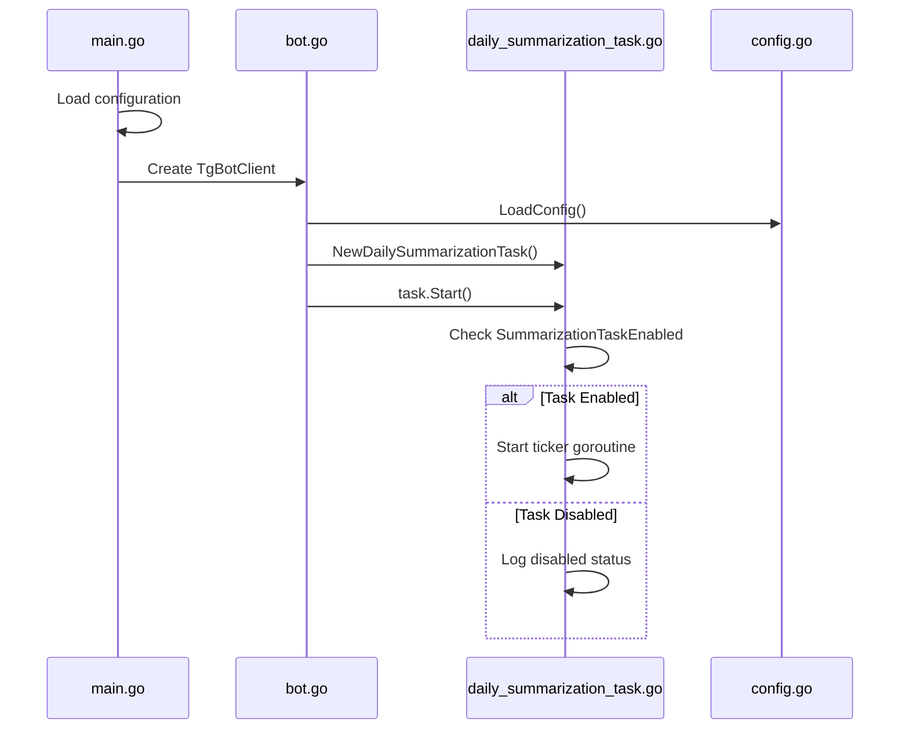
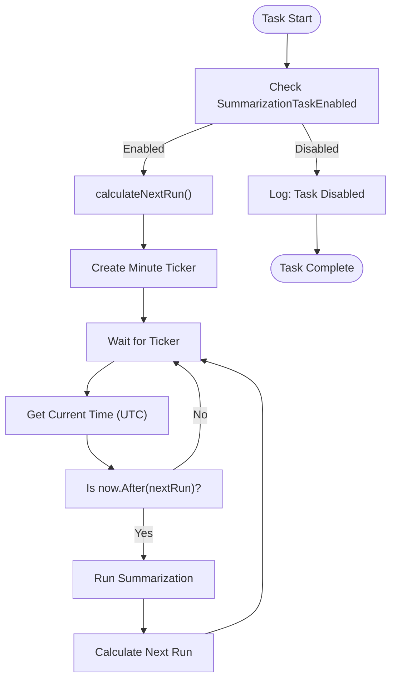
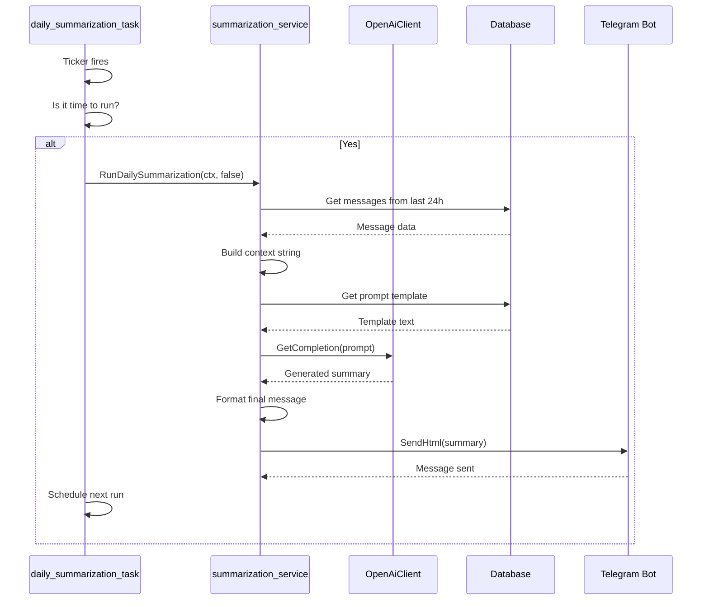

# Scheduling Configuration

<cite>
**Referenced Files in This Document**   
- [daily_summarization_task.go](file://internal/tasks/daily_summarization_task.go)
- [config.go](file://internal/config/config.go)
- [summarization_service.go](file://internal/services/summarization_service.go)
- [bot.go](file://internal/bot/bot.go)
- [general_constants.go](file://internal/constants/general_constants.go)
- [main.go](file://main.go)
</cite>

## Table of Contents
1. [Introduction](#introduction)
2. [Configuration Settings](#configuration-settings)
3. [Task Initialization and Startup Sequence](#task-initialization-and-startup-sequence)
4. [Scheduling Mechanism](#scheduling-mechanism)
5. [Execution Flow](#execution-flow)
6. [Common Issues and Troubleshooting](#common-issues-and-troubleshooting)
7. [Best Practices](#best-practices)
8. [Conclusion](#conclusion)

## Introduction
The Daily Summarization feature in evocoders-bot-go is a scheduled task that automatically generates and posts summaries of group chat activity on a daily basis. This document details the scheduling configuration, initialization process, and execution logic of the `daily_summarization_task`. The system uses a ticker-based goroutine scheduler to check for execution time every minute, ensuring reliable daily runs at a configured UTC time. Configuration is managed through environment variables and the `config.go` file, with support for enabling/disabling the task, setting custom run times, and specifying target message threads. This guide provides both foundational knowledge for new developers and advanced insights into concurrency safety and system load considerations for production environments.

## Configuration Settings
The scheduling behavior of the daily summarization task is controlled through several configuration options defined in `config.go`. These settings are loaded from environment variables during application startup and determine when and how the summarization process runs.

### Core Configuration Parameters
The following configuration fields in the `Config` struct govern the daily summarization task:

- **SummarizationTaskEnabled**: A boolean flag that enables or disables the daily summarization task. When set to `false`, the task will not start even if other settings are configured.
- **SummaryTime**: A `time.Time` value that specifies the hour and minute (in UTC) when the summarization should run each day.
- **MonitoredTopicsIDs**: A slice of integers representing the topic IDs from which messages will be collected for summarization.
- **SummaryTopicID**: The topic ID where the generated summary will be posted.
- **SuperGroupChatID**: The main group chat ID used as the target for summary messages.

### Environment Variables
These configuration values are populated from the following environment variables:

- `TG_EVO_BOT_SUMMARIZATION_TASK_ENABLED`: Controls whether the task is active (defaults to `true`)
- `TG_EVO_BOT_SUMMARY_TIME`: Sets the daily execution time in 24-hour format (e.g., "03:00", defaults to "03:00")
- `TG_EVO_BOT_MONITORED_TOPICS_IDS`: Comma-separated list of topic IDs to monitor
- `TG_EVO_BOT_SUMMARY_TOPIC_ID`: Topic ID where summaries are posted
- `TG_EVO_BOT_SUPERGROUP_CHAT_ID`: Main group chat ID

### Default Values
The configuration system provides sensible defaults:
- The summarization task is enabled by default
- The default execution time is 03:00 UTC
- No default topics are monitored (this must be explicitly configured)

**Section sources**
- [config.go](file://internal/config/config.go#L28-L31)
- [config.go](file://internal/config/config.go#L156-L195)

## Task Initialization and Startup Sequence
The daily summarization task is initialized during the bot's startup process and integrated into the application's lifecycle management.

### Bot Startup Integration
In `main.go`, the application follows this startup sequence:
1. Configuration is loaded via `config.LoadConfig()`
2. Dependencies including the OpenAI client are initialized
3. The Telegram bot client is created with `bot.NewTgBotClient()`
4. All scheduled tasks are registered and started

The `TgBotClient` struct maintains a list of scheduled tasks and starts them when `Start()` is called.

### Task Registration
During bot initialization in `bot.go`, the daily summarization task is created and added to the tasks list:

```go
scheduledTasks := []tasks.Task{
    tasks.NewDailySummarizationTask(appConfig, summarizationService),
    // other tasks...
}
```

The `NewDailySummarizationTask` constructor injects the application configuration and summarization service dependencies.

### Lifecycle Management
The task supports graceful startup and shutdown:
- `Start()` begins the scheduling loop if enabled in configuration
- `Stop()` closes the stop channel to terminate the goroutine
- The bot's `Close()` method ensures all tasks are properly stopped during shutdown



**Diagram sources**
- [main.go](file://main.go#L15-L53)
- [bot.go](file://internal/bot/bot.go#L150-L180)
- [daily_summarization_task.go](file://internal/tasks/daily_summarization_task.go#L25-L37)

**Section sources**
- [main.go](file://main.go#L15-L53)
- [bot.go](file://internal/bot/bot.go#L150-L180)
- [daily_summarization_task.go](file://internal/tasks/daily_summarization_task.go#L25-L37)

## Scheduling Mechanism
The daily summarization task uses a ticker-based scheduling approach that provides reliable daily execution with proper timezone handling.

### Ticker-Based Scheduler
The task employs a `time.Ticker` that fires every minute to check if it's time to run:

```go
ticker := time.NewTicker(time.Minute)
```

This approach avoids issues with cron libraries and provides fine-grained control over the scheduling logic.

### Next Run Calculation
The `calculateNextRun()` method determines when the next execution should occur:

1. Gets the current time in UTC
2. Extracts the configured hour and minute from `SummaryTime`
3. Creates a target time for today at the configured hour/minute
4. If the target time has already passed today, schedules for tomorrow

This ensures the task runs once per day at the exact configured time, regardless of when the bot was started.

### Timezone Handling
All scheduling calculations use UTC time to avoid daylight saving time complications and ensure consistent behavior across deployments:

```go
now := time.Now().UTC()
```

The `SummaryTime` configuration is interpreted as UTC, making the scheduling behavior predictable and consistent.



**Diagram sources**
- [daily_summarization_task.go](file://internal/tasks/daily_summarization_task.go#L44-L87)
- [daily_summarization_task.go](file://internal/tasks/daily_summarization_task.go#L89-L109)

**Section sources**
- [daily_summarization_task.go](file://internal/tasks/daily_summarization_task.go#L44-L109)

## Execution Flow
When the daily summarization task executes, it follows a well-defined flow to generate and deliver the summary.

### Task Execution Sequence
1. The ticker detects that execution time has been reached
2. A new goroutine is spawned to prevent blocking the scheduler
3. A context with 30-minute timeout is created for the summarization process
4. The `RunDailySummarization` method is called with `sendToDM=false`

### Summarization Process
The `RunDailySummarization` method in `summarization_service.go` performs the following steps:

1. Calculates the time window (last 24 hours)
2. Iterates through each monitored topic in `MonitoredTopicsIDs`
3. Retrieves messages from the database for each topic
4. Builds a context string from the messages
5. Retrieves the prompt template from the database
6. Generates the summary using OpenAI
7. Formats the final message with proper HTML formatting
8. Sends the summary to the `SummaryTopicID`

### Concurrency Safety
The implementation ensures thread safety through:
- Goroutine isolation for each execution
- Context-based cancellation and timeout
- Non-blocking ticker operations
- Proper channel closing during shutdown

### Rate Limiting Considerations
To prevent API rate limiting, the system:
- Adds a 20-second delay between processing different topics
- Uses context timeouts to prevent hanging operations
- Continues processing other topics even if one fails



**Diagram sources**
- [daily_summarization_task.go](file://internal/tasks/daily_summarization_task.go#L60-L75)
- [summarization_service.go](file://internal/services/summarization_service.go#L50-L150)

**Section sources**
- [daily_summarization_task.go](file://internal/tasks/daily_summarization_task.go#L60-L75)
- [summarization_service.go](file://internal/services/summarization_service.go#L50-L150)

## Common Issues and Troubleshooting
This section addresses frequent problems encountered with the daily summarization scheduling and provides solutions.

### Missed Executions
**Symptoms**: The summary does not appear at the expected time.

**Causes and Solutions**:
- **Bot not running**: Ensure the bot process is active and not crashed
- **Task disabled**: Verify `TG_EVO_BOT_SUMMARIZATION_TASK_ENABLED` is set to `true`
- **Incorrect time format**: Confirm `TG_EVO_BOT_SUMMARY_TIME` uses 24-hour format (e.g., "03:00")
- **Timezone confusion**: Remember the time is in UTC, not local time

### Time Drift
**Symptoms**: Summaries run at slightly different times each day.

**Causes and Solutions**:
- **System clock issues**: Ensure the server clock is synchronized with NTP
- **Long-running executions**: If summarization takes longer than a minute, consider optimizing the process
- **Goroutine scheduling delays**: This is normal in Go and typically doesn't accumulate

### Configuration Errors
**Symptoms**: Application fails to start or task doesn't initialize.

**Common Errors**:
- Missing `TG_EVO_BOT_MONITORED_TOPICS_IDS` environment variable
- Invalid topic IDs in the monitored topics list
- Malformed time string in `TG_EVO_BOT_SUMMARY_TIME`

**Troubleshooting Steps**:
1. Check application logs for configuration loading errors
2. Verify all required environment variables are set
3. Test time parsing with `time.Parse("15:04", "03:00")`
4. Validate topic IDs exist in the group

### Debugging Tips
- Enable detailed logging to track task scheduling
- Use the `try_summarize` admin command to test summarization on demand
- Check the `last-prompt-log.txt` file to review the exact prompt sent to OpenAI
- Monitor goroutine count to ensure no leaks

**Section sources**
- [config.go](file://internal/config/config.go#L156-L195)
- [daily_summarization_task.go](file://internal/tasks/daily_summarization_task.go#L30-L37)
- [summarization_service.go](file://internal/services/summarization_service.go#L160-L170)

## Best Practices
Follow these recommendations for reliable and efficient daily summarization scheduling.

### Configuration Management
- Use environment variables for all configuration settings
- Set appropriate monitoring for the summarization task
- Consider the audience's timezone when selecting the UTC execution time
- Test configuration changes in a staging environment first

### Performance Considerations
- Schedule summarization during low-activity periods to minimize impact
- Monitor API usage to avoid rate limiting
- Keep the number of monitored topics reasonable
- Consider the length of messages being summarized

### Reliability Measures
- Implement health checks for the bot process
- Set up alerts for failed summarization attempts
- Use structured logging to track task execution
- Regularly review logs for warning messages

### Development and Testing
- Use the `try_summarize` admin command for manual testing
- Verify time calculations with edge cases (midnight, leap seconds)
- Test both enabled and disabled configurations
- Validate error handling by temporarily disabling external services

### Production Deployment
- Ensure the server clock is synchronized
- Use process managers to auto-restart the bot if it crashes
- Monitor resource usage (CPU, memory, goroutines)
- Plan for graceful shutdowns during maintenance

## Conclusion
The daily summarization scheduling system in evocoders-bot-go provides a reliable mechanism for automated content generation. By leveraging Go's concurrency features and a simple ticker-based approach, the system ensures consistent daily execution at the configured time. The configuration is flexible and controlled through environment variables, allowing easy customization without code changes. The integration with the bot's startup sequence ensures proper lifecycle management, while the use of contexts and timeouts provides resilience against failures. For new developers, the clear configuration interface and straightforward scheduling logic make it accessible, while the concurrency safety and rate limiting considerations provide important insights for production deployments. By following the best practices outlined in this document, teams can ensure reliable and efficient daily summarization that enhances community engagement without operational burden.