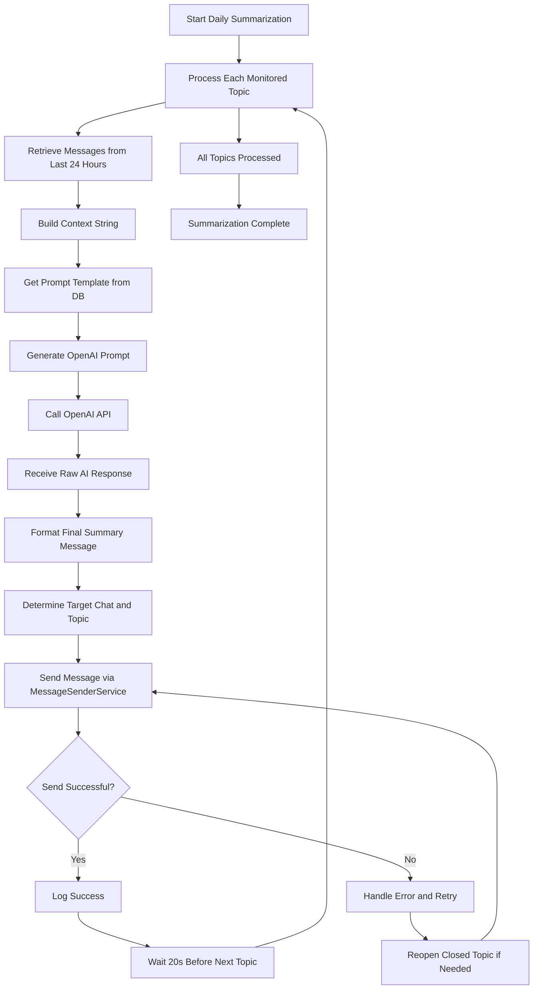
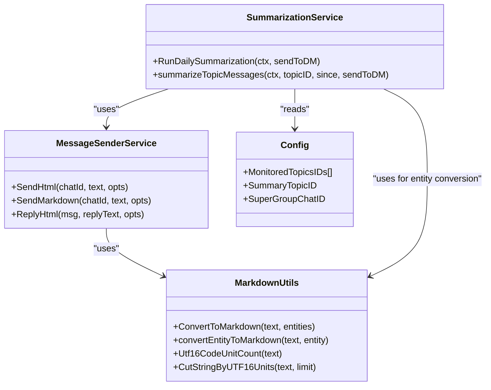
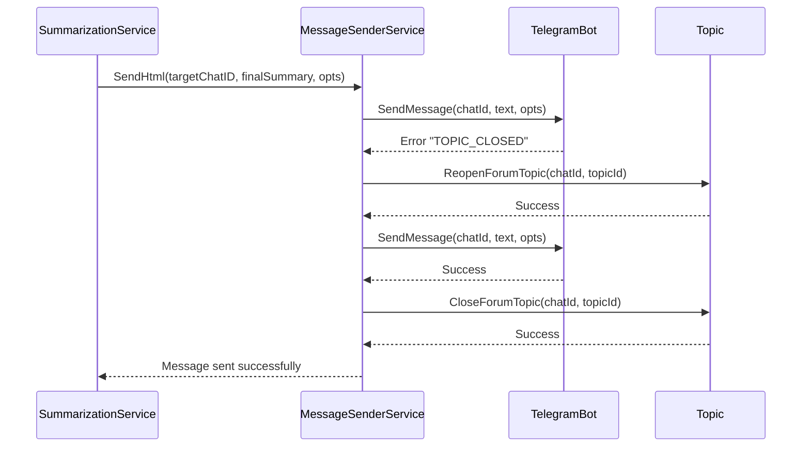

# Summary Generation and Posting

<cite>
**Referenced Files in This Document**   
- [summarization_service.go](file://internal/services/summarization_service.go)
- [message_sender_service.go](file://internal/services/message_sender_service.go)
- [config.go](file://internal/config/config.go)
- [summarization_prompt.go](file://internal/database/prompts/summarization_prompt.go)
- [markdown_utils.go](file://internal/utils/markdown_utils.go)
- [try_summarize_handler.go](file://internal/handlers/adminhandlers/testhandlers/try_summarize_handler.go)
- [group_topic_repository.go](file://internal/database/repositories/group_topic_repository.go)
</cite>

## Table of Contents
1. [Introduction](#introduction)
2. [Workflow Overview](#workflow-overview)
3. [Raw Response Processing](#raw-response-processing)
4. [Message Formatting and Templating](#message-formatting-and-templating)
5. [Message Posting and Delivery](#message-posting-and-delivery)
6. [Error Recovery and Retry Logic](#error-recovery-and-retry-logic)
7. [Integration with Bot Services](#integration-with-bot-services)
8. [Common Issues and Debugging](#common-issues-and-debugging)
9. [Conclusion](#conclusion)

## Introduction
The Summary Generation and Posting phase in the evocoders-bot-go system is responsible for transforming raw AI responses from OpenAI into well-formatted summaries and delivering them to the appropriate Telegram group topics. This document details the complete workflow from receiving the AI response in the summarization service to posting the final message via the bot client. The process involves several key components: response processing, message formatting using templates, destination routing, error handling, and retry mechanisms. The system is designed to ensure reliable message delivery while maintaining a high-quality user experience through proper formatting and error recovery.

**Section sources**
- [summarization_service.go](file://internal/services/summarization_service.go#L0-L176)

## Workflow Overview
The summary generation and posting workflow begins with the `RunDailySummarization` method in the `SummarizationService`, which processes each monitored topic sequentially. For each topic, the service retrieves messages from the past 24 hours, constructs a context string, and generates a prompt using a template from the database. This prompt is sent to OpenAI to generate a summary, which is then formatted with a title and posted to the designated summary topic. The workflow includes safeguards against rate limiting with 20-second delays between topic processing and handles both regular posting and direct message (DM) delivery options.

**Diagram sources**
- [summarization_service.go](file://internal/services/summarization_service.go#L46-L175)

**Section sources**
- [summarization_service.go](file://internal/services/summarization_service.go#L46-L175)

## Raw Response Processing
The raw AI response processing begins in the `summarizeTopicMessages` method of the `SummarizationService`. After retrieving messages from the database, the service constructs a context string that includes message metadata such as MessageID, UserID, Timestamp, and Text. This context is combined with a prompt template retrieved from the database using the `DailySummarizationPromptTemplateDbKey`. The complete prompt is formatted with dynamic values including the current date, super group chat ID, and topic ID before being sent to OpenAI via the `GetCompletion` method of the `OpenAiClient`. The raw response from OpenAI is then combined with a formatted title to create the final summary message.

**Section sources**
- [summarization_service.go](file://internal/services/summarization_service.go#L82-L153)

## Message Formatting and Templating
Message formatting in the system relies on a combination of template-based title generation and Markdown formatting. The title is formatted using a predefined template that includes an emoji, the topic name in bold HTML tags, and the current date. The prompt template itself, defined in `DailySummarizationPromptDefaultTemplate`, instructs the AI to use Markdown for formatting the output as a bulleted list of main topics. The system also includes utilities in `markdown_utils.go` for converting Telegram message entities to Markdown format, supporting various text styles including bold, italic, code blocks, and hyperlinks. Message length is managed through the use of UTF-16 code unit counting in the `CutStringByUTF16Units` function, which ensures messages stay within Telegram's limits.

**Diagram sources**
- [summarization_service.go](file://internal/services/summarization_service.go#L117-L153)
- [message_sender_service.go](file://internal/services/message_sender_service.go#L320-L365)
- [markdown_utils.go](file://internal/utils/markdown_utils.go#L0-L109)

**Section sources**
- [summarization_service.go](file://internal/services/summarization_service.go#L117-L153)
- [markdown_utils.go](file://internal/utils/markdown_utils.go#L0-L109)
- [summarization_prompt.go](file://internal/database/prompts/summarization_prompt.go#L0-L12)

## Message Posting and Delivery
Message posting is handled by the `MessageSenderService` which integrates with the Telegram bot client to deliver messages to the appropriate destinations. The target destination is determined by the `sendToDM` parameter and context values. When `sendToDM` is false, messages are posted to the summary topic in the super group chat as configured in `SummaryTopicID`. When `sendToDM` is true, the message is sent as a direct message to the user specified in the context. The service uses the `SendHtml` method to send messages with HTML parsing enabled, allowing for rich formatting including bold text in the summary title. Message threading is maintained by setting the `MessageThreadId` in the `SendMessageOpts` to ensure summaries appear in the correct topic.

**Section sources**
- [summarization_service.go](file://internal/services/summarization_service.go#L155-L175)
- [message_sender_service.go](file://internal/services/message_sender_service.go#L320-L365)

## Error Recovery and Retry Logic
The system implements robust error recovery mechanisms to handle common issues such as closed topics and rate limiting. When a message send fails due to a "TOPIC_CLOSED" error, the `MessageSenderService` automatically attempts to reopen the topic, send the message, and then close the topic again to maintain its original state. This recovery process is implemented in the `handleClosedTopicReturnMessage` method. The system also includes rate limiting protection by adding a 20-second delay between processing each monitored topic, preventing the bot from exceeding Telegram's API limits. Additionally, the summarization process continues with other topics even if one fails, ensuring partial success when possible.

**Diagram sources**
- [message_sender_service.go](file://internal/services/message_sender_service.go#L452-L479)
- [summarization_service.go](file://internal/services/summarization_service.go#L155-L175)

**Section sources**
- [message_sender_service.go](file://internal/services/message_sender_service.go#L411-L479)
- [summarization_service.go](file://internal/services/summarization_service.go#L65-L80)

## Integration with Bot Services
The summary generation system is tightly integrated with the bot's message sender service through dependency injection. The `SummarizationService` receives an instance of `MessageSenderService` during initialization, creating a direct dependency between these components. The message sender service acts as a wrapper around the Telegram bot client, providing additional functionality like automatic link preview disabling and error handling. Configuration values such as `SuperGroupChatID`, `MonitoredTopicsIDs`, and `SummaryTopicID` are injected from the `Config` struct, allowing for environment-specific settings without code changes. The system also integrates with the database through the `PromptingTemplateRepository` to retrieve prompt templates, ensuring flexibility in the summarization process.

**Section sources**
- [summarization_service.go](file://internal/services/summarization_service.go#L0-L47)
- [bot.go](file://internal/bot/bot.go#L150-L170)
- [config.go](file://internal/config/config.go#L144-L183)

## Common Issues and Debugging
Several common issues can occur during the summary generation and posting process. Malformed responses from OpenAI can result in poorly formatted summaries, which can be debugged by examining the `last-prompt-log.txt` file that contains the complete prompt sent to the API. Formatting inconsistencies may occur when the AI doesn't follow the Markdown instructions in the prompt template, which can be addressed by refining the prompt or post-processing the response. Incorrect topic routing can happen if configuration values are not properly set in environment variables, particularly `TG_EVO_BOT_SUMMARY_TOPIC_ID` and `TG_EVO_BOT_MONITORED_TOPICS_IDS`. Debugging strategies include checking log output for error messages, verifying database entries for prompt templates, and testing with the `try_summarize` command handler which provides a controlled environment for testing the summarization process.

**Section sources**
- [summarization_service.go](file://internal/services/summarization_service.go#L130-L135)
- [try_summarize_handler.go](file://internal/handlers/adminhandlers/testhandlers/try_summarize_handler.go#L139-L176)
- [config.go](file://internal/config/config.go#L144-L183)

## Conclusion
The Summary Generation and Posting system in evocoders-bot-go demonstrates a well-structured approach to AI-powered content summarization and delivery. By separating concerns into distinct services and leveraging configuration-driven behavior, the system achieves both reliability and flexibility. The integration of error recovery mechanisms, particularly for handling closed topics, ensures robust message delivery even in challenging conditions. The use of template-based prompts and Markdown formatting produces visually appealing summaries that enhance user experience. Future improvements could include more sophisticated message length management, enhanced error logging, and additional formatting options to accommodate different content types. Overall, the system provides a solid foundation for automated content summarization in Telegram group environments.