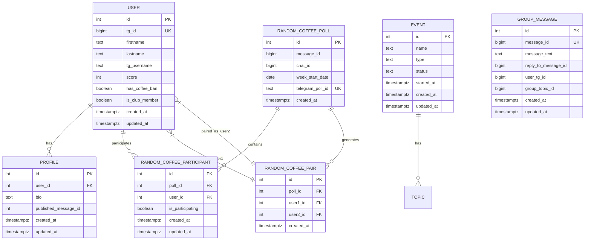
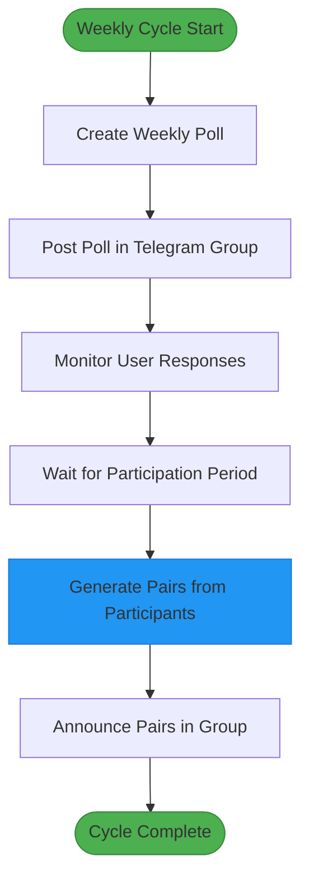

# Database Schema Design

<cite>
**Referenced Files in This Document**   
- [20250519_add_users_and_profiles_tables.go](file://internal/database/migrations/implementations/20250519_add_users_and_profiles_tables.go)
- [202602_add_random_coffee_poll_tables.go](file://internal/database/migrations/implementations/20250602_add_random_coffee_poll_tables.go)
- [20250609_add_random_coffee_pairs_table.go](file://internal/database/migrations/implementations/20250609_add_random_coffee_pairs_table.go)
- [20250918_add_group_messages_table.go](file://internal/database/migrations/implementations/20250918_add_group_messages_table.go)
- [20250403_rename_contents_to_events.go](file://internal/database/migrations/implementations/20250403_rename_contents_to_events.go)
- [user_repository.go](file://internal/database/repositories/user_repository.go)
- [profile_repository.go](file://internal/database/repositories/profile_repository.go)
- [event_repository.go](file://internal/database/repositories/event_repository.go)
- [random_coffee_poll_repository.go](file://internal/database/repositories/random_coffee_poll_repository.go)
- [random_coffee_participant_repository.go](file://internal/database/repositories/random_coffee_participant_repository.go)
- [random_coffee_pair_repository.go](file://internal/database/repositories/random_coffee_pair_repository.go)
- [group_message_repository.go](file://internal/database/repositories/group_message_repository.go)
- [random_coffee_service.go](file://internal/services/random_coffee_service.go)
</cite>

## Table of Contents
1. [Introduction](#introduction)
2. [Core Data Model](#core-data-model)
3. [Entity Relationship Diagram](#entity-relationship-diagram)
4. [Table Definitions](#table-definitions)
5. [Business Rules and Validation](#business-rules-and-validation)
6. [Data Access Patterns](#data-access-patterns)
7. [Query Optimization and Performance](#query-optimization-and-performance)
8. [Data Lifecycle and Migration](#data-lifecycle-and-migration)
9. [Data Security and Access Control](#data-security-and-access-control)
10. [Sample Data Scenarios](#sample-data-scenarios)

## Introduction

The evocoders-bot-go application utilizes a PostgreSQL database to manage community interactions, user profiles, events, and automated social activities such as weekly random coffee meetings. This document provides comprehensive documentation of the database schema, focusing on the relationships between key entities including users, profiles, events, random coffee polls, participants, pairs, and group messages. The schema has evolved through a series of migration files that reflect the application's growing functionality, from basic user management to sophisticated automated pairing systems. The design emphasizes data integrity through proper foreign key constraints, ensures efficient querying with appropriate indexes, and supports business logic through well-defined relationships and constraints.

**Section sources**
- [20250519_add_users_and_profiles_tables.go](file://internal/database/migrations/implementations/20250519_add_users_and_profiles_tables.go#L1-L120)
- [20250602_add_random_coffee_poll_tables.go](file://internal/database/migrations/implementations/20250602_add_random_coffee_poll_tables.go#L1-L110)
- [20250609_add_random_coffee_pairs_table.go](file://internal/database/migrations/implementations/20250609_add_random_coffee_pairs_table.go#L1-L40)

## Core Data Model

The database schema is centered around several core entities that support the bot's primary functions: user management, profile publishing, event tracking, and automated social pairing. The `users` table serves as the foundation, storing Telegram user information and community status. Each user can have a corresponding `profiles` record containing their bio and publication status. The `events` table tracks community events with types and statuses, while the random coffee system uses a three-table structure (`random_coffee_polls`, `random_coffee_participants`, and `random_coffee_pairs`) to manage weekly participation and automated pairing. Additional tables like `group_messages` and `group_topics` support conversation tracking in the community group. The schema uses foreign key constraints to maintain referential integrity and cascading deletes to ensure data consistency when records are removed.



**Diagram sources**
- [20250519_add_users_and_profiles_tables.go](file://internal/database/migrations/implementations/20250519_add_users_and_profiles_tables.go#L1-L120)
- [20250602_add_random_coffee_poll_tables.go](file://internal/database/migrations/implementations/20250602_add_random_coffee_poll_tables.go#L1-L110)
- [20250609_add_random_coffee_pairs_table.go](file://internal/database/migrations/implementations/20250609_add_random_coffee_pairs_table.go#L1-L40)
- [20250918_add_group_messages_table.go](file://internal/database/migrations/implementations/20250918_add_group_messages_table.go#L1-L51)
- [20250403_rename_contents_to_events.go](file://internal/database/migrations/implementations/20250403_rename_contents_to_events.go#L1-L115)

**Section sources**
- [20250519_add_users_and_profiles_tables.go](file://internal/database/migrations/implementations/20250519_add_users_and_profiles_tables.go#L1-L120)
- [20250602_add_random_coffee_poll_tables.go](file://internal/database/migrations/implementations/20250602_add_random_coffee_poll_tables.go#L1-L110)
- [20250609_add_random_coffee_pairs_table.go](file://internal/database/migrations/implementations/20250609_add_random_coffee_pairs_table.go#L1-L40)

## Entity Relationship Diagram

The entity relationship diagram illustrates the core data model of the evocoders-bot-go application. The `users` table is central to the schema, with one-to-one and one-to-many relationships to other entities. Each user can have exactly one profile, establishing a direct 1:1 relationship. The random coffee system forms a complex relationship network where a single poll can have multiple participants, and the pairing algorithm generates multiple pairs from the participant pool. The diagram shows how foreign key constraints enforce referential integrity, with cascading deletes ensuring that when a poll is removed, all associated participants and pairs are automatically deleted. The `events` table connects to the `topics` table (not fully detailed here) to organize community discussions around specific events. This structure supports the application's business logic while maintaining data consistency and enabling efficient querying.

```mermaid
erDiagram
USER {
int id PK
bigint tg_id UK
text firstname
text lastname
text tg_username
int score
boolean has_coffee_ban
boolean is_club_member
timestamptz created_at
timestamptz updated_at
}
PROFILE {
int id PK
int user_id FK
text bio
int published_message_id
timestamptz created_at
timestamptz updated_at
}
RANDOM_COFFEE_POLL {
int id PK
bigint message_id
bigint chat_id
date week_start_date
text telegram_poll_id UK
timestamptz created_at
}
RANDOM_COFFEE_PARTICIPANT {
int id PK
int poll_id FK
int user_id FK
boolean is_participating
timestamptz created_at
timestamptz updated_at
}
RANDOM_COFFEE_PAIR {
int id PK
int poll_id FK
int user1_id FK
int user2_id FK
timestamptz created_at
}
USER ||--o{ PROFILE : "has"
USER ||--o{ RANDOM_COFFEE_PARTICIPANT : "is"
RANDOM_COFFEE_POLL ||--o{ RANDOM_COFFEE_PARTICIPANT : "contains"
RANDOM_COFFEE_POLL ||--o{ RANDOM_COFFEE_PAIR : "generates"
USER }|--|| RANDOM_COFFEE_PAIR : "as_user1"
USER }|--|| RANDOM_COFFEE_PAIR : "as_user2"
note right of RANDOM_COFFEE_POLL
Represents a weekly poll for
random coffee participation
end note
note right of RANDOM_COFFEE_PARTICIPANT
Tracks user's participation
status for a specific poll
end note
note right of RANDOM_COFFEE_PAIR
Generated pairs for a specific
week's coffee meeting
end note
```

**Diagram sources**
- [20250519_add_users_and_profiles_tables.go](file://internal/database/migrations/implementations/20250519_add_users_and_profiles_tables.go#L1-L120)
- [20250602_add_random_coffee_poll_tables.go](file://internal/database/migrations/implementations/20250602_add_random_coffee_poll_tables.go#L1-L110)
- [20250609_add_random_coffee_pairs_table.go](file://internal/database/migrations/implementations/20250609_add_random_coffee_pairs_table.go#L1-L40)

**Section sources**
- [20250519_add_users_and_profiles_tables.go](file://internal/database/migrations/implementations/20250519_add_users_and_profiles_tables.go#L1-L120)
- [20250602_add_random_coffee_poll_tables.go](file://internal/database/migrations/implementations/20250602_add_random_coffee_poll_tables.go#L1-L110)
- [20250609_add_random_coffee_pairs_table.go](file://internal/database/migrations/implementations/20250609_add_random_coffee_pairs_table.go#L1-L40)

## Table Definitions

### users Table
The `users` table stores information about Telegram users in the community. It serves as the primary identity table with a unique Telegram ID for each user.

| Field | Type | Constraints | Description |
|-------|------|-------------|-------------|
| id | SERIAL | PRIMARY KEY | Auto-incrementing primary key |
| tg_id | BIGINT | NOT NULL, UNIQUE | Telegram user ID |
| firstname | TEXT | NOT NULL | User's first name |
| lastname | TEXT | | User's last name |
| tg_username | TEXT | | Telegram username |
| score | INTEGER | NOT NULL, DEFAULT 0 | User's reputation score |
| has_coffee_ban | BOOLEAN | NOT NULL, DEFAULT false | Indicates if user is banned from coffee meetings |
| is_club_member | BOOLEAN | NOT NULL, DEFAULT true | Indicates active club membership |
| created_at | TIMESTAMPTZ | NOT NULL, DEFAULT NOW() | Record creation timestamp |
| updated_at | TIMESTAMPTZ | NOT NULL, DEFAULT NOW() | Record update timestamp |

**Section sources**
- [20250519_add_users_and_profiles_tables.go](file://internal/database/migrations/implementations/20250519_add_users_and_profiles_tables.go#L1-L120)
- [user_repository.go](file://internal/database/repositories/user_repository.go#L1-L424)

### profiles Table
The `profiles` table stores user profile information, linked to the users table through a foreign key relationship.

| Field | Type | Constraints | Description |
|-------|------|-------------|-------------|
| id | SERIAL | PRIMARY KEY | Auto-incrementing primary key |
| user_id | INTEGER | NOT NULL, FOREIGN KEY (users.id), ON DELETE CASCADE | Reference to users table |
| bio | TEXT | | User's biography or introduction |
| published_message_id | INTEGER | | Telegram message ID where profile is published |
| created_at | TIMESTAMPTZ | NOT NULL, DEFAULT NOW() | Record creation timestamp |
| updated_at | TIMESTAMPTZ | NOT NULL, DEFAULT NOW() | Record update timestamp |

**Section sources**
- [20250519_add_users_and_profiles_tables.go](file://internal/database/migrations/implementations/20250519_add_users_and_profiles_tables.go#L1-L120)
- [profile_repository.go](file://internal/database/repositories/profile_repository.go#L1-L286)

### events Table
The `events` table tracks community events, originally migrated from a table named "contents".

| Field | Type | Constraints | Description |
|-------|------|-------------|-------------|
| id | SERIAL | PRIMARY KEY | Auto-incrementing primary key |
| name | TEXT | NOT NULL | Event name |
| type | TEXT | NOT NULL | Event type (e.g., meetup, webinar) |
| status | TEXT | NOT NULL | Event status (e.g., actual, archived) |
| started_at | TIMESTAMPTZ | | Timestamp when event started |
| created_at | TIMESTAMPTZ | NOT NULL, DEFAULT NOW() | Record creation timestamp |
| updated_at | TIMESTAMPTZ | NOT NULL, DEFAULT NOW() | Record update timestamp |

**Section sources**
- [20250403_rename_contents_to_events.go](file://internal/database/migrations/implementations/20250403_rename_contents_to_events.go#L1-L115)
- [event_repository.go](file://internal/database/repositories/event_repository.go#L1-L253)

### random_coffee_polls Table
The `random_coffee_polls` table represents weekly polls for the random coffee pairing system.

| Field | Type | Constraints | Description |
|-------|------|-------------|-------------|
| id | SERIAL | PRIMARY KEY | Auto-incrementing primary key |
| message_id | BIGINT | NOT NULL | Telegram message ID of the poll |
| chat_id | BIGINT | NOT NULL | Telegram chat ID where poll was posted |
| week_start_date | DATE | NOT NULL | Start date of the week for which the poll is created |
| telegram_poll_id | TEXT | UNIQUE | Unique identifier from Telegram for the poll |
| created_at | TIMESTAMPTZ | DEFAULT NOW() | Record creation timestamp |

**Section sources**
- [20250602_add_random_coffee_poll_tables.go](file://internal/database/migrations/implementations/20250602_add_random_coffee_poll_tables.go#L1-L110)
- [random_coffee_poll_repository.go](file://internal/database/repositories/random_coffee_poll_repository.go#L1-L97)

### random_coffee_participants Table
The `random_coffee_participants` table tracks user participation status in weekly coffee polls.

| Field | Type | Constraints | Description |
|-------|------|-------------|-------------|
| id | SERIAL | PRIMARY KEY | Auto-incrementing primary key |
| poll_id | INTEGER | NOT NULL, FOREIGN KEY (random_coffee_polls.id), ON DELETE CASCADE | Reference to the poll |
| user_id | INTEGER | NOT NULL, FOREIGN KEY (users.id), ON DELETE CASCADE | Reference to the user |
| is_participating | BOOLEAN | NOT NULL | Indicates if user wants to participate |
| created_at | TIMESTAMPTZ | DEFAULT NOW() | Record creation timestamp |
| updated_at | TIMESTAMPTZ | DEFAULT NOW() | Record update timestamp |

**Section sources**
- [20250602_add_random_coffee_poll_tables.go](file://internal/database/migrations/implementations/20250602_add_random_coffee_poll_tables.go#L1-L110)
- [random_coffee_participant_repository.go](file://internal/database/repositories/random_coffee_participant_repository.go#L1-L87)

### random_coffee_pairs Table
The `random_coffee_pairs` table stores the generated pairs for weekly coffee meetings.

| Field | Type | Constraints | Description |
|-------|------|-------------|-------------|
| id | SERIAL | PRIMARY KEY | Auto-incrementing primary key |
| poll_id | INTEGER | NOT NULL, FOREIGN KEY (random_coffee_polls.id), ON DELETE CASCADE | Reference to the poll |
| user1_id | INTEGER | NOT NULL, FOREIGN KEY (users.id), ON DELETE CASCADE | First user in the pair |
| user2_id | INTEGER | NOT NULL, FOREIGN KEY (users.id), ON DELETE CASCADE | Second user in the pair |
| created_at | TIMESTAMPTZ | NOT NULL, DEFAULT NOW() | Record creation timestamp |

**Section sources**
- [20250609_add_random_coffee_pairs_table.go](file://internal/database/migrations/implementations/20250609_add_random_coffee_pairs_table.go#L1-L40)
- [random_coffee_pair_repository.go](file://internal/database/repositories/random_coffee_pair_repository.go)

### group_messages Table
The `group_messages` table stores messages from the community group for analysis and tracking.

| Field | Type | Constraints | Description |
|-------|------|-------------|-------------|
| id | SERIAL | PRIMARY KEY | Auto-incrementing primary key |
| message_id | BIGINT | NOT NULL, UNIQUE | Telegram message ID |
| message_text | TEXT | NOT NULL | Content of the message |
| reply_to_message_id | BIGINT | | Message ID this message replies to |
| user_tg_id | BIGINT | NOT NULL | Telegram ID of the sender |
| group_topic_id | BIGINT | NOT NULL | ID of the group topic |
| created_at | TIMESTAMPTZ | NOT NULL, DEFAULT NOW() | Record creation timestamp |
| updated_at | TIMESTAMPTZ | NOT NULL, DEFAULT NOW() | Record update timestamp |

**Section sources**
- [20250918_add_group_messages_table.go](file://internal/database/migrations/implementations/20250918_add_group_messages_table.go#L1-L51)
- [group_message_repository.go](file://internal/database/repositories/group_message_repository.go)

## Business Rules and Validation

### Weekly Poll Cycle
The random coffee system operates on a weekly cycle with two key phases: participation polling and pair generation. The business logic enforces that polls are created for a specific week (identified by `week_start_date`) and that pairing only occurs for the most recent poll. Users can update their participation status throughout the week, with the `updated_at` timestamp in the `random_coffee_participants` table tracking changes. A database trigger automatically updates this timestamp on any modification, ensuring accurate audit trails.

### Pairing Algorithm Constraints
The pairing algorithm, implemented in the `random_coffee_service.go` file, enforces several business rules:
- Only users who have indicated participation (`is_participating = TRUE`) are included in pairing
- Users with `has_coffee_ban = TRUE` are excluded from the pairing process
- The algorithm attempts to avoid pairing users who have been paired together recently by checking historical data
- Each user can only appear in one pair per week, ensuring fair distribution of meeting opportunities
- The pairing process is idempotent, meaning it can be safely rerun without creating duplicate pairs

### Data Validation Rules
The schema enforces data integrity through various constraints:
- Foreign key relationships with cascading deletes ensure referential integrity
- Unique constraints prevent duplicate entries (e.g., one participation record per user per poll)
- NOT NULL constraints on critical fields prevent incomplete data
- Default values for timestamps ensure consistent audit trails
- The `telegram_poll_id` uniqueness constraint prevents duplicate poll tracking



**Diagram sources**
- [random_coffee_service.go](file://internal/services/random_coffee_service.go#L1-L52)
- [20250602_add_random_coffee_poll_tables.go](file://internal/database/migrations/implementations/20250602_add_random_coffee_poll_tables.go#L1-L110)

**Section sources**
- [random_coffee_service.go](file://internal/services/random_coffee_service.go#L1-L52)
- [20250602_add_random_coffee_poll_tables.go](file://internal/database/migrations/implementations/20250602_add_random_coffee_poll_tables.go#L1-L110)

## Data Access Patterns

The application follows a repository pattern for data access, with dedicated repository classes for each major entity. This pattern provides a clean abstraction layer between the business logic and database operations.

### User and Profile Access
The `UserRepository` and `ProfileRepository` classes provide methods for CRUD operations and specialized queries:
- `GetOrCreate` methods that handle both retrieval and creation in a single operation
- Search functionality by Telegram ID, username, or name
- Methods to update specific fields without loading the entire record
- Transaction-safe operations for related user-profile operations

### Random Coffee Access
The random coffee system uses three interconnected repositories:
- `RandomCoffeePollRepository` manages poll lifecycle operations
- `RandomCoffeeParticipantRepository` handles user participation status
- `RandomCoffeePairRepository` stores and retrieves generated pairs

These repositories work together to support the weekly cycle, with methods like `GetParticipatingUsers` that join participants with user data to retrieve complete user information for pairing.

### Query Patterns
Common query patterns include:
- Finding the latest poll using ORDER BY with LIMIT 1
- Joining participants with user data to get complete user profiles
- Using UPSERT (INSERT ... ON CONFLICT) for participation status updates
- Batch operations for efficient data retrieval

**Section sources**
- [user_repository.go](file://internal/database/repositories/user_repository.go#L1-L424)
- [profile_repository.go](file://internal/database/repositories/profile_repository.go#L1-L286)
- [random_coffee_poll_repository.go](file://internal/database/repositories/random_coffee_poll_repository.go#L1-L97)
- [random_coffee_participant_repository.go](file://internal/database/repositories/random_coffee_participant_repository.go#L1-L87)

## Query Optimization and Performance

### Indexing Strategy
The schema includes several indexes to optimize common query patterns:
- Primary key indexes on all `id` fields for O(1) lookups
- Unique index on `users.tg_id` for fast user lookup by Telegram ID
- Index on `profiles.user_id` for efficient profile retrieval by user
- Unique constraint on `random_coffee_polls.telegram_poll_id` for poll lookup
- Composite unique constraint on `random_coffee_participants(poll_id, user_id)` to prevent duplicates
- Indexes on `group_messages` fields for efficient message retrieval by various criteria

### Performance Considerations
The application optimizes performance through:
- Using connection pooling to minimize database connection overhead
- Employing prepared statements for frequently executed queries
- Minimizing round trips with batch operations where appropriate
- Caching frequently accessed data in memory when possible
- Using efficient JOINs and avoiding N+1 query problems

### Query Optimization Examples
```sql
-- Efficiently get latest poll with participants
SELECT u.firstname, u.tg_username, rpc.is_participating
FROM random_coffee_participants rpc
JOIN users u ON rpc.user_id = u.id
JOIN random_coffee_polls rcp ON rpc.poll_id = rcp.id
WHERE rcp.id = (SELECT id FROM random_coffee_polls ORDER BY week_start_date DESC, id DESC LIMIT 1)
ORDER BY u.firstname;
```

**Section sources**
- [20250519_add_users_and_profiles_tables.go](file://internal/database/migrations/implementations/20250519_add_users_and_profiles_tables.go#L1-L120)
- [20250602_add_random_coffee_poll_tables.go](file://internal/database/migrations/implementations/20250602_add_random_coffee_poll_tables.go#L1-L110)
- [20250918_add_group_messages_table.go](file://internal/database/migrations/implementations/20250918_add_group_messages_table.go#L1-L51)

## Data Lifecycle and Migration

### Migration Strategy
The database schema has evolved through a series of numbered migration files that apply changes incrementally. Each migration includes both `Apply` and `Rollback` methods, enabling safe deployment and rollback. The migrations follow a pattern of:
- Creating new tables and columns
- Modifying existing structures (renaming, constraints)
- Adding indexes and triggers
- Updating data as needed

### Schema Evolution
Key migration milestones include:
- Initial creation of users and profiles tables
- Renaming of "contents" to "events" to better reflect purpose
- Addition of random coffee poll functionality
- Enhancement of user table with club membership status
- Addition of group message tracking for community analysis

### Data Integrity
The migration system ensures data integrity by:
- Using transactions for multi-step migrations
- Implementing proper foreign key constraints
- Including rollback functionality for safe experimentation
- Maintaining a clear, sequential migration history

**Section sources**
- [20250519_add_users_and_profiles_tables.go](file://internal/database/migrations/implementations/20250519_add_users_and_profiles_tables.go#L1-L120)
- [20250403_rename_contents_to_events.go](file://internal/database/migrations/implementations/20250403_rename_contents_to_events.go#L1-L115)
- [20250602_add_random_coffee_poll_tables.go](file://internal/database/migrations/implementations/20250602_add_random_coffee_poll_tables.go#L1-L110)

## Data Security and Access Control

### Data Protection
The application implements several data security measures:
- Storing only necessary user information (no sensitive data)
- Using Telegram's secure authentication system for user identification
- Protecting against SQL injection through parameterized queries
- Implementing proper error handling that doesn't expose database details

### Access Control
Access control is enforced at multiple levels:
- Repository methods validate input parameters before database operations
- Business logic checks user permissions before allowing operations
- The bot interface restricts certain commands to administrators
- Database constraints prevent invalid data states

### Privacy Considerations
Privacy is maintained by:
- Allowing users to control their profile visibility
- Providing opt-in/opt-out for the random coffee system
- Not exposing personal information without user consent
- Following Telegram's privacy guidelines for data handling

**Section sources**
- [user_repository.go](file://internal/database/repositories/user_repository.go#L1-L424)
- [profile_repository.go](file://internal/database/repositories/profile_repository.go#L1-L286)
- [random_coffee_service.go](file://internal/services/random_coffee_service.go#L1-L52)

## Sample Data Scenarios

### Weekly Random Coffee Flow
1. **Poll Creation**: On Friday at 2 PM UTC, the system creates a new poll for the following week
2. **User Participation**: Members respond to the poll indicating their availability
3. **Status Updates**: Users can change their participation status throughout the week
4. **Pair Generation**: On Monday at 12 PM UTC, the system generates pairs from participating members
5. **Announcement**: The bot announces the pairs in the main chat with links to user profiles

### User Profile Lifecycle
1. **Profile Creation**: User invokes `/profile` command to create or edit their profile
2. **Publication**: User chooses to publish their profile to the "Intro" topic
3. **Search**: Other members can search for profiles by name
4. **Update**: User can edit their profile at any time
5. **Linking**: Profile mentions in the bot are automatically linked to the published message

### Event Management Workflow
1. **Event Creation**: Administrator creates a new event using bot commands
2. **Topic Organization**: The event is associated with a discussion topic
3. **Status Updates**: Event status is updated as it progresses from planning to completion
4. **Archiving**: Completed events are marked as archived and moved out of active view
5. **Cleanup**: When an event is deleted, all associated topics are automatically removed

**Section sources**
- [README.md](file://README.md#L21-L45)
- [random_coffee_service.go](file://internal/services/random_coffee_service.go#L1-L52)
- [profile_repository.go](file://internal/database/repositories/profile_repository.go#L1-L286)
- [event_repository.go](file://internal/database/repositories/event_repository.go#L1-L253)