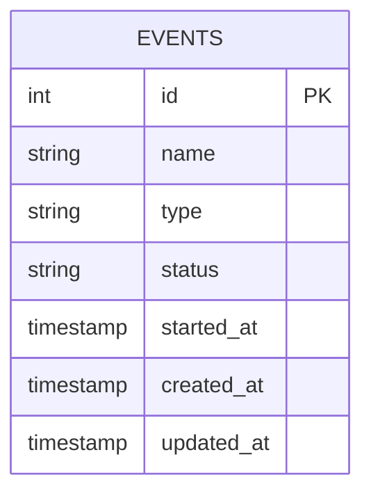
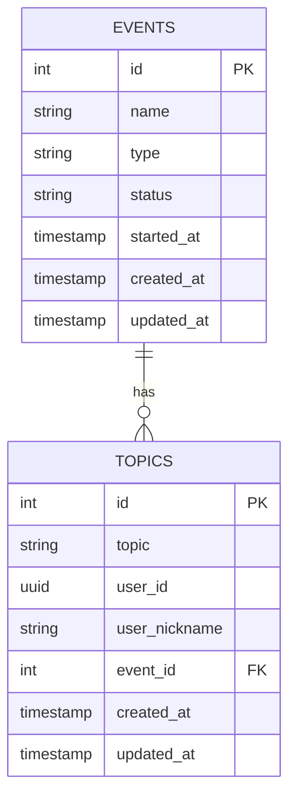
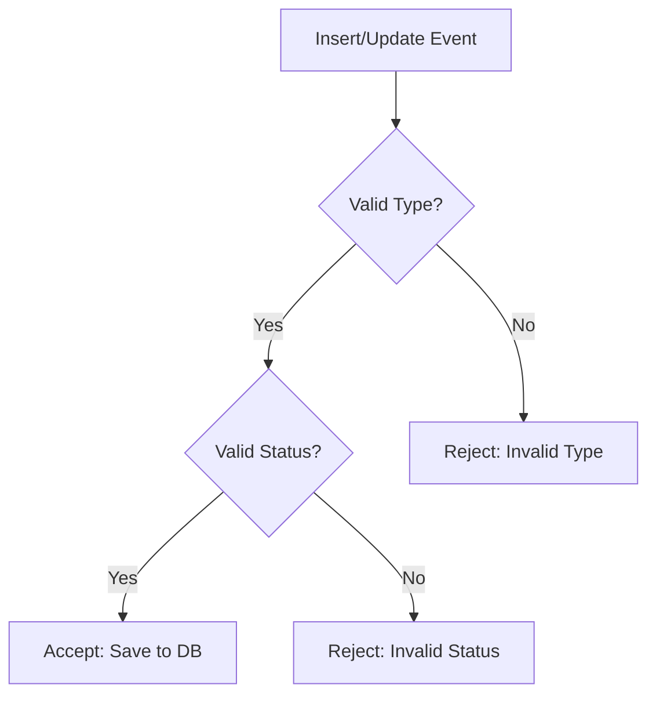
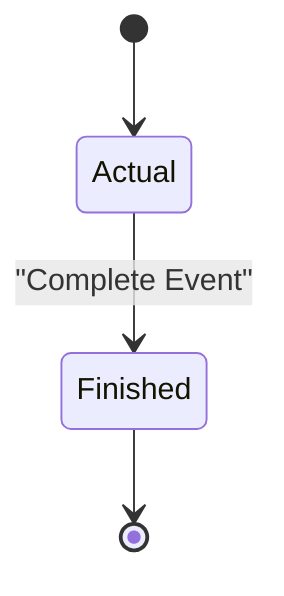
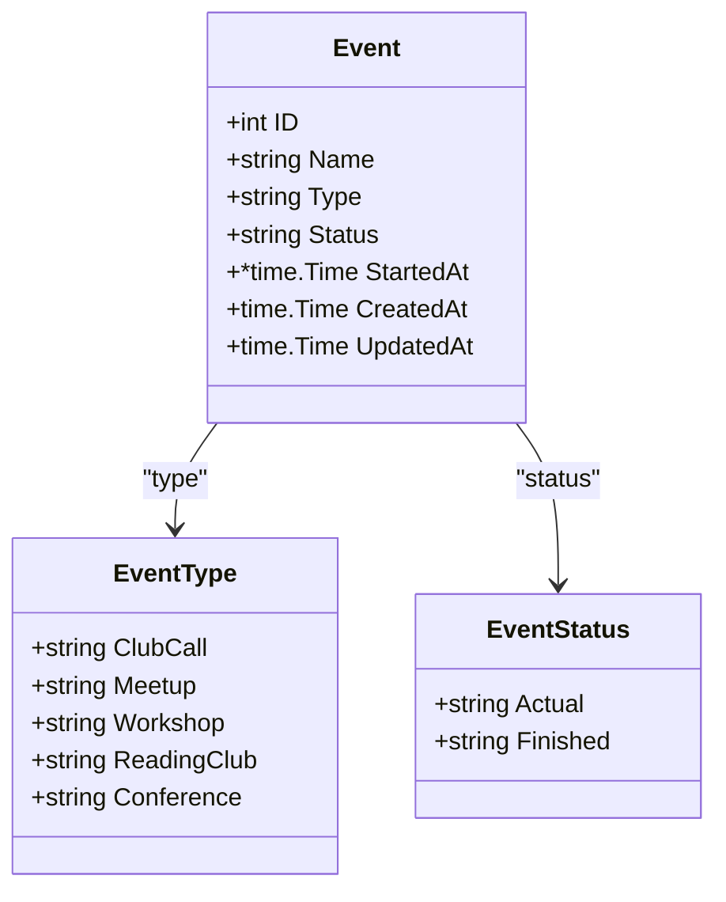
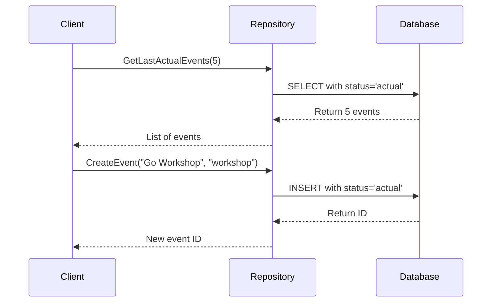
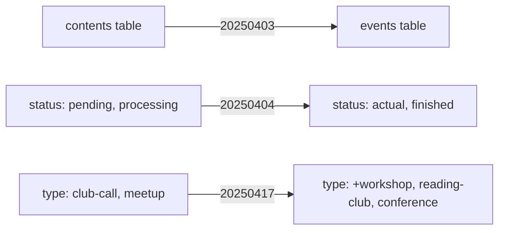

# Event Management Schema

<cite>
**Referenced Files in This Document**   
- [event_repository.go](file://internal/database/repositories/event_repository.go)
- [db_constants.go](file://internal/constants/db_constants.go)
- [20250403_rename_contents_to_events.go](file://internal/database/migrations/implementations/20250403_rename_contents_to_events.go)
- [20250404_update_events_constraints.go](file://internal/database/migrations/implementations/20250404_update_events_constraints.go)
- [20250417_add_new_event_types.go](file://internal/database/migrations/implementations/20250417_add_new_event_types.go)
- [event_formatters.go](file://internal/formatters/event_formatters.go)
</cite>

## Table of Contents
1. [Introduction](#introduction)
2. [Event Table Structure](#event-table-structure)
3. [Primary and Foreign Key Relationships](#primary-and-foreign-key-relationships)
4. [Field Constraints and Validation](#field-constraints-and-validation)
5. [Event Lifecycle and Status States](#event-lifecycle-and-status-states)
6. [Event Types and Business Use Cases](#event-types-and-business-use-cases)
7. [Data Access Patterns](#data-access-patterns)
8. [Performance Considerations and Indexing](#performance-considerations-and-indexing)
9. [Schema Evolution History](#schema-evolution-history)
10. [Conclusion](#conclusion)

## Introduction
The Event entity in the evocoders-bot-go application serves as the central model for managing community events such as workshops, meetups, and webinars. This document provides comprehensive documentation of the event database schema, including structural details, constraints, lifecycle management, and access patterns. The schema supports dynamic event types and status transitions, enabling flexible event management within the platform.

**Section sources**
- [event_repository.go](file://internal/database/repositories/event_repository.go#L12-L20)
- [db_constants.go](file://internal/constants/db_constants.go#L0-L34)

## Event Table Structure
The `events` table stores core information about each event, with the following fields:

| Field | Type | Nullable | Description |
|-------|------|----------|-------------|
| id | INTEGER | NO | Primary key, auto-incrementing identifier |
| name | TEXT | NO | Title of the event |
| type | TEXT | NO | Categorical type (e.g., workshop, meetup) |
| status | TEXT | NO | Current lifecycle state |
| started_at | TIMESTAMP | YES | Scheduled start time (nullable for planning) |
| created_at | TIMESTAMP | NO | Record creation timestamp |
| updated_at | TIMESTAMP | NO | Last modification timestamp |

The `started_at` field is optional to accommodate events in the planning phase where timing has not yet been confirmed. The `created_at` and `updated_at` fields are automatically managed by the system to track record lifecycle.

**Diagram sources**
- [event_repository.go](file://internal/database/repositories/event_repository.go#L12-L20)

**Section sources**
- [event_repository.go](file://internal/database/repositories/event_repository.go#L12-L20)

## Primary and Foreign Key Relationships
The `events` table uses `id` as its primary key, which serves as a reference target for related entities. A foreign key relationship exists between the `topics` table and the `events` table through the `event_id` column.

When an event is deleted, all associated topics are automatically removed through cascading logic implemented in the `DeleteEvent` method. This ensures referential integrity and prevents orphaned topic records.

**Diagram sources**
- [20250403_rename_contents_to_events.go](file://internal/database/migrations/implementations/20250403_rename_contents_to_events.go#L0-L114)
- [event_repository.go](file://internal/database/repositories/event_repository.go#L240-L252)

**Section sources**
- [20250403_rename_contents_to_events.go](file://internal/database/migrations/implementations/20250403_rename_contents_to_events.go#L0-L114)
- [event_repository.go](file://internal/database/repositories/event_repository.go#L240-L252)

## Field Constraints and Validation
The `events` table enforces data integrity through CHECK constraints on the `type` and `status` columns.

The `type` field is constrained to a predefined set of values:
- `club-call`
- `meetup`
- `workshop`
- `reading-club`
- `conference`

The `status` field is restricted to two possible values:
- `actual` - active or upcoming events
- `finished` - completed events

These constraints are implemented at the database level to prevent invalid data entry. Application-level validation is also enforced through constants defined in `db_constants.go`.

**Diagram sources**
- [db_constants.go](file://internal/constants/db_constants.go#L0-L34)
- [20250417_add_new_event_types.go](file://internal/database/migrations/implementations/20250417_add_new_event_types.go#L0-L89)

**Section sources**
- [db_constants.go](file://internal/constants/db_constants.go#L0-L34)
- [20250417_add_new_event_types.go](file://internal/database/migrations/implementations/20250417_add_new_event_types.go#L0-L89)

## Event Lifecycle and Status States
The event lifecycle is managed through a two-state status system:

- **Actual**: Events that are upcoming or currently ongoing. These are active events visible to users and available for topic submission.
- **Finished**: Events that have been completed. These are archived and no longer accept new topics.

When a new event is created, it is automatically assigned the `actual` status. Events transition to `finished` status when they are marked as complete through administrative actions. This binary state model simplifies event management while supporting the core use case of distinguishing between active and historical events.

The lifecycle transition is implemented through the `UpdateEventStatus` method in the repository, which validates the new status against allowed values before persistence.

**Diagram sources**
- [event_repository.go](file://internal/database/repositories/event_repository.go#L175-L187)
- [db_constants.go](file://internal/constants/db_constants.go#L24-L34)

**Section sources**
- [event_repository.go](file://internal/database/repositories/event_repository.go#L175-L187)
- [db_constants.go](file://internal/constants/db_constants.go#L24-L34)

## Event Types and Business Use Cases
The system supports five distinct event types, each serving a specific community engagement purpose:

| Type | Emoji | Use Case |
|------|-------|--------|
| club-call | 💬 | Regular community check-ins and discussions |
| meetup | 🎙 | In-person or virtual gatherings with presentations |
| workshop | ⚙️ | Interactive sessions with hands-on activities |
| reading-club | 📚 | Group discussions around technical articles or books |
| conference | 👥 | Large-scale events with multiple speakers and sessions |

Each event type is represented by a unique emoji in user-facing interfaces, enhancing visual recognition. The `GetTypeInRussian` function in `event_formatters.go` provides localized display names for Russian-speaking users.

Sample scenarios:
- A **workshop** on Go concurrency patterns with a scheduled `started_at` time and `actual` status
- A **meetup** that has concluded and been marked as `finished`
- A **reading-club** event in planning phase with null `started_at` value

**Diagram sources**
- [db_constants.go](file://internal/constants/db_constants.go#L5-L23)
- [event_formatters.go](file://internal/formatters/event_formatters.go#L5-L50)

**Section sources**
- [db_constants.go](file://internal/constants/db_constants.go#L5-L23)
- [event_formatters.go](file://internal/formatters/event_formatters.go#L5-L50)

## Data Access Patterns
The `EventRepository` provides several methods for querying events based on different access patterns:

- **Upcoming events**: `GetLastActualEvents` retrieves active events ordered by `started_at` (ascending, with NULLs last)
- **Recent events**: `GetLastEvents` returns events ordered by `started_at` (descending, with NULLs last)
- **Event lookup**: `GetEventByID` retrieves a single event by primary key
- **Status-based queries**: Methods filter by `status = 'actual'` for current events

The repository also supports CRUD operations:
- `CreateEvent` and `CreateEventWithStartedAt` for insertion
- Update methods for name, status, type, and start time
- `DeleteEvent` with cascading removal of related topics

**Diagram sources**
- [event_repository.go](file://internal/database/repositories/event_repository.go#L50-L240)

**Section sources**
- [event_repository.go](file://internal/database/repositories/event_repository.go#L50-L240)

## Performance Considerations and Indexing
While explicit index definitions are not visible in the provided code, optimal query performance suggests the following indexing strategy should be implemented:

- **Index on `status`**: Critical for filtering active vs. finished events in `GetLastActualEvents`
- **Index on `started_at`**: Essential for time-based ordering in both ascending and descending queries
- **Composite index on `(status, started_at)`**: Most effective for combined filtering and sorting in event listing queries

The `NULLS LAST` clause in ORDER BY statements indicates that events without scheduled times should appear after scheduled ones, which is particularly important for planning interfaces. Queries that retrieve events by ID benefit from the primary key index on `id`.

For large datasets, partial indexes on `status = 'actual'` could further optimize performance for the most common access pattern of retrieving upcoming events.

**Section sources**
- [event_repository.go](file://internal/database/repositories/event_repository.go#L60-L75)
- [event_repository.go](file://internal/database/repositories/event_repository.go#L95-L110)

## Schema Evolution History
The event schema has evolved through several migration steps:

1. **20250403**: Renamed `contents` table to `events` and updated foreign key in `topics` table from `content_id` to `event_id`
2. **20250404**: Updated constraints, renaming `contents_status_check` to `events_status_check` and standardizing status values to `actual`/`finished`
3. **20250417**: Expanded event types to include `workshop`, `reading-club`, and `conference` alongside existing `club-call` and `meetup` types

This evolution reflects a shift from generic "content" to specialized "events" with richer categorization. The migration strategy uses transactional DDL operations to ensure atomic changes, with rollback methods provided for each migration.

The constraint updates demonstrate a progression toward more meaningful status values that better represent the actual event lifecycle.

**Diagram sources**
- [20250403_rename_contents_to_events.go](file://internal/database/migrations/implementations/20250403_rename_contents_to_events.go#L0-L114)
- [20250404_update_events_constraints.go](file://internal/database/migrations/implementations/20250404_update_events_constraints.go#L0-L106)
- [20250417_add_new_event_types.go](file://internal/database/migrations/implementations/20250417_add_new_event_types.go#L0-L89)

**Section sources**
- [20250403_rename_contents_to_events.go](file://internal/database/migrations/implementations/20250403_rename_contents_to_events.go#L0-L114)
- [20250404_update_events_constraints.go](file://internal/database/migrations/implementations/20250404_update_events_constraints.go#L0-L106)
- [20250417_add_new_event_types.go](file://internal/database/migrations/implementations/20250417_add_new_event_types.go#L0-L89)

## Conclusion
The Event entity in the evocoders-bot-go application provides a robust foundation for managing community events with support for multiple types, clear lifecycle states, and efficient data access patterns. The schema has evolved to better serve the platform's needs, moving from generic content to specialized events with meaningful categorization. The combination of database constraints and application-level validation ensures data integrity, while the repository pattern provides a clean interface for event management operations. Future enhancements could include additional status states, more sophisticated time management features, and enhanced indexing for improved query performance at scale.