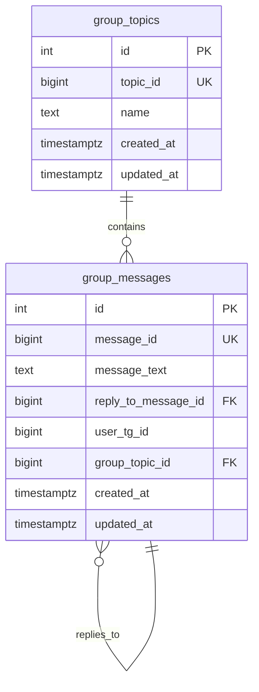
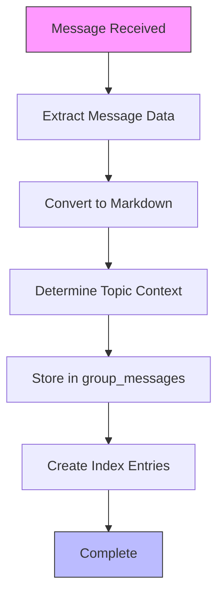
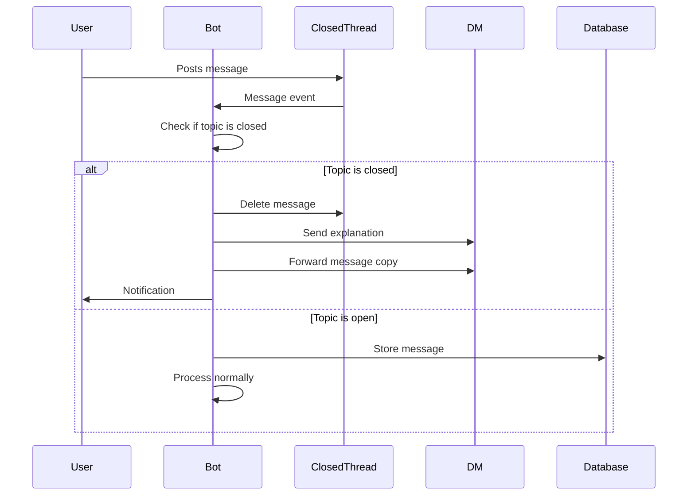
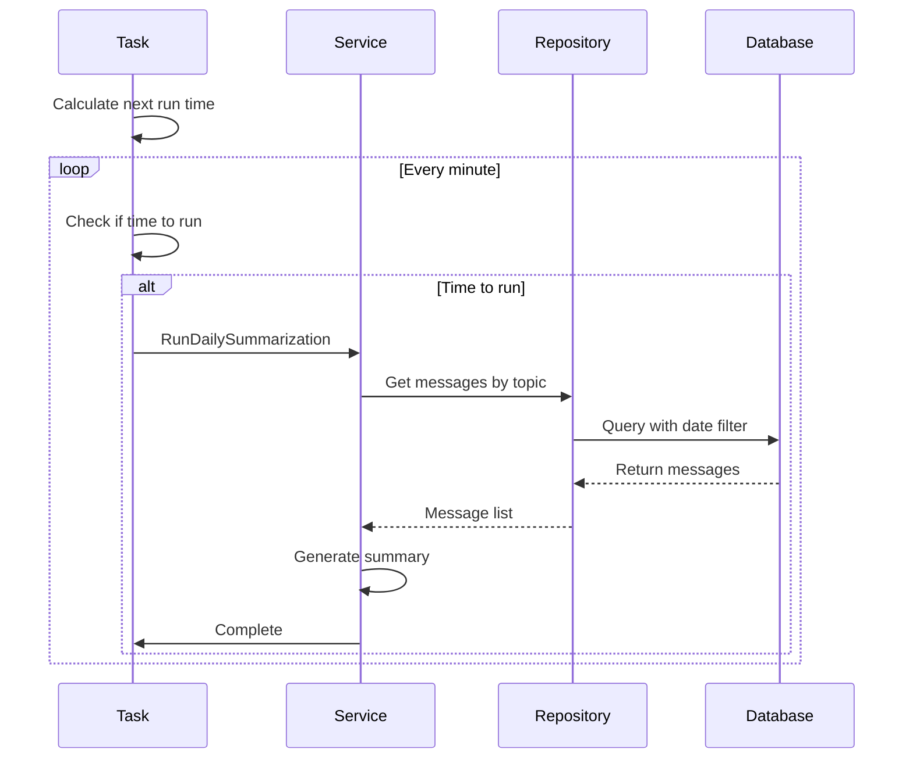

# Group Content Schema

<cite>
**Referenced Files in This Document**   
- [20250917_add_group_topics_table.go](file://internal/database/migrations/implementations/20250917_add_group_topics_table.go)
- [20250918_add_group_messages_table.go](file://internal/database/migrations/implementations/20250918_add_group_messages_table.go)
- [group_topic_repository.go](file://internal/database/repositories/group_topic_repository.go)
- [group_message_repository.go](file://internal/database/repositories/group_message_repository.go)
- [save_topics_handler.go](file://internal/handlers/grouphandlers/save_topics_handler.go)
- [save_messages_handler.go](file://internal/handlers/grouphandlers/save_messages_handler.go)
- [clean_closed_threads_handler.go](file://internal/handlers/grouphandlers/clean_closed_threads_handler.go)
- [daily_summarization_task.go](file://internal/tasks/daily_summarization_task.go)
</cite>

## Table of Contents
1. [Introduction](#introduction)
2. [Data Model Overview](#data-model-overview)
3. [Group Topics Table](#group-topics-table)
4. [Group Messages Table](#group-messages-table)
5. [Thread Management Business Rules](#thread-management-business-rules)
6. [Data Access Patterns](#data-access-patterns)
7. [Performance Considerations](#performance-considerations)
8. [Feature Integration](#feature-integration)
9. [Sample Data Scenarios](#sample-data-scenarios)
10. [Conclusion](#conclusion)

## Introduction

The Group Content Schema in the evocoders-bot-go application is designed to capture and manage discussions within Telegram supergroup threads. This documentation provides a comprehensive overview of the database schema components responsible for storing forum topics and their associated messages. The schema supports key features such as thread tracking, message archiving, automated cleanup of closed threads, and daily summarization of active discussions. The design reflects the hierarchical structure of Telegram's forum capabilities, where each thread (topic) contains multiple messages from participants.

**Section sources**
- [20250917_add_group_topics_table.go](file://internal/database/migrations/implementations/20250917_add_group_topics_table.go#L1-L38)
- [20250918_add_group_messages_table.go](file://internal/database/migrations/implementations/20250918_add_group_messages_table.go#L1-L50)

## Data Model Overview

The group content data model consists of two primary entities: `group_topics` and `group_messages`. These tables form a parent-child relationship where each topic can have multiple messages. The schema is optimized for efficient retrieval of messages by topic, tracking of thread activity, and supporting automated processes like summarization and cleanup. The model captures the essential attributes needed to represent Telegram forum threads and their messages while enabling business logic for thread management.



**Diagram sources**
- [20250917_add_group_topics_table.go](file://internal/database/migrations/implementations/20250917_add_group_topics_table.go#L1-L38)
- [20250918_add_group_messages_table.go](file://internal/database/migrations/implementations/20250918_add_group_messages_table.go#L1-L50)

**Section sources**
- [20250917_add_group_topics_table.go](file://internal/database/migrations/implementations/20250917_add_group_topics_table.go#L1-L38)
- [20250918_add_group_messages_table.go](file://internal/database/migrations/implementations/20250918_add_group_messages_table.go#L1-L50)

## Group Topics Table

The `group_topics` table stores metadata about each forum thread in the Telegram supergroup. Each record represents a distinct discussion thread with a unique identifier that corresponds to Telegram's internal topic ID system. The table captures the thread's name, creation timestamp, and last update time, providing the foundation for thread management operations. The schema is designed to support efficient lookups by topic ID, which is critical for handling incoming messages and maintaining thread state.

### Field Definitions

| Field | Type | Constraints | Description |
|-------|------|-------------|-------------|
| id | SERIAL | PRIMARY KEY | Internal database identifier |
| topic_id | BIGINT | NOT NULL, UNIQUE | Telegram's unique identifier for the topic |
| name | TEXT | NOT NULL | Display name of the topic/thread |
| created_at | TIMESTAMPTZ | NOT NULL, DEFAULT NOW() | Timestamp when topic was created |
| updated_at | TIMESTAMPTZ | NOT NULL, DEFAULT NOW() | Timestamp when topic was last updated |

The `topic_id` field serves as the primary link between the database records and Telegram's API, ensuring that the application can accurately track and reference specific threads. The `name` field stores the human-readable title of the discussion thread, which may be updated when users edit the topic name in Telegram.

**Section sources**
- [20250917_add_group_topics_table.go](file://internal/database/migrations/implementations/20250917_add_group_topics_table.go#L1-L38)
- [group_topic_repository.go](file://internal/database/repositories/group_topic_repository.go#L1-L147)
- [save_topics_handler.go](file://internal/handlers/grouphandlers/save_topics_handler.go#L1-L116)

## Group Messages Table

The `group_messages` table stores individual messages posted within forum threads. Each message is associated with a specific topic and contains the message content, sender information, and reply context. The table is designed to support high-volume message storage with optimized indexing for common query patterns. The schema captures both the content and structural relationships between messages, enabling features like conversation threading and message attribution.

### Field Definitions

| Field | Type | Constraints | Description |
|-------|------|-------------|-------------|
| id | SERIAL | PRIMARY KEY | Internal database identifier |
| message_id | BIGINT | NOT NULL, UNIQUE | Telegram's unique identifier for the message |
| message_text | TEXT | NOT NULL | Message content in Markdown format |
| reply_to_message_id | BIGINT | NULLABLE | Reference to parent message in conversation |
| user_tg_id | BIGINT | NOT NULL | Telegram user ID of the message sender |
| group_topic_id | BIGINT | NOT NULL | Reference to the parent topic |
| created_at | TIMESTAMPTZ | NOT NULL, DEFAULT NOW() | Timestamp when message was created |
| updated_at | TIMESTAMPTZ | NOT NULL, DEFAULT NOW() | Timestamp when message was last updated |

The `message_text` field stores content in Markdown format, preserving formatting from the original Telegram message. The `reply_to_message_id` field enables reconstruction of conversation threads by linking replies to their parent messages. The `group_topic_id` establishes the relationship between messages and their containing topics.

### Indexing Strategy

The table includes multiple indexes to optimize query performance:

- `idx_group_messages_user_tg_id`: Optimizes queries by sender
- `idx_group_messages_group_topic_id`: Optimizes retrieval of messages by topic
- `idx_group_messages_reply_to_message_id`: Optimizes thread reconstruction
- `idx_group_messages_created_at`: Optimizes chronological queries



**Diagram sources**
- [20250918_add_group_messages_table.go](file://internal/database/migrations/implementations/20250918_add_group_messages_table.go#L1-L50)

**Section sources**
- [20250918_add_group_messages_table.go](file://internal/database/migrations/implementations/20250918_add_group_messages_table.go#L1-L50)
- [group_message_repository.go](file://internal/database/repositories/group_message_repository.go#L1-L263)
- [save_messages_handler.go](file://internal/handlers/grouphandlers/save_messages_handler.go#L1-L285)

## Thread Management Business Rules

The application implements specific business rules for managing forum threads, particularly around closed topics. These rules ensure that the community maintains appropriate discussion boundaries while providing users with clear feedback about message handling.

### Closed Thread Detection

Closed threads are identified through configuration rather than a database flag. The `config.ClosedTopicsIDs` field contains a list of topic IDs that are considered closed. This approach allows administrators to manage closed threads without requiring database schema changes. The `CleanClosedThreadsHandler` checks incoming messages against this list to determine if automated cleanup should be applied.

### Message Forwarding and Deletion

When a message is posted in a closed thread, the system automatically deletes it and forwards a copy to the sender via direct message. This process includes:

1. Message deletion from the original thread
2. Sending a notification explaining the deletion
3. Forwarding the message content to the user's DM

This workflow ensures that users receive their content while maintaining the read-only nature of closed threads. The system also handles message editing and deletion requests through special commands like "[delete]" or "[удалить]".



**Diagram sources**
- [clean_closed_threads_handler.go](file://internal/handlers/grouphandlers/clean_closed_threads_handler.go#L1-L159)

**Section sources**
- [clean_closed_threads_handler.go](file://internal/handlers/grouphandlers/clean_closed_threads_handler.go#L1-L159)
- [save_messages_handler.go](file://internal/handlers/grouphandlers/save_messages_handler.go#L1-L285)

## Data Access Patterns

The repository layer provides optimized access patterns for common operations related to group content. These patterns support the application's core functionality while maintaining performance and data integrity.

### Message Retrieval by Topic

The primary access pattern involves retrieving messages for a specific topic. The `GetByGroupTopicID` method in `GroupMessageRepository` supports pagination through limit and offset parameters, enabling efficient loading of message threads:


### Closed Thread Detection

The system determines if a thread is closed by checking the topic ID against the configured list of closed topics. This check occurs in the `CleanClosedThreadsHandler.check` method before any message processing.

### Activity Tracking

Activity is tracked through the `created_at` timestamp on messages. The system can determine the most recently active topics by querying for messages with the latest timestamps, which supports features like daily summarization.

**Section sources**
- [group_topic_repository.go](file://internal/database/repositories/group_topic_repository.go#L1-L147)
- [group_message_repository.go](file://internal/database/repositories/group_message_repository.go#L1-L263)
- [clean_closed_threads_handler.go](file://internal/handlers/grouphandlers/clean_closed_threads_handler.go#L1-L159)

## Performance Considerations

The schema design incorporates several performance optimizations to handle the high-volume message traffic typical of active Telegram groups.

### Partitioning Strategy

While the current implementation does not include explicit database partitioning, the schema is designed to support future partitioning by time or topic. The `created_at` field provides the natural basis for time-based partitioning, which could be implemented to improve query performance for historical data.

### Indexing Optimization

The indexing strategy focuses on the most common query patterns:

- Topic-based queries are optimized through the `idx_group_messages_group_topic_id` index
- Chronological queries are optimized through the `idx_group_messages_created_at` index
- User-based queries are optimized through the `idx_group_messages_user_tg_id` index

These indexes ensure that message retrieval operations maintain consistent performance even as the message volume grows.

### Query Performance

The repository methods are designed to minimize database load through:

- Parameterized queries to prevent SQL injection
- Proper use of LIMIT and OFFSET for pagination
- Efficient scanning with appropriate WHERE clauses
- Connection reuse through the shared database instance

**Section sources**
- [20250918_add_group_messages_table.go](file://internal/database/migrations/implementations/20250918_add_group_messages_table.go#L1-L50)
- [group_message_repository.go](file://internal/database/repositories/group_message_repository.go#L1-L263)

## Feature Integration

The group content schema enables several key features in the evocoders-bot-go application, serving as the data foundation for automated processes and user-facing functionality.

### Daily Summarization

The schema supports daily summarization through the `DailySummarizationTask`, which uses message data to generate summaries of active discussions. The task runs at a configured time and processes messages from the previous day, leveraging the `created_at` timestamps to identify relevant content.



**Diagram sources**
- [daily_summarization_task.go](file://internal/tasks/daily_summarization_task.go#L1-L99)
- [group_message_repository.go](file://internal/database/repositories/group_message_repository.go#L1-L263)

### Automated Thread Cleanup

The closed thread management system automatically cleans up messages in designated read-only threads. This feature maintains community guidelines by preventing new discussions in archived topics while providing users with their content via direct message.

**Section sources**
- [daily_summarization_task.go](file://internal/tasks/daily_summarization_task.go#L1-L99)
- [clean_closed_threads_handler.go](file://internal/handlers/grouphandlers/clean_closed_threads_handler.go#L1-L159)

## Sample Data Scenarios

### Active Discussion

An active discussion in the "General Discussion" topic (topic_id: 1001):

```json
{
  "topic": {
    "id": 1,
    "topic_id": 1001,
    "name": "General Discussion",
    "created_at": "2025-09-17T10:00:00Z"
  },
  "messages": [
    {
      "id": 1,
      "message_id": 5001,
      "message_text": "Hello everyone!",
      "user_tg_id": 12345,
      "group_topic_id": 1001,
      "created_at": "2025-09-17T10:05:00Z"
    },
    {
      "id": 2,
      "message_id": 5002,
      "message_text": "Welcome!",
      "reply_to_message_id": 5001,
      "user_tg_id": 67890,
      "group_topic_id": 1001,
      "created_at": "2025-09-17T10:06:00Z"
    }
  ]
}
```

### Closed Thread

A message attempt in a closed thread (topic_id: 2001):

```json
{
  "topic": {
    "id": 2,
    "topic_id": 2001,
    "name": "Announcements",
    "created_at": "2025-09-17T09:00:00Z"
  },
  "attempted_message": {
    "message_id": 6001,
    "message_text": "Great announcement!",
    "user_tg_id": 12345,
    "group_topic_id": 2001,
    "created_at": "2025-09-17T11:00:00Z"
  },
  "outcome": "Message deleted and forwarded to user's DM"
}
```

### Message Archiving

Historical messages archived for summarization:

```json
{
  "summary_period": "2025-09-17",
  "topics": [
    {
      "topic_id": 1001,
      "name": "General Discussion",
      "message_count": 150,
      "active_users": 45
    }
  ],
  "generated_summary": "Active discussion with 150 messages from 45 users..."
}
```

**Section sources**
- [group_topic_repository.go](file://internal/database/repositories/group_topic_repository.go#L1-L147)
- [group_message_repository.go](file://internal/database/repositories/group_message_repository.go#L1-L263)
- [daily_summarization_task.go](file://internal/tasks/daily_summarization_task.go#L1-L99)

## Conclusion

The Group Content Schema in evocoders-bot-go provides a robust foundation for managing forum discussions in Telegram supergroups. The two-table design effectively captures the hierarchical relationship between topics and messages while supporting essential features like thread management, message archiving, and automated cleanup. The schema's indexing strategy and repository patterns ensure efficient data access even with high message volumes. By leveraging Telegram's forum capabilities, the system enables structured community discussions with automated moderation and summarization features that enhance user experience. The design demonstrates a clear understanding of both the technical requirements of message storage and the community management needs of a vibrant online group.