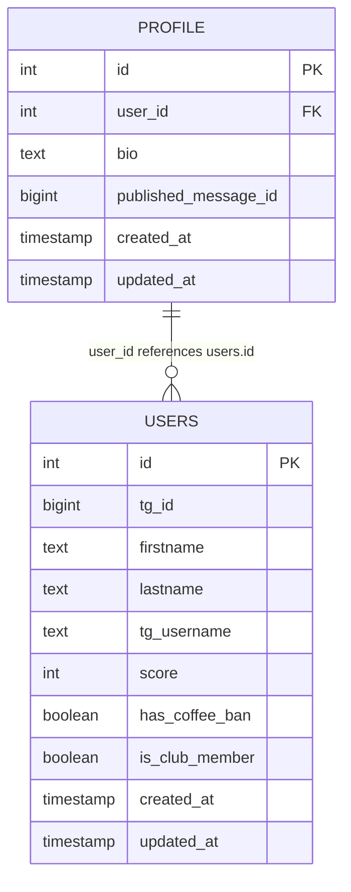
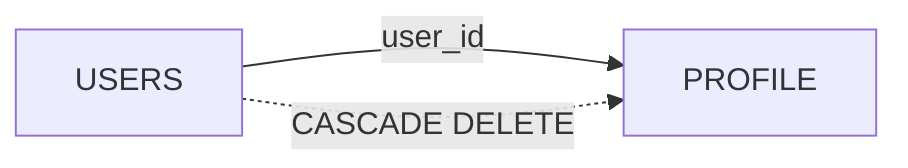
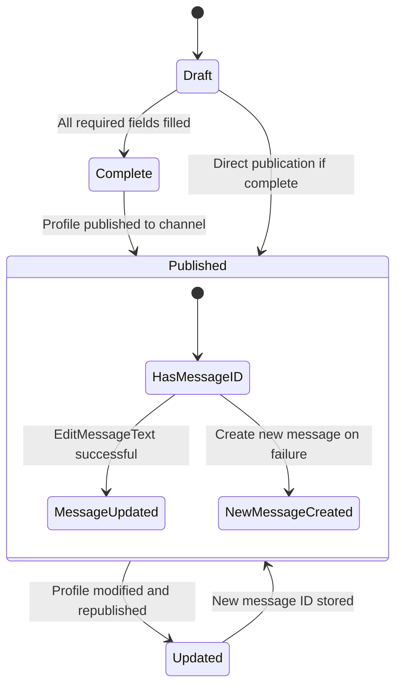
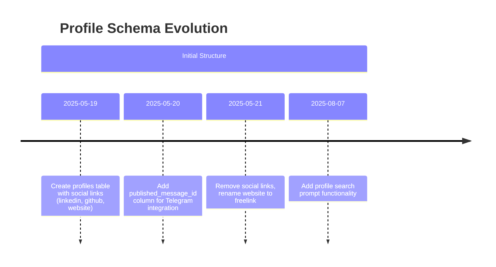
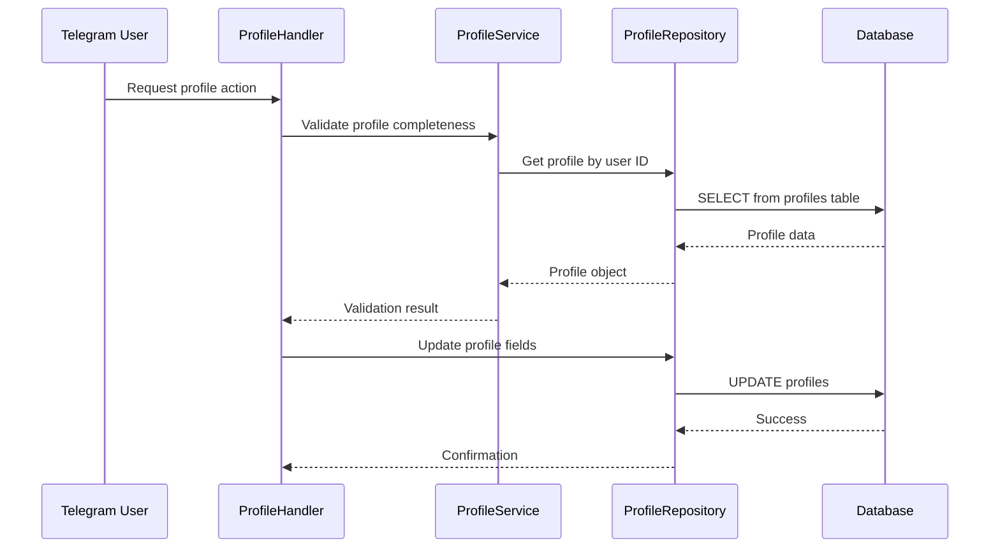

# Profile Management Schema

<cite>
**Referenced Files in This Document**   
- [20250519_add_users_and_profiles_tables.go](file://internal/database/migrations/implementations/20250519_add_users_and_profiles_tables.go)
- [20250520_add_published_message_id_to_profiles.go](file://internal/database/migrations/implementations/20250520_add_published_message_id_to_profiles.go)
- [20250521_remove_social_links_from_profiles.go](file://internal/database/migrations/implementations/20250521_remove_social_links_from_profiles.go)
- [20250807_add_profile_search_prompt.go](file://internal/database/migrations/implementations/20250807_add_profile_search_prompt.go)
- [profile_repository.go](file://internal/database/repositories/profile_repository.go)
- [profile_handler.go](file://internal/handlers/privatehandlers/profile_handler.go)
- [profile_service.go](file://internal/services/profile_service.go)
- [profile_formaters.go](file://internal/formatters/profile_formaters.go)
</cite>

## Table of Contents
1. [Introduction](#introduction)
2. [Profile Table Structure](#profile-table-structure)
3. [Field Definitions and Validation](#field-definitions-and-validation)
4. [Foreign Key Relationships](#foreign-key-relationships)
5. [Profile Lifecycle and Publication](#profile-lifecycle-and-publication)
6. [Schema Evolution and Migrations](#schema-evolution-and-migrations)
7. [Sample Data Scenarios](#sample-data-scenarios)
8. [Data Access Patterns](#data-access-patterns)
9. [Performance Considerations](#performance-considerations)
10. [Conclusion](#conclusion)

## Introduction
The Profile entity in the evocoders-bot-go application serves as a central component for managing user profiles within the system. This documentation provides a comprehensive overview of the profile schema, detailing its structure, relationships, lifecycle, and access patterns. The profile system enables users to create and maintain personal information that can be published to a Telegram channel, facilitating community engagement and visibility.

**Section sources**
- [profile_repository.go](file://internal/database/repositories/profile_repository.go#L13-L20)

## Profile Table Structure
The profile table is designed to store user profile information with a focus on simplicity and essential data. The table structure has evolved through multiple migrations to meet changing requirements.



**Diagram sources**
- [20250519_add_users_and_profiles_tables.go](file://internal/database/migrations/implementations/20250519_add_users_and_profiles_tables.go#L50-L60)
- [20250520_add_published_message_id_to_profiles.go](file://internal/database/migrations/implementations/20250520_add_published_message_id_to_profiles.go#L35-L45)

## Field Definitions and Validation
Each field in the profile table serves a specific purpose and is subject to validation rules to ensure data integrity.

### Field Specifications
| Field | Type | Nullable | Description | Validation Rules |
|-------|------|----------|-------------|------------------|
| id | SERIAL | NO | Primary key identifier | Auto-incrementing, unique |
| user_id | INTEGER | NO | Foreign key to users table | Must reference existing user |
| bio | TEXT | YES | User biography/description | Max length enforced at application level |
| published_message_id | BIGINT | YES | Telegram message ID of published profile | Nullable, defaults to NULL |
| created_at | TIMESTAMP | NO | Record creation timestamp | Defaults to NOW() |
| updated_at | TIMESTAMP | NO | Record modification timestamp | Defaults to NOW() |

**Section sources**
- [profile_repository.go](file://internal/database/repositories/profile_repository.go#L13-L20)
- [profile_handler.go](file://internal/handlers/privatehandlers/profile_handler.go#L100-L150)

## Foreign Key Relationships
The profile table maintains a critical relationship with the users table, ensuring referential integrity and enabling user-centric operations.

### Relationship Details
- **Constraint Type**: Foreign Key with CASCADE DELETE
- **Referenced Table**: users (id column)
- **On Delete**: CASCADE - When a user is deleted, their profile is automatically removed
- **Index**: profiles_user_id_idx for optimized lookup performance



**Diagram sources**
- [20250519_add_users_and_profiles_tables.go](file://internal/database/migrations/implementations/20250519_add_users_and_profiles_tables.go#L50-L60)
- [20250519_add_users_and_profiles_tables.go](file://internal/database/migrations/implementations/20250519_add_users_and_profiles_tables.go#L70-L75)

## Profile Lifecycle and Publication
The profile lifecycle encompasses creation, editing, validation, and publication to a Telegram channel.

### Lifecycle States


### Publication Process
1. User initiates profile publication
2. System validates completeness (firstname, lastname, bio)
3. If published_message_id exists, attempt to edit existing message
4. If edit fails or no message ID exists, create new message in topic
5. Update profile with new published_message_id
6. Provide user with link to published profile

**Section sources**
- [profile_handler.go](file://internal/handlers/privatehandlers/profile_handler.go#L600-L750)
- [profile_service.go](file://internal/services/profile_service.go#L15-L35)
- [profile_formaters.go](file://internal/formatters/profile_formaters.go#L70-L110)

## Schema Evolution and Migrations
The profile schema has undergone several evolutionary changes through database migrations.

### Migration Timeline


### Key Migration Details
- **20250519**: Initial creation with social media fields
- **20250520**: Added published_message_id to track Telegram message association
- **20250521**: Removed social links (linkedin, github) and renamed website to freelink
- **20250807**: Added search prompt functionality through prompting_templates

**Section sources**
- [20250519_add_users_and_profiles_tables.go](file://internal/database/migrations/implementations/20250519_add_users_and_profiles_tables.go)
- [20250520_add_published_message_id_to_profiles.go](file://internal/database/migrations/implementations/20250520_add_published_message_id_to_profiles.go)
- [20250521_remove_social_links_from_profiles.go](file://internal/database/migrations/implementations/20250521_remove_social_links_from_profiles.go)
- [20250807_add_profile_search_prompt.go](file://internal/database/migrations/implementations/20250807_add_profile_search_prompt.go)

## Sample Data Scenarios
Illustrative examples of profile data in various states.

### Complete Profile
```json
{
  "id": 123,
  "user_id": 456,
  "bio": "Full-stack developer with 5 years of experience in Go and React. Passionate about open source and community building.",
  "published_message_id": {
    "Valid": true,
    "Int64": 789
  },
  "created_at": "2025-06-15T10:30:00Z",
  "updated_at": "2025-06-15T10:30:00Z"
}
```

### Incomplete Profile
```json
{
  "id": 124,
  "user_id": 457,
  "bio": "",
  "published_message_id": {
    "Valid": false,
    "Int64": 0
  },
  "created_at": "2025-06-16T14:20:00Z",
  "updated_at": "2025-06-16T14:20:00Z"
}
```

**Section sources**
- [profile_repository.go](file://internal/database/repositories/profile_repository.go#L13-L20)
- [profile_handler.go](file://internal/handlers/privatehandlers/profile_handler.go#L500-L550)

## Data Access Patterns
The profile_repository.go implements several key data access patterns for profile management.

### Repository Operations


### Key Repository Methods
- **GetByID**: Retrieve profile by primary key
- **GetByUserID**: Find profile associated with specific user
- **GetOrCreate**: Ensure profile exists for user
- **Create**: Insert new profile record
- **Update**: Modify profile fields
- **UpdatePublishedMessageID**: Set Telegram message association

**Section sources**
- [profile_repository.go](file://internal/database/repositories/profile_repository.go)
- [profile_handler.go](file://internal/handlers/privatehandlers/profile_handler.go)

## Performance Considerations
Optimization strategies for efficient profile data management.

### Indexing Strategy
- **profiles_user_id_idx**: B-tree index on user_id for fast user-based lookups
- **Consideration**: Potential full-text index on bio for improved search performance

### Query Optimization
- Use parameterized queries to prevent SQL injection
- Implement connection pooling at database level
- Cache frequently accessed profiles when appropriate
- Batch operations when processing multiple profiles

### Search Performance
For text-based searches on profile content:
- Implement database-level full-text search capabilities
- Consider adding GIN index on bio field for pattern matching
- Implement application-level caching for frequent search queries
- Use pagination for large result sets

**Section sources**
- [profile_repository.go](file://internal/database/repositories/profile_repository.go)
- [20250519_add_users_and_profiles_tables.go](file://internal/database/migrations/implementations/20250519_add_users_and_profiles_tables.go#L70-L75)

## Conclusion
The Profile entity in evocoders-bot-go provides a robust foundation for user profile management with a clear lifecycle from creation to publication. The schema has evolved to focus on essential information while maintaining integration with Telegram through the published_message_id field. The implementation includes comprehensive validation, efficient data access patterns, and consideration for performance optimization. Future enhancements could include advanced search capabilities and additional indexing strategies to support growing user bases.