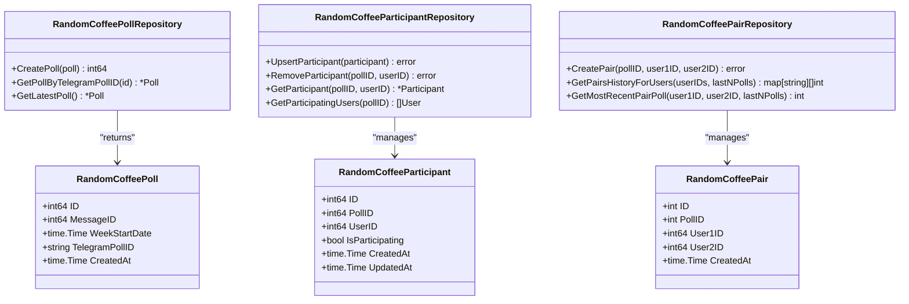

# Random Coffee System Schema

<cite>
**Referenced Files in This Document**   
- [20250602_add_random_coffee_poll_tables.go](file://internal/database/migrations/implementations/20250602_add_random_coffee_poll_tables.go)
- [20250603_remove_chat_id_from_random_coffee_polls.go](file://internal/database/migrations/implementations/20250603_remove_chat_id_from_random_coffee_polls.go)
- [20250609_add_random_coffee_pairs_table.go](file://internal/database/migrations/implementations/20250609_add_random_coffee_pairs_table.go)
- [random_coffee_poll_repository.go](file://internal/database/repositories/random_coffee_poll_repository.go)
- [random_coffee_participant_repository.go](file://internal/database/repositories/random_coffee_participant_repository.go)
- [random_coffee_pair_repository.go](file://internal/database/repositories/random_coffee_pair_repository.go)
</cite>

## Table of Contents
1. [Introduction](#introduction)
2. [Core Data Model](#core-data-model)
3. [Weekly Poll Cycle Workflow](#weekly-poll-cycle-workflow)
4. [Data Access Patterns](#data-access-patterns)
5. [Pairing Algorithm Constraints](#pairing-algorithm-constraints)
6. [Sample Data Scenario](#sample-data-scenario)
7. [Performance Considerations](#performance-considerations)
8. [Schema Evolution](#schema-evolution)
9. [Conclusion](#conclusion)

## Introduction
The Random Coffee System is designed to facilitate weekly pairings of participants for informal virtual meetings. This document provides comprehensive documentation of the database schema supporting this system, focusing on the three core tables: random_coffee_polls, random_coffee_participants, and random_coffee_pairs. The schema supports a weekly cycle of poll creation, participant registration, pair generation, and historical tracking.

**Section sources**
- [20250602_add_random_coffee_poll_tables.go](file://internal/database/migrations/implementations/20250602_add_random_coffee_poll_tables.go#L0-L55)
- [20250609_add_random_coffee_pairs_table.go](file://internal/database/migrations/implementations/20250609_add_random_coffee_pairs_table.go#L0-L38)

## Core Data Model

### random_coffee_polls Table
The random_coffee_polls table represents a weekly poll instance for the Random Coffee system. Each poll corresponds to a specific week and serves as the parent entity for participants and pairs.

**Attributes:**
- **id**: Primary key (SERIAL)
- **message_id**: BIGINT, not null - Telegram message ID associated with the poll
- **week_start_date**: DATE, not null - The starting date of the week for which the poll is created
- **telegram_poll_id**: TEXT, unique - Unique identifier from Telegram's Poll API
- **created_at**: TIMESTAMPTZ, default NOW() - Timestamp of poll creation

**Constraints:**
- Primary key on id
- Unique constraint on telegram_poll_id
- Trigger maintains updated_at timestamp for participants


**Diagram sources**
- [20250602_add_random_coffee_poll_tables.go](file://internal/database/migrations/implementations/20250602_add_random_coffee_poll_tables.go#L0-L55)
- [20250609_add_random_coffee_pairs_table.go](file://internal/database/migrations/implementations/20250609_add_random_coffee_pairs_table.go#L0-L38)

**Section sources**
- [20250602_add_random_coffee_poll_tables.go](file://internal/database/migrations/implementations/20250602_add_random_coffee_poll_tables.go#L0-L55)
- [random_coffee_poll_repository.go](file://internal/database/repositories/random_coffee_poll_repository.go#L0-L96)

### random_coffee_participants Table
The random_coffee_participants table tracks user participation in weekly polls. It establishes the many-to-many relationship between users and polls.

**Attributes:**
- **id**: Primary key (SERIAL)
- **poll_id**: INTEGER, not null, foreign key to random_coffee_polls(id) with cascade delete
- **user_id**: INTEGER, not null, foreign key to users(id) with cascade delete
- **is_participating**: BOOLEAN, not null - Indicates whether the user is participating in the poll
- **created_at**: TIMESTAMPTZ, default NOW()
- **updated_at**: TIMESTAMPTZ, default NOW(), updated by trigger

**Constraints:**
- Composite primary key (poll_id, user_id)
- Unique constraint on (poll_id, user_id) combination
- Cascade delete on poll_id and user_id
- Trigger updates updated_at on modification

**Section sources**
- [20250602_add_random_coffee_poll_tables.go](file://internal/database/migrations/implementations/20250602_add_random_coffee_poll_tables.go#L0-L55)
- [random_coffee_participant_repository.go](file://internal/database/repositories/random_coffee_participant_repository.go#L0-L86)

### random_coffee_pairs Table
The random_coffee_pairs table stores the generated pairs for each weekly poll. It represents the final output of the pairing algorithm.

**Attributes:**
- **id**: Primary key (SERIAL)
- **poll_id**: INTEGER, not null, foreign key to random_coffee_polls(id) with cascade delete
- **user1_id**: INTEGER, not null, foreign key to users(id) with cascade delete
- **user2_id**: INTEGER, not null, foreign key to users(id) with cascade delete
- **created_at**: TIMESTAMPTZ, not null, default NOW()

**Constraints:**
- Primary key on id
- Foreign key constraints with cascade delete
- Unique constraint on (poll_id, user1_id, user2_id) combination
- No self-pairing constraint enforced at application level



**Diagram sources**
- [20250609_add_random_coffee_pairs_table.go](file://internal/database/migrations/implementations/20250609_add_random_coffee_pairs_table.go#L0-L38)
- [random_coffee_pair_repository.go](file://internal/database/repositories/random_coffee_pair_repository.go#L0-L125)

**Section sources**
- [20250609_add_random_coffee_pairs_table.go](file://internal/database/migrations/implementations/20250609_add_random_coffee_pairs_table.go#L0-L38)
- [random_coffee_pair_repository.go](file://internal/database/repositories/random_coffee_pair_repository.go#L0-L125)

## Weekly Poll Cycle Workflow

The Random Coffee system follows a weekly cycle that begins with poll creation and ends with pair generation. The workflow consists of the following stages:

1. **Poll Creation**: A new poll is created for the upcoming week with a specific week_start_date.
2. **Participant Registration**: Users respond to the Telegram poll, and their responses are recorded in the random_coffee_participants table.
3. **Poll Closure**: After a designated period, the poll is closed, and participant data is finalized.
4. **Pair Generation**: The pairing algorithm processes participating users and generates pairs stored in random_coffee_pairs.
5. **Notification**: Participants are notified of their pairings via the messaging system.
6. **Historical Archival**: The poll and its associated data become part of the historical record for future reference.


**Diagram sources**
- [random_coffee_poll_repository.go](file://internal/database/repositories/random_coffee_poll_repository.go#L0-L96)
- [random_coffee_participant_repository.go](file://internal/database/repositories/random_coffee_participant_repository.go#L0-L86)
- [random_coffee_pair_repository.go](file://internal/database/repositories/random_coffee_pair_repository.go#L0-L125)

**Section sources**
- [random_coffee_poll_repository.go](file://internal/database/repositories/random_coffee_poll_repository.go#L0-L96)
- [random_coffee_participant_repository.go](file://internal/database/repositories/random_coffee_participant_repository.go#L0-L86)
- [random_coffee_pair_repository.go](file://internal/database/repositories/random_coffee_pair_repository.go#L0-L125)

## Data Access Patterns

### Participant Registration
Participant registration is handled through the RandomCoffeeParticipantRepository, which provides methods to upsert participant records. The upsert operation uses PostgreSQL's ON CONFLICT DO UPDATE syntax to handle both insertions and updates.

```go
func (r *RandomCoffeeParticipantRepository) UpsertParticipant(participant RandomCoffeeParticipant) error
```

This method ensures that each user can have only one record per poll, updating the is_participating status and timestamps as needed.

**Section sources**
- [random_coffee_participant_repository.go](file://internal/database/repositories/random_coffee_participant_repository.go#L0-L42)

### Pair Retrieval
The system provides two primary methods for retrieving pair information:

1. **GetPairsHistoryForUsers**: Retrieves historical pairing data for specified users across the most recent N polls.
2. **GetMostRecentPairPoll**: Determines if two specific users were paired in any of the most recent N polls.

These methods support the pairing algorithm's constraint checking by providing historical context to avoid repeated pairings.

```go
func (r *RandomCoffeePairRepository) GetPairsHistoryForUsers(userIDs []int, lastNPolls int) (map[string][]int, error)
func (r *RandomCoffeePairRepository) GetMostRecentPairPoll(user1ID, user2ID int, lastNPolls int) (int, error)
```

**Section sources**
- [random_coffee_pair_repository.go](file://internal/database/repositories/random_coffee_pair_repository.go#L54-L124)

### Historical Poll Queries
The system supports queries for historical poll data through several repository methods:

- **GetLatestPoll**: Retrieves the most recent poll based on week_start_date.
- **GetPollByTelegramPollID**: Finds a poll using Telegram's unique poll identifier.
- **GetParticipatingUsers**: Retrieves all users participating in a specific poll.

These methods enable the system to maintain continuity across weekly cycles and provide context for current operations.

**Section sources**
- [random_coffee_poll_repository.go](file://internal/database/repositories/random_coffee_poll_repository.go#L0-L96)
- [random_coffee_participant_repository.go](file://internal/database/repositories/random_coffee_participant_repository.go#L44-L85)

## Pairing Algorithm Constraints

The Random Coffee system enforces several constraints to ensure fair and meaningful pairings:

### Prevention of Self-Pairing
The system prevents users from being paired with themselves through application-level validation before inserting records into the random_coffee_pairs table. The CreatePair method includes validation to ensure user1_id and user2_id are different.

### Single Pair Per Participant
Each participant appears in exactly one pair per poll cycle. This constraint is enforced by the pairing algorithm logic, which ensures complete coverage of all participating users without duplication. The algorithm processes the list of participating users and assigns each user to exactly one pair.

### Avoidance of Recent Pairings
The system attempts to avoid pairing users who have been paired recently by checking historical data through the GetPairsHistoryForUsers and GetMostRecentPairPoll methods. This historical awareness helps create diverse connections across the community.

### Data Integrity Constraints
The database schema enforces referential integrity through foreign key constraints with cascade delete behavior. This ensures that when a poll is removed, all associated participants and pairs are automatically cleaned up, maintaining data consistency.

**Section sources**
- [random_coffee_pair_repository.go](file://internal/database/repositories/random_coffee_pair_repository.go#L0-L125)
- [20250609_add_random_coffee_pairs_table.go](file://internal/database/migrations/implementations/20250609_add_random_coffee_pairs_table.go#L0-L38)

## Sample Data Scenario

### Week of 2025-06-16: Complete Cycle

**Poll Creation:**
```sql
INSERT INTO random_coffee_polls (message_id, week_start_date, telegram_poll_id)
VALUES (1001, '2025-06-16', 'AgADAgADY6cxG8a');
```

**Participant Registration:**
```sql
INSERT INTO random_coffee_participants (poll_id, user_id, is_participating)
VALUES 
(1, 101, TRUE),  -- Alice
(1, 102, TRUE),  -- Bob
(1, 103, TRUE),  -- Carol
(1, 104, TRUE),  -- David
(1, 105, FALSE); -- Eve (not participating)
```

**Pair Generation:**
```sql
INSERT INTO random_coffee_pairs (poll_id, user1_id, user2_id)
VALUES 
(1, 101, 102),  -- Alice & Bob
(1, 103, 104);  -- Carol & David
```

**Query Results:**
- GetParticipatingUsers(1) returns [101, 102, 103, 104]
- GetPairsHistoryForUsers([101,102], 1) returns {"101-102": [1], "102-101": [1]}
- GetMostRecentPairPoll(101, 102, 1) returns 1

This scenario demonstrates a complete weekly cycle with five users, four participants, and two generated pairs, illustrating the proper functioning of all system components.

**Section sources**
- [20250602_add_random_coffee_poll_tables.go](file://internal/database/migrations/implementations/20250602_add_random_coffee_poll_tables.go#L0-L55)
- [20250609_add_random_coffee_pairs_table.go](file://internal/database/migrations/implementations/20250609_add_random_coffee_pairs_table.go#L0-L38)
- [random_coffee_poll_repository.go](file://internal/database/repositories/random_coffee_poll_repository.go#L0-L96)
- [random_coffee_participant_repository.go](file://internal/database/repositories/random_coffee_participant_repository.go#L0-L86)
- [random_coffee_pair_repository.go](file://internal/database/repositories/random_coffee_pair_repository.go#L0-L125)

## Performance Considerations

### Indexing Strategy
The schema benefits from several implicit and explicit indexes that optimize query performance:

- **Primary keys**: Automatic indexes on id fields for all tables
- **Foreign keys**: Indexes on poll_id in participants and pairs tables
- **Unique constraints**: Index on telegram_poll_id in polls table
- **Date-based queries**: Potential benefit from index on week_start_date

The most critical indexes for performance are the foreign key indexes, which accelerate joins between polls, participants, and pairs during historical queries and reporting.

### Pairing Algorithm Data Access
The pairing algorithm's performance is influenced by several data access patterns:

1. **Participant Retrieval**: The GetParticipatingUsers query joins users and participants tables, benefiting from indexes on poll_id and the composite (poll_id, user_id) constraint.
2. **Historical Pair Checking**: The GetPairsHistoryForUsers method performs joins across pairs and polls tables, with filtering by week_start_date.
3. **Recent Pair Detection**: The GetMostRecentPairPoll query uses date-based ordering and limiting for efficiency.

### Query Optimization Opportunities
Potential optimizations include:

- Adding an index on week_start_date for faster date-range queries
- Considering partial indexes on is_participating for large datasets
- Monitoring query performance with EXPLAIN ANALYZE during peak usage
- Implementing caching for frequently accessed historical data

These considerations ensure the system remains responsive as the user base grows over time.

**Section sources**
- [random_coffee_poll_repository.go](file://internal/database/repositories/random_coffee_poll_repository.go#L0-L96)
- [random_coffee_participant_repository.go](file://internal/database/repositories/random_coffee_participant_repository.go#L0-L86)
- [random_coffee_pair_repository.go](file://internal/database/repositories/random_coffee_pair_repository.go#L0-L125)

## Schema Evolution

### Removal of chat_id Field
The schema has evolved to improve data normalization and reduce redundancy. Initially, the random_coffee_polls table included a chat_id field, but this was removed in a subsequent migration:

```go
func (m *RemoveChatIdFromRandomCoffeePolls) Apply(db *sql.DB) error {
	sql := `ALTER TABLE random_coffee_polls DROP COLUMN IF EXISTS chat_id`
	_, err := db.Exec(sql)
	return err
}
```

This change was made because the chat_id could be derived from other context or was redundant with existing messaging system data. Removing this field improved data normalization by eliminating redundant information and reducing the potential for inconsistencies.

### Migration History
The schema evolution is tracked through versioned migration files:

- **20250602**: Initial creation of random_coffee_polls and random_coffee_participants tables
- **20250603**: Removal of chat_id column from random_coffee_polls
- **20250609**: Addition of random_coffee_pairs table

This incremental approach allows for controlled schema changes while maintaining data integrity and providing rollback capabilities.

**Section sources**
- [20250602_add_random_coffee_poll_tables.go](file://internal/database/migrations/implementations/20250602_add_random_coffee_poll_tables.go#L0-L55)
- [20250603_remove_chat_id_from_random_coffee_polls.go](file://internal/database/migrations/implementations/20250603_remove_chat_id_from_random_coffee_polls.go#L0-L29)
- [20250609_add_random_coffee_pairs_table.go](file://internal/database/migrations/implementations/20250609_add_random_coffee_pairs_table.go#L0-L38)

## Conclusion
The Random Coffee System schema effectively supports a weekly pairing workflow with well-defined tables for polls, participants, and pairs. The design emphasizes data integrity through foreign key constraints and unique indexes while providing efficient data access patterns for the core use cases. The system's evolution demonstrates thoughtful consideration of data normalization principles, as evidenced by the removal of redundant fields. Performance considerations are addressed through appropriate indexing and optimized query patterns, ensuring scalability as the user base grows. The comprehensive repository layer provides a clean interface for all data operations, supporting the application's business logic while maintaining separation of concerns.