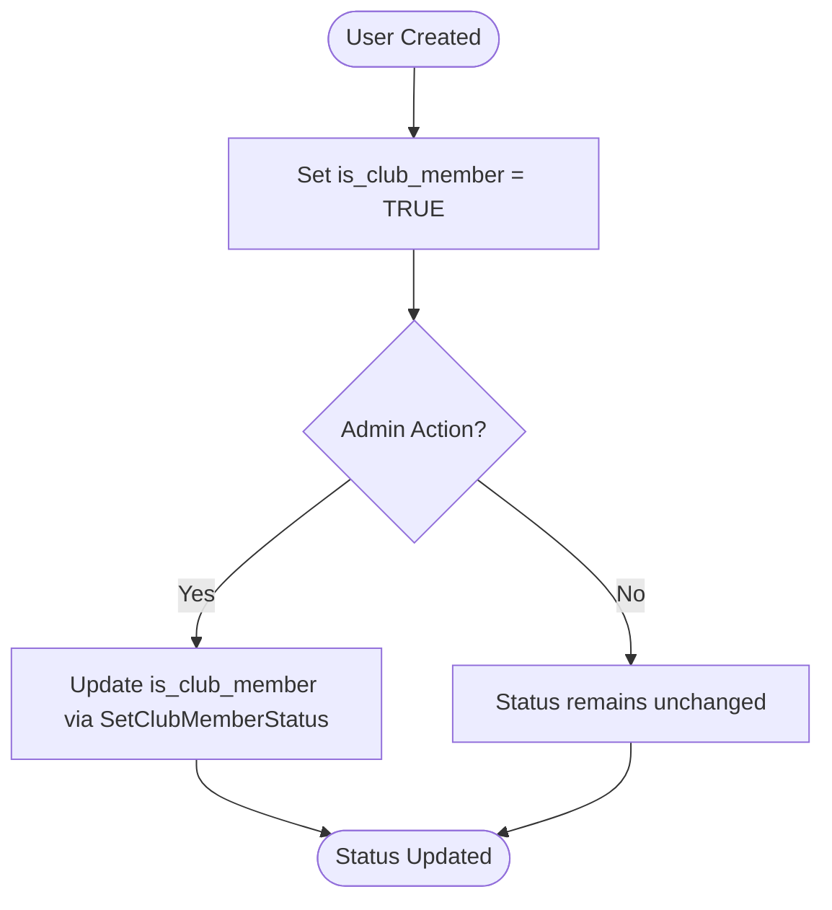

# User Management Schema

<cite>
**Referenced Files in This Document**   
- [20250519_add_users_and_profiles_tables.go](file://internal/database/migrations/implementations/20250519_add_users_and_profiles_tables.go)
- [20250609_add_is_club_member_to_users.go](file://internal/database/migrations/implementations/20250609_add_is_club_member_to_users.go)
- [user_repository.go](file://internal/database/repositories/user_repository.go)
- [db_constants.go](file://internal/constants/db_constants.go)
</cite>

## Table of Contents
1. [Introduction](#introduction)
2. [User Table Structure](#user-table-structure)
3. [Field Definitions and Constraints](#field-definitions-and-constraints)
4. [Business Logic for Club Membership](#business-logic-for-club-membership)
5. [Data Lifecycle and User Creation](#data-lifecycle-and-user-creation)
6. [Data Access Patterns](#data-access-patterns)
7. [Search and Indexing Strategy](#search-and-indexing-strategy)
8. [Sample Data Scenarios](#sample-data-scenarios)
9. [Conclusion](#conclusion)

## Introduction
The User entity in the evocoders-bot-go application serves as the foundational model for tracking community members within a Telegram-based ecosystem. This documentation provides a comprehensive overview of the user table schema, including structural design, business logic for membership status, data access patterns, and lifecycle management. The schema supports core functionalities such as profile management, community engagement tracking, and access control based on membership status.

**Section sources**
- [20250519_add_users_and_profiles_tables.go](file://internal/database/migrations/implementations/20250519_add_users_and_profiles_tables.go#L1-L119)
- [20250609_add_is_club_member_to_users.go](file://internal/database/migrations/implementations/20250609_add_is_club_member_to_users.go#L1-L30)

## User Table Structure
The `users` table is the central data store for member information, designed to capture both Telegram-specific identifiers and community engagement metadata. The table was initially created in migration `20250519_add_users_and_profiles_tables.go` and later extended to include club membership status in `20250609_add_is_club_member_to_users.go`.


**Diagram sources**
- [20250519_add_users_and_profiles_tables.go](file://internal/database/migrations/implementations/20250519_add_users_and_profiles_tables.go#L30-L52)
- [20250609_add_is_club_member_to_users.go](file://internal/database/migrations/implementations/20250609_add_is_club_member_to_users.go#L15-L20)

## Field Definitions and Constraints
The user table enforces strict data integrity through primary key constraints, unique indexes, and default values. Each field serves a specific purpose in the community management system.

| Field Name | Data Type | Nullability | Default Value | Description |
|------------|-----------|-------------|---------------|-------------|
| id | SERIAL | NOT NULL | AUTO_INCREMENT | Primary key, auto-incrementing integer |
| tg_id | BIGINT | NOT NULL | - | Unique Telegram user identifier |
| firstname | TEXT | NOT NULL | - | User's first name from Telegram |
| lastname | TEXT | NULL | - | User's last name from Telegram |
| tg_username | TEXT | NULL | - | Telegram username handle |
| score | INTEGER | NOT NULL | 0 | Engagement score for community activity |
| has_coffee_ban | BOOLEAN | NOT NULL | false | Flag indicating if user is banned from coffee events |
| is_club_member | BOOLEAN | NOT NULL | true | Flag indicating active club membership status |
| created_at | TIMESTAMP | NOT NULL | NOW() | Record creation timestamp |
| updated_at | TIMESTAMP | NOT NULL | NOW() | Last modification timestamp |

**Section sources**
- [20250519_add_users_and_profiles_tables.go](file://internal/database/migrations/implementations/20250519_add_users_and_profiles_tables.go#L30-L52)
- [20250609_add_is_club_member_to_users.go](file://internal/database/migrations/implementations/20250609_add_is_club_member_to_users.go#L15-L20)

## Business Logic for Club Membership
The `is_club_member` flag is a critical business attribute that determines a user's eligibility for community privileges and participation in exclusive events. By default, all users are considered club members upon creation, as specified in the `Create` method of `user_repository.go` where `is_club_member` is set to `true`.

This flag directly impacts access to features such as:
- Participation in random coffee pairings
- Access to private community events
- Visibility in member directories
- Eligibility for leadership roles

Administrative interfaces allow authorized users to modify this status through the `SetClubMemberStatus` method, which updates the flag and automatically refreshes the `updated_at` timestamp.



**Diagram sources**
- [user_repository.go](file://internal/database/repositories/user_repository.go#L280-L295)
- [20250609_add_is_club_member_to_users.go](file://internal/database/migrations/implementations/20250609_add_is_club_member_to_users.go#L15-L20)

**Section sources**
- [user_repository.go](file://internal/database/repositories/user_repository.go#L280-L295)
- [20250609_add_is_club_member_to_users.go](file://internal/database/migrations/implementations/20250609_add_is_club_member_to_users.go#L15-L20)

## Data Lifecycle and User Creation
User records are automatically created upon a user's first interaction with the bot through the `GetOrCreate` method in `user_repository.go`. This method implements an upsert pattern that either retrieves an existing user by `tg_id` or creates a new record with default values.

The creation process initializes:
- `score` to 0 (no initial engagement points)
- `has_coffee_ban` to false (no restrictions)
- `is_club_member` to true (full membership privileges)
- `created_at` and `updated_at` to current timestamp

Subsequent interactions trigger automatic profile synchronization, updating `firstname`, `lastname`, and `tg_username` if they have changed in the user's Telegram profile.


**Diagram sources**
- [user_repository.go](file://internal/database/repositories/user_repository.go#L300-L350)
- [20250519_add_users_and_profiles_tables.go](file://internal/database/migrations/implementations/20250519_add_users_and_profiles_tables.go#L30-L52)

**Section sources**
- [user_repository.go](file://internal/database/repositories/user_repository.go#L300-L350)

## Data Access Patterns
The `UserRepository` struct provides a comprehensive set of methods for user data access and manipulation. These methods abstract the underlying SQL operations and provide type-safe interfaces for business logic.

Key access patterns include:
- **Lookup by Telegram ID**: Primary method for user retrieval during bot interactions
- **Lookup by username**: Used for profile discovery and mentions
- **Name-based search**: Case-insensitive search by first and last name
- **Batch operations**: Score updates and status modifications

The repository implements proper error handling, returning `sql.ErrNoRows` when users are not found and wrapping database errors with contextual information.

```mermaid
classDiagram
class UserRepository {
+GetByID(id int) (*User, error)
+GetByTelegramID(tgID int64) (*User, error)
+GetByTelegramUsername(tgUsername string) (*User, error)
+Create(tgID int64, firstname, lastname, username string) (int, error)
+Update(id int, fields map[string]interface{}) error
+SetClubMemberStatus(id int, isMember bool) error
+GetOrCreate(tgUser *gotgbot.User) (*User, error)
+SearchByName(firstname, lastname string) (*User, error)
}
class User {
+ID int
+TgID int64
+Firstname string
+Lastname string
+TgUsername string
+Score int
+HasCoffeeBan bool
+IsClubMember bool
+CreatedAt time.Time
+UpdatedAt time.Time
}
UserRepository --> User : "returns"
```

**Diagram sources**
- [user_repository.go](file://internal/database/repositories/user_repository.go#L15-L350)
- [20250519_add_users_and_profiles_tables.go](file://internal/database/migrations/implementations/20250519_add_users_and_profiles_tables.go#L30-L52)

**Section sources**
- [user_repository.go](file://internal/database/repositories/user_repository.go#L15-L350)

## Search and Indexing Strategy
While the current schema does not explicitly define indexes on `firstname`, `lastname`, or `tg_username`, the `SearchByName` method implements case-insensitive matching using `LOWER()` function calls. This approach ensures consistent search results regardless of input case.

Performance considerations:
- The `tg_id` field has an implicit unique index due to the UNIQUE constraint
- The `id` field has an implicit index as the primary key
- Name-based searches may benefit from explicit indexes on `firstname` and `lastname` for large datasets
- Username lookups could be optimized with a dedicated index on `tg_username`

The search functionality is currently limited to exact matches on both first and last name, suggesting potential for enhancement with partial matching or fuzzy search capabilities.

**Section sources**
- [user_repository.go](file://internal/database/repositories/user_repository.go#L388-L422)

## Sample Data Scenarios
### New Member
```json
{
  "id": 1001,
  "tg_id": 123456789,
  "firstname": "John",
  "lastname": "Doe",
  "tg_username": "johndoe",
  "score": 0,
  "has_coffee_ban": false,
  "is_club_member": true,
  "created_at": "2025-06-15T10:30:00Z",
  "updated_at": "2025-06-15T10:30:00Z"
}
```

### Verified Club Member
```json
{
  "id": 1002,
  "tg_id": 987654321,
  "firstname": "Jane",
  "lastname": "Smith",
  "tg_username": "janesmith",
  "score": 45,
  "has_coffee_ban": false,
  "is_club_member": true,
  "created_at": "2025-04-20T14:15:00Z",
  "updated_at": "2025-09-01T09:20:00Z"
}
```

### Inactive User (Non-Member)
```json
{
  "id": 1003,
  "tg_id": 456789123,
  "firstname": "Bob",
  "lastname": "Johnson",
  "tg_username": "inactive_bob",
  "score": 12,
  "has_coffee_ban": true,
  "is_club_member": false,
  "created_at": "2025-05-10T16:45:00Z",
  "updated_at": "2025-08-20T11:30:00Z"
}
```

**Section sources**
- [user_repository.go](file://internal/database/repositories/user_repository.go#L126-L167)
- [20250519_add_users_and_profiles_tables.go](file://internal/database/migrations/implementations/20250519_add_users_and_profiles_tables.go#L30-L52)

## Conclusion
The User entity in the evocoders-bot-go application provides a robust foundation for community member management. The schema effectively balances simplicity with extensibility, supporting core features like membership tracking, engagement scoring, and profile management. The integration of the `is_club_member` flag enables fine-grained access control, while the automated user creation process ensures seamless onboarding. Future enhancements could include improved search capabilities through dedicated indexes and expanded status tracking for more granular membership tiers.