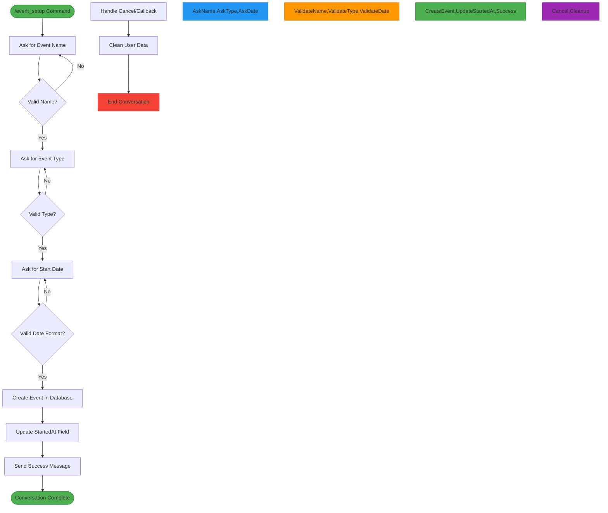
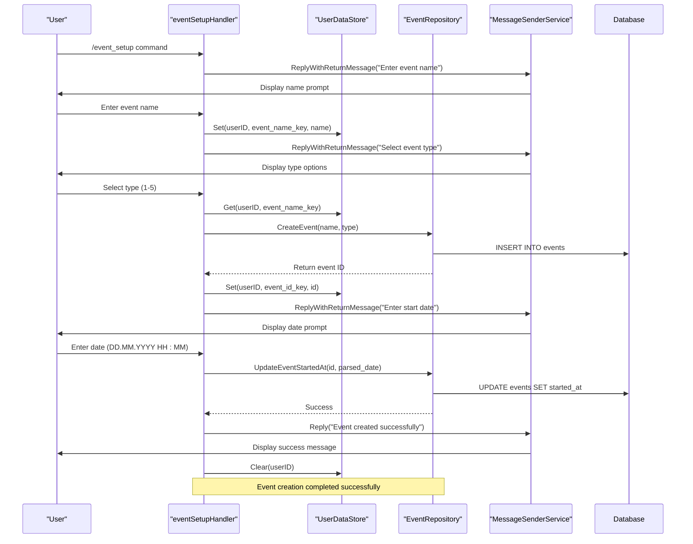
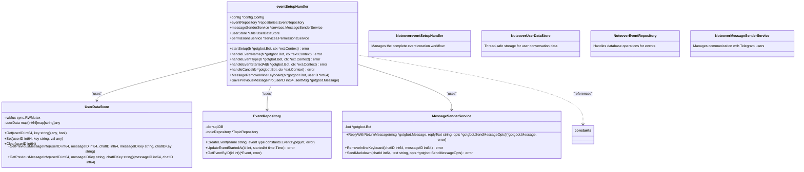
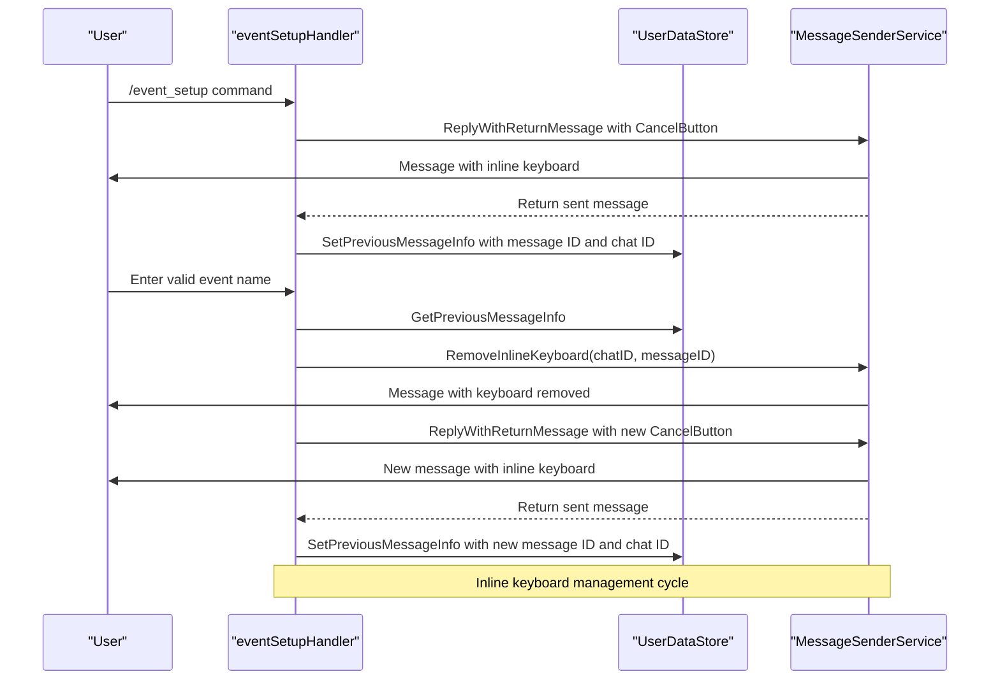
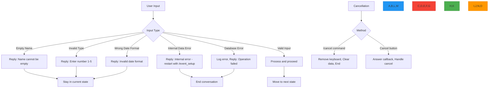

# Event Creation

<cite>
**Referenced Files in This Document**   
- [event_setup_handler.go](file://internal/handlers/adminhandlers/eventhandlers/event_setup_handler.go)
- [event_repository.go](file://internal/database/repositories/event_repository.go)
- [message_sender_service.go](file://internal/services/message_sender_service.go)
- [datastore_utils.go](file://internal/utils/datastore_utils.go)
- [db_constants.go](file://internal/constants/db_constants.go)
</cite>

## Table of Contents
1. [Introduction](#introduction)
2. [Event Creation Workflow](#event-creation-workflow)
3. [Core Components Interaction](#core-components-interaction)
4. [Conversation State Management](#conversation-state-management)
5. [Event Validation and Error Handling](#event-validation-and-error-handling)
6. [Inline Keyboard Management](#inline-keyboard-management)
7. [Common Issues and Solutions](#common-issues-and-solutions)
8. [Conclusion](#conclusion)

## Introduction
The Event Creation feature in evocoders-bot-go enables administrators to create new events through a structured conversation flow initiated by the `/event_setup` command. This document details the step-by-step process of event creation, focusing on the interaction between key components: `eventSetupHandler`, `EventRepository.CreateEvent`, and `MessageSenderService`. The system uses conversation states to collect event name, type, and start date from users, with validation at each step to ensure data integrity. The `UserDataStore` maintains conversation state across multiple user interactions, while inline keyboards provide cancellation options. This feature is designed to be user-friendly for beginners while offering robust technical implementation details for experienced developers.

## Event Creation Workflow

The event creation process follows a sequential conversation flow with three distinct states:

1. **Event Name Collection**: The user initiates the process with `/event_setup` command, triggering the bot to request an event name.
2. **Event Type Selection**: After receiving a valid name, the bot presents a numbered list of available event types for selection.
3. **Start Date Input**: Once the event type is confirmed, the user is prompted to enter the start date and time in a specific format.

The workflow is implemented as a state machine using the `handlers.NewConversation` pattern, where each state corresponds to a specific data collection phase. The conversation progresses only when valid input is received, otherwise it remains in the current state to allow correction.

**Diagram sources**
- [event_setup_handler.go](file://internal/handlers/adminhandlers/eventhandlers/event_setup_handler.go#L35-L357)

## Core Components Interaction

The event creation feature relies on the coordinated interaction between three core components: the `eventSetupHandler` that manages the conversation flow, the `EventRepository` that handles database operations, and the `MessageSenderService` that manages communication with users.

**Diagram sources**
- [event_setup_handler.go](file://internal/handlers/adminhandlers/eventhandlers/event_setup_handler.go#L35-L357)
- [event_repository.go](file://internal/database/repositories/event_repository.go#L37-L45)
- [message_sender_service.go](file://internal/services/message_sender_service.go#L148-L176)

**Section sources**
- [event_setup_handler.go](file://internal/handlers/adminhandlers/eventhandlers/event_setup_handler.go#L35-L357)
- [event_repository.go](file://internal/database/repositories/event_repository.go#L37-L45)
- [message_sender_service.go](file://internal/services/message_sender_service.go#L148-L176)

## Conversation State Management

The event creation process maintains conversation state using the `UserDataStore` component, which provides thread-safe storage for user-specific data throughout the multi-step interaction. This state management is crucial for preserving information across different conversation states.

The handler uses several context data keys to store and retrieve information:
- `eventSetupCtxDataKeyEventName`: Stores the event name provided by the user
- `eventSetupCtxDataKeyEventID`: Stores the database ID of the created event
- `eventSetupCtxDataKeyPreviousMessageID`: Stores the message ID for inline keyboard management
- `eventSetupCtxDataKeyPreviousChatID`: Stores the chat ID for inline keyboard management

Each conversation state is defined as a constant:
- `eventSetupStateAskEventName`: First state for collecting event name
- `eventSetupStateAskEventType`: Second state for selecting event type
- `eventSetupStateAskEventStartedAt`: Third state for entering start date

The state transitions are managed by returning `handlers.NextConversationState()` with the appropriate state constant, ensuring the conversation progresses only when valid input is received.

**Diagram sources**
- [event_setup_handler.go](file://internal/handlers/adminhandlers/eventhandlers/event_setup_handler.go#L35-L357)
- [datastore_utils.go](file://internal/utils/datastore_utils.go#L0-L71)
- [event_repository.go](file://internal/database/repositories/event_repository.go#L23-L26)

**Section sources**
- [event_setup_handler.go](file://internal/handlers/adminhandlers/eventhandlers/event_setup_handler.go#L35-L357)
- [datastore_utils.go](file://internal/utils/datastore_utils.go#L0-L71)

## Event Validation and Error Handling

The event creation process includes comprehensive validation at each step to ensure data integrity and provide meaningful feedback to users. The system handles both user input validation and internal error conditions with appropriate responses.

For event name validation, the system checks for empty input and provides a clear error message if the name is blank. The validation occurs in the `handleEventName` method, which verifies that the trimmed message text is not empty before proceeding to the next state.

Event type validation is implemented through a dual approach: users can either enter a number corresponding to the event type or input the type directly. The system validates that the selected index is within the valid range (1 to 5) and maps it to the corresponding `EventType` from the `AllEventTypes` array. If a user enters a type directly, the system validates that it matches one of the predefined event types.

Date validation uses Go's `time.Parse` function with the format string "02.01.2006 15:04" to ensure the input matches the required DD.MM.YYYY HH:MM format. If parsing fails, the user is prompted to re-enter the date with a clear error message indicating the correct format.

Internal error handling is implemented throughout the process. When retrieving stored data from `UserDataStore`, the system checks both the existence of the key and the type assertion, providing specific error messages for different failure scenarios. Database operations are wrapped in error checks, with appropriate logging and user feedback in case of failures.

```mermaid
flowchart TD
subgraph EventNameValidation
A["Receive Event Name"] --> B{"Name Empty?"}
B --> |Yes| C["Reply: Name cannot be empty"]
B --> |No| D["Store name in UserDataStore"]
end
subgraph EventTypeValidation
E["Receive Type Input"] --> F{"Input is Number?"}
F --> |Yes| G{"Number in Range 1-5?"}
G --> |No| H["Reply: Enter number 1-5"]
G --> |Yes| I["Map to EventType"]
F --> |No| J["Treat as direct type input"]
J --> K{"Valid EventType?"}
K --> |No| L["Reply: Invalid event type"]
K --> |Yes| M["Use provided type"]
end
subgraph DateValidation
N["Receive Date String"] --> O["Parse with time.Parse"]
O --> P{"Parse Successful?"}
P --> |No| Q["Reply: Invalid date format"]
P --> |Yes| R["Store parsed time.Time"]
end
subgraph InternalErrorHandling
S["Retrieve from UserDataStore"] --> T{"Key Exists?"}
T --> |No| U["Reply: Internal error - data not found"]
T --> |Yes| V{"Type Assertion OK?"}
V --> |No| W["Reply: Internal error - invalid type"]
V --> |Yes| X["Proceed with operation"]
Y["Database Operation"] --> Z{"Operation Successful?"}
Z --> |No| AA["Log error, Reply: Operation failed"]
Z --> |Yes| AB["Continue workflow"]
end
style A,E,N,S,Y fill:#2196F3,stroke:#1976D2
style B,F,G,J,K,O,P,T,V,Z fill:#FF9800,stroke:#F57C00
style C,H,L,Q,U,W,AA fill:#F44336,stroke:#D32F2F
style D,I,M,R,X,AB fill:#4CAF50,stroke:#388E3C
```

**Diagram sources**
- [event_setup_handler.go](file://internal/handlers/adminhandlers/eventhandlers/event_setup_handler.go#L100-L138)
- [event_setup_handler.go](file://internal/handlers/adminhandlers/eventhandlers/event_setup_handler.go#L174-L211)
- [event_setup_handler.go](file://internal/handlers/adminhandlers/eventhandlers/event_setup_handler.go#L242-L275)
- [db_constants.go](file://internal/constants/db_constants.go#L0-L34)

**Section sources**
- [event_setup_handler.go](file://internal/handlers/adminhandlers/eventhandlers/event_setup_handler.go#L100-L138)
- [db_constants.go](file://internal/constants/db_constants.go#L0-L34)

## Inline Keyboard Management

The event creation process uses inline keyboards to provide users with a cancellation option throughout the conversation flow. The `buttons.CancelButton` function creates an inline keyboard with a cancel option that triggers the `eventSetupCallbackConfirmCancel` callback data.

The system manages inline keyboard state through the `MessageRemoveInlineKeyboard` method in the `eventSetupHandler`. This method retrieves the previous message information (message ID and chat ID) from the `UserDataStore` using the `GetPreviousMessageInfo` method and then calls the `RemoveInlineKeyboard` method on the `MessageSenderService` to remove the inline keyboard from the message.

The `SavePreviousMessageInfo` method is called after each message is sent to store the message ID and chat ID in the `UserDataStore` using the `SetPreviousMessageInfo` method. This ensures that the system can later reference the correct message when needing to remove the inline keyboard.

The inline keyboard is removed after successful validation of user input, providing visual feedback that the system has processed the input and is moving to the next step. This improves the user experience by cleaning up the interface and indicating progress through the workflow.

**Diagram sources**
- [event_setup_handler.go](file://internal/handlers/adminhandlers/eventhandlers/event_setup_handler.go#L35-L357)
- [message_sender_service.go](file://internal/services/message_sender_service.go#L411-L450)
- [datastore_utils.go](file://internal/utils/datastore_utils.go#L60-L71)

**Section sources**
- [event_setup_handler.go](file://internal/handlers/adminhandlers/eventhandlers/event_setup_handler.go#L35-L357)
- [message_sender_service.go](file://internal/services/message_sender_service.go#L411-L450)

## Common Issues and Solutions

Several common issues can occur during the event creation process, each with specific handling mechanisms in place:

**Empty Event Name**: When a user submits an empty event name, the system detects this in the `handleEventName` method and responds with a clear error message: "Название не может быть пустым. Пожалуйста, введи название для мероприятия или используй кнопку для отмены." The conversation remains in the same state, allowing the user to correct their input.

**Invalid Event Type Selection**: If a user enters a number outside the valid range (1-5) or an invalid type name, the system responds with: "Неверный выбор. Пожалуйста, введи число от 1 до 5, или используй кнопку для отмены." The validation occurs in the `handleEventType` method, which checks both the integer conversion and range validity before proceeding.

**Incorrect Date Format**: When a user enters a date in an incorrect format, the `time.Parse` function returns an error, triggering the system to respond with: "Неверный формат даты. Пожалуйста, введи дату и время в формате DD.MM.YYYY HH:MM или используй кнопку для отмены." The expected format is clearly specified in the error message to guide the user.

**Internal Data Retrieval Errors**: If the system cannot find expected data in the `UserDataStore`, it responds with internal error messages that include instructions to restart the process with "/event_setup". These errors include cases where the event name or ID cannot be found or when type assertions fail.

**Database Operation Failures**: When database operations fail (event creation or update), the system logs the error for debugging purposes and responds with a generic error message: "Произошла ошибка при создании записи о мероприятии." This provides user feedback while protecting system details.

The system also handles cancellation through both the `/cancel` command and the inline cancel button, ensuring users can exit the workflow at any point. When cancelled, the system removes the inline keyboard from the previous message and clears all stored user data to prevent state conflicts in future interactions.

**Diagram sources**
- [event_setup_handler.go](file://internal/handlers/adminhandlers/eventhandlers/event_setup_handler.go#L100-L138)
- [event_setup_handler.go](file://internal/handlers/adminhandlers/eventhandlers/event_setup_handler.go#L174-L211)
- [event_setup_handler.go](file://internal/handlers/adminhandlers/eventhandlers/event_setup_handler.go#L242-L275)

**Section sources**
- [event_setup_handler.go](file://internal/handlers/adminhandlers/eventhandlers/event_setup_handler.go#L100-L138)

## Conclusion
The Event Creation feature in evocoders-bot-go provides a robust, user-friendly interface for administrators to create new events through a structured conversation flow. By leveraging conversation states, the system guides users through a three-step process to collect event name, type, and start date with appropriate validation at each stage. The interaction between `eventSetupHandler`, `EventRepository`, and `MessageSenderService` components ensures reliable data handling and user communication. The `UserDataStore` maintains conversation state across interactions, while inline keyboard management enhances the user experience. Comprehensive error handling addresses common issues such as empty names, invalid types, and incorrect date formats, providing clear feedback to users. This implementation balances ease of use for beginners with technical robustness for developers, making it an effective solution for event management within the Telegram bot ecosystem.