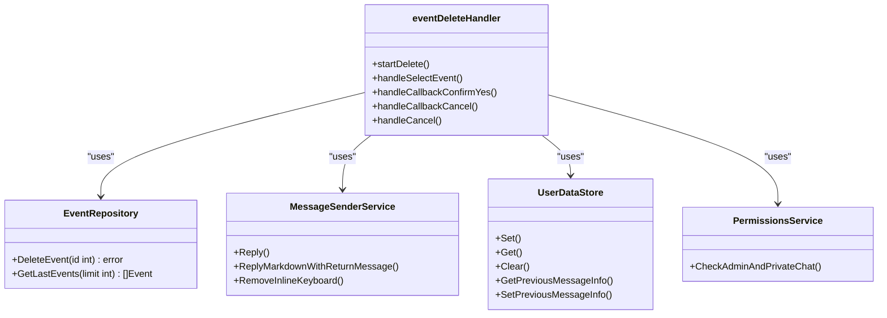
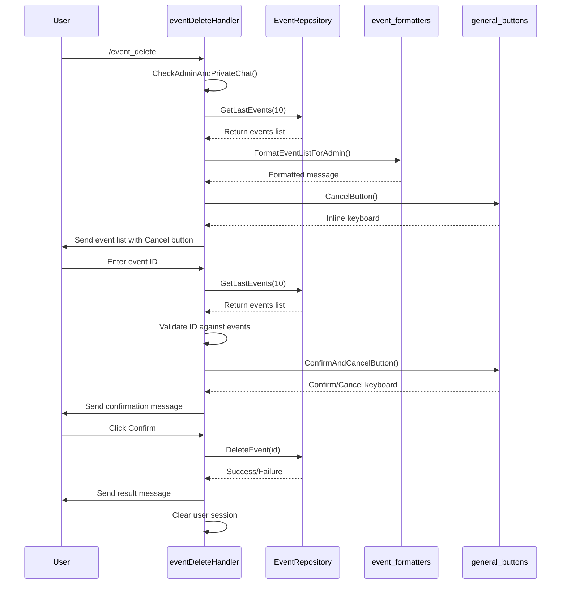

# Administrative Controls

<cite>
**Referenced Files in This Document**   
- [event_delete_handler.go](file://internal/handlers/adminhandlers/eventhandlers/event_delete_handler.go)
- [event_repository.go](file://internal/database/repositories/event_repository.go)
- [general_buttons.go](file://internal/buttons/general_buttons.go)
- [event_formatters.go](file://internal/formatters/event_formatters.go)
- [handlers_admin_constants.go](file://internal/constants/handlers_admin_constants.go)
</cite>

## Table of Contents
1. [Introduction](#introduction)
2. [Event Deletion Workflow](#event-deletion-workflow)
3. [Core Components and Interactions](#core-components-and-interactions)
4. [User Interaction Flow](#user-interaction-flow)
5. [Database Operations and Cascade Effects](#database-operations-and-cascade-effects)
6. [Error Handling and Edge Cases](#error-handling-and-edge-cases)
7. [Session and State Management](#session-and-state-management)
8. [Conclusion](#conclusion)

## Introduction
The Event Administrative Controls feature in evocoders-bot-go enables authorized users to manage events through a structured conversation flow. The `/event_delete` command provides a safe mechanism for removing events, incorporating user confirmation and cascading cleanup of related data. This document details the implementation of the event deletion process, focusing on the interaction between the handler, repository, and UI components. The system ensures data integrity by validating permissions, confirming user intent, and maintaining clean state transitions throughout the operation.

## Event Deletion Workflow
The event deletion process follows a multi-step conversation pattern designed to prevent accidental data loss. When an administrator invokes the `/event_delete` command, the bot initiates a stateful conversation that guides the user through event selection and confirmation. The workflow consists of three primary states: initiation, event selection, and confirmation. During initiation, the system validates admin permissions and retrieves the most recent events. In the selection phase, users input an event ID from the displayed list. Finally, a confirmation step requires explicit approval via inline buttons before permanent deletion occurs. This structured approach balances usability with safety, ensuring administrators can efficiently manage events while minimizing the risk of unintended deletions.

```mermaid
flowchart TD
A[/event_delete command] --> B{Admin Permissions?}
B --> |No| C[End Conversation]
B --> |Yes| D[Fetch Last Events]
D --> E{Events Exist?}
E --> |No| F[Notify No Events]
E --> |Yes| G[Display Event List]
G --> H[Wait for Event ID]
H --> I{Valid ID?}
I --> |No| J[Request Valid Input]
I --> |Yes| K[Show Confirmation]
K --> L{User Confirms?}
L --> |Cancel| M[End Operation]
L --> |Yes| N[Delete Event & Topics]
N --> O[Send Success Message]
O --> P[Clean Session]
P --> Q[End Conversation]
```

**Diagram sources**
- [event_delete_handler.go](file://internal/handlers/adminhandlers/eventhandlers/event_delete_handler.go#L60-L120)

**Section sources**
- [event_delete_handler.go](file://internal/handlers/adminhandlers/eventhandlers/event_delete_handler.go#L60-L120)

## Core Components and Interactions
The event deletion functionality relies on several interconnected components working in concert. The `eventDeleteHandler` coordinates the conversation flow, while the `EventRepository` manages database operations. These components interact through well-defined interfaces, maintaining separation of concerns. The handler uses the repository to retrieve and delete events, while leveraging the `MessageSenderService` for user communication. The `UserDataStore` maintains conversation state across messages, and the `PermissionsService` enforces access control. This modular design allows each component to focus on its specific responsibility, creating a maintainable and testable system architecture.



**Diagram sources**
- [event_delete_handler.go](file://internal/handlers/adminhandlers/eventhandlers/event_delete_handler.go#L39-L59)
- [event_repository.go](file://internal/database/repositories/event_repository.go#L12-L18)

**Section sources**
- [event_delete_handler.go](file://internal/handlers/adminhandlers/eventhandlers/event_delete_handler.go#L39-L59)
- [event_repository.go](file://internal/database/repositories/event_repository.go#L12-L18)

## User Interaction Flow
The user interaction begins when an administrator sends the `/event_delete` command. The system first verifies admin privileges and ensures the command is executed in a private chat. Upon successful validation, the bot retrieves the most recent events using `GetLastEvents` with a limit defined by `EventEditGetLastLimit`. These events are formatted using `FormatEventListForAdmin` and presented to the user with their IDs, names, types, and statuses. The message includes a "Cancel" button powered by `CancelButton` for aborting the operation. Users respond by entering an event ID, which the system validates against the retrieved list. After selection, a confirmation message appears with "Confirm" and "Cancel" buttons created by `ConfirmAndCancelButton`, requiring explicit user approval before proceeding to deletion.



**Diagram sources**
- [event_delete_handler.go](file://internal/handlers/adminhandlers/eventhandlers/event_delete_handler.go#L97-L153)
- [event_formatters.go](file://internal/formatters/event_formatters.go#L154-L184)
- [general_buttons.go](file://internal/buttons/general_buttons.go#L22-L40)

**Section sources**
- [event_delete_handler.go](file://internal/handlers/adminhandlers/eventhandlers/event_delete_handler.go#L97-L153)
- [event_formatters.go](file://internal/formatters/event_formatters.go#L154-L184)
- [general_buttons.go](file://internal/buttons/general_buttons.go#L22-L40)

## Database Operations and Cascade Effects
The event deletion process implements a cascading cleanup mechanism to maintain database integrity. When `DeleteEvent` is called, it first retrieves all topics associated with the target event using `GetTopicsByEventID`. The system then iterates through these topics, deleting each one individually via `DeleteTopic`. This two-phase approach ensures referential integrity by removing child records before the parent event. After all related topics are deleted, the event itself is removed from the `events` table. The operation includes row count validation to detect cases where no matching records exist, providing meaningful error feedback. This cascade pattern prevents orphaned records and maintains the logical consistency of the data model.

```mermaid
flowchart TD
A[DeleteEvent(id)] --> B[GetTopicsByEventID(id)]
B --> C{Topics Found?}
C --> |No| D[Delete Event]
C --> |Yes| E[For Each Topic]
E --> F[DeleteTopic(topic.ID)]
F --> G{More Topics?}
G --> |Yes| E
G --> |No| D
D --> H[Execute DELETE FROM events]
H --> I{Rows Affected > 0?}
I --> |No| J[Return 'Not Found' Error]
I --> |Yes| K[Return Success]
```

**Diagram sources**
- [event_repository.go](file://internal/database/repositories/event_repository.go#L189-L229)

**Section sources**
- [event_repository.go](file://internal/database/repositories/event_repository.go#L189-L229)

## Error Handling and Edge Cases
The system implements comprehensive error handling to address various failure scenarios. When database operations fail, the system logs detailed error messages while presenting user-friendly notifications. The handler detects and handles several edge cases: non-existent events, invalid ID formats, and permission violations. For example, if a user enters an ID not present in the recent events list, the system responds with a specific error message rather than proceeding to confirmation. Similarly, if `DeleteEvent` returns a "no rows affected" result, the system recognizes this as an attempt to delete a non-existent event. The confirmation phase also handles unexpected text input by reminding users to use the provided buttons, preventing confusion during the critical deletion step.

**Section sources**
- [event_delete_handler.go](file://internal/handlers/adminhandlers/eventhandlers/event_delete_handler.go#L122-L153)
- [event_delete_handler.go](file://internal/handlers/adminhandlers/eventhandlers/event_delete_handler.go#L221-L259)
- [event_repository.go](file://internal/database/repositories/event_repository.go#L212-L229)

## Session and State Management
The event deletion process maintains state across multiple user interactions using the `UserDataStore`. When the conversation begins, the system stores the message ID and chat ID of the sent event list, enabling later cleanup of inline keyboards. During event selection, the handler saves the chosen event's ID and name in the user's session data using context keys like `eventDeleteCtxDataKeySelectedEventID`. This information persists through the confirmation step, allowing the final deletion phase to access the target event details. The system also manages conversation states, transitioning from `eventDeleteStateSelectEvent` to `eventDeleteStateConfirm` as the user progresses. Upon completion or cancellation, the handler clears all stored data with `Clear`, preventing state leakage between operations.

**Section sources**
- [event_delete_handler.go](file://internal/handlers/adminhandlers/eventhandlers/event_delete_handler.go#L184-L219)
- [event_delete_handler.go](file://internal/handlers/adminhandlers/eventhandlers/event_delete_handler.go#L261-L308)

## Conclusion
The Event Administrative Controls feature demonstrates a robust approach to managing sensitive operations in a chatbot environment. By combining stateful conversations, visual confirmation, and cascading data cleanup, the system provides administrators with powerful event management capabilities while safeguarding against accidental data loss. The modular architecture separates concerns effectively, with clear responsibilities for handling user interaction, managing state, and performing database operations. This design not only ensures reliability and data integrity but also creates a foundation for extending administrative functionality with similar patterns for other operations.