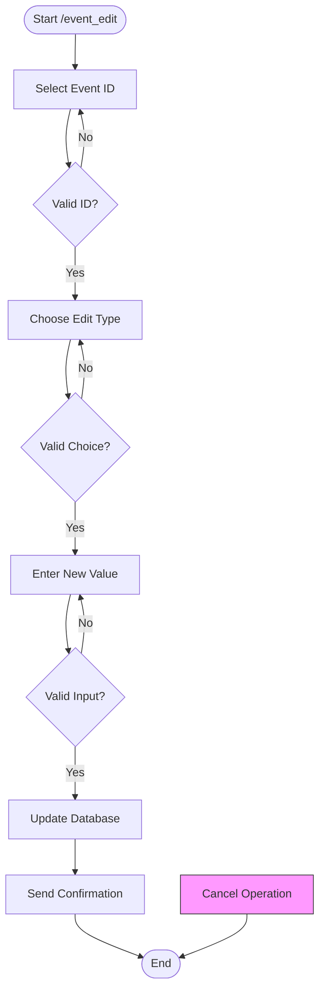
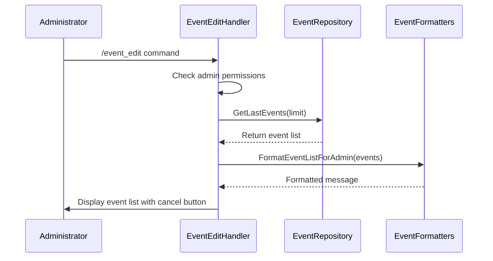
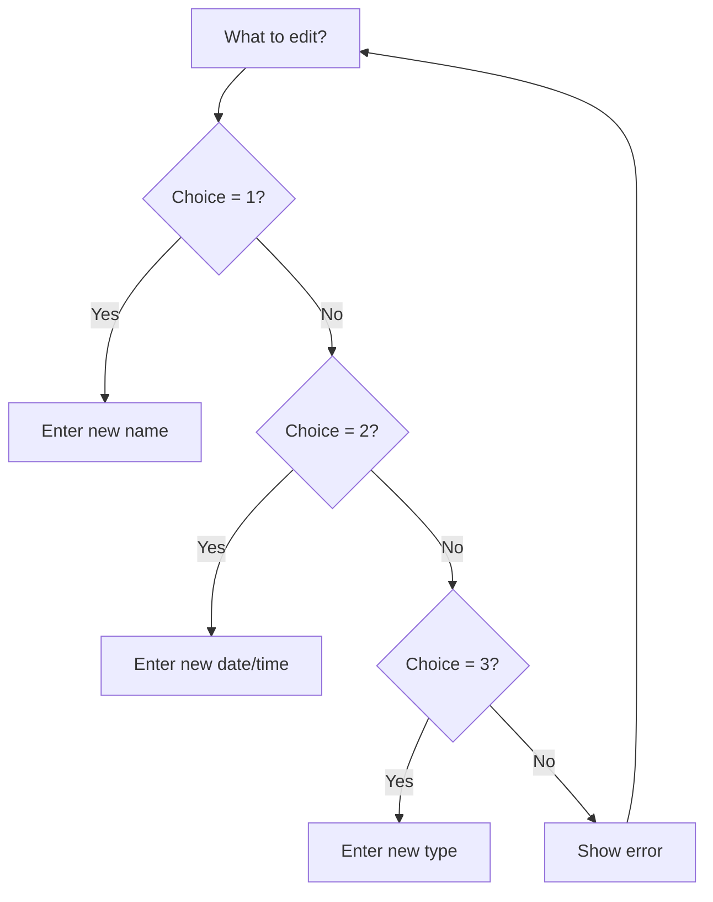
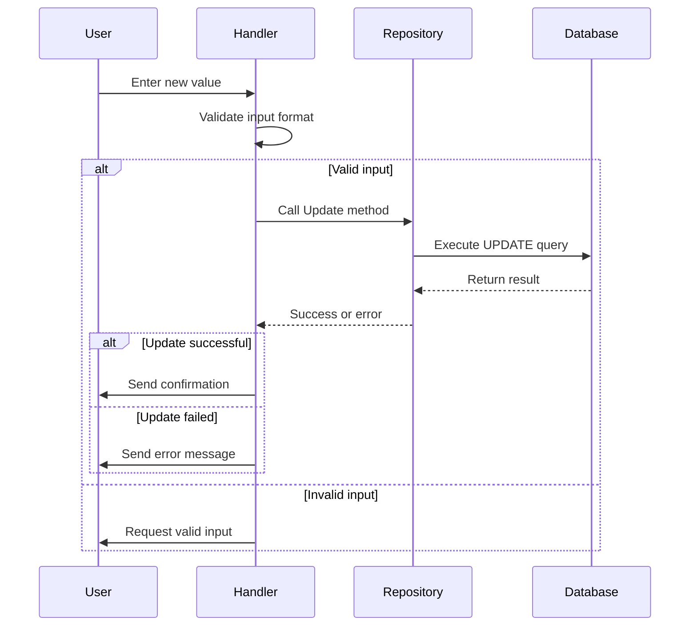

# Event Editing

<cite>
**Referenced Files in This Document**   
- [event_edit_handler.go](file://internal/handlers/adminhandlers/eventhandlers/event_edit_handler.go)
- [event_repository.go](file://internal/database/repositories/event_repository.go)
- [event_formatters.go](file://internal/formatters/event_formatters.go)
- [db_constants.go](file://internal/constants/db_constants.go)
</cite>

## Table of Contents
1. [Introduction](#introduction)
2. [Event Editing Workflow](#event-editing-workflow)
3. [Event Selection Process](#event-selection-process)
4. [Edit Type Selection](#edit-type-selection)
5. [Property Modification](#property-modification)
6. [Validation and Error Handling](#validation-and-error-handling)
7. [Common Issues and Solutions](#common-issues-and-solutions)
8. [Conclusion](#conclusion)

## Introduction
The Event Editing feature in evocoders-bot-go enables administrators to modify existing event properties through the `/event_edit` command. This comprehensive system allows modification of event name, start date, and type through a structured conversation flow. The process begins with event selection from a list of recent events, followed by choosing the property to edit, and finally providing the new value. The system incorporates robust validation, error handling, and user-friendly formatting to ensure a smooth editing experience for both beginners and experienced developers.

**Section sources**
- [event_edit_handler.go](file://internal/handlers/adminhandlers/eventhandlers/event_edit_handler.go#L0-L539)

## Event Editing Workflow
The event editing process follows a state-based conversation pattern with five distinct states that guide the user through the editing workflow:

**Diagram sources**
- [event_edit_handler.go](file://internal/handlers/adminhandlers/eventhandlers/event_edit_handler.go#L69-L103)

The conversation states are defined as:
- `event_edit_state_select_event`: User selects which event to edit by ID
- `event_edit_state_ask_edit_type`: User chooses which property to modify
- `event_edit_state_edit_name`: User provides new name for the event
- `event_edit_state_edit_started_at`: User inputs new start date and time
- `event_edit_state_edit_type`: User specifies new event type

Users can cancel the operation at any point using the cancel button or `/cancel` command, which terminates the conversation and cleans up stored user data.

**Section sources**
- [event_edit_handler.go](file://internal/handlers/adminhandlers/eventhandlers/event_edit_handler.go#L12-L38)

## Event Selection Process
The editing process begins when an administrator invokes the `/event_edit` command. The system first verifies admin permissions and private chat context before proceeding. It then retrieves the most recent events from the database using the `GetLastEvents` method with a limit defined by `EventEditGetLastLimit`.

The events are formatted for display using the `FormatEventListForAdmin` function, which creates a user-friendly list with the following features:
- Each event is displayed with its type emoji, ID, name, and start date
- Status is indicated with appropriate emoji (✅ for finished, 🔄 for actual)
- Dates are formatted in DD.MM.YYYY at HH:MM UTC format
- Events without start dates are marked as "не указано" (not specified)

**Diagram sources**
- [event_edit_handler.go](file://internal/handlers/adminhandlers/eventhandlers/event_edit_handler.go#L105-L157)
- [event_formatters.go](file://internal/formatters/event_formatters.go#L122-L144)

When the user responds with an event ID, the system validates it by checking if the ID is numeric and whether an event with that ID exists in the database via the `GetEventByID` method. If the ID is invalid or the event doesn't exist, the user receives an error message and remains in the selection state to try again.

**Section sources**
- [event_edit_handler.go](file://internal/handlers/adminhandlers/eventhandlers/event_edit_handler.go#L159-L226)

## Edit Type Selection
After successful event selection, the user is prompted to choose which property to edit by entering a number corresponding to the desired edit type:
1. Name
2. Date of start
3. Type

The system retrieves the current event details using `GetEventByID` to display the current values for context. For each edit type, a specific message is constructed to guide the user:

**Diagram sources**
- [event_edit_handler.go](file://internal/handlers/adminhandlers/eventhandlers/event_edit_handler.go#L228-L269)

When editing the event type, the system provides a list of available types with their corresponding emojis and numbers. The available types are retrieved from the `AllEventTypes` constant array and displayed in the format "/[number]. [emoji] [type_name]". This helps users understand the valid options and select appropriately.

**Section sources**
- [event_edit_handler.go](file://internal/handlers/adminhandlers/eventhandlers/event_edit_handler.go#L255-L267)
- [db_constants.go](file://internal/constants/db_constants.go#L0-L34)

## Property Modification
Once the edit type is selected, the system transitions to the appropriate state to collect the new value and update the database using the corresponding repository method.

### Name Modification
When editing the event name, the system prompts the user to enter a new name. After receiving input, it validates that the name is not empty before calling `UpdateEventName` with the event ID and new name. The method executes an SQL UPDATE statement to modify the name field and sets the updated_at timestamp to the current time.

### Start Date Modification
For start date editing, the user must provide a date and time in the format "DD.MM.YYYY HH:MM" (UTC). The system uses Go's `time.Parse` function with the layout "02.01.2006 15:04" to parse the input. Upon successful parsing, it calls `UpdateEventStartedAt` with the event ID and parsed time value, which updates the started_at field in the database.

### Type Modification
When changing the event type, the system accepts either a number corresponding to the type's position in the list or the type name directly. If a number is provided, it indexes into the `AllEventTypes` array. If a name is provided, it validates against the array of valid types before calling `UpdateEventType` with the event ID and validated type.

**Diagram sources**
- [event_edit_handler.go](file://internal/handlers/adminhandlers/eventhandlers/event_edit_handler.go#L271-L502)
- [event_repository.go](file://internal/database/repositories/event_repository.go#L120-L190)

**Section sources**
- [event_edit_handler.go](file://internal/handlers/adminhandlers/eventhandlers/event_edit_handler.go#L271-L502)
- [event_repository.go](file://internal/database/repositories/event_repository.go#L120-L190)

## Validation and Error Handling
The event editing system incorporates comprehensive validation at multiple levels to ensure data integrity and provide helpful feedback to users.

### Input Validation
Each edit type has specific validation rules:
- **Name**: Must not be empty (checked with `strings.TrimSpace`)
- **Start Date**: Must match format "DD.MM.YYYY HH:MM" (validated with `time.Parse`)
- **Type**: Must be either a valid number (1-5) or one of the predefined type strings

The system uses Go's standard library functions for parsing and validation, returning descriptive error messages when inputs fail validation. For example, invalid date formats trigger a message explaining the correct format (DD.MM.YYYY HH:MM UTC).

### Database Validation
The repository methods include additional validation at the database level:
- Each UPDATE operation checks `RowsAffected()` to verify that a row was actually modified
- If no rows are affected, it indicates the event ID doesn't exist, triggering an appropriate error
- Database errors are wrapped with context using `fmt.Errorf` to aid debugging

### Error Recovery
The system is designed to handle errors gracefully:
- Most validation errors keep the user in the current state, allowing correction without restarting
- Critical errors (like database connectivity issues) terminate the conversation with an error message
- All errors are logged using Go's `log.Printf` for monitoring and debugging
- User data is properly cleaned up when conversations end, whether successfully or due to errors

**Section sources**
- [event_edit_handler.go](file://internal/handlers/adminhandlers/eventhandlers/event_edit_handler.go#L336-L366)
- [event_repository.go](file://internal/database/repositories/event_repository.go#L120-L190)

## Common Issues and Solutions
Several common issues may arise during event editing, each with specific solutions implemented in the system.

### Non-existent Event ID
**Issue**: User enters an ID that doesn't correspond to any existing event
**Solution**: The system calls `GetEventByID` to verify the ID exists. If not, it returns an error message prompting the user to enter an existing ID, while remaining in the selection state to allow correction.

### Invalid Date Format
**Issue**: User enters a date in incorrect format
**Solution**: The system uses `time.Parse` to validate the format. On failure, it displays a message showing the correct format (DD.MM.YYYY HH:MM UTC) and requests valid input, keeping the user in the date entry state.

### Invalid Event Type
**Issue**: User enters a type that doesn't match any valid options
**Solution**: The system validates against the `AllEventTypes` array. On invalid input, it responds with a list of allowed types separated by commas, helping the user correct their input.

### Empty Input
**Issue**: User submits empty input for name or type
**Solution**: The system checks for empty strings (after trimming whitespace) and prompts the user to provide a non-empty value.

### Permission Issues
**Issue**: Non-admin user attempts to edit events
**Solution**: The system checks permissions at the start using `permissionsService.CheckAdminAndPrivateChat`. If the user lacks permissions, the conversation ends immediately with no further interaction.

These error handling mechanisms ensure that users receive clear guidance when mistakes occur, minimizing frustration and supporting successful completion of editing tasks.

**Section sources**
- [event_edit_handler.go](file://internal/handlers/adminhandlers/eventhandlers/event_edit_handler.go#L171-L187)
- [event_edit_handler.go](file://internal/handlers/adminhandlers/eventhandlers/event_edit_handler.go#L338-L343)
- [event_edit_handler.go](file://internal/handlers/adminhandlers/eventhandlers/event_edit_handler.go#L428-L461)

## Conclusion
The Event Editing feature in evocoders-bot-go provides a robust, user-friendly interface for administrators to modify event properties. Through a well-structured conversation flow, the system guides users through selecting an event, choosing a property to edit, and providing new values with appropriate validation. The implementation separates concerns effectively, with handler logic managing the conversation state, formatters handling presentation, and repository methods managing database operations. Comprehensive validation and error handling ensure data integrity while providing helpful feedback to users. This design makes the feature accessible to beginners through clear prompts and error messages, while offering sufficient technical depth for developers to understand and extend the system as needed.