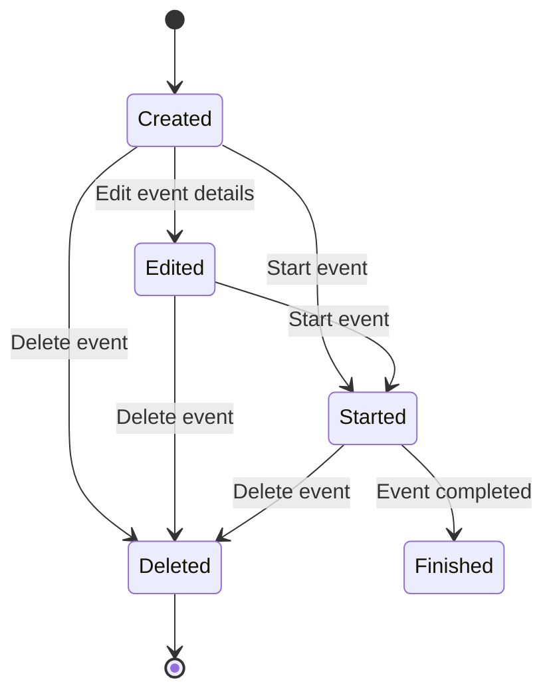
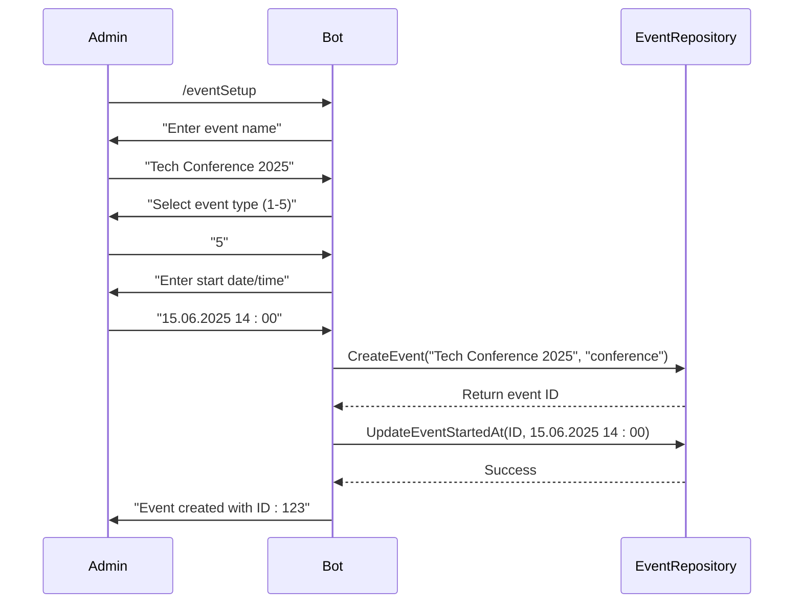
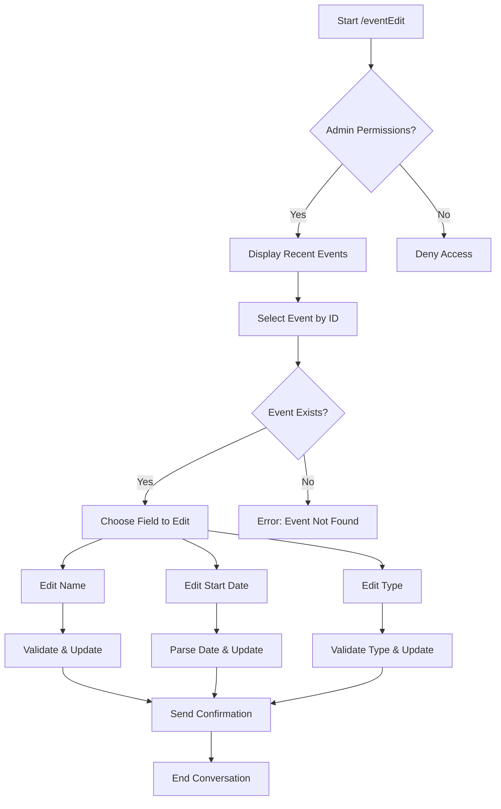
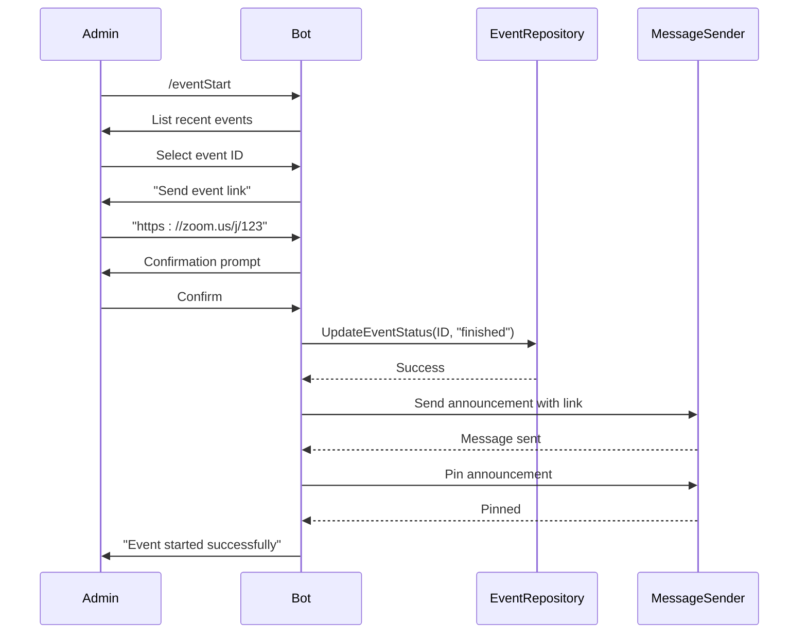
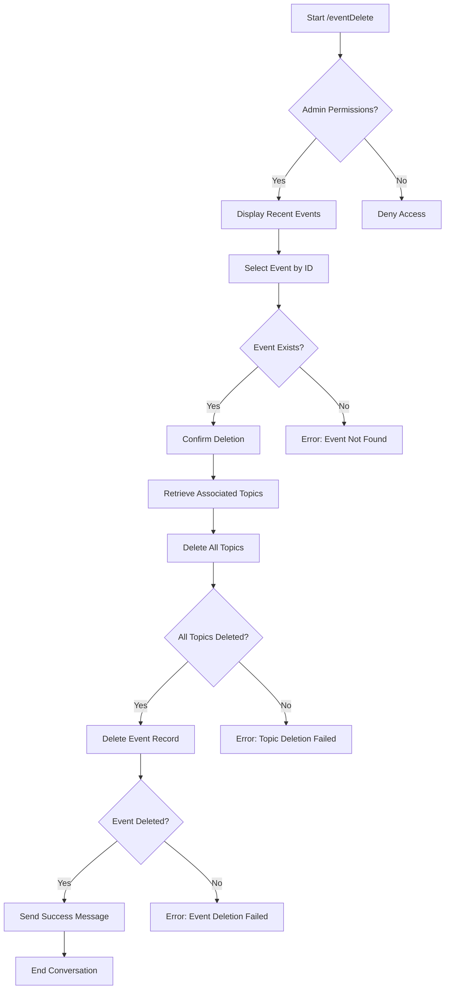
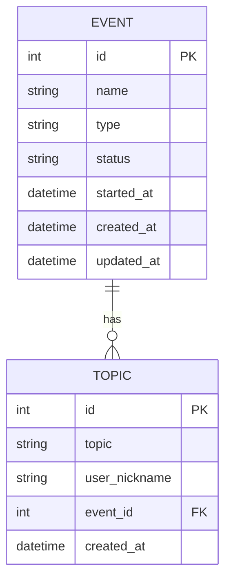
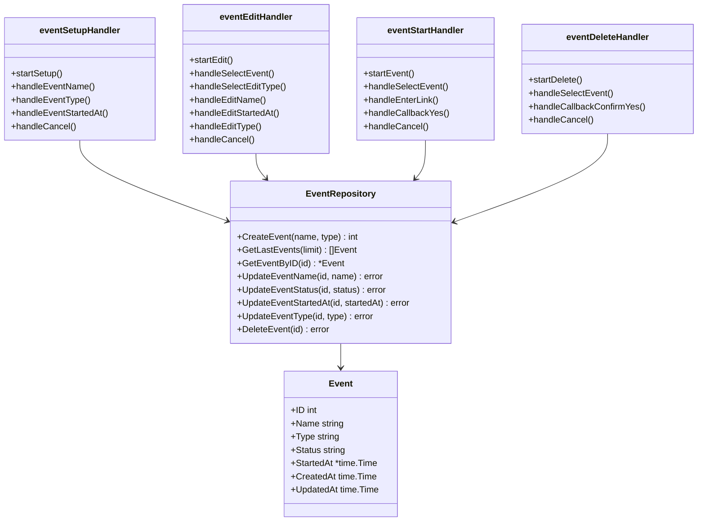

# Event Management

<cite>
**Referenced Files in This Document**   
- [event_setup_handler.go](file://internal/handlers/adminhandlers/eventhandlers/event_setup_handler.go)
- [event_edit_handler.go](file://internal/handlers/adminhandlers/eventhandlers/event_edit_handler.go)
- [event_delete_handler.go](file://internal/handlers/adminhandlers/eventhandlers/event_delete_handler.go)
- [event_start_handler.go](file://internal/handlers/adminhandlers/eventhandlers/event_start_handler.go)
- [event_repository.go](file://internal/database/repositories/event_repository.go)
- [event_formatters.go](file://internal/formatters/event_formatters.go)
- [db_constants.go](file://internal/constants/db_constants.go)
- [handlers_admin_constants.go](file://internal/constants/handlers_admin_constants.go)
</cite>

## Table of Contents
1. [Introduction](#introduction)
2. [Event Lifecycle Overview](#event-lifecycle-overview)
3. [Event Creation Process](#event-creation-process)
4. [Event Editing Capabilities](#event-editing-capabilities)
5. [Event Status Management](#event-status-management)
6. [Event Deletion Procedure](#event-deletion-procedure)
7. [Topic Association System](#topic-association-system)
8. [Administrative Controls](#administrative-controls)
9. [Configuration Options](#configuration-options)
10. [Error Handling and Conflict Resolution](#error-handling-and-conflict-resolution)
11. [Conclusion](#conclusion)

## Introduction

The Event Management feature in evocoders-bot-go provides a comprehensive system for administrators to create, edit, track, and manage events within the community. This documentation details the complete event lifecycle from creation through editing to status tracking, including topic association and administrative controls. The system is designed to be accessible to beginners while providing sufficient technical depth for experienced developers.

The event management system follows a conversation-based pattern using the Telegram Bot API, where administrators interact with the bot through a series of commands and responses. Each operation follows a structured workflow that ensures data integrity and provides clear feedback to the user.

**Section sources**
- [event_setup_handler.go](file://internal/handlers/adminhandlers/eventhandlers/event_setup_handler.go#L1-L50)
- [event_repository.go](file://internal/database/repositories/event_repository.go#L1-L20)

## Event Lifecycle Overview

The event lifecycle in evocoders-bot-go consists of four main stages: creation, editing, status management, and deletion. Each event is represented by an Event struct that contains essential information such as ID, name, type, status, and start time. The lifecycle is managed through a series of handler functions that guide administrators through each operation.

Events begin with creation through the event setup process, where administrators provide the event name, type, and scheduled start time. Once created, events can be edited to modify their name, type, or start time. The status of an event can be changed from "actual" to "finished" when the event begins, which triggers announcements to the community. Finally, events can be deleted when they are no longer needed, which also removes all associated topics.

The system maintains referential integrity by ensuring that when an event is deleted, all related topics are also removed from the database. This prevents orphaned records and maintains data consistency across the application.

**Diagram sources**
- [event_repository.go](file://internal/database/repositories/event_repository.go#L15-L45)
- [db_constants.go](file://internal/constants/db_constants.go#L1-L35)

## Event Creation Process

The event creation process is initiated through the `/eventSetup` command, which starts a conversation that guides administrators through creating a new event. The process follows a sequential workflow with three main steps: providing the event name, selecting the event type, and specifying the start date and time.

When an administrator uses the `/eventSetup` command, the bot first verifies their administrative privileges and ensures they are in a private chat. The system then prompts for the event name, validates that it is not empty, and stores it temporarily. Next, the administrator selects from a list of available event types by entering a corresponding number. Finally, the start date and time must be provided in the format DD.MM.YYYY HH:MM.

The creation process is implemented in the eventSetupHandler, which uses conversation states to manage the workflow. Each step is validated before proceeding to the next, ensuring data integrity. Upon successful creation, the event is stored in the database with an "actual" status, and the administrator receives confirmation with the event ID.

**Diagram sources**
- [event_setup_handler.go](file://internal/handlers/adminhandlers/eventhandlers/event_setup_handler.go#L35-L358)
- [event_repository.go](file://internal/database/repositories/event_repository.go#L60-L78)

## Event Editing Capabilities

The event editing system allows administrators to modify existing events through the `/eventEdit` command. This feature supports updating the event name, start date/time, and event type. The editing process follows a conversation flow that first displays a list of recent events, allows selection of the target event, and then prompts for the specific field to be edited.

The eventEditHandler manages the editing workflow through multiple conversation states. When an administrator initiates the edit process, they are presented with a formatted list of the last 10 events (configurable via EventEditGetLastLimit constant). After selecting an event by ID, the administrator chooses which attribute to modify from the options: name, start date, or type.

For name editing, the system accepts any non-empty string and updates the event record. When editing the start date, the input must follow the DD.MM.YYYY HH:MM format and is parsed as UTC time. For type changes, administrators can either enter the type name directly or select from numbered options corresponding to the available event types.

The system validates all inputs and provides appropriate error messages for invalid entries, ensuring data consistency. After a successful update, the administrator receives confirmation with the modified event details.

**Diagram sources**
- [event_edit_handler.go](file://internal/handlers/adminhandlers/eventhandlers/event_edit_handler.go#L38-L539)
- [event_repository.go](file://internal/database/repositories/event_repository.go#L82-L154)

## Event Status Management

Event status management is handled through the `/eventStart` command, which transitions an event from "actual" to "finished" status when it begins. This process not only updates the event status in the database but also triggers announcements to the community by sending a message with the event link to the announcement topic.

The eventStartHandler orchestrates this process through a three-step conversation: selecting the event to start, entering the event link, and confirming the action. The system validates that the provided link starts with "http://" or "https://" to ensure it is a valid URL. Upon confirmation, the bot updates the event status and sends an announcement message with a button linking to the event.

The announcement includes the event name, type emoji, and a formatted message that varies based on the event type. For club calls, additional information about the format and rules is included. The announcement message is pinned in the announcement topic with notifications enabled, ensuring maximum visibility for community members.

This status management system serves as both a record-keeping mechanism and a communication tool, automatically notifying the community when events begin while maintaining an accurate record of event history.

**Diagram sources**
- [event_start_handler.go](file://internal/handlers/adminhandlers/eventhandlers/event_start_handler.go#L40-L418)
- [event_repository.go](file://internal/database/repositories/event_repository.go#L127-L154)

## Event Deletion Procedure

The event deletion process is initiated with the `/eventDelete` command and follows a careful procedure to maintain data integrity. When an administrator requests to delete an event, the system first displays a list of recent events, allowing selection by ID. Before proceeding, the system asks for confirmation to prevent accidental deletions.

The deletion process is implemented in the eventDeleteHandler and involves two critical steps: removing all associated topics and then deleting the event record itself. This order ensures referential integrity by preventing orphaned topic records. The EventRepository handles this cascade deletion automatically when DeleteEvent is called.

When an event is deleted, all topics linked to that event are first retrieved and individually removed from the database. Only after all related topics have been successfully deleted does the system remove the event record. This approach prevents database constraint violations and maintains consistency across related tables.

The system provides clear feedback at each stage, including confirmation of successful deletion and error messages if any part of the process fails. This comprehensive deletion procedure ensures that the database remains clean and consistent while protecting against accidental data loss.

**Diagram sources**
- [event_delete_handler.go](file://internal/handlers/adminhandlers/eventhandlers/event_delete_handler.go#L39-L315)
- [event_repository.go](file://internal/database/repositories/event_repository.go#L189-L229)

## Topic Association System

The topic association system links discussion topics to specific events, creating a structured way to organize community contributions. Each topic is associated with exactly one event through the event_id foreign key in the topics table. This one-to-many relationship allows multiple topics to be linked to a single event while ensuring each topic belongs to only one event.

When an event is created, it can have zero or more topics associated with it. Topics are typically added by community members using the `/topicAdd` command, which links their submission to the current or specified event. Administrators can view all topics for a specific event using the `/showTopics` command, which displays them in a formatted list.

The system maintains this association through the TopicRepository, which provides methods to retrieve topics by event ID and to create new topics with a specified event ID. When an event is deleted, all associated topics are automatically removed to maintain referential integrity, as implemented in the DeleteEvent method of the EventRepository.

This association system enables organized discussion around specific events while allowing flexible management of topics independent of the events themselves.

**Diagram sources**
- [event_repository.go](file://internal/database/repositories/event_repository.go#L189-L229)
- [topic_repository.go](file://internal/database/repositories/topic_repository.go#L30-L52)

## Administrative Controls

The administrative controls for event management are designed to ensure that only authorized users can perform sensitive operations. All event management commands require administrative privileges, which are verified by the PermissionsService before any operation proceeds.

The system uses a conversation-based approach for all administrative operations, guiding administrators through each step with clear instructions and validation. Each conversation state is carefully managed to prevent invalid transitions and ensure data integrity. The UserDataStore is used to temporarily store information between conversation steps, such as event names, IDs, and other parameters.

Error handling is comprehensive, with specific messages for different failure scenarios including invalid inputs, database errors, and permission violations. The system provides helpful guidance in error messages, suggesting correct formats or actions to resolve issues.

Administrative operations include creating events (`/eventSetup`), editing events (`/eventEdit`), starting events (`/eventStart`), and deleting events (`/eventDelete`). Each operation follows a consistent pattern of validation, confirmation, and feedback, creating a predictable and reliable administrative experience.

**Diagram sources**
- [event_setup_handler.go](file://internal/handlers/adminhandlers/eventhandlers/event_setup_handler.go#L35-L59)
- [event_edit_handler.go](file://internal/handlers/adminhandlers/eventhandlers/event_edit_handler.go#L38-L67)
- [event_start_handler.go](file://internal/handlers/adminhandlers/eventhandlers/event_start_handler.go#L40-L66)
- [event_delete_handler.go](file://internal/handlers/adminhandlers/eventhandlers/event_delete_handler.go#L39-L59)

## Configuration Options

The event management system includes several configuration options that can be customized to meet specific requirements. These options are defined as constants in the handlers_admin_constants.go file and can be modified to adjust system behavior.

Key configuration options include:
- **EventEditGetLastLimit**: Determines how many recent events are displayed when editing, starting, or deleting events (default: 10)
- **Event types**: Defined in db_constants.go as EventType constants, including club-call, meetup, workshop, reading-club, and conference
- **Event statuses**: Defined as EventStatus constants with values "finished" and "actual"

The system supports five distinct event types, each with its own emoji representation for visual identification:
- Club Call (💬)
- Meetup (🎙)
- Workshop (⚙️)
- Reading Club (📚)
- Conference (👥)

These configuration options are centralized in the constants package, making them easy to locate and modify. The use of constants ensures consistency across the application and prevents errors from using incorrect string values.

Additional configuration is available through the Config struct, which includes settings for the supergroup chat ID and announcement topic ID, allowing the system to be adapted to different Telegram group configurations.

**Section sources**
- [db_constants.go](file://internal/constants/db_constants.go#L1-L35)
- [handlers_admin_constants.go](file://internal/constants/handlers_admin_constants.go#L1-L59)

## Error Handling and Conflict Resolution

The event management system implements comprehensive error handling to address common issues and prevent data inconsistencies. When conflicts or errors occur, the system provides specific feedback to help administrators resolve the issue.

Common error scenarios and their solutions include:
- **Invalid event ID**: When an administrator enters an ID that doesn't exist, the system responds with "Event with ID X not found" and prompts for a valid ID
- **Invalid date format**: For incorrect date/time entries, the system specifies the required format (DD.MM.YYYY HH:MM) and requests re-entry
- **Empty event name**: The system validates that event names are not empty and prompts for a valid name
- **Invalid event type**: When an unrecognized event type is entered, the system lists all valid types and requests a correction
- **Database errors**: Technical issues with database operations are logged and reported as "An error occurred during event operation"

The system uses transactional principles where appropriate, particularly in the DeleteEvent operation, which first removes associated topics before deleting the event itself. This prevents orphaned records and maintains referential integrity.

For input validation, the system employs both format checking (for dates and URLs) and semantic validation (for event types and non-empty fields). Error messages are designed to be helpful, often including suggestions for correct input or references to commands that can be used to restart the process.

**Section sources**
- [event_setup_handler.go](file://internal/handlers/adminhandlers/eventhandlers/event_setup_handler.go#L35-L358)
- [event_edit_handler.go](file://internal/handlers/adminhandlers/eventhandlers/event_edit_handler.go#L38-L539)
- [event_repository.go](file://internal/database/repositories/event_repository.go#L60-L252)

## Conclusion

The Event Management feature in evocoders-bot-go provides a robust and user-friendly system for administrators to manage community events. The comprehensive lifecycle management—from creation and editing to status tracking and deletion—ensures that events are properly organized and communicated to the community.

Key strengths of the system include its conversation-based interface that guides administrators through complex operations, its careful attention to data integrity through proper validation and cascade deletion, and its integration with community communication through automated announcements.

The modular design separates concerns between handlers, repositories, and formatters, making the system maintainable and extensible. The use of constants for configuration options and the consistent pattern across different administrative operations create a predictable and reliable experience for administrators.

For future improvements, potential enhancements could include conflict detection for overlapping event times, recurring event support, and more sophisticated topic management features. However, the current implementation provides a solid foundation for effective event management within the community.