# Event Status Tracking

<cite>
**Referenced Files in This Document**   
- [event_start_handler.go](file://internal/handlers/adminhandlers/eventhandlers/event_start_handler.go)
- [event_formatters.go](file://internal/formatters/event_formatters.go)
- [message_sender_service.go](file://internal/services/message_sender_service.go)
- [event_repository.go](file://internal/database/repositories/event_repository.go)
</cite>

## Table of Contents
1. [Introduction](#introduction)
2. [Event Start Workflow](#event-start-workflow)
3. [Event Status Update Process](#event-status-update-process)
4. [Announcement Message Construction](#announcement-message-construction)
5. [Message Delivery and Pinning](#message-delivery-and-pinning)
6. [Error Handling and Validation](#error-handling-and-validation)
7. [Common Issues and Solutions](#common-issues-and-solutions)

## Introduction
The Event Status Tracking feature in evocoders-bot-go enables administrators to transition events to active status using the `/event_start` command. This process triggers a series of actions including event selection, link submission, status update, and announcement generation. The system is designed to streamline event management within a Telegram group environment, ensuring timely communication and proper event tracking. This documentation details the complete workflow from event initiation to announcement delivery, providing both conceptual understanding and technical implementation details.

## Event Start Workflow

The event start process follows a structured conversation flow that guides administrators through three distinct states: event selection, link entry, and confirmation. When an admin issues the `/event_start` command, the bot initiates a conversation by retrieving the list of recent events from the database using the `GetLastEvents` method from the `EventRepository`. The events are formatted using `FormatEventListForAdmin` from `event_formatters.go`, which presents each event with its type emoji, ID, name, status, and scheduled time.

After the administrator selects an event by entering its ID, the system transitions to the link entry state. The bot prompts for a valid URL (must start with http:// or https://) that will be used for the event announcement. Once the link is provided, the system enters the confirmation state where the administrator must confirm the action using inline buttons. This multi-step process ensures data accuracy and prevents accidental event activations.

**Diagram sources**
- [event_start_handler.go](file://internal/handlers/adminhandlers/eventhandlers/event_start_handler.go#L75-L120)

**Section sources**
- [event_start_handler.go](file://internal/handlers/adminhandlers/eventhandlers/event_start_handler.go#L75-L120)

## Event Status Update Process

The core of the event status tracking system is the `UpdateEventStatus` operation, which modifies an event's status in the database. This operation is executed after the administrator confirms the event start action. The `UpdateEventStatus` method in `event_repository.go` performs a SQL UPDATE on the events table, setting the new status and updating the `updated_at` timestamp to the current time.

The method includes comprehensive error handling to ensure data integrity. It verifies the number of affected rows to confirm that the event actually existed before the update. If no rows are affected, it returns a specific error indicating that no event was found with the provided ID. The method also wraps database errors with contextual information using Go's error wrapping feature, making debugging easier by preserving the call stack and error context.

**Diagram sources**
- [event_start_handler.go](file://internal/handlers/adminhandlers/eventhandlers/event_start_handler.go#L300-L317)
- [event_repository.go](file://internal/database/repositories/event_repository.go#L139-L154)

**Section sources**
- [event_repository.go](file://internal/database/repositories/event_repository.go#L139-L154)

## Announcement Message Construction

The announcement message is carefully constructed to provide clear information and proper visual formatting. The message begins with a prominent "🔴 НАЧИНАЕМ ИВЕНТ! 🔴" header to grab attention, followed by the event type emoji and name. The emoji is determined by the `GetTypeEmoji` function in `event_formatters.go`, which maps event types to appropriate Unicode emojis (e.g., "💬" for club calls, "🎙" for meetups).

For club call events specifically, the system includes a helpful link to the format and rules documentation. The message concludes with a call-to-action and an inline button containing the event link. The button is created using Telegram's `InlineKeyboardMarkup` structure with a URL button type, ensuring users can directly access the event with a single click.

```mermaid
flowchart TD
Start["Start Message Construction"] --> AddHeader["Add Header: '🔴 НАЧИНАЕМ ИВЕНТ! 🔴'"]
AddHeader --> AddEventType["Get Event Type from Repository"]
AddEventType --> GetEmoji["Call GetTypeEmoji(event.Type)"]
GetEmoji --> AddTitle["Add Formatted Title with Emoji and Name"]
AddTitle --> CheckClubCall["Is EventTypeClubCall?"]
CheckClubCall --> |Yes| AddRulesLink["Add Rules Documentation Link"]
CheckClubCall --> |No| SkipRules["No Additional Link"]
AddRulesLink --> AddCallToAction["Add Call-to-Action Text"]
SkipRules --> AddCallToAction
AddCallToAction --> CreateButton["Create Inline Button with URL"]
CreateButton --> FinalizeMessage["Finalize Announcement Message"]
FinalizeMessage --> End["Message Ready for Delivery"]
style Start fill:#2196F3,stroke:#1976D2
style End fill:#4CAF50,stroke:#388E3C
```

**Diagram sources**
- [event_start_handler.go](file://internal/handlers/adminhandlers/eventhandlers/event_start_handler.go#L319-L330)
- [event_formatters.go](file://internal/formatters/event_formatters.go#L9-L38)

**Section sources**
- [event_start_handler.go](file://internal/handlers/adminhandlers/eventhandlers/event_start_handler.go#L319-L330)

## Message Delivery and Pinning

Once the announcement message is constructed, it is delivered to the designated announcement topic within the Telegram group. The `SendMarkdownWithReturnMessage` method from `MessageSenderService` handles the message delivery, specifying both the target chat ID and the message thread ID (topic ID) in the send options. This ensures the message appears in the correct discussion thread.

After successful message delivery, the system automatically pins the announcement using the `PinMessage` method. The pinning operation includes notifications to all group members to ensure maximum visibility. This is particularly important for time-sensitive event announcements. The pinning operation is conditional on successful message delivery, with appropriate error logging if the pin operation fails.

The message delivery system includes resilience features to handle common Telegram API issues. For example, if a topic is closed, the system will attempt to reopen it, send the message, and then close it again to maintain the original state. This ensures message delivery even when topics are temporarily closed for moderation purposes.

**Diagram sources**
- [event_start_handler.go](file://internal/handlers/adminhandlers/eventhandlers/event_start_handler.go#L332-L345)
- [message_sender_service.go](file://internal/services/message_sender_service.go#L390-L415)

**Section sources**
- [message_sender_service.go](file://internal/services/message_sender_service.go#L390-L415)

## Error Handling and Validation

The event start process incorporates multiple layers of validation and error handling to ensure system reliability and data integrity. Input validation occurs at several points: the event ID must be a valid integer, and the event link must be a properly formatted URL starting with http:// or https://. These validations prevent common user errors and malformed data from entering the system.

Database operations include comprehensive error checking, with the system verifying that operations affect the expected number of rows. For example, when updating an event status, the system checks that at least one row was affected, indicating that the event actually existed. This prevents silent failures where commands appear to succeed but have no effect.

The messaging system includes error recovery mechanisms for common Telegram API issues. The `isTopicClosedError` method detects when a topic is closed, and the `handleClosedTopicReturnMessage` method implements a retry strategy that temporarily reopens the topic, sends the message, and then closes it again. This ensures message delivery even in moderated group environments where topics may be closed.

All errors are logged with contextual information using the `GetCurrentTypeName` utility, which helps with debugging by indicating the source of the error. User-facing error messages are clear and actionable, guiding administrators on how to resolve issues or restart the process.

**Section sources**
- [event_start_handler.go](file://internal/handlers/adminhandlers/eventhandlers/event_start_handler.go#L158-L178)
- [message_sender_service.go](file://internal/services/message_sender_service.go#L450-L480)

## Common Issues and Solutions

Several common issues may arise during the event start process, each with specific solutions:

**Invalid URL Format**: If an administrator enters a link without http:// or https:// prefix, the system will reject it and prompt for a valid URL. Solution: Always include the protocol prefix when entering links.

**Event Not Found**: If the specified event ID doesn't exist in the database, the system will display an error. Solution: Use the `/event_list` command to verify available events before starting.

**Message Delivery Failure**: Network issues or API limitations may prevent message delivery. The system logs these errors but doesn't automatically retry. Solution: Verify bot connectivity and retry the command after a brief wait.

**Topic Closed Errors**: In moderated groups, announcement topics may be closed. The system automatically handles this by temporarily reopening the topic. No user action is required.

**Permission Issues**: Only administrators can start events. If a regular user attempts to use the command, they'll receive an access denied message. Solution: Contact a group administrator to start the event.

The system provides clear feedback at each step, with success messages confirming event activation and error messages providing specific guidance for resolution. The conversation flow automatically cleans up user data upon completion or cancellation, preventing state conflicts in subsequent operations.

**Section sources**
- [event_start_handler.go](file://internal/handlers/adminhandlers/eventhandlers/event_start_handler.go#L158-L200)
- [message_sender_service.go](file://internal/services/message_sender_service.go#L450-L480)