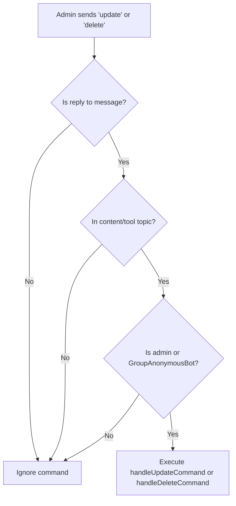
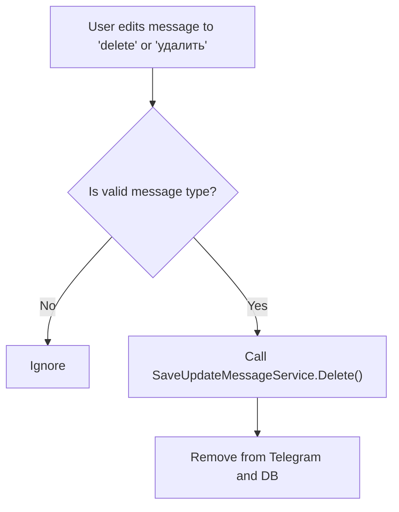
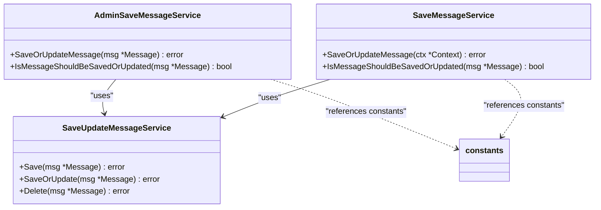

# Group Handlers Services Constants

<cite>
**Referenced Files in This Document**   
- [services_grouphandlers_constants.go](file://internal/constants/services_grouphandlers_constants.go)
- [admin_save_message_service.go](file://internal/services/grouphandlersservices/admin_save_message_service.go)
- [save_message_service.go](file://internal/services/grouphandlersservices/save_message_service.go)
</cite>

## Table of Contents
1. [Introduction](#introduction)
2. [Admin Save Message Service Constants](#admin-save-message-service-constants)
3. [Save Message Service Constants](#save-message-service-constants)
4. [Usage Patterns and Workflows](#usage-patterns-and-workflows)
5. [Integration with Services](#integration-with-services)
6. [Conclusion](#conclusion)

## Introduction
This document provides comprehensive documentation for the constants used in the group handlers services of the Evocoders Bot. These constants are defined in the `services_grouphandlers_constants.go` file and are utilized by various services within the `grouphandlersservices` package to manage message handling, updates, and deletions in group chat environments. The constants ensure consistent command recognition and streamline interactions between Telegram messages and backend services.

**Section sources**
- [services_grouphandlers_constants.go](file://internal/constants/services_grouphandlers_constants.go#L1-L8)

## Admin Save Message Service Constants
The `AdminSaveMessageService` uses specific command constants to allow administrators to control message persistence in designated topics. These constants define valid administrative commands that trigger update or delete operations on replied messages.

### Constants
- **AdminSaveMessage_ReplyUpdateMesageCommand**: `"update"` – Triggers the update or save operation for a replied message in the database.
- **AdminSaveMessage_ReplyDeleteMessageCommand**: `"delete"` – Initiates the deletion of a replied message from both Telegram and the database.

These commands are case-insensitive and must be sent as a reply to the target message within either the content or tool topic. Only users with admin privileges or the `GroupAnonymousBot` are authorized to execute these commands.

**Diagram sources**
- [admin_save_message_service.go](file://internal/services/grouphandlersservices/admin_save_message_service.go#L42-L80)
- [services_grouphandlers_constants.go](file://internal/constants/services_grouphandlers_constants.go#L3-L4)

**Section sources**
- [admin_save_message_service.go](file://internal/services/grouphandlersservices/admin_save_message_service.go#L42-L80)
- [services_grouphandlers_constants.go](file://internal/constants/services_grouphandlers_constants.go#L3-L4)

## Save Message Service Constants
The `SaveMessageService` utilizes language-specific constants to identify user-initiated message deletions. These constants support multilingual interaction by recognizing deletion commands in both English and Russian.

### Constants
- **ServiceSaveMessage_MessageDeleteEnCommand**: `"delete"` – Recognizes the English command for message deletion.
- **ServiceSaveMessage_MessageDeleteRuCommand**: `"удалить"` – Recognizes the Russian equivalent for message deletion.

When a user sends a message containing either of these commands (typically in an edited message), the service interprets it as a request to delete the message from the database and Telegram. This functionality is integrated with the `SaveUpdateMessageService` for actual deletion processing.

**Diagram sources**
- [save_message_service.go](file://internal/services/grouphandlersservices/save_message_service.go#L29-L33)
- [services_grouphandlers_constants.go](file://internal/constants/services_grouphandlers_constants.go#L7-L8)

**Section sources**
- [save_message_service.go](file://internal/services/grouphandlersservices/save_message_service.go#L29-L33)
- [services_grouphandlers_constants.go](file://internal/constants/services_grouphandlers_constants.go#L7-L8)

## Usage Patterns and Workflows
The constants are integral to command parsing workflows in both `AdminSaveMessageService` and `SaveMessageService`. They enable pattern-based message handling by comparing user input against predefined command strings.

### Admin Command Workflow
Administrators reply to a message with either `"update"` or `"delete"`. The `AdminSaveMessageService` checks:
1. Message is a reply
2. Sent in content or tool topic
3. Sender is an admin or `GroupAnonymousBot`
4. Text matches one of the command constants

If all conditions are met, the corresponding handler is invoked.

### User Deletion Workflow
Users can delete their own messages by editing them to contain `"delete"` or `"удалить"`. The `SaveMessageService` detects this during message update processing and triggers deletion via `SaveUpdateMessageService`.

**Section sources**
- [admin_save_message_service.go](file://internal/services/grouphandlersservices/admin_save_message_service.go#L42-L80)
- [save_message_service.go](file://internal/services/grouphandlersservices/save_message_service.go#L29-L33)

## Integration with Services
These constants are consumed by multiple services that depend on consistent command recognition:

- **AdminSaveMessageService**: Directly uses `AdminSaveMessage_ReplyUpdateMesageCommand` and `AdminSaveMessage_ReplyDeleteMessageCommand` in its `SaveOrUpdateMessage` method.
- **SaveMessageService**: Uses `ServiceSaveMessage_MessageDeleteEnCommand` and `ServiceSaveMessage_MessageDeleteRuCommand` in its `isMessageForDeletion` method to detect deletion requests.

Both services are initialized in `bot.go` and injected into the `MessageHandler`, ensuring loose coupling and testability.

**Diagram sources**
- [admin_save_message_service.go](file://internal/services/grouphandlersservices/admin_save_message_service.go#L14-L20)
- [save_message_service.go](file://internal/services/grouphandlersservices/save_message_service.go#L10-L13)
- [save_update_message_service.go](file://internal/services/grouphandlersservices/save_update_message_service.go#L14-L20)

**Section sources**
- [admin_save_message_service.go](file://internal/services/grouphandlersservices/admin_save_message_service.go#L14-L20)
- [save_message_service.go](file://internal/services/grouphandlersservices/save_message_service.go#L10-L13)

## Conclusion
The group handlers services constants provide a clean, centralized mechanism for defining command strings used in message management workflows. By externalizing these values, the codebase achieves better maintainability and supports multilingual interaction. These constants are critical for enabling administrative controls and user-driven message deletion within group topics, forming an essential part of the bot's content moderation and persistence logic.