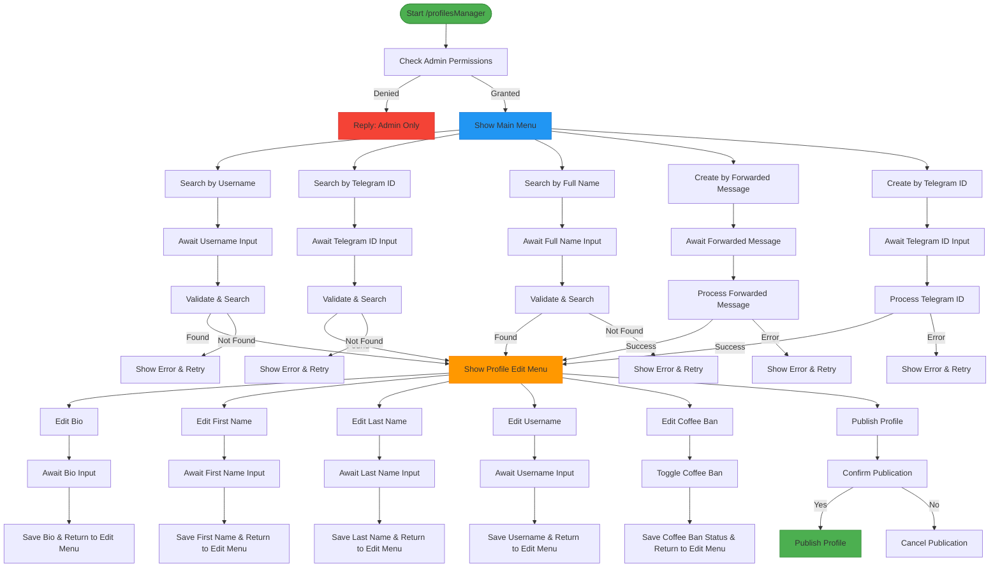
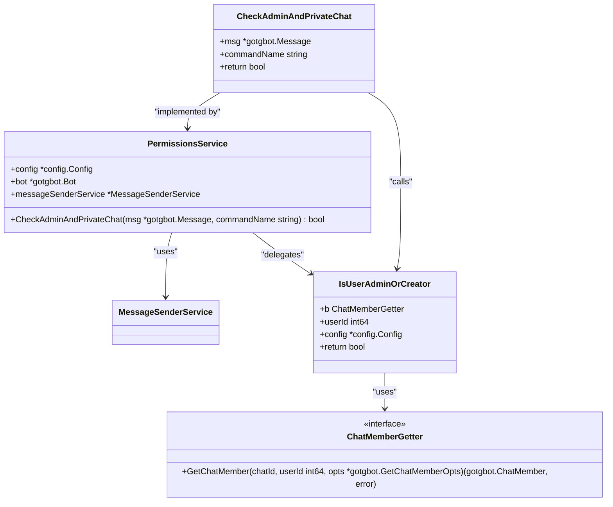
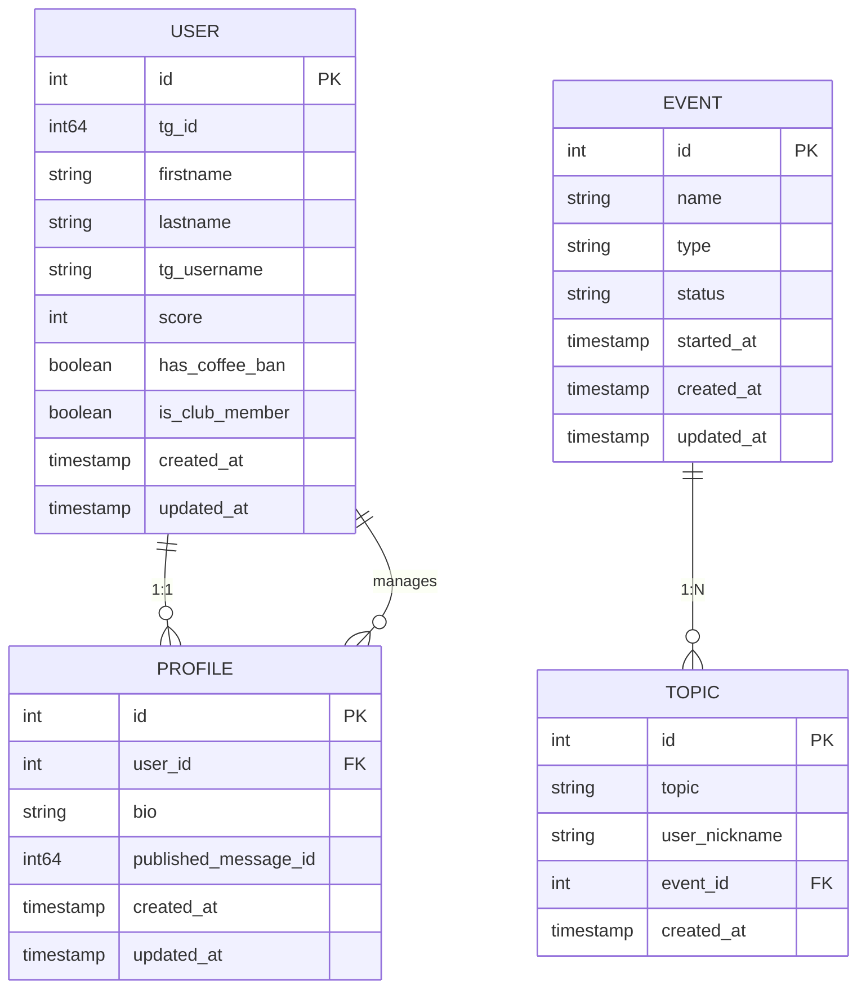

# Admin Handlers

<cite>
**Referenced Files in This Document**   
- [profiles_manager_handler.go](file://internal/handlers/adminhandlers/profiles_manager_handler.go)
- [show_topics_handler.go](file://internal/handlers/adminhandlers/show_topics_handler.go)
- [permission_utils.go](file://internal/utils/permission_utils.go)
- [handlers_admin_constants.go](file://internal/constants/handlers_admin_constants.go)
- [event_repository.go](file://internal/database/repositories/event_repository.go)
- [topic_repository.go](file://internal/database/repositories/topic_repository.go)
- [profile_repository.go](file://internal/database/repositories/profile_repository.go)
- [profile_service.go](file://internal/services/profile_service.go)
- [message_sender_service.go](file://internal/services/message_sender_service.go)
- [profiles_manager_handler_buttons.go](file://internal/buttons/profiles_manager_handler_buttons.go)
- [bot.go](file://internal/bot/bot.go)
</cite>

## Table of Contents
1. [Introduction](#introduction)
2. [Core Admin Handler Components](#core-admin-handler-components)
3. [Profiles Manager Handler](#profiles-manager-handler)
4. [Show Topics Handler](#show-topics-handler)
5. [Permission and Access Control](#permission-and-access-control)
6. [Domain Models and Data Flow](#domain-models-and-data-flow)
7. [Configuration and Constants](#configuration-and-constants)
8. [Error Handling and Troubleshooting](#error-handling-and-troubleshooting)
9. [Integration with Core Bot Framework](#integration-with-core-bot-framework)
10. [Conclusion](#conclusion)

## Introduction

The Admin Handlers sub-component of evocoders-bot-go provides privileged functionality for administrators to manage user profiles, events, and discussion topics within the Evocoders Club Telegram community. This documentation details the implementation of two key admin handlers: `profiles_manager_handler` and `show_topics_handler`. These handlers enable administrators to perform critical moderation tasks such as managing user profiles and viewing/deleting discussion topics from events. The system enforces strict access control through permission checks, ensuring that only authorized users can execute these sensitive operations. The handlers follow a conversation-based pattern using the gotgbot/v2 library, guiding administrators through multi-step workflows with state management.

## Core Admin Handler Components

The admin handlers in evocoders-bot-go are designed as conversation-based components that guide administrators through multi-step processes. These handlers are registered in the bot's main initialization process and are only accessible to users with administrative privileges. The core components include the `profiles_manager_handler` for managing user profiles and the `show_topics_handler` for viewing and managing discussion topics from events. Both handlers utilize a state machine pattern with conversation states to maintain context across multiple user interactions. They interact with various services and repositories to perform database operations, send messages, and validate user permissions. The handlers are initialized with dependencies including configuration, message sender service, permissions service, and relevant repositories, following dependency injection principles for better testability and separation of concerns.

**Section sources**
- [profiles_manager_handler.go](file://internal/handlers/adminhandlers/profiles_manager_handler.go#L1-L100)
- [show_topics_handler.go](file://internal/handlers/adminhandlers/show_topics_handler.go#L1-L100)
- [bot.go](file://internal/bot/bot.go#L170-L207)

## Profiles Manager Handler

The `profiles_manager_handler` provides a comprehensive interface for administrators to manage user profiles within the Evocoders Club. This handler enables administrators to search for existing profiles by username, Telegram ID, or full name, as well as create new profiles either by forwarding a user's message or by specifying a Telegram ID. The handler implements a conversation flow with multiple states, allowing administrators to edit various profile fields including first name, last name, username, bio, and coffee ban status. When creating a profile from a forwarded message, the handler extracts user information and uses the message text as the initial bio content. The handler also provides functionality to publish profiles to the community with or without message preview. All operations are protected by admin permission checks, and the handler maintains conversation state using a `UserDataStore` to track the current user's interaction context across multiple messages.



**Diagram sources **
- [profiles_manager_handler.go](file://internal/handlers/adminhandlers/profiles_manager_handler.go#L100-L1000)

**Section sources**
- [profiles_manager_handler.go](file://internal/handlers/adminhandlers/profiles_manager_handler.go#L1-L1322)
- [profiles_manager_handler_buttons.go](file://internal/buttons/profiles_manager_handler_buttons.go#L1-L171)

## Show Topics Handler

The `show_topics_handler` enables administrators to view and manage discussion topics associated with events in the Evocoders Club. This handler follows a two-step conversation process: first, the administrator selects an event from a list of recent events, and then can view all topics associated with that event. Administrators can delete specific topics by providing the topic ID. The handler retrieves the last 10 events from the database and displays them in a formatted list, allowing the administrator to select an event by its ID. Once an event is selected, the handler fetches all topics associated with that event and displays them in a formatted HTML message. The handler includes validation to ensure that the topic being deleted belongs to the selected event, preventing accidental deletion of topics from other events. The conversation maintains state using a `UserDataStore` to track the selected event ID across multiple interaction steps, ensuring data integrity during the deletion process.

```mermaid
sequenceDiagram
participant Admin as Administrator
participant Handler as ShowTopicsHandler
participant Repo as TopicRepository
participant Formatter as Formatters
participant Sender as MessageSenderService
Admin->>Handler : Send /showTopics command
Handler->>Handler : CheckAdminAndPrivateChat()
alt Not Authorized
Handler->>Admin : Reply "Admin only" message
deactivate Handler
else Authorized
Handler->>Repo : GetLastEvents(10)
alt No Events
Handler->>Admin : Reply "No events available"
deactivate Handler
else Events Found
Formatter->>Formatter : FormatEventListForAdmin()
Sender->>Admin : Send event selection message
Handler->>Handler : Store previous message info
Admin->>Handler : Send event ID
Handler->>Repo : GetEventByID(eventID)
Handler->>Repo : GetTopicsByEventID(eventID)
Handler->>Handler : Store eventID in UserDataStore
Formatter->>Formatter : FormatHtmlTopicListForAdmin()
Sender->>Admin : Reply with topics list
alt Topics Exist
Sender->>Admin : Send deletion instructions
Admin->>Handler : Send topic ID to delete
Handler->>Repo : GetTopicByID(topicID)
alt Topic Exists & Matches Event
Handler->>Repo : DeleteTopic(topicID)
Handler->>Repo : GetTopicsByEventID(eventID)
Formatter->>Formatter : FormatHtmlTopicListForAdmin()
Sender->>Admin : Reply with updated topics list
alt More Topics
Sender->>Admin : Send deletion instructions again
end
else Invalid Topic
Sender->>Admin : Reply "Topic not found" error
end
end
end
end
```

**Diagram sources **
- [show_topics_handler.go](file://internal/handlers/adminhandlers/show_topics_handler.go#L1-L355)

**Section sources**
- [show_topics_handler.go](file://internal/handlers/adminhandlers/show_topics_handler.go#L1-L355)

## Permission and Access Control

Access control for admin handlers is implemented through a layered permission system that verifies both user role and conversation context. The `permissions_service.go` provides the core `CheckAdminAndPrivateChat` method that validates whether a user has administrative privileges in the target group chat. This method uses the Telegram Bot API's `GetChatMember` to retrieve the user's status and checks if it is either "administrator" or "creator". The permission check is integrated into the entry point of each admin handler, such as the `handleCommand` method in `profiles_manager_handler` and the `startShowTopics` method in `show_topics_handler`. If a user without proper permissions attempts to access an admin command, the system logs the unauthorized access attempt and sends a polite error message indicating that the command is restricted to administrators. The permission system is designed to be reusable across all admin handlers, promoting consistency in access control enforcement. Additionally, the system ensures that admin commands can only be executed in private chats, preventing sensitive operations from being performed in public channels.



**Diagram sources **
- [permission_utils.go](file://internal/utils/permission_utils.go#L1-L50)
- [services/permissions_service.go](file://internal/services/permissions_service.go#L1-L45)

**Section sources**
- [permission_utils.go](file://internal/utils/permission_utils.go#L1-L50)
- [services/permissions_service.go](file://internal/services/permissions_service.go#L1-L45)
- [profiles_manager_handler.go](file://internal/handlers/adminhandlers/profiles_manager_handler.go#L200-L250)
- [show_topics_handler.go](file://internal/handlers/adminhandlers/show_topics_handler.go#L150-L200)

## Domain Models and Data Flow

The admin handlers interact with several key domain models that represent the core entities in the Evocoders Club system. The `Event` model represents club events with properties such as name, type, status, and start time. The `Topic` model represents discussion topics associated with events, containing the topic text, user nickname, and reference to the parent event. The `Profile` model stores user profile information including bio and publication status, while the `User` model contains personal information like first name, last name, and Telegram identifiers. These models are managed by corresponding repositories that provide CRUD operations with proper error handling. The data flow begins with user input through Telegram commands, passes through the handler's conversation states, interacts with repositories for database operations, and returns formatted responses to the user. The handlers use formatters to transform raw data into user-friendly messages and rely on the message sender service for reliable message delivery, including handling edge cases like closed topics.



**Diagram sources **
- [event_repository.go](file://internal/database/repositories/event_repository.go#L1-L253)
- [topic_repository.go](file://internal/database/repositories/topic_repository.go#L1-L115)
- [profile_repository.go](file://internal/database/repositories/profile_repository.go#L1-L286)
- [user_repository.go](file://internal/database/repositories/user_repository.go#L1-L200)

**Section sources**
- [event_repository.go](file://internal/database/repositories/event_repository.go#L1-L253)
- [topic_repository.go](file://internal/database/repositories/topic_repository.go#L1-L115)
- [profile_repository.go](file://internal/database/repositories/profile_repository.go#L1-L286)

## Configuration and Constants

The admin handlers utilize a comprehensive system of constants defined in `handlers_admin_constants.go` to maintain consistency and avoid magic strings throughout the codebase. These constants include command names like `AdminProfilesCommand` and `ShowTopicsCommand`, as well as callback data identifiers prefixed with `AdminProfilesPrefix` for the profiles manager. The constants system enables easy modification of command names and callback identifiers without requiring changes to multiple files. The configuration is injected into handlers through dependency injection, allowing for flexible setup and testing. The bot's main registration process in `bot.go` initializes all admin handlers with their required dependencies, including the configuration object that contains settings like the super group chat ID used for permission checks. This centralized configuration approach ensures that all components use consistent settings and can be easily adapted to different deployment environments.

**Section sources**
- [handlers_admin_constants.go](file://internal/constants/handlers_admin_constants.go#L1-L59)
- [bot.go](file://internal/bot/bot.go#L170-L207)
- [config.go](file://internal/config/config.go#L1-L100)

## Error Handling and Troubleshooting

The admin handlers implement comprehensive error handling to provide a robust user experience and maintain system stability. When unauthorized access is detected, the system logs the attempt with user details and command name while providing a user-friendly error message. Input validation is performed at multiple stages, with handlers providing specific error messages for invalid IDs, empty inputs, or format errors. Database operations include proper error handling for cases like record not found (sql.ErrNoRows) or constraint violations, with appropriate user feedback. The conversation system includes automatic cleanup of temporary state data when a conversation ends, whether through completion or cancellation. For operations that modify data, such as profile publishing or topic deletion, the system provides confirmation feedback to the user. The message sender service includes retry logic for transient errors like closed topics, automatically attempting to reopen the topic before sending the message. Common issues like unauthorized access can be resolved by ensuring the user is an administrator in the target group chat, while input-related errors can be addressed by following the format instructions provided in the error messages.

**Section sources**
- [profiles_manager_handler.go](file://internal/handlers/adminhandlers/profiles_manager_handler.go#L500-L1000)
- [show_topics_handler.go](file://internal/handlers/adminhandlers/show_topics_handler.go#L200-L355)
- [message_sender_service.go](file://internal/services/message_sender_service.go#L1-L481)

## Integration with Core Bot Framework

The admin handlers are seamlessly integrated into the core bot framework through the handler registration process in `bot.go`. During initialization, the bot creates instances of all admin handlers, injecting them with necessary dependencies such as configuration, repositories, and services. The handlers are then added to the dispatcher, which routes incoming Telegram updates to the appropriate handler based on commands and message types. The conversation-based design of the handlers leverages the gotgbot/v2 library's conversation middleware, which manages state across multiple user interactions. The handlers follow a consistent pattern of entry point validation, state progression, and resource cleanup, ensuring a uniform experience across different administrative functions. The integration with the permissions service ensures that access control is consistently enforced across all admin functionality. The message sender service provides a unified interface for all message operations, handling formatting, delivery, and error recovery across the entire application.

**Section sources**
- [bot.go](file://internal/bot/bot.go#L170-L207)
- [profiles_manager_handler.go](file://internal/handlers/adminhandlers/profiles_manager_handler.go#L64-L90)
- [show_topics_handler.go](file://internal/handlers/adminhandlers/show_topics_handler.go#L39-L60)

## Conclusion

The Admin Handlers sub-component of evocoders-bot-go provides a robust and secure interface for administrators to manage key aspects of the Evocoders Club community. Through the `profiles_manager_handler` and `show_topics_handler`, administrators can effectively manage user profiles and event discussions with a user-friendly conversation-based interface. The system's layered architecture, with clear separation between handlers, services, and repositories, promotes maintainability and testability. The comprehensive permission system ensures that sensitive operations are restricted to authorized users, while detailed error handling provides a smooth user experience. The integration with the core bot framework through dependency injection and consistent design patterns ensures that new administrative features can be added with minimal friction. For developers extending this system, following the established patterns for conversation flow, permission checking, and error handling will ensure consistency with the existing codebase.