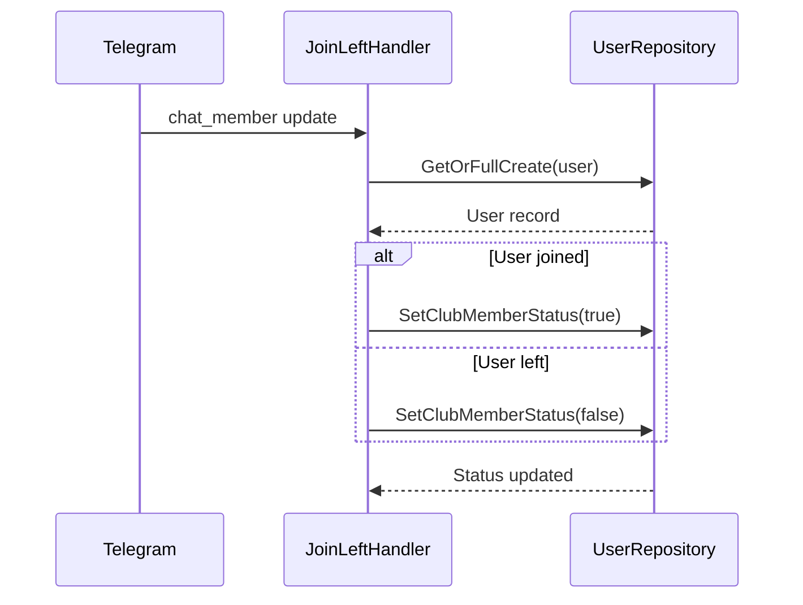
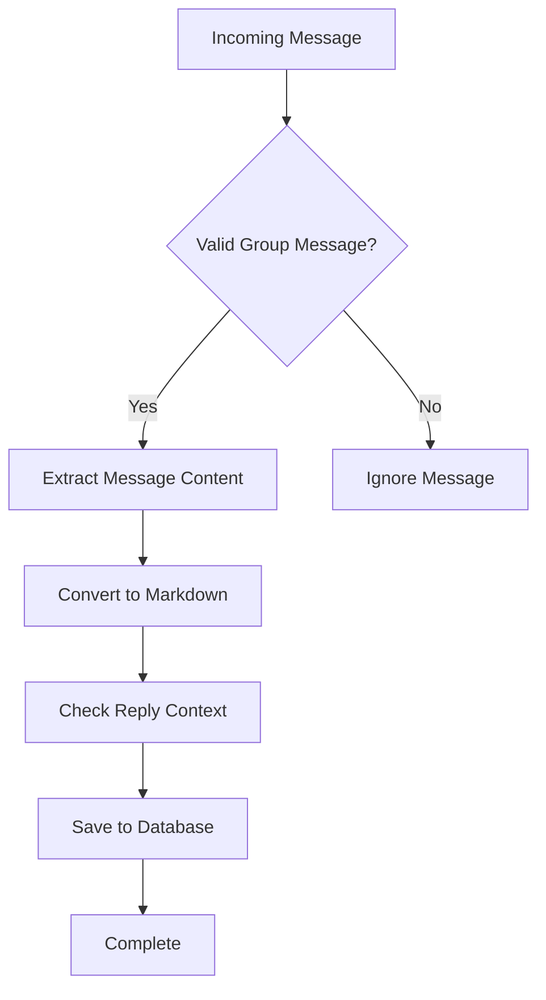
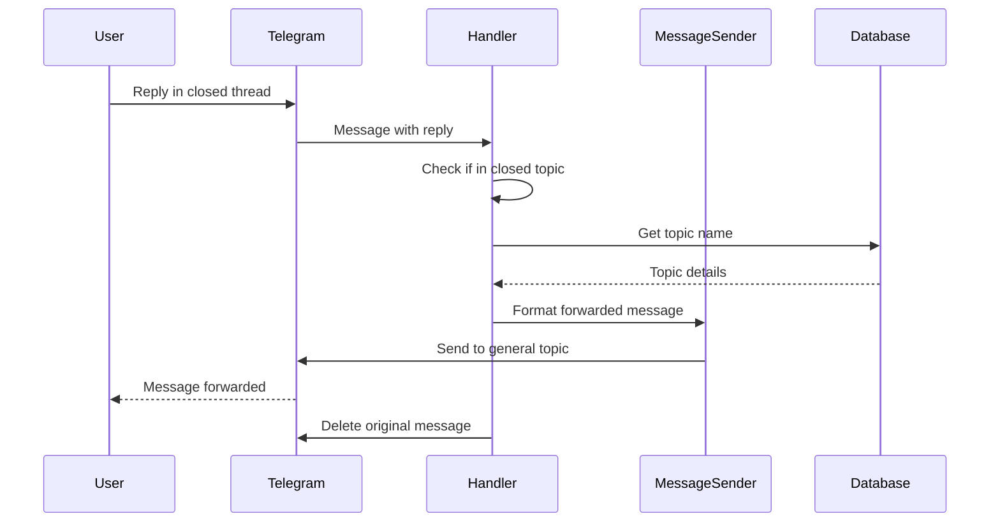
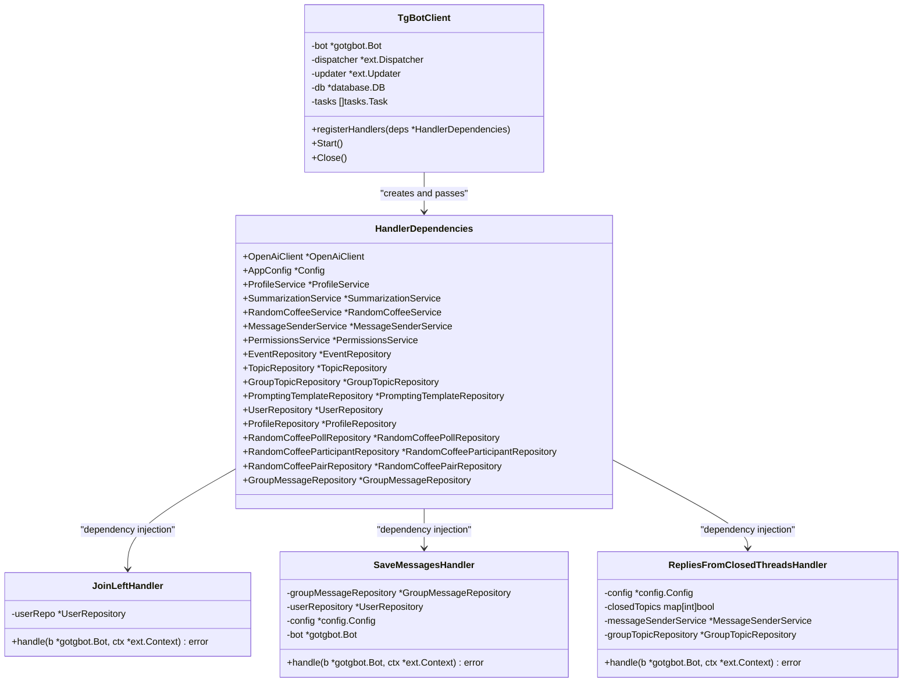
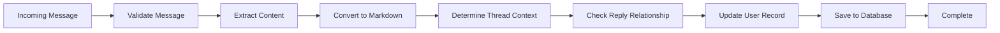
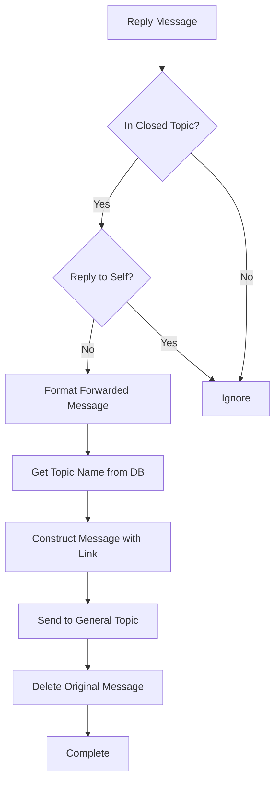

# Group Handlers

<cite>
**Referenced Files in This Document**   
- [join_left_handler.go](file://internal/handlers/grouphandlers/join_left_handler.go)
- [save_messages_handler.go](file://internal/handlers/grouphandlers/save_messages_handler.go)
- [replies_from_closed_threads_handler.go](file://internal/handlers/grouphandlers/replies_from_closed_threads_handler.go)
- [message_sender_service.go](file://internal/services/message_sender_service.go)
- [group_message_repository.go](file://internal/database/repositories/group_message_repository.go)
- [group_topic_repository.go](file://internal/database/repositories/group_topic_repository.go)
- [user_repository.go](file://internal/database/repositories/user_repository.go)
- [markdown_utils.go](file://internal/utils/markdown_utils.go)
- [chat_utils.go](file://internal/utils/chat_utils.go)
- [bot.go](file://internal/bot/bot.go)
- [config.go](file://internal/config/config.go)
</cite>

## Table of Contents
1. [Introduction](#introduction)
2. [Core Group Handlers](#core-group-handlers)
3. [Handler Dependencies and Integration](#handler-dependencies-and-integration)
4. [Message Processing and Persistence](#message-processing-and-persistence)
5. [Thread State Detection and Reply Handling](#thread-state-detection-and-reply-handling)
6. [Common Issues and Debugging Strategies](#common-issues-and-debugging-strategies)
7. [Performance Considerations](#performance-considerations)
8. [Conclusion](#conclusion)

## Introduction
The Group Handlers sub-component of evocoders-bot-go manages message processing and user interactions within Telegram group contexts. These handlers are responsible for tracking member activity, persisting messages, and managing replies in closed discussion threads. The system leverages Telegram's forum topic features to organize discussions while ensuring off-topic replies are properly redirected to general discussion areas. This documentation details the implementation of key handlers including `join_left_handler`, `save_messages_handler`, and `replies_from_closed_threads_handler`, along with their integration with supporting services and repositories.

## Core Group Handlers

The group handlers are specifically designed to process updates in Telegram group chats, with each handler focusing on a distinct aspect of group management. These handlers are registered in the bot's dependency injection system and receive their required dependencies through constructor injection.

### Join/Leave Handler
The `JoinLeftHandler` tracks user membership changes in the group, updating the database to reflect whether users are active club members. When a user joins or leaves the group, this handler updates their `IsClubMember` status accordingly.



**Diagram sources**
- [join_left_handler.go](file://internal/handlers/grouphandlers/join_left_handler.go#L1-L61)
- [user_repository.go](file://internal/database/repositories/user_repository.go#L1-L200)

**Section sources**
- [join_left_handler.go](file://internal/handlers/grouphandlers/join_left_handler.go#L1-L61)

### Message Persistence Handler
The `SaveMessagesHandler` captures and stores all user messages in the group, converting them to Markdown format and persisting them in the database for future retrieval and analysis. It handles both new messages and edited messages, with special logic for message deletion requests.



**Diagram sources**
- [save_messages_handler.go](file://internal/handlers/grouphandlers/save_messages_handler.go#L1-L285)

**Section sources**
- [save_messages_handler.go](file://internal/handlers/grouphandlers/save_messages_handler.go#L1-L285)

### Closed Thread Reply Handler
The `RepliesFromClosedThreadsHandler` detects when users reply to messages in closed discussion topics and automatically forwards these replies to the general discussion thread. This ensures that conversations remain active and visible to all group members.



**Diagram sources**
- [replies_from_closed_threads_handler.go](file://internal/handlers/grouphandlers/replies_from_closed_threads_handler.go#L1-L187)
- [message_sender_service.go](file://internal/services/message_sender_service.go#L1-L480)

**Section sources**
- [replies_from_closed_threads_handler.go](file://internal/handlers/grouphandlers/replies_from_closed_threads_handler.go#L1-L187)

## Handler Dependencies and Integration

Group handlers are integrated into the bot's dependency injection system through the `HandlerDependencies` struct in `bot.go`. This pattern ensures that all handlers receive their required services and repositories at initialization time.



**Diagram sources**
- [bot.go](file://internal/bot/bot.go#L1-L384)

**Section sources**
- [bot.go](file://internal/bot/bot.go#L1-L384)

## Message Processing and Persistence

The message processing pipeline ensures that all group messages are properly formatted, classified, and stored for future use. The `save_messages_handler` works in conjunction with the `group_message_repository` and `markdown_utils` to maintain a comprehensive record of group discussions.

### Message Storage Workflow
When a message is received in a group chat, the `SaveMessagesHandler` processes it through several stages:

1. **Validation**: The handler first checks if the message is from a group chat and contains actual content (text, media, etc.).
2. **Content Extraction**: The message text or caption is extracted, with descriptive placeholders for media-only messages.
3. **Markdown Conversion**: The `ConvertToMarkdown` function processes the message text and entities, preserving formatting like bold, italic, links, and code blocks.
4. **Context Analysis**: The handler determines the message's thread context and reply relationships.
5. **Database Storage**: The processed message is saved to the `group_messages` table via the repository.



**Diagram sources**
- [save_messages_handler.go](file://internal/handlers/grouphandlers/save_messages_handler.go#L1-L285)
- [markdown_utils.go](file://internal/utils/markdown_utils.go#L1-L109)
- [group_message_repository.go](file://internal/database/repositories/group_message_repository.go#L1-L263)

**Section sources**
- [save_messages_handler.go](file://internal/handlers/grouphandlers/save_messages_handler.go#L1-L285)
- [markdown_utils.go](file://internal/utils/markdown_utils.go#L1-L109)
- [group_message_repository.go](file://internal/database/repositories/group_message_repository.go#L1-L263)

## Thread State Detection and Reply Handling

The system uses a combination of configuration settings and database queries to detect closed threads and handle replies appropriately. The `replies_from_closed_threads_handler` leverages the `chat_utils` package for thread state detection and the `message_sender_service` for message forwarding.

### Closed Thread Detection
The handler determines if a message is in a closed thread by checking against a configuration list of closed topic IDs. This list is initialized when the handler is created:

```go
closedTopics := make(map[int]bool)
for _, id := range config.ClosedTopicsIDs {
    closedTopics[id] = true
}
```

When a reply is detected in a closed thread, the handler constructs a formatted message that includes:
- A visual indicator (↩️) showing it's a reply
- The username of the replier
- A link to the original message
- The name of the closed topic (retrieved from the database)

The message is then forwarded to the general discussion topic using the `SendCopy` method of the `MessageSenderService`, which preserves the original message's formatting and media.



**Diagram sources**
- [replies_from_closed_threads_handler.go](file://internal/handlers/grouphandlers/replies_from_closed_threads_handler.go#L1-L187)
- [group_topic_repository.go](file://internal/database/repositories/group_topic_repository.go#L1-L100)
- [message_sender_service.go](file://internal/services/message_sender_service.go#L1-L480)

**Section sources**
- [replies_from_closed_threads_handler.go](file://internal/handlers/grouphandlers/replies_from_closed_threads_handler.go#L1-L187)

## Common Issues and Debugging Strategies

### Message Loss in Closed Threads
One common issue is message loss when users reply in closed threads. The current implementation addresses this by automatically forwarding replies to the general discussion topic. However, issues can arise if:

1. The `SendCopy` operation fails due to network issues or API limits
2. The topic name cannot be retrieved from the database
3. The message deletion fails after forwarding

**Debugging Strategy**: Check the application logs for error messages from the `RepliesFromClosedThreadsHandler`. Look for entries containing "failed to forward reply message" or "failed to delete original message after forwarding". Verify that the `ClosedTopicsIDs` configuration matches the actual closed topic IDs in the group.

### Incorrect Thread Classification
Messages may be incorrectly classified as being in closed threads due to:
- Configuration mismatches between `ClosedTopicsIDs` and actual closed topics
- Race conditions when topics are opened/closed frequently
- Incorrect message thread ID extraction

**Debugging Strategy**: Enable verbose logging in the handler to trace the message processing flow. Verify that the `MessageThreadId` is being correctly extracted from incoming messages and that it matches the expected values from the Telegram API.

### Performance Issues in High-Volume Groups
In groups with high message volume, the message persistence system may experience:
- Database connection bottlenecks
- Message processing delays
- Memory leaks from unprocessed messages

**Debugging Strategy**: Monitor database performance metrics and connection pool usage. Implement rate limiting if necessary and consider batching database operations for improved efficiency.

## Performance Considerations

The group handlers are designed to handle high-volume group environments, but several performance considerations should be addressed:

### Database Optimization
The `group_message_repository` should be optimized for frequent INSERT and SELECT operations. Indexes on `message_id`, `user_tg_id`, and `group_topic_id` fields ensure efficient querying. For very large groups, consider implementing data partitioning by date or topic.

### Concurrency Handling
The handlers process messages concurrently through the bot's dispatcher. The `MessageSenderService` methods are designed to be goroutine-safe, allowing multiple messages to be processed simultaneously without conflicts.

### Memory Management
The system should monitor memory usage, particularly when processing large numbers of messages or media files. The `SendCopy` method handles large captions by truncating them to 1000 UTF-16 code units, preventing memory overflow from extremely long messages.

### Error Resilience
The handlers implement robust error handling to ensure that failures in one component don't affect the entire system. For example, if message persistence fails, the bot continues processing other messages rather than crashing.

## Conclusion
The Group Handlers sub-component provides essential functionality for managing Telegram group interactions in evocoders-bot-go. By tracking membership changes, persisting messages, and redirecting off-topic replies, these handlers maintain an organized and accessible discussion environment. The modular design with clear dependencies allows for easy maintenance and extension. The integration with the bot's dependency injection system ensures consistent configuration and service availability across all handlers.