# Handler System

<cite>
**Referenced Files in This Document**   
- [bot.go](file://internal/bot/bot.go)
- [help_handler.go](file://internal/handlers/privatehandlers/help_handler.go)
- [join_left_handler.go](file://internal/handlers/grouphandlers/join_left_handler.go)
- [profiles_manager_handler.go](file://internal/handlers/adminhandlers/profiles_manager_handler.go)
</cite>

## Table of Contents
1. [Introduction](#introduction)
2. [Handler Architecture Overview](#handler-architecture-overview)
3. [Handler Types and Responsibilities](#handler-types-and-responsibilities)
4. [Handler Registration Process](#handler-registration-process)
5. [Dependency Injection with HandlerDependencies](#dependency-injection-with-handlerdependencies)
6. [Update Processing Flow](#update-processing-flow)
7. [Private Handlers Implementation](#private-handlers-implementation)
8. [Group Handlers Implementation](#group-handlers-implementation)
9. [Admin Handlers Implementation](#admin-handlers-implementation)
10. [Practical Examples](#practical-examples)
11. [Public Interfaces and Signatures](#public-interfaces-and-signatures)

## Introduction
The Handler System in evocoders-bot-go is responsible for processing Telegram updates and routing them to appropriate handler functions based on chat context, user permissions, and message type. The system implements a modular architecture with three distinct handler types: adminhandlers, grouphandlers, and privatehandlers, each designed to handle specific interaction contexts within the Telegram ecosystem. This documentation provides a comprehensive analysis of the handler system's architecture, implementation details, and operational flow.

## Handler Architecture Overview


**Diagram sources**
- [bot.go](file://internal/bot/bot.go#L45-L79)
- [bot.go](file://internal/bot/bot.go#L25-L43)

**Section sources**
- [bot.go](file://internal/bot/bot.go#L1-L385)

## Handler Types and Responsibilities

The evocoders-bot-go handler system is organized into three primary categories based on the context in which they operate:

1. **adminhandlers**: Handle commands and interactions from administrators in private chats, providing management capabilities for events, profiles, and system features
2. **grouphandlers**: Process messages and events in group chat contexts, including message saving, thread management, and member join/leave notifications
3. **privatehandlers**: Manage interactions in private chat contexts, including command processing, content generation, and user profile management

Each handler type is registered with the dispatcher and processes updates relevant to its specific context, ensuring proper separation of concerns and access control.

**Section sources**
- [bot.go](file://internal/bot/bot.go#L200-L375)

## Handler Registration Process


**Diagram sources**
- [bot.go](file://internal/bot/bot.go#L180-L375)

**Section sources**
- [bot.go](file://internal/bot/bot.go#L180-L375)

The handler registration process begins in the `NewTgBotClient` function, which creates a `TgBotClient` instance and initializes all required dependencies. The `registerHandlers` method then creates three separate slices for admin, group, and private handlers, populating them with handler instances created using the `HandlerDependencies` container. These handler slices are combined and registered with the dispatcher using `AddHandler`, establishing the complete handler chain for processing Telegram updates.

## Dependency Injection with HandlerDependencies

```mermaid
classDiagram
class HandlerDependencies {
+OpenAiClient *OpenAiClient
+AppConfig *Config
+ProfileService *ProfileService
+SummarizationService *SummarizationService
+RandomCoffeeService *RandomCoffeeService
+MessageSenderService *MessageSenderService
+PermissionsService *PermissionsService
+EventRepository *EventRepository
+TopicRepository *TopicRepository
+GroupTopicRepository *GroupTopicRepository
+PromptingTemplateRepository *PromptingTemplateRepository
+UserRepository *UserRepository
+ProfileRepository *ProfileRepository
+RandomCoffeePollRepository *RandomCoffeePollRepository
+RandomCoffeeParticipantRepository *RandomCoffeeParticipantRepository
+RandomCoffeePairRepository *RandomCoffeePairRepository
+GroupMessageRepository *GroupMessageRepository
}
class TgBotClient {
-bot *gotgbot.Bot
-dispatcher *ext.Dispatcher
-updater *ext.Updater
-db *database.DB
-tasks []tasks.Task
+registerHandlers(deps *HandlerDependencies)
+Start()
+Close()
}
TgBotClient --> HandlerDependencies : "passes to"
HandlerDependencies --> "All Handler Types" : "injected into"
class "All Handler Types" {
+New*Handler(deps *HandlerDependencies)
}
```

**Diagram sources**
- [bot.go](file://internal/bot/bot.go#L25-L43)
- [bot.go](file://internal/bot/bot.go#L45-L79)

**Section sources**
- [bot.go](file://internal/bot/bot.go#L25-L43)

The `HandlerDependencies` struct serves as a dependency injection container, aggregating all services, repositories, configuration, and clients required by various handlers. This pattern eliminates direct dependencies between handlers and lower-level components, promoting testability and maintainability. The dependencies are initialized in `NewTgBotClient` and passed to `registerHandlers`, which distributes them to individual handler constructors. This approach ensures consistent dependency management across the entire handler system.

## Update Processing Flow


**Diagram sources**
- [bot.go](file://internal/bot/bot.go#L180-L375)
- [help_handler.go](file://internal/handlers/privatehandlers/help_handler.go#L25-L55)
- [join_left_handler.go](file://internal/handlers/grouphandlers/join_left_handler.go#L25-L61)

**Section sources**
- [bot.go](file://internal/bot/bot.go#L180-L375)
- [help_handler.go](file://internal/handlers/privatehandlers/help_handler.go#L25-L55)
- [join_left_handler.go](file://internal/handlers/grouphandlers/join_left_handler.go#L25-L61)

The update processing flow begins when Telegram sends an update to the bot, which is received through long polling. The `ext.Dispatcher` routes the update to appropriate handlers based on the update type and chat context. For private chat messages, the system checks if the message contains a command that matches registered private handlers. Group chat messages are processed by group handlers that save messages, manage threads, and handle member join/leave events. Admin commands are verified for proper permissions before execution. The flow ensures that each update is processed by the appropriate handler while maintaining proper access control and context awareness.

## Private Handlers Implementation

```mermaid
classDiagram
class helpHandler {
-config *config.Config
-messageSenderService *MessageSenderService
-permissionsService *PermissionsService
+handleCommand(b *gotgbot.Bot, ctx *ext.Context) error
}
class contentHandler {
-config *config.Config
-openaiClient *clients.OpenAiClient
-messageSenderService *MessageSenderService
-promptingTemplateRepository *repositories.PromptingTemplateRepository
-permissionsService *services.PermissionsService
+handleCommand(b *gotgbot.Bot, ctx *ext.Context) error
+processContentSearch(b *gotgbot.Bot, ctx *ext.Context) error
+handleCallbackCancel(b *gotgbot.Bot, ctx *ext.Context) error
}
class introHandler {
-config *config.Config
-openaiClient *clients.OpenAiClient
-messageSenderService *MessageSenderService
-promptingTemplateRepository *repositories.PromptingTemplateRepository
-profileRepository *repositories.ProfileRepository
-permissionsService *services.PermissionsService
+handleCommand(b *gotgbot.Bot, ctx *ext.Context) error
+processIntroQuery(b *gotgbot.Bot, ctx *ext.Context) error
+handleCallbackCancel(b *gotgbot.Bot, ctx *ext.Context) error
}
class profileHandler {
-config *config.Config
-messageSenderService *MessageSenderService
-permissionsService *services.PermissionsService
-profileService *services.ProfileService
-userRepository *repositories.UserRepository
-profileRepository *repositories.ProfileRepository
-promptingTemplateRepository *repositories.PromptingTemplateRepository
-openaiClient *clients.OpenAiClient
+handleCommand(b *gotgbot.Bot, ctx *ext.Context) error
+handleEditBio(b *gotgbot.Bot, ctx *ext.Context) error
+handleEditFirstname(b *gotgbot.Bot, ctx *ext.Context) error
+handleEditLastname(b *gotgbot.Bot, ctx *ext.Context) error
+handleEditUsername(b *gotgbot.Bot, ctx *ext.Context) error
}
helpHandler --> MessageSenderService : "uses"
helpHandler --> PermissionsService : "uses"
contentHandler --> OpenAiClient : "uses"
contentHandler --> MessageSenderService : "uses"
contentHandler --> PromptingTemplateRepository : "uses"
contentHandler --> PermissionsService : "uses"
introHandler --> OpenAiClient : "uses"
introHandler --> MessageSenderService : "uses"
introHandler --> PromptingTemplateRepository : "uses"
introHandler --> ProfileRepository : "uses"
introHandler --> PermissionsService : "uses"
profileHandler --> MessageSenderService : "uses"
profileHandler --> PermissionsService : "uses"
profileHandler --> ProfileService : "uses"
profileHandler --> UserRepository : "uses"
profileHandler --> ProfileRepository : "uses"
profileHandler --> PromptingTemplateRepository : "uses"
profileHandler --> OpenAiClient : "uses"
class MessageSenderService {
+ReplyHtml(msg *gotgbot.Message, text string, opts *gotgbot.SendMessageOpts) error
+SendHtmlWithReturnMessage(chatId int64, text string, opts *gotgbot.SendMessageOpts) (*gotgbot.Message, error)
+SendTypingAction(chatId int64) error
}
class PermissionsService {
+CheckPrivateChatType(msg *gotgbot.Message) bool
+CheckClubMemberPermissions(msg *gotgbot.Message, command string) bool
}
```



**Diagram sources**
- [help_handler.go](file://internal/handlers/privatehandlers/help_handler.go#L10-L20)
- [privatehandlers](file://internal/handlers/privatehandlers)

**Section sources**
- [help_handler.go](file://internal/handlers/privatehandlers/help_handler.go#L10-L55)

Private handlers process interactions in private chat contexts between users and the bot. The `helpHandler` responds to the `/help` command by verifying the chat type and user permissions before sending formatted help text. Other private handlers like `contentHandler`, `introHandler`, and `profileHandler` implement conversation flows for content search, introduction generation, and profile management respectively. These handlers use the `MessageSenderService` to send responses and the `PermissionsService` to enforce access control, ensuring that only authorized users can access specific functionality.

## Group Handlers Implementation

```mermaid
classDiagram
class JoinLeftHandler {
-userRepo *repositories.UserRepository
+handle(b *gotgbot.Bot, ctx *ext.Context) error
}
class SaveMessagesHandler {
-groupMessageRepository *repositories.GroupMessageRepository
-userRepository *repositories.UserRepository
-appConfig *config.Config
-bot *gotgbot.Bot
+handle(b *gotgbot.Bot, ctx *ext.Context) error
}
class SaveTopicsHandler {
-groupTopicRepository *repositories.GroupTopicRepository
+handle(b *gotgbot.Bot, ctx *ext.Context) error
}
class CleanClosedThreadsHandler {
-appConfig *config.Config
-messageSenderService *services.MessageSenderService
+handle(b *gotgbot.Bot, ctx *ext.Context) error
}
class RandomCoffeePollAnswerHandler {
-appConfig *config.Config
-userRepository *repositories.UserRepository
-randomCoffeePollRepository *repositories.RandomCoffeePollRepository
-randomCoffeeParticipantRepository *repositories.RandomCoffeeParticipantRepository
-messageSenderService *services.MessageSenderService
+handle(b *gotgbot.Bot, ctx *ext.Context) error
}
class RepliesFromClosedThreadsHandler {
-appConfig *config.Config
-messageSenderService *services.MessageSenderService
-groupTopicRepository *repositories.GroupTopicRepository
+handle(b *gotgbot.Bot, ctx *ext.Context) error
}
JoinLeftHandler --> UserRepository : "uses"
SaveMessagesHandler --> GroupMessageRepository : "uses"
SaveMessagesHandler --> UserRepository : "uses"
SaveTopicsHandler --> GroupTopicRepository : "uses"
CleanClosedThreadsHandler --> MessageSenderService : "uses"
RandomCoffeePollAnswerHandler --> UserRepository : "uses"
RandomCoffeePollAnswerHandler --> RandomCoffeePollRepository : "uses"
RandomCoffeePollAnswerHandler --> RandomCoffeeParticipantRepository : "uses"
RandomCoffeePollAnswerHandler --> MessageSenderService : "uses"
RepliesFromClosedThreadsHandler --> MessageSenderService : "uses"
RepliesFromClosedThreadsHandler --> GroupTopicRepository : "uses"
class UserRepository {
+GetOrFullCreate(user *gotgbot.User) (*User, bool, error)
+SetClubMemberStatus(userID int, isClubMember bool) error
}
class GroupMessageRepository {
+Create(message *GroupMessage) error
+Delete(messageID int) error
}
class GroupTopicRepository {
+Create(topic *GroupTopic) error
+GetByTopicID(topicID int) (*GroupTopic, error)
}
```



**Diagram sources**
- [join_left_handler.go](file://internal/handlers/grouphandlers/join_left_handler.go#L10-L20)
- [grouphandlers](file://internal/handlers/grouphandlers)

**Section sources**
- [join_left_handler.go](file://internal/handlers/grouphandlers/join_left_handler.go#L10-L61)

Group handlers process events and messages in group chat contexts. The `JoinLeftHandler` monitors chat member updates, updating user status in the database when members join or leave the group. When a user joins, their `IsClubMember` status is set to true; when they leave, it's set to false. The `SaveMessagesHandler` captures messages in the group, storing them in the database for later processing and analysis. The `SaveTopicsHandler` tracks group topics (threads), while `CleanClosedThreadsHandler` manages closed threads according to configured rules. These handlers work together to maintain a comprehensive record of group activity and enforce community guidelines.

## Admin Handlers Implementation

```mermaid
classDiagram
class adminProfilesHandler {
-config *config.Config
-messageSenderService *services.MessageSenderService
-permissionsService *services.PermissionsService
-profileService *services.ProfileService
-userRepository *repositories.UserRepository
-profileRepository *repositories.ProfileRepository
-userStore *utils.UserDataStore
+handleCommand(b *gotgbot.Bot, ctx *ext.Context) error
+handleSearchByUsernameCallback(b *gotgbot.Bot, ctx *ext.Context) error
+handleCreateByForwardedMessageCallback(b *gotgbot.Bot, ctx *ext.Context) error
+handleCreateByTelegramIDCallback(b *gotgbot.Bot, ctx *ext.Context) error
+handleSearchByTelegramIDCallback(b *gotgbot.Bot, ctx *ext.Context) error
+handleSearchByFullNameCallback(b *gotgbot.Bot, ctx *ext.Context) error
+handleEditFieldCallback(b *gotgbot.Bot, ctx *ext.Context) error
+handlePublishCallback(b *gotgbot.Bot, ctx *ext.Context) error
+showMainMenu(b *gotgbot.Bot, msg *gotgbot.Message, userId int64) error
+showProfileEditMenu(b *gotgbot.Bot, msg *gotgbot.Message, userId int64, user *repositories.User, profile *repositories.Profile) error
}
class eventDeleteHandler {
-config *config.Config
-eventRepository *repositories.EventRepository
-messageSenderService *services.MessageSenderService
-permissionsService *services.PermissionsService
+handle(b *gotgbot.Bot, ctx *ext.Context) error
}
class eventEditHandler {
-config *config.Config
-eventRepository *repositories.EventRepository
-messageSenderService *services.MessageSenderService
-permissionsService *services.PermissionsService
+handle(b *gotgbot.Bot, ctx *ext.Context) error
}
class eventSetupHandler {
-config *config.Config
-eventRepository *repositories.EventRepository
-messageSenderService *services.MessageSenderService
-permissionsService *services.PermissionsService
+handle(b *gotgbot.Bot, ctx *ext.Context) error
}
class eventStartHandler {
-config *config.Config
-eventRepository *repositories.EventRepository
-messageSenderService *services.MessageSenderService
-permissionsService *services.PermissionsService
+handle(b *gotgbot.Bot, ctx *ext.Context) error
}
adminProfilesHandler --> MessageSenderService : "uses"
adminProfilesHandler --> PermissionsService : "uses"
adminProfilesHandler --> ProfileService : "uses"
adminProfilesHandler --> UserRepository : "uses"
adminProfilesHandler --> ProfileRepository : "uses"
adminProfilesHandler --> UserDataStore : "uses"
eventDeleteHandler --> EventRepository : "uses"
eventDeleteHandler --> MessageSenderService : "uses"
eventDeleteHandler --> PermissionsService : "uses"
eventEditHandler --> EventRepository : "uses"
eventEditHandler --> MessageSenderService : "uses"
eventEditHandler --> PermissionsService : "uses"
eventSetupHandler --> EventRepository : "uses"
eventSetupHandler --> MessageSenderService : "uses"
eventSetupHandler --> PermissionsService : "uses"
eventStartHandler --> EventRepository : "uses"
eventStartHandler --> MessageSenderService : "uses"
eventStartHandler --> PermissionsService : "uses"
class UserDataStore {
+Set(userID int64, key string, value interface{})
+Get(userID int64, key string) (interface{}, bool)
+Clear(userID int64)
+SetPreviousMessageInfo(userID int64, messageID int, chatID int64, messageKey string, chatKey string)
+GetPreviousMessageInfo(userID int64, messageKey string, chatKey string) (int, int64)
}
class MessageSenderService {
+SendHtmlWithReturnMessage(chatId int64, text string, opts *gotgbot.SendMessageOpts) (*gotgbot.Message, error)
+Reply(msg *gotgbot.Message, text string, opts *gotgbot.SendMessageOpts) error
+SendTypingAction(chatId int64) error
}
class PermissionsService {
+CheckAdminAndPrivateChat(msg *gotgbot.Message, command string) bool
}
```

**Diagram sources**
- [profiles_manager_handler.go](file://internal/handlers/adminhandlers/profiles_manager_handler.go#L75-L90)
- [adminhandlers](file://internal/handlers/adminhandlers)

**Section sources**
- [profiles_manager_handler.go](file://internal/handlers/adminhandlers/profiles_manager_handler.go#L75-L799)

Admin handlers provide administrative functionality accessible only to authorized users in private chats. The `adminProfilesHandler` implements a conversation flow for managing user profiles, allowing administrators to search for users by username, ID, or name, create profiles from forwarded messages, and edit profile fields. The handler uses a state machine approach with the `UserDataStore` to maintain conversation context across multiple messages. Event management handlers (`eventDeleteHandler`, `eventEditHandler`, etc.) provide CRUD operations for events, with proper permission checks ensuring only administrators can modify event data. These handlers use callback queries to implement interactive menus and forms.

## Practical Examples

### Processing /help Command in Private Chat


**Diagram sources**
- [help_handler.go](file://internal/handlers/privatehandlers/help_handler.go#L35-L55)

**Section sources**
- [help_handler.go](file://internal/handlers/privatehandlers/help_handler.go#L35-L55)

When a user sends the `/help` command in a private chat, the dispatcher routes the message to the `helpHandler`. The handler first verifies that the message was sent in a private chat using `CheckPrivateChatType`. It then checks if the user is a club member using `CheckClubMemberPermissions`. If both checks pass, the handler formats the help message using `FormatHelpMessage`, which includes different content based on whether the user is an administrator. Finally, the formatted message is sent back to the user using `ReplyHtml`.

### Handling Join/Leave Messages in Group Context


**Diagram sources**
- [join_left_handler.go](file://internal/handlers/grouphandlers/join_left_handler.go#L35-L61)

**Section sources**
- [join_left_handler.go](file://internal/handlers/grouphandlers/join_left_handler.go#L35-L61)

When a user joins or leaves the group, Telegram sends a `ChatMemberUpdated` event that is processed by the `JoinLeftHandler`. The handler extracts the user information from the update and calls `GetOrFullCreate` to ensure the user exists in the database. If the user's new status is "member", "administrator", or "creator", the handler sets their `IsClubMember` status to true. If the user's status is "left" or "kicked", and they were previously a club member, their `IsClubMember` status is set to false. This mechanism automatically maintains accurate membership status based on actual group participation.

## Public Interfaces and Signatures

```mermaid
classDiagram
class HandlerDependencies {
+OpenAiClient *clients.OpenAiClient
+AppConfig *config.Config
+ProfileService *services.ProfileService
+SummarizationService *services.SummarizationService
+RandomCoffeeService *services.RandomCoffeeService
+MessageSenderService *services.MessageSenderService
+PermissionsService *services.PermissionsService
+EventRepository *repositories.EventRepository
+TopicRepository *repositories.TopicRepository
+GroupTopicRepository *repositories.GroupTopicRepository
+PromptingTemplateRepository *repositories.PromptingTemplateRepository
+UserRepository *repositories.UserRepository
+ProfileRepository *repositories.ProfileRepository
+RandomCoffeePollRepository *repositories.RandomCoffeePollRepository
+RandomCoffeeParticipantRepository *repositories.RandomCoffeeParticipantRepository
+RandomCoffeePairRepository *repositories.RandomCoffeePairRepository
+GroupMessageRepository *repositories.GroupMessageRepository
}
class TgBotClient {
+NewTgBotClient(openaiClient *clients.OpenAiClient, appConfig *config.Config) (*TgBotClient, error)
+Start()
+Close() error
}
class "privatehandlers" {
+NewHelpHandler(config *config.Config, messageSenderService *services.MessageSenderService, permissionsService *services.PermissionsService) ext.Handler
+NewContentHandler(config *config.Config, openaiClient *clients.OpenAiClient, messageSenderService *services.MessageSenderService, promptingTemplateRepository *repositories.PromptingTemplateRepository, permissionsService *services.PermissionsService) ext.Handler
+NewProfileHandler(config *config.Config, messageSenderService *services.MessageSenderService, permissionsService *services.PermissionsService, profileService *services.ProfileService, userRepository *repositories.UserRepository, profileRepository *repositories.ProfileRepository, promptingTemplateRepository *repositories.PromptingTemplateRepository, openaiClient *clients.OpenAiClient) ext.Handler
}
class "grouphandlers" {
+NewJoinLeftHandler(userRepo *repositories.UserRepository) ext.Handler
+NewSaveMessagesHandler(groupMessageRepository *repositories.GroupMessageRepository, userRepository *repositories.UserRepository, appConfig *config.Config, bot *gotgbot.Bot) ext.Handler
+NewSaveTopicsHandler(groupTopicRepository *repositories.GroupTopicRepository) ext.Handler
}
class "adminhandlers" {
+NewAdminProfilesHandler(config *config.Config, messageSenderService *services.MessageSenderService, permissionsService *services.PermissionsService, profileService *services.ProfileService, userRepository *repositories.UserRepository, profileRepository *repositories.ProfileRepository) ext.Handler
+NewShowTopicsHandler(config *config.Config, topicRepository *repositories.TopicRepository, eventRepository *repositories.EventRepository, messageSenderService *services.MessageSenderService, permissionsService *services.PermissionsService) ext.Handler
}
class "eventhandlers" {
+NewEventDeleteHandler(config *config.Config, eventRepository *repositories.EventRepository, messageSenderService *services.MessageSenderService, permissionsService *services.PermissionsService) ext.Handler
+NewEventEditHandler(config *config.Config, eventRepository *repositories.EventRepository, messageSenderService *services.MessageSenderService, permissionsService *services.PermissionsService) ext.Handler
+NewEventSetupHandler(config *config.Config, eventRepository *repositories.EventRepository, messageSenderService *services.MessageSenderService, permissionsService *services.PermissionsService) ext.Handler
+NewEventStartHandler(config *config.Config, eventRepository *repositories.EventRepository, messageSenderService *services.MessageSenderService, permissionsService *services.PermissionsService) ext.Handler
}
class "testhandlers" {
+NewTryCreateCoffeePoolHandler(config *config.Config, messageSenderService *services.MessageSenderService, permissionsService *services.PermissionsService, randomCoffeeService *services.RandomCoffeeService) ext.Handler
+NewTryGenerateCoffeePairsHandler(config *config.Config, permissionsService *services.PermissionsService, messageSenderService *services.MessageSenderService, randomCoffeePollRepository *repositories.RandomCoffeePollRepository, randomCoffeeParticipantRepository *repositories.RandomCoffeeParticipantRepository, profileRepository *repositories.ProfileRepository, randomCoffeeService *services.RandomCoffeeService) ext.Handler
+NewTrySummarizeHandler(config *config.Config, summarizationService *services.SummarizationService, messageSenderService *services.MessageSenderService, permissionsService *services.PermissionsService) ext.Handler
}
HandlerDependencies <|-- "privatehandlers"
HandlerDependencies <|-- "grouphandlers"
HandlerDependencies <|-- "adminhandlers"
HandlerDependencies <|-- "eventhandlers"
HandlerDependencies <|-- "testhandlers"
```

**Diagram sources**
- [bot.go](file://internal/bot/bot.go#L25-L43)
- [help_handler.go](file://internal/handlers/privatehandlers/help_handler.go#L30-L35)
- [join_left_handler.go](file://internal/handlers/grouphandlers/join_left_handler.go#L25-L30)
- [profiles_manager_handler.go](file://internal/handlers/adminhandlers/profiles_manager_handler.go#L100-L105)

**Section sources**
- [bot.go](file://internal/bot/bot.go#L25-L43)
- [help_handler.go](file://internal/handlers/privatehandlers/help_handler.go#L30-L35)
- [join_left_handler.go](file://internal/handlers/grouphandlers/join_left_handler.go#L25-L30)
- [profiles_manager_handler.go](file://internal/handlers/adminhandlers/profiles_manager_handler.go#L100-L105)

The public interfaces of the handler system follow a consistent pattern where each handler type provides a constructor function that returns an `ext.Handler` interface. The `HandlerDependencies` struct is used as a parameter bag to inject all required dependencies, promoting loose coupling and testability. Constructor functions for private handlers typically require the `MessageSenderService` and `PermissionsService` to handle message sending and access control. Group handlers often require repositories to persist data from group interactions. Admin handlers have the most extensive dependencies, reflecting their complex administrative functionality. All handlers implement the `ext.Handler` interface, allowing them to be registered with the dispatcher uniformly.