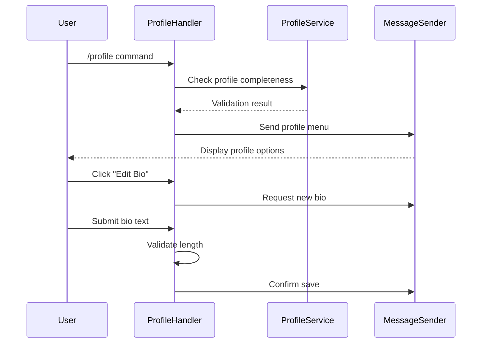
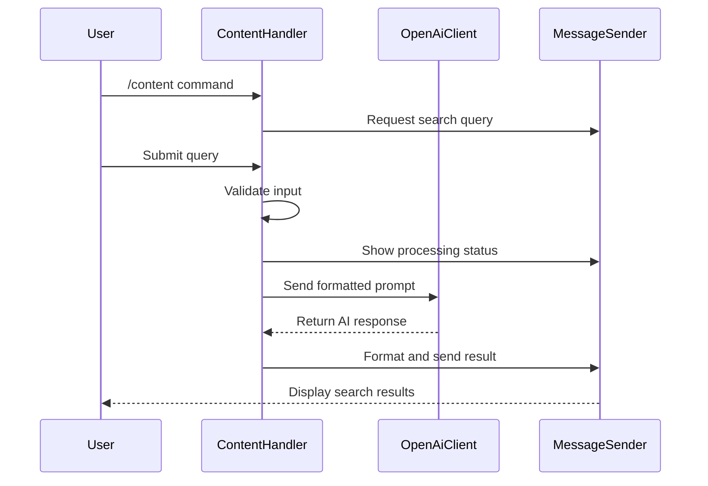
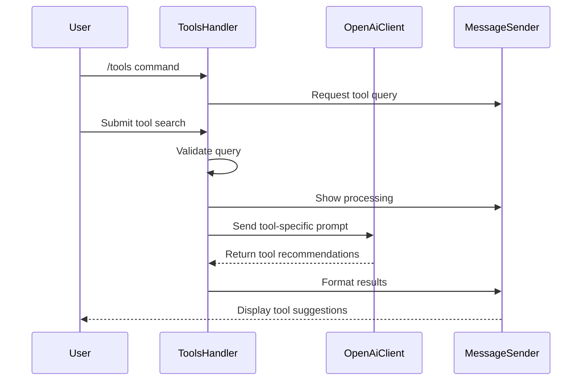
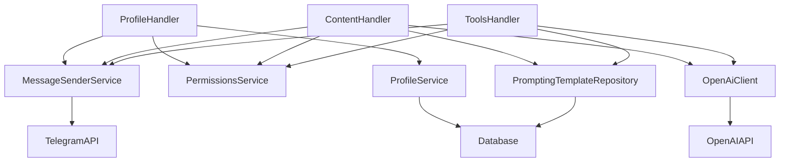

# Private Handlers

<cite>
**Referenced Files in This Document**   
- [profile_handler.go](file://internal/handlers/privatehandlers/profile_handler.go)
- [content_handler.go](file://internal/handlers/privatehandlers/content_handler.go)
- [tools_handler.go](file://internal/handlers/privatehandlers/tools_handler.go)
- [profile_service.go](file://internal/services/profile_service.go)
- [openai_client.go](file://internal/clients/openai_client.go)
- [help_message_formatter.go](file://internal/formatters/help_message_formatter.go)
- [markdown_utils.go](file://internal/utils/markdown_utils.go)
- [handlers_private_constants.go](file://internal/constants/handlers_private_constants.go)
</cite>

## Table of Contents
1. [Introduction](#introduction)
2. [Core Components Overview](#core-components-overview)
3. [Profile Handler Implementation](#profile-handler-implementation)
4. [Content Handler Implementation](#content-handler-implementation)
5. [Tools Handler Implementation](#tools-handler-implementation)
6. [Service Dependencies](#service-dependencies)
7. [Response Formatting and Utilities](#response-formatting-and-utilities)
8. [Command Routing and Constants](#command-routing-and-constants)
9. [Error Handling and Common Issues](#error-handling-and-common-issues)
10. [Conclusion](#conclusion)

## Introduction

The Private Handlers sub-component of evocoders-bot-go manages user interactions within private chat contexts. These handlers respond to specific commands initiated by users in one-on-one conversations with the bot. The system is designed to provide personalized functionality including profile management, AI-powered content search, and tool discovery. Built using a conversation-based state machine pattern, the handlers maintain context across multiple user interactions while ensuring proper permission checks and input validation. This document details the implementation of three primary handlers: profile_handler for managing user profiles, content_handler for searching video content using AI, and tools_handler for discovering tools through natural language queries.

## Core Components Overview

The private handlers system consists of three main components that handle distinct user functionalities. Each handler operates as a conversation state machine, guiding users through multi-step processes while maintaining context. The handlers leverage shared services for database operations, message sending, and AI integration. They utilize a dependency injection system to receive required services and configuration. All handlers implement consistent patterns for permission verification, user input processing, and response formatting. The system uses a UserDataStore to maintain conversation state and prevent race conditions during concurrent operations.

**Section sources**
- [profile_handler.go](file://internal/handlers/privatehandlers/profile_handler.go#L1-L50)
- [content_handler.go](file://internal/handlers/privatehandlers/content_handler.go#L1-L50)
- [tools_handler.go](file://internal/handlers/privatehandlers/tools_handler.go#L1-L50)

## Profile Handler Implementation

The profile_handler manages user profile operations including viewing, editing, and publishing profiles. It responds to the /profile command and implements a state machine with multiple conversation states such as profileStateViewOptions, profileStateEditMyProfile, and profileStateAwaitBio. The handler uses callback queries to navigate between different profile management options. When a user initiates the /profile command, the handler first verifies private chat context and club membership permissions before displaying the profile menu. The handler supports editing profile fields like bio, firstname, and lastname, with appropriate validation for length limits. For profile publishing, it checks completeness using the ProfileService and publishes formatted profiles to the intro topic channel. The handler maintains previous message references to clean up interface elements and prevent clutter.

**Diagram sources**
- [profile_handler.go](file://internal/handlers/privatehandlers/profile_handler.go#L150-L200)
- [profile_service.go](file://internal/services/profile_service.go#L15-L30)

**Section sources**
- [profile_handler.go](file://internal/handlers/privatehandlers/profile_handler.go#L1-L1006)

## Content Handler Implementation

The content_handler enables AI-powered search of video content from the "Video-content" channel. It responds to the /content command and processes user queries through OpenAI's language model. The handler follows a two-step conversation flow: first prompting the user for a search query, then processing that query against indexed content. When processing a query, it creates a cancellable context to handle long-running operations and prevent resource leaks. The handler implements rate limiting protection by checking for ongoing operations in the UserDataStore. It formats the prompt using a template retrieved from the database, incorporating the query and relevant context from chat messages. During processing, it sends typing indicators every 5 seconds to provide user feedback. The response from OpenAI is sent back to the user in markdown format, preserving any formatting in the AI-generated content.

**Diagram sources**
- [content_handler.go](file://internal/handlers/privatehandlers/content_handler.go#L50-L150)
- [openai_client.go](file://internal/clients/openai_client.go#L50-L70)

**Section sources**
- [content_handler.go](file://internal/handlers/privatehandlers/content_handler.go#L1-L341)

## Tools Handler Implementation

The tools_handler provides natural language search capabilities for discovering tools from the "Tools" channel. It shares an identical structure and implementation pattern with the content_handler, demonstrating code reuse through similar functionality. Responding to the /tools command, it guides users through a conversation to collect search queries and return AI-processed results. The handler uses the same conversation state machine pattern with toolsStateStartToolSearch as its primary processing state. It leverages the same OpenAI client and message sender services as the content_handler, differing only in the prompt template used for AI requests. The handler implements identical safeguards against concurrent operations and provides the same user experience with typing indicators and cancel functionality. This parallel implementation allows consistent behavior across different content types while maintaining separation of concerns.

**Diagram sources**
- [tools_handler.go](file://internal/handlers/privatehandlers/tools_handler.go#L50-L150)
- [openai_client.go](file://internal/clients/openai_client.go#L50-L70)

**Section sources**
- [tools_handler.go](file://internal/handlers/privatehandlers/tools_handler.go#L1-L326)

## Service Dependencies

The private handlers rely on several key services injected through the HandlerDependencies system. The MessageSenderService handles all outgoing messages, providing methods for sending HTML, markdown, and reply messages with proper formatting. The PermissionsService verifies user eligibility by checking private chat context and club membership status before processing sensitive operations. The ProfileService provides business logic for profile validation, particularly the IsProfileComplete method used when publishing profiles. The OpenAiClient encapsulates communication with OpenAI's API, handling authentication and request formatting. The PromptingTemplateRepository retrieves prompt templates from the database, allowing dynamic configuration of AI interactions without code changes. These services are shared across handlers, promoting consistency and reducing code duplication.

**Diagram sources**
- [profile_handler.go](file://internal/handlers/privatehandlers/profile_handler.go#L30-L50)
- [content_handler.go](file://internal/handlers/privatehandlers/content_handler.go#L30-L50)
- [tools_handler.go](file://internal/handlers/privatehandlers/tools_handler.go#L30-L50)

**Section sources**
- [profile_service.go](file://internal/services/profile_service.go#L1-L39)
- [openai_client.go](file://internal/clients/openai_client.go#L1-L98)

## Response Formatting and Utilities

The system employs specialized formatting utilities to ensure consistent and properly styled responses. The help_message_formatter generates comprehensive help text with conditional sections based on user permissions, using HTML formatting for rich display in Telegram. The markdown_utils package provides functions to convert Telegram message entities to markdown format, preserving formatting like bold, italic, code blocks, and links when relaying messages. The ConvertToMarkdown function processes message entities in offset order, ensuring correct nesting of formatting elements. These utilities enable the handlers to present information in a visually appealing and structured manner, enhancing user experience. The formatters also handle special cases like spoilers, blockquotes, and text mentions, ensuring compatibility with Telegram's message formatting standards.

**Section sources**
- [help_message_formatter.go](file://internal/formatters/help_message_formatter.go#L1-L59)
- [markdown_utils.go](file://internal/utils/markdown_utils.go#L1-L110)

## Command Routing and Constants

Command routing is managed through constants defined in handlers_private_constants.go, providing a single source of truth for command names and callback data. The constants include both top-level commands like ProfileCommand, ContentCommand, and ToolsCommand, as well as prefixed callback identifiers for the profile handler. This approach prevents string duplication and reduces errors from typos. The profile handler uses a ProfilePrefix constant to create a namespace for its callback data, ensuring uniqueness across different handler components. Callback constants follow a consistent naming convention, making their purpose immediately clear. These constants are used throughout the handlers for command registration, callback routing, and button creation, enabling reliable navigation between different states and actions within the conversation flow.

**Section sources**
- [handlers_private_constants.go](file://internal/constants/handlers_private_constants.go#L1-L30)

## Error Handling and Common Issues

The private handlers implement comprehensive error handling strategies to address common issues. For malformed user input, handlers validate content length and presence before processing, providing specific feedback when limits are exceeded. The profile_handler checks bio length against ProfileBioLengthLimit and prompts users to resubmit if too long. For API rate limits and timeouts from OpenAI, handlers use cancellable contexts that can be terminated via the /cancel command or cancel buttons. The UserDataStore tracks ongoing operations with processing flags, preventing concurrent requests from overwhelming the system. When OpenAI requests fail, handlers provide user-friendly error messages while logging detailed information for debugging. The system handles duplicate messages by tracking message timestamps in the user store, preventing unintended multiple processing of the same input. All database operations include proper error handling for cases like sql.ErrNoRows, ensuring graceful degradation when data is not found.

**Section sources**
- [profile_handler.go](file://internal/handlers/privatehandlers/profile_handler.go#L300-L400)
- [content_handler.go](file://internal/handlers/privatehandlers/content_handler.go#L100-L200)
- [tools_handler.go](file://internal/handlers/privatehandlers/tools_handler.go#L100-L200)

## Conclusion

The Private Handlers sub-component provides a robust framework for managing user interactions in private chats. Through a consistent conversation-based architecture, it delivers profile management, content search, and tool discovery functionalities with a unified user experience. The design emphasizes separation of concerns, with handlers focusing on interaction logic while delegating business rules and external communications to dedicated services. The use of shared utilities and constants promotes consistency across features while reducing maintenance overhead. By implementing proper error handling, input validation, and user feedback mechanisms, the system provides a reliable and user-friendly interface. The architecture supports future expansion, allowing new private handlers to be added following the established patterns while leveraging the existing service ecosystem.