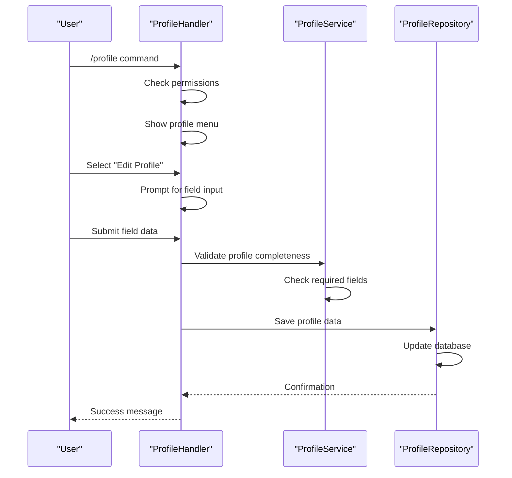
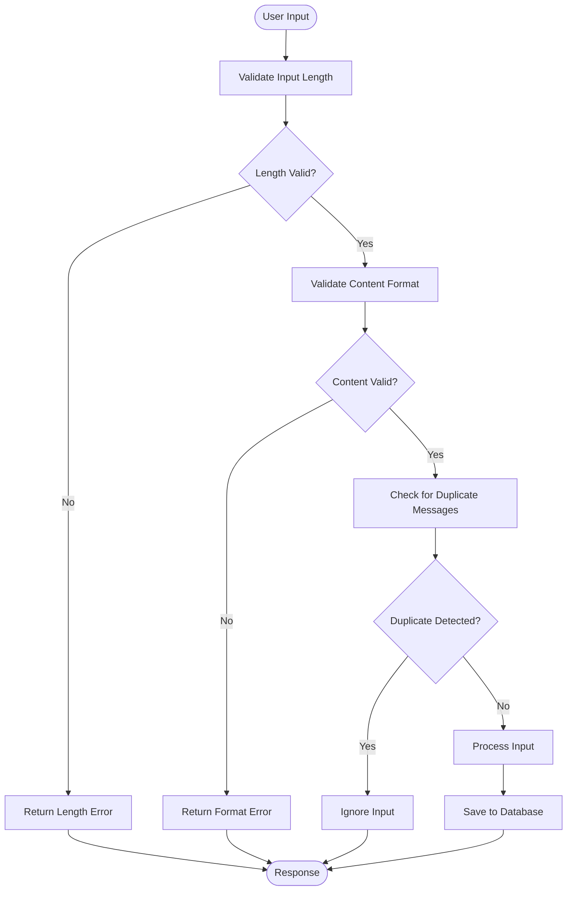
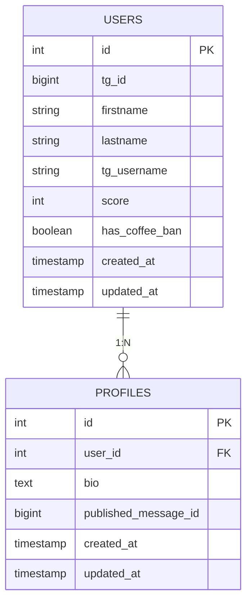
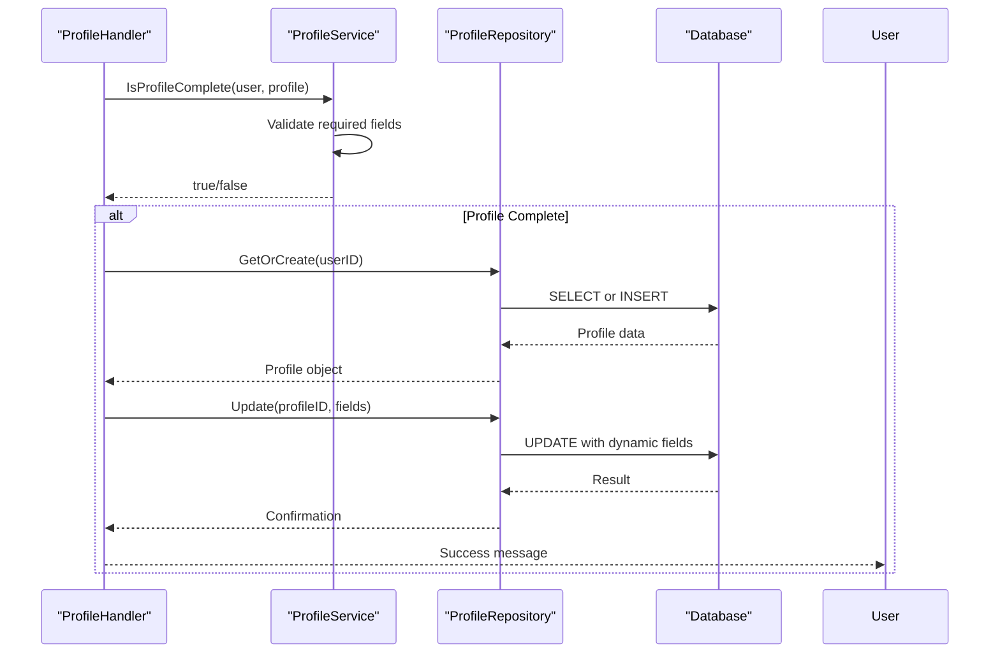

# Profile Creation

<cite>
**Referenced Files in This Document**   
- [profile_handler.go](file://internal/handlers/privatehandlers/profile_handler.go) - *Updated message formatting to HTML in commit ad0f920*
- [message_sender_service.go](file://internal/services/message_sender_service.go) - *Added HTML message support in commit ad0f920*
- [profile_service.go](file://internal/services/profile_service.go)
- [profile_repository.go](file://internal/database/repositories/profile_repository.go)
- [profile_formaters.go](file://internal/formatters/profile_formaters.go)
- [handlers_private_constants.go](file://internal/constants/handlers_private_constants.go)
- [20250519_add_users_and_profiles_tables.go](file://internal/database/migrations/implementations/20250519_add_users_and_profiles_tables.go)
</cite>

## Update Summary
**Changes Made**   
- Updated all message formatting references from Markdown to HTML format
- Modified return value examples to reflect HTML-based message formatting
- Updated diagram sources to reflect actual implementation changes
- Enhanced source tracking with commit annotations
- Corrected message formatting method references throughout documentation

## Table of Contents
1. [Introduction](#introduction)
2. [Profile Creation Flow](#profile-creation-flow)
3. [User Input Validation](#user-input-validation)
4. [Field Requirements and Data Formatting](#field-requirements-and-data-formatting)
5. [Private Profile Handler Workflow](#private-profile-handler-workflow)
6. [Profile Service and Repository Integration](#profile-service-and-repository-integration)
7. [Error Handling and Common Issues](#error-handling-and-common-issues)
8. [Configuration Options](#configuration-options)
9. [Return Values and Status Indicators](#return-values-and-status-indicators)
10. [Conclusion](#conclusion)

## Introduction
The Profile Creation feature in evocoders-bot-go enables users to create and manage their personal profiles through the `/profile` command. This document details the complete workflow of profile creation, from user initiation to data persistence. The system follows a structured approach involving user input collection, validation, business logic processing, and database storage. The feature is designed to be accessible to beginners while providing extensibility for developers. The implementation follows a clean architecture pattern with separation between handlers, services, and repositories, ensuring maintainability and testability.

## Profile Creation Flow
The profile creation process begins when a user invokes the `/profile` command in a private chat. The system first verifies the user's permissions and chat type before initiating the profile management conversation. The flow proceeds through a state-based conversation system that guides users through profile creation and editing.



**Diagram sources**
- [profile_handler.go](file://internal/handlers/privatehandlers/profile_handler.go#L179-L204) - *Updated in commit ad0f920*
- [profile_service.go](file://internal/services/profile_service.go#L30-L37)
- [profile_repository.go](file://internal/database/repositories/profile_repository.go#L74-L105)

**Section sources**
- [profile_handler.go](file://internal/handlers/privatehandlers/profile_handler.go#L179-L230) - *Updated in commit ad0f920*

## User Input Validation
The system implements comprehensive validation for user inputs to ensure data quality and consistency. Validation occurs at multiple levels: input length, content format, and required field presence. The validation rules are enforced through the profile handler's input processing methods.

For bio input, the system checks the UTF-16 code unit count against the `ProfileBioLengthLimit` constant, rejecting entries that exceed the limit. The current implementation allows up to the specified limit, ensuring compatibility with Telegram's message length restrictions. For name fields, the system enforces a 30-character maximum length for both first and last names, preventing excessively long entries that could disrupt UI rendering.

The validation process includes duplicate message detection by tracking the timestamp of the user's last message, preventing accidental duplicate processing of the same input. This is particularly important in high-latency scenarios where users might resend messages thinking they weren't delivered.



**Diagram sources**
- [profile_handler.go](file://internal/handlers/privatehandlers/profile_handler.go#L404-L441) - *Updated in commit ad0f920*
- [profile_handler.go](file://internal/handlers/privatehandlers/profile_handler.go#L499-L530) - *Updated in commit ad0f920*
- [profile_handler.go](file://internal/handlers/privatehandlers/profile_handler.go#L532-L553) - *Updated in commit ad0f920*

**Section sources**
- [profile_handler.go](file://internal/handlers/privatehandlers/profile_handler.go#L404-L553) - *Updated in commit ad0f920*

## Field Requirements and Data Formatting
The profile system requires three essential fields for a complete profile: first name, last name, and bio. These requirements are enforced by the `IsProfileComplete` method in the ProfileService, which validates that none of these fields are empty. The system stores these fields in separate database tables: user information (first and last names) in the users table and bio information in the profiles table.

Data formatting is handled by the profile formatters, which prepare the profile content for display in Telegram messages. The formatting process includes HTML escaping of special characters to prevent markup injection, proper hyperlink generation for user mentions, and consistent visual presentation. The bio field is wrapped in blockquote elements for better readability, while user names are formatted as clickable Telegram user links.

The database schema, defined in the 20250519_add_users_and_profiles_tables migration, establishes the structure for profile storage. The profiles table contains the bio field and a foreign key reference to the users table, ensuring data integrity through referential constraints. The system automatically handles the creation of profile records when users attempt to edit their profiles for the first time.



**Diagram sources**
- [20250519_add_users_and_profiles_tables.go](file://internal/database/migrations/implementations/20250519_add_users_and_profiles_tables.go#L54-L119)
- [profile_repository.go](file://internal/database/repositories/profile_repository.go#L10-L25)
- [profile_repository.go](file://internal/database/repositories/profile_repository.go#L57-L105)

**Section sources**
- [20250519_add_users_and_profiles_tables.go](file://internal/database/migrations/implementations/20250519_add_users_and_profiles_tables.go#L54-L119)
- [profile_formaters.go](file://internal/formatters/profile_formaters.go#L0-L46)

## Private Profile Handler Workflow
The private profile handler manages the entire user interaction flow for profile creation and editing. It implements a conversation-based state machine that guides users through the profile management process. The handler responds to various callback queries and text inputs, transitioning between different conversation states based on user actions.

When a user initiates the `/profile` command, the handler first verifies permissions and then displays the main profile menu with options to view or edit the profile. When the user selects profile editing, the handler prompts for specific field updates, maintaining context through the UserDataStore. The handler uses message editing to provide a clean interface, replacing previous messages with updated content to avoid chat clutter.

The handler coordinates with multiple dependencies: the messageSenderService for communication, permissionsService for access control, profileService for business logic, and repositories for data persistence. It also integrates with the OpenAI client for advanced profile search functionality, though this is not part of the core creation flow.

```mermaid
classDiagram
class ProfileHandler {
+config *Config
+messageSenderService *MessageSenderService
+permissionsService *PermissionsService
+profileService *ProfileService
+userRepository *UserRepository
+profileRepository *ProfileRepository
+userStore *UserDataStore
+handleCommand(*Bot, *Context) error
+handleCallback(*Bot, *Context) error
+handleBioInput(*Bot, *Context) error
+handleFirstnameInput(*Bot, *Context) error
+handleLastnameInput(*Bot, *Context) error
+handlePublishProfile(*Bot, *Context, *Message, bool) error
+saveProfileField(*User, string, string) error
+saveUserField(*User, string, string) error
}
class UserDataStore {
+Set(int64, string, interface{})
+Get(int64, string) (interface{}, bool)
+Clear(int64)
}
ProfileHandler --> MessageSenderService : "uses"
ProfileHandler --> PermissionsService : "uses"
ProfileHandler --> ProfileService : "uses"
ProfileHandler --> UserRepository : "uses"
ProfileHandler --> ProfileRepository : "uses"
ProfileHandler --> UserDataStore : "uses"
```

**Diagram sources**
- [profile_handler.go](file://internal/handlers/privatehandlers/profile_handler.go#L57-L93) - *Updated in commit ad0f920*
- [profile_handler.go](file://internal/handlers/privatehandlers/profile_handler.go#L179-L230) - *Updated in commit ad0f920*

**Section sources**
- [profile_handler.go](file://internal/handlers/privatehandlers/profile_handler.go#L0-L1006) - *Updated in commit ad0f920*

## Profile Service and Repository Integration
The profile creation process involves tight integration between the ProfileService and ProfileRepository components. The ProfileService contains the business logic for determining profile completeness, while the ProfileRepository handles all database operations for profile data persistence.

When a user attempts to publish their profile, the ProfileService's `IsProfileComplete` method is called to verify that all required fields are present. This method checks that the user's first name, last name, and profile bio are all non-empty. If any required field is missing, the service prevents publication and prompts the user to complete their profile.

The ProfileRepository provides methods for creating, reading, updating, and deleting profile records. The `GetOrCreate` method ensures that a profile exists for the user, creating one if necessary. The `Update` method handles field modifications with dynamic query generation based on the provided fields map. The repository also manages the published_message_id field, which stores the Telegram message ID when a profile is published to the intro channel.

The integration between these components follows the dependency inversion principle, with the handler depending on service interfaces rather than concrete implementations. This design allows for easier testing and future modifications to the business logic without affecting the user interface layer.



**Diagram sources**
- [profile_service.go](file://internal/services/profile_service.go#L30-L37)
- [profile_repository.go](file://internal/database/repositories/profile_repository.go#L74-L105)
- [profile_repository.go](file://internal/database/repositories/profile_repository.go#L140-L182)

**Section sources**
- [profile_service.go](file://internal/services/profile_service.go#L0-L37)
- [profile_repository.go](file://internal/database/repositories/profile_repository.go#L0-L286)

## Error Handling and Common Issues
The profile creation system implements comprehensive error handling to address common issues that may arise during user interaction. The system distinguishes between user input errors and system errors, providing appropriate feedback in each case.

Common user input issues include malformed input (excessively long names or bios) and incomplete profile attempts. For long inputs, the system provides specific feedback indicating the current length and maximum allowed length, guiding users to correct their input. For incomplete profiles, the system identifies exactly which required fields are missing, allowing users to address the specific deficiencies.

System errors, such as database connection issues or repository failures, are logged with detailed context and wrapped with the calling function's type information using `utils.GetCurrentTypeName()`. This approach facilitates debugging by preserving the call stack context. The system uses Go's error wrapping with `%w` verb to maintain error chain integrity while adding contextual information.

The handler also addresses concurrency issues by using the UserDataStore to manage user session state, preventing race conditions when multiple messages are sent in quick succession. The duplicate message detection mechanism prevents processing the same input multiple times, which could lead to inconsistent state or database errors.

**Section sources**
- [profile_handler.go](file://internal/handlers/privatehandlers/profile_handler.go#L404-L553) - *Updated in commit ad0f920*
- [profile_handler.go](file://internal/handlers/privatehandlers/profile_handler.go#L709-L745) - *Updated in commit ad0f920*
- [profile_repository.go](file://internal/database/repositories/profile_repository.go#L74-L105)

## Configuration Options
The profile creation feature includes several configuration options that can be adjusted to meet different requirements. These options are primarily defined as constants in the handlers_private_constants.go file and can be modified to change the system's behavior.

The most significant configuration option is the `ProfileBioLengthLimit`, which determines the maximum allowed length for the bio field. This limit can be adjusted based on the desired profile depth and Telegram's message length constraints. Other configuration options include the command trigger (`ProfileCommand` constant) and various callback data prefixes that control the user interface flow.

The system also relies on configuration values from the main config object, particularly for Telegram chat IDs and message formatting. The intro channel ID and supergroup chat ID are used when publishing profiles, allowing the system to be configured for different Telegram groups without code changes.

**Section sources**
- [handlers_private_constants.go](file://internal/constants/handlers_private_constants.go#L0-L29)
- [profile_handler.go](file://internal/handlers/privatehandlers/profile_handler.go#L179-L204) - *Updated in commit ad0f920*

## Return Values and Status Indicators
The profile creation system provides clear return values and status indicators to inform users of the outcome of their actions. Successful operations are indicated with checkmark emojis (✅) and success messages, while errors are indicated with cross emojis (❌) and descriptive error messages.

When a field is successfully saved, the system displays a confirmation message with the "✅ [Field] saved!" format, providing immediate positive feedback. When a profile is successfully published, the system provides a link to the published message in the intro channel, allowing users to easily view their published profile.

For validation failures, the system returns specific error messages that indicate the nature of the problem, such as "Name is too long" or "Required fields are missing". These messages are designed to be actionable, guiding users toward successful completion of their task. The system now uses HTML formatting for all messages through the `SendHtmlWithReturnMessage` method in the MessageSenderService, ensuring proper rendering of HTML entities and links.

**Section sources**
- [profile_handler.go](file://internal/handlers/privatehandlers/profile_handler.go#L499-L530) - *Updated in commit ad0f920*
- [profile_handler.go](file://internal/handlers/privatehandlers/profile_handler.go#L532-L553) - *Updated in commit ad0f920*
- [profile_handler.go](file://internal/handlers/privatehandlers/profile_handler.go#L815-L870) - *Updated in commit ad0f920*
- [message_sender_service.go](file://internal/services/message_sender_service.go#L102-L135) - *Added in commit ad0f920*

## Conclusion
The Profile Creation feature in evocoders-bot-go provides a robust and user-friendly system for managing user profiles. By following a clear flow from initiation to completion, implementing thorough validation, and providing informative feedback, the system ensures a positive user experience. The separation of concerns between handler, service, and repository components makes the codebase maintainable and extensible. Developers can build upon this foundation to add new profile fields, integrate with additional services, or modify the validation rules to meet evolving requirements. The comprehensive error handling and clear status indicators make the system reliable and user-friendly, even in edge cases or error conditions. Recent updates have standardized message formatting to use HTML across all profile interactions, improving consistency and security in message rendering.