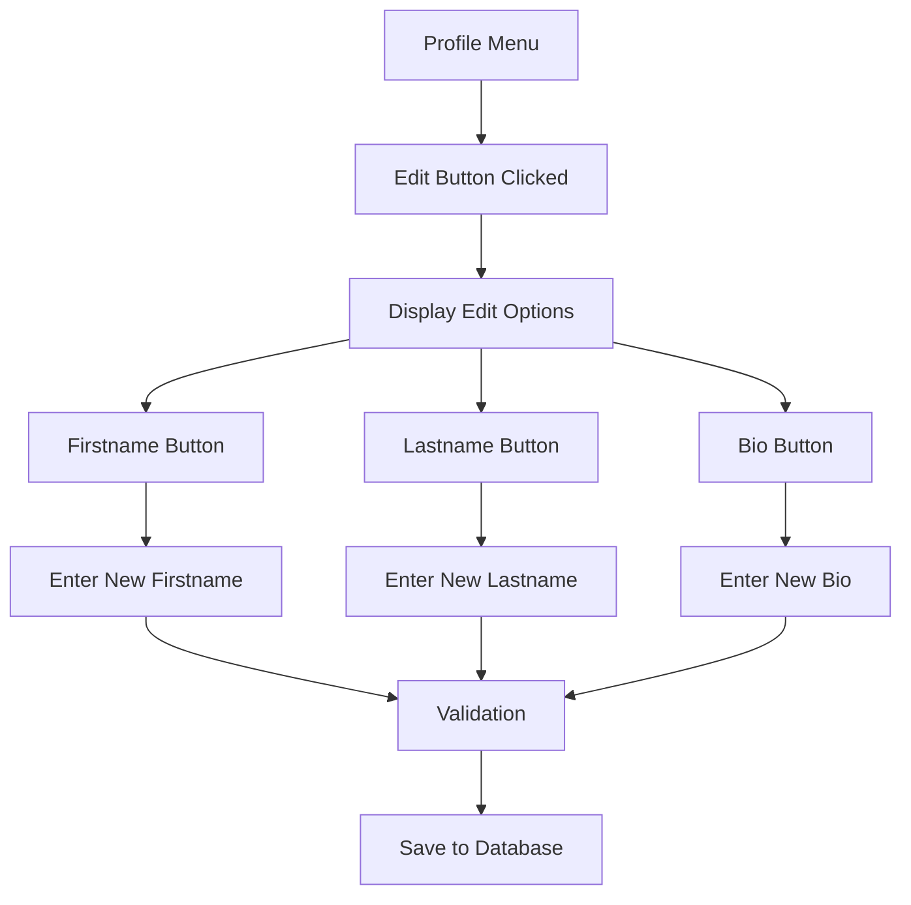
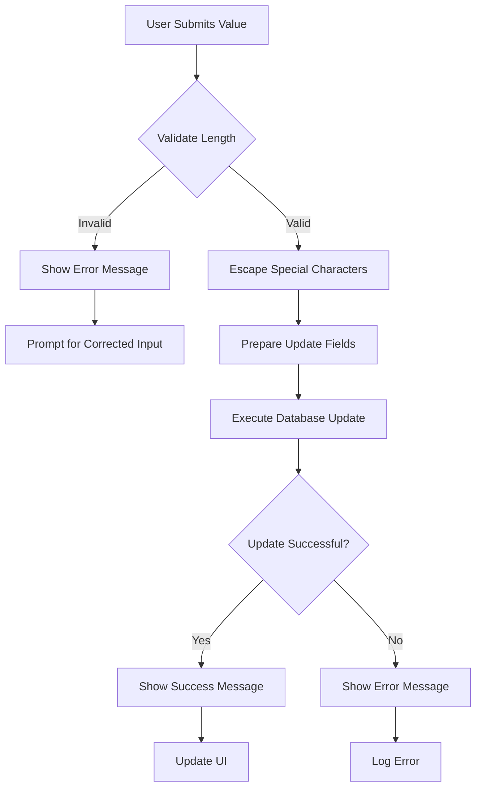
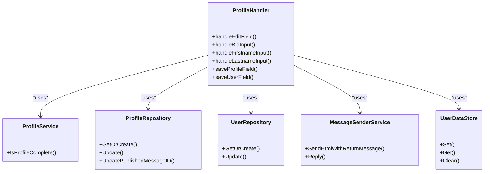

# Profile Editing

<cite>
**Referenced Files in This Document**   
- [profile_handler.go](file://internal/handlers/privatehandlers/profile_handler.go)
- [profile_repository.go](file://internal/database/repositories/profile_repository.go)
- [profile_service.go](file://internal/services/profile_service.go)
- [profile_handler_buttons.go](file://internal/buttons/profile_handler_buttons.go)
- [handlers_private_constants.go](file://internal/constants/handlers_private_constants.go)
</cite>

## Table of Contents
1. [Introduction](#introduction)
2. [Profile Edit Flow Overview](#profile-edit-flow-overview)
3. [User Interaction and Inline Buttons](#user-interaction-and-inline-buttons)
4. [State Management During Editing](#state-management-during-editing)
5. [Data Retrieval Process](#data-retrieval-process)
6. [Field Validation and Persistence](#field-validation-and-persistence)
7. [Component Interaction](#component-interaction)
8. [Editable Fields and Parameters](#editable-fields-and-parameters)
9. [Success and Failure Indicators](#success-and-failure-indicators)
10. [Configuration and Permissions](#configuration-and-permissions)
11. [Common Issues and Solutions](#common-issues-and-solutions)
12. [Conclusion](#conclusion)

## Introduction
The Profile Editing feature in evocoders-bot-go enables users to modify their personal information through a structured conversation flow initiated via inline keyboard buttons. This documentation details the implementation of the edit functionality, covering the complete workflow from user interaction to data persistence. The system employs a state-based conversation model to guide users through editing their profile information, with validation and error handling at each step. The architecture follows a clean separation of concerns between handlers, services, and repositories, ensuring maintainability and testability of the codebase.

## Profile Edit Flow Overview
The profile editing process follows a sequential flow initiated by user interaction with inline buttons. When a user selects the "Edit" option from the profile menu, the system transitions into an editing state where specific fields can be modified. The flow begins with the display of editing options for firstname, lastname, and bio fields. Upon selecting a field to edit, the user is prompted to enter new values. The system validates input length and content before persisting changes to the database. After successful updates, users receive confirmation messages with options to continue editing or publish their updated profile. The entire process maintains context using a UserDataStore to track conversation states and pending operations for each user.

**Section sources**
- [profile_handler.go](file://internal/handlers/privatehandlers/profile_handler.go#L203-L230)
- [profile_handler.go](file://internal/handlers/privatehandlers/profile_handler.go#L342-L378)

## User Interaction and Inline Buttons
Users trigger the profile editing process through inline keyboard buttons displayed in the profile menu. The main profile interface presents an "Edit" button (labeled "✏️ Редактировать") that initiates the editing workflow. When activated, this button displays a secondary menu with specific editing options for firstname, lastname, and bio fields. Each field has its dedicated button with appropriate labels and callback data. The interface also provides navigation controls including "Back" and "Cancel" buttons to allow users to exit the editing process gracefully. The button layout is organized in a structured grid format, with related actions grouped together for intuitive user experience.

**Diagram sources**
- [profile_handler_buttons.go](file://internal/buttons/profile_handler_buttons.go#L110-L141)
- [handlers_private_constants.go](file://internal/constants/handlers_private_constants.go#L15-L27)

## State Management During Editing
The system employs a conversation-based state management approach to handle the profile editing process. When a user begins editing a profile field, the handler sets a specific conversation state (e.g., `profileStateAwaitBio`, `profileStateAwaitFirstname`) that determines how subsequent messages are processed. The current editing context, including the field being modified, is stored in the UserDataStore using user-specific keys. This approach allows the bot to maintain context across multiple messages and handle concurrent editing sessions for different users. The state transitions are managed through the handlers.NewConversation function, which defines the flow between different stages of the editing process. Each state has specific message handlers that process user input and transition to the next appropriate state.

**Section sources**
- [profile_handler.go](file://internal/handlers/privatehandlers/profile_handler.go#L95-L120)
- [profile_handler.go](file://internal/handlers/privatehandlers/profile_handler.go#L378-L406)

## Data Retrieval Process
When initiating a profile edit operation, the system retrieves existing profile data to display current values to the user. The process begins by fetching the user record from the database using their Telegram ID. Once the user is retrieved, the system attempts to get or create a corresponding profile record. For bio field editing, the current bio content is fetched and properly escaped to prevent HTML injection by replacing `<` and `>` characters with their HTML entities. For firstname and lastname fields, the current values are retrieved directly from the user record. If no existing value is found, the system displays "отсутствует" (absent) to indicate an empty field. This retrieval process ensures users can see their current information before making changes.

**Section sources**
- [profile_handler.go](file://internal/handlers/privatehandlers/profile_handler.go#L378-L406)
- [profile_repository.go](file://internal/database/repositories/profile_repository.go#L140-L182)

## Field Validation and Persistence
The system implements validation rules for each editable field to ensure data quality and consistency. The bio field has a length limit defined by `constants.ProfileBioLengthLimit`, and inputs exceeding this limit are rejected with an appropriate error message. Firstname and lastname fields are limited to 30 characters each, with validation performed immediately upon receiving user input. When validation passes, the system persists changes through the repository layer using parameterized queries to prevent SQL injection. The update operation includes a timestamp update to reflect the modification time. The persistence process is transactional at the statement level, ensuring that either the entire update succeeds or fails without leaving the database in an inconsistent state.

**Diagram sources**
- [profile_handler.go](file://internal/handlers/privatehandlers/profile_handler.go#L709-L745)
- [profile_repository.go](file://internal/database/repositories/profile_repository.go#L57-L105)

## Component Interaction
The profile editing functionality is implemented through a well-defined interaction between handler, service, and repository components. The ProfileHandler receives user input and manages the conversation flow, delegating data operations to the ProfileRepository. The ProfileService provides business logic functions, such as determining if a profile is complete for publishing. The UserRepository handles user-related data operations, while the ProfileRepository manages profile-specific data. These components are injected into the handler through dependency injection in the NewProfileHandler constructor, promoting loose coupling and testability. The MessageSenderService is used to communicate with users through Telegram messages, while the UserDataStore maintains session state across interactions.

**Diagram sources**
- [profile_handler.go](file://internal/handlers/privatehandlers/profile_handler.go#L57-L93)
- [profile_service.go](file://internal/services/profile_service.go#L0-L37)
- [profile_repository.go](file://internal/database/repositories/profile_repository.go#L13-L20)

## Editable Fields and Parameters
The profile editing system supports modification of three primary fields: firstname, lastname, and bio. Each field has specific parameters and constraints governing its editing process. The firstname and lastname fields are stored in the users table and limited to 30 characters each. The bio field is stored in the profiles table with a configurable length limit defined by `constants.ProfileBioLengthLimit`. When editing is initiated, the system passes a descriptive string indicating the expected input (e.g., "новое имя" for firstname, "обновлённую биографию" for bio) along with the target conversation state. These parameters are used to generate appropriate prompts and validation messages for users. The field names are passed as string identifiers to the saveProfileField and saveUserField methods, which use them as database column names in update operations.

**Section sources**
- [profile_handler.go](file://internal/handlers/privatehandlers/profile_handler.go#L203-L230)
- [profile_handler.go](file://internal/handlers/privatehandlers/profile_handler.go#L709-L745)

## Success and Failure Indicators
The system provides clear feedback to users regarding the outcome of edit operations through both visual indicators and status messages. Upon successful updates, users receive confirmation messages with a checkmark emoji (✅) indicating completion, such as "✅ Биография сохранена!" (Bio saved!). Failed operations trigger error messages with appropriate guidance, such as length requirements for oversized inputs. The interface updates to reflect the new state, showing success messages with options to continue editing or publish the profile. In the backend, all operations return explicit error values that include contextual information for debugging, using wrapped errors with type names and operation details. The system also handles edge cases like duplicate messages from the same timestamp by silently ignoring them to prevent processing errors.

**Section sources**
- [profile_handler.go](file://internal/handlers/privatehandlers/profile_handler.go#L740-L745)
- [profile_handler.go](file://internal/handlers/privatehandlers/profile_handler.go#L450-L455)

## Configuration and Permissions
Profile editing functionality is governed by configuration settings and permission checks to ensure appropriate access control. The system verifies that operations occur in private chat contexts and that users have the necessary club member permissions before allowing profile modifications. These checks are performed in the handleCommand method before initiating any editing workflow. Configuration values such as the bio length limit are defined as constants and can be adjusted without modifying the core logic. The system also respects user privacy by not exposing sensitive information and by properly escaping HTML content in bio fields to prevent injection attacks. The conversation flow is designed to be cancellable at any point, with appropriate cleanup of temporary state.

**Section sources**
- [profile_handler.go](file://internal/handlers/privatehandlers/profile_handler.go#L130-L138)
- [handlers_private_constants.go](file://internal/constants/handlers_private_constants.go#L5-L13)

## Common Issues and Solutions
The profile editing system addresses several common issues through proactive design and error handling. Concurrent edits are managed through the state-based conversation model, which ensures that each user's editing session is isolated and tracked independently. Invalid field changes are prevented through client-side validation that checks input length before submission. The system handles cases where users send multiple messages with the same timestamp by tracking the last message time and ignoring duplicates. Database update failures are caught and reported to users with appropriate error messages, while detailed error logging helps diagnose underlying issues. The UserDataStore is properly cleared when conversations end to prevent memory leaks and ensure fresh sessions. Transactional integrity is maintained by updating the updated_at timestamp with each modification, providing an audit trail of changes.

**Section sources**
- [profile_handler.go](file://internal/handlers/privatehandlers/profile_handler.go#L709-L745)
- [profile_handler.go](file://internal/handlers/privatehandlers/profile_handler.go#L420-L425)

## Conclusion
The Profile Editing feature in evocoders-bot-go demonstrates a robust implementation of user profile management through Telegram interactions. By leveraging a state-based conversation model, the system provides a guided experience for users to modify their personal information securely and efficiently. The clean separation between handler, service, and repository components ensures maintainability and testability of the codebase. Comprehensive validation and error handling protect data integrity while providing clear feedback to users. The system effectively manages state, handles edge cases, and maintains transactional consistency throughout the editing process. This implementation serves as a solid foundation for profile management that can be extended with additional fields or validation rules as needed.