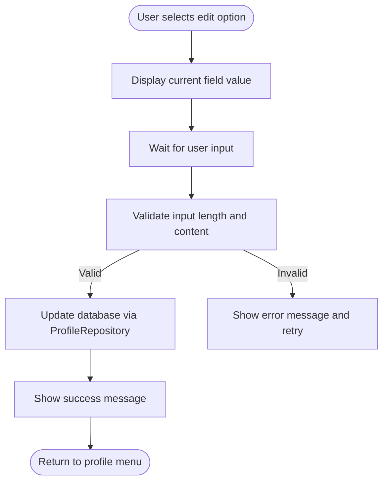
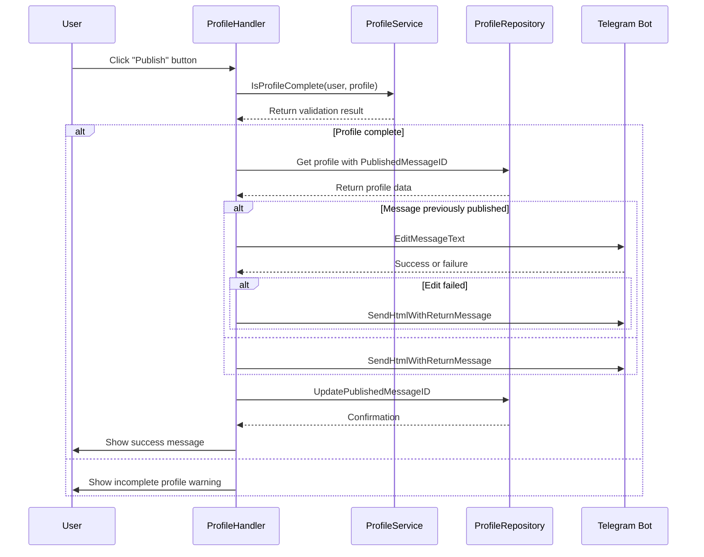
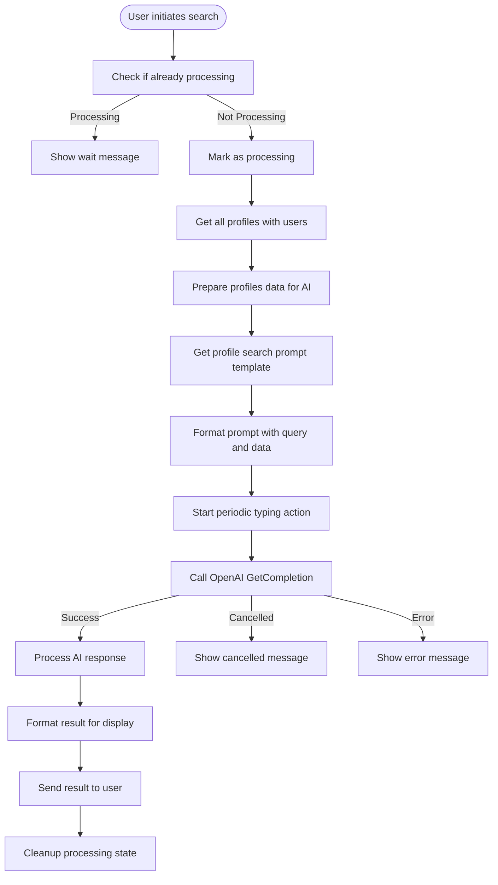
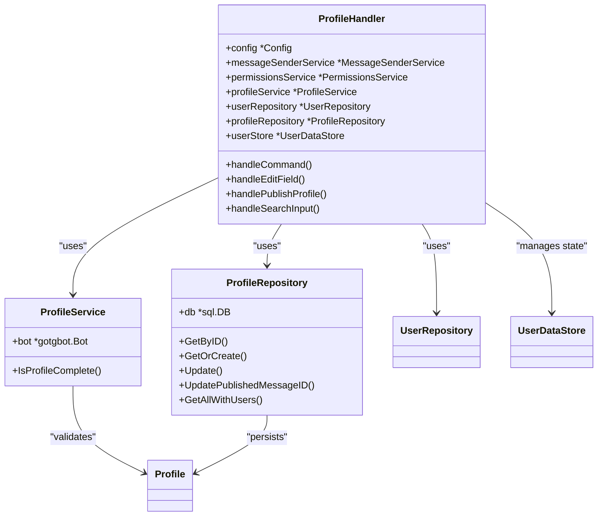

# Profile Management

<cite>
**Referenced Files in This Document**   
- [profile_handler.go](file://internal/handlers/privatehandlers/profile_handler.go)
- [profile_service.go](file://internal/services/profile_service.go)
- [profile_repository.go](file://internal/database/repositories/profile_repository.go)
- [profile_formaters.go](file://internal/formatters/profile_formaters.go)
- [config.go](file://internal/config/config.go)
- [20250519_add_users_and_profiles_tables.go](file://internal/database/migrations/implementations/20250519_add_users_and_profiles_tables.go)
- [20250520_add_published_message_id_to_profiles.go](file://internal/database/migrations/implementations/20250520_add_published_message_id_to_profiles.go)
- [20250807_add_profile_search_prompt.go](file://internal/database/migrations/implementations/20250807_add_profile_search_prompt.go)
- [profile_prompt.go](file://internal/database/prompts/profile_prompt.go)
- [profile_handler_buttons.go](file://internal/buttons/profile_handler_buttons.go)
- [handlers_private_constants.go](file://internal/constants/handlers_private_constants.go)
</cite>

## Table of Contents
1. [Introduction](#introduction)
2. [Profile Creation Flow](#profile-creation-flow)
3. [Profile Editing Process](#profile-editing-process)
4. [Publishing Mechanism to Intro Topic](#publishing-mechanism-to-intro-topic)
5. [Search Functionality](#search-functionality)
6. [Component Interaction Architecture](#component-interaction-architecture)
7. [Configuration and Parameters](#configuration-and-parameters)
8. [Common Issues and Solutions](#common-issues-and-solutions)
9. [Conclusion](#conclusion)

## Introduction
The Profile Management feature in evocoders-bot-go enables users to create, edit, publish, and search profiles within the Evocoders community. This comprehensive system allows members to showcase their professional background and connect with others through a structured profile interface. The feature supports both direct profile management and AI-powered search capabilities, providing a rich user experience for community engagement. The implementation follows a clean architecture pattern with clear separation between handlers, services, and repositories, ensuring maintainability and scalability.

## Profile Creation Flow
The profile creation flow in evocoders-bot-go follows a lazy initialization pattern, where profiles are automatically created when users first interact with the profile system. When a user invokes the `/profile` command, the system checks for the existence of their profile through the `GetOrCreate` method in the ProfileRepository. If no profile exists, it is automatically created with default values. This approach eliminates the need for a separate profile creation step, simplifying the user experience. The profile creation is tightly coupled with user data, as each profile is linked to a user record in the database through a foreign key relationship. The initial migration script `20250519_add_users_and_profiles_tables.go` establishes this relationship by creating both users and profiles tables with appropriate constraints and indexes.

**Section sources**
- [profile_handler.go](file://internal/handlers/privatehandlers/profile_handler.go#L285-L317)
- [profile_repository.go](file://internal/database/repositories/profile_repository.go#L140-L182)
- [20250519_add_users_and_profiles_tables.go](file://internal/database/migrations/implementations/20250519_add_users_and_profiles_tables.go#L0-L119)

## Profile Editing Process
The profile editing process is implemented through a state-based conversation flow that guides users through updating their profile information. The system supports editing three key fields: firstname, lastname, and bio. When a user selects an editing option, the handler stores the current editing context in memory using the UserDataStore, which tracks the field being edited and the user's conversation state. Input validation is performed at multiple levels: the bio field has a character limit enforced by `ProfileBioLengthLimit`, while name fields are limited to 30 characters. Special characters in bio content are automatically escaped to prevent HTML injection by replacing `<` and `>` with their HTML entities. The editing process follows a three-step pattern: display current value, accept new input, and confirm successful update with appropriate feedback.

**Diagram sources**
- [profile_handler.go](file://internal/handlers/privatehandlers/profile_handler.go#L378-L441)
- [profile_repository.go](file://internal/database/repositories/profile_repository.go#L65-L85)

**Section sources**
- [profile_handler.go](file://internal/handlers/privatehandlers/profile_handler.go#L378-L441)
- [profile_repository.go](file://internal/database/repositories/profile_repository.go#L65-L85)
- [profile_formaters.go](file://internal/formatters/profile_formaters.go#L0-L46)

## Publishing Mechanism to Intro Topic
The publishing mechanism allows users to share their profiles in the designated "Intro" topic within the Telegram supergroup. Before publishing, the system validates that the profile meets completeness requirements through the `IsProfileComplete` method in ProfileService, which checks for the presence of firstname, lastname, and bio. If any required field is missing, the user is prompted to complete their profile before publishing. When publishing, the system first checks if the profile has been published previously by examining the `PublishedMessageID` field. If a previous publication exists, the system attempts to edit the existing message; otherwise, it creates a new message in the Intro topic thread. After successful publication, the message ID is stored in the profile record to enable future updates. The publication process supports two modes: with and without link preview, controlled by the `withoutPreview` parameter.

**Diagram sources**
- [profile_handler.go](file://internal/handlers/privatehandlers/profile_handler.go#L584-L676)
- [profile_service.go](file://internal/services/profile_service.go#L0-L37)
- [profile_repository.go](file://internal/database/repositories/profile_repository.go#L100-L115)

**Section sources**
- [profile_handler.go](file://internal/handlers/privatehandlers/profile_handler.go#L584-L711)
- [profile_service.go](file://internal/services/profile_service.go#L0-L37)
- [20250520_add_published_message_id_to_profiles.go](file://internal/database/migrations/implementations/20250520_add_published_message_id_to_profiles.go#L0-L83)

## Search Functionality
The search functionality in evocoders-bot-go provides two distinct methods for finding profiles: direct username/name search and AI-powered bio search. The direct search allows users to find profiles by Telegram username (with or without @) or by full name (firstname and lastname separated by space). This search is implemented through database queries in the UserRepository, first attempting to match by username and falling back to name search if no results are found. The AI-powered search uses OpenAI's completion API to analyze profile bios based on natural language queries. The search process begins by retrieving all profiles with bios from the database, formatting them into a structured data payload, and combining this with a predefined prompt template from the database. The system implements request cancellation through context management, allowing users to cancel ongoing search operations. Rate limiting is enforced by preventing concurrent searches for the same user.

**Diagram sources**
- [profile_handler.go](file://internal/handlers/privatehandlers/profile_handler.go#L834-L898)
- [profile_repository.go](file://internal/database/repositories/profile_repository.go#L200-L245)
- [profile_prompt.go](file://internal/database/prompts/profile_prompt.go#L0-L18)

**Section sources**
- [profile_handler.go](file://internal/handlers/privatehandlers/profile_handler.go#L285-L317)
- [profile_repository.go](file://internal/database/repositories/profile_repository.go#L200-L245)
- [20250807_add_profile_search_prompt.go](file://internal/database/migrations/implementations/20250807_add_profile_search_prompt.go#L0-L60)
- [profile_prompt.go](file://internal/database/prompts/profile_prompt.go#L0-L18)

## Component Interaction Architecture
The Profile Management feature follows a layered architecture with clear separation of concerns between components. The interaction begins with the ProfileHandler, which receives user input from Telegram and manages the conversation state. The handler delegates business logic to the ProfileService, which contains domain-specific rules such as profile completeness validation. Data persistence operations are handled by the ProfileRepository, which provides an abstraction layer over the database. This architecture enables loose coupling between components, making the system more maintainable and testable. The components are connected through dependency injection, with the ProfileHandler receiving instances of ProfileService, ProfileRepository, and other dependencies through its constructor. The flow of data follows a unidirectional pattern from handler to service to repository and back, ensuring predictable behavior and easier debugging.

**Diagram sources**
- [profile_handler.go](file://internal/handlers/privatehandlers/profile_handler.go#L57-L93)
- [profile_service.go](file://internal/services/profile_service.go#L0-L37)
- [profile_repository.go](file://internal/database/repositories/profile_repository.go#L23-L25)

**Section sources**
- [profile_handler.go](file://internal/handlers/privatehandlers/profile_handler.go#L57-L93)
- [profile_service.go](file://internal/services/profile_service.go#L0-L37)
- [profile_repository.go](file://internal/database/repositories/profile_repository.go#L23-L25)

## Configuration and Parameters
The Profile Management feature utilizes several configuration parameters and constants that control its behavior. These are defined in various files across the codebase and include both compile-time constants and runtime configuration values. The system uses environment variables loaded through the Config struct to determine key operational parameters such as the supergroup chat ID and intro topic ID, which are essential for message routing. Field-specific constraints are implemented as constants, including the bio length limit which prevents excessively long biographies. The search functionality relies on a prompt template stored in the database, which can be updated without code changes. Button labels and menu headers are defined as constants to ensure consistency across the user interface. This configuration approach provides flexibility while maintaining security by keeping sensitive information out of the codebase.

**Configuration Options for Profile Fields**
| Field | Parameter | Value | Description |
|-------|---------|-------|-------------|
| Bio | ProfileBioLengthLimit | 500 | Maximum character length for bio field |
| Firstname | MaxLength | 30 | Maximum character length for firstname |
| Lastname | MaxLength | 30 | Maximum character length for lastname |
| Username | Format | @username or username | Accepts Telegram username with or without @ prefix |

**Search Query Parameters**
| Parameter | Type | Description | Default |
|---------|------|-------------|---------|
| query | string | Search term for AI-powered bio search | None (required) |
| withoutPreview | boolean | Controls link preview in published messages | false |
| processing | boolean | Tracks ongoing search operations per user | false |

**Return Values from Profile Operations**
| Operation | Success Return | Error Return | Notes |
|---------|---------------|--------------|-------|
| Profile creation | Profile object | Error object | Auto-created if not exists |
| Profile update | nil | Error object | Returns error on validation failure |
| Profile publication | Published message ID | Error object | Stores message ID for future updates |
| Profile search | Formatted results | Error message | AI search returns natural language response |

**Section sources**
- [config.go](file://internal/config/config.go#L0-L340)
- [handlers_private_constants.go](file://internal/constants/handlers_private_constants.go#L0-L28)
- [profile_handler_buttons.go](file://internal/buttons/profile_handler_buttons.go#L0-L143)

## Common Issues and Solutions
The Profile Management system addresses several common issues that arise in user profile management. One frequent issue is handling incomplete profiles during the publishing process. The system solves this by implementing the `IsProfileComplete` method in ProfileService, which validates that all required fields (firstname, lastname, and bio) are present before allowing publication. Another common issue is duplicate profile creation, which is prevented through the use of database constraints and the `GetOrCreate` pattern that checks for existing profiles before creating new ones. Input validation issues are addressed through multiple layers of validation, including character limits and HTML escaping to prevent injection attacks. For search functionality, the system handles the issue of long-running AI requests by implementing context cancellation and periodic typing indicators to maintain user engagement. Rate limiting is enforced by tracking processing state in the UserDataStore to prevent concurrent searches by the same user.

**Section sources**
- [profile_service.go](file://internal/services/profile_service.go#L0-L37)
- [profile_repository.go](file://internal/database/repositories/profile_repository.go#L140-L182)
- [profile_handler.go](file://internal/handlers/privatehandlers/profile_handler.go#L834-L865)

## Conclusion
The Profile Management feature in evocoders-bot-go provides a comprehensive solution for user profile creation, editing, publication, and discovery within the Evocoders community. The system's architecture follows best practices with clear separation of concerns between handlers, services, and repositories, making it maintainable and extensible. Key strengths include the lazy profile creation pattern, robust validation mechanisms, and innovative AI-powered search capabilities. The publishing workflow ensures content quality by requiring complete profiles before publication, while the search functionality enhances discoverability through natural language processing. The implementation demonstrates thoughtful consideration of user experience, with intuitive navigation, clear feedback messages, and cancellation capabilities for long-running operations. This feature serves as a solid foundation for community engagement and can be extended with additional profile fields or search capabilities in the future.