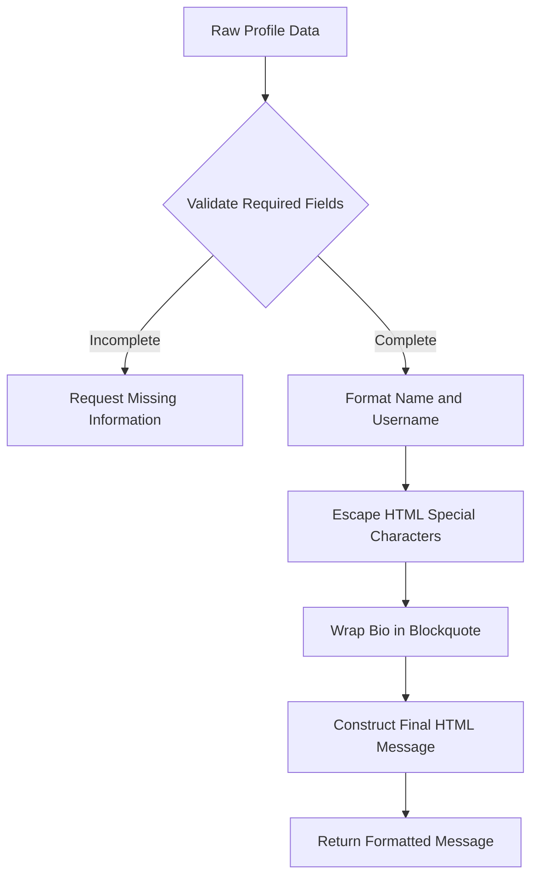
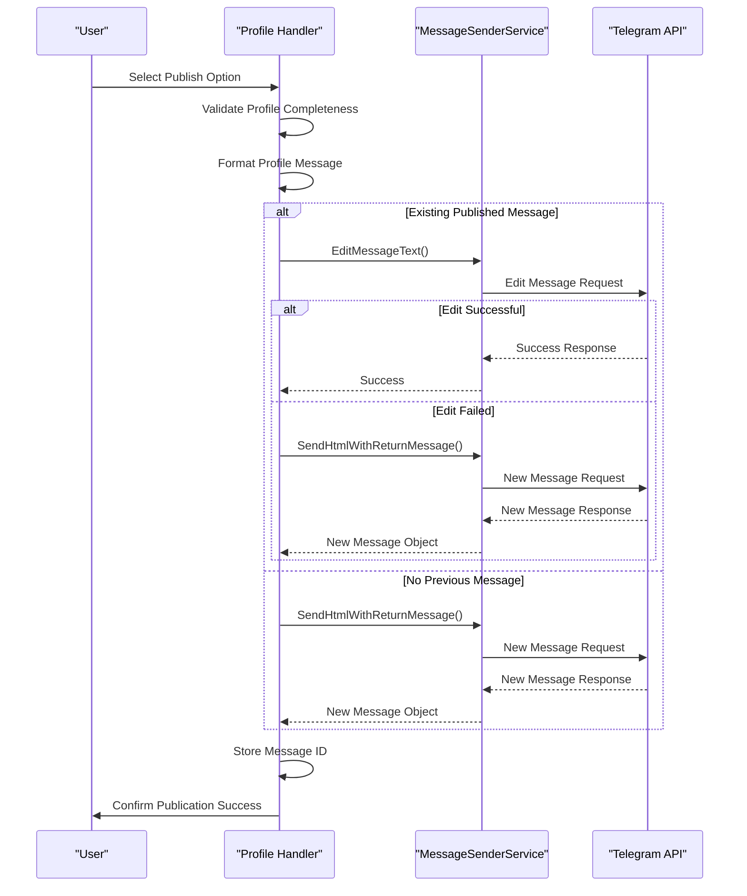

# Profile Publishing

<cite>
**Referenced Files in This Document**   
- [profile_handler.go](file://internal/handlers/privatehandlers/profile_handler.go)
- [profiles_manager_handler.go](file://internal/handlers/adminhandlers/profiles_manager_handler.go)
- [message_sender_service.go](file://internal/services/message_sender_service.go)
- [profile_formaters.go](file://internal/formatters/profile_formaters.go)
- [profile_repository.go](file://internal/database/repositories/profile_repository.go)
- [config.go](file://internal/config/config.go)
</cite>

## Table of Contents
1. [Introduction](#introduction)
2. [Publishing Trigger Mechanism](#publishing-trigger-mechanism)
3. [Profile Data Formatting](#profile-data-formatting)
4. [Message Delivery Process](#message-delivery-process)
5. [Published Message ID Storage](#published-message-id-storage)
6. [Configuration Options](#configuration-options)
7. [Error Handling and Common Issues](#error-handling-and-common-issues)
8. [Conclusion](#conclusion)

## Introduction
The Profile Publishing feature in evocoders-bot-go enables users to publish their profiles to the Intro topic within a Telegram group. This functionality allows members to introduce themselves to the community by sharing their bio, name, and other relevant information in a structured format. The publishing process involves several components working together: the message sender service for delivering messages to Telegram, formatting utilities for preparing the profile content, and database operations for tracking published messages. This document provides a comprehensive technical overview of how the profile publishing mechanism works, including the trigger conditions, message formatting, delivery process, and error handling strategies.

## Publishing Trigger Mechanism
The profile publishing action is initiated through user interaction with the bot's interface, either via private commands or admin controls. When a user selects the publish option from their profile menu, the bot triggers the publishing workflow. The system first validates that the profile contains all required information—specifically the user's first name, last name, and bio—before proceeding with publication. If any of these fields are missing, the bot prompts the user to complete their profile before publishing.

The publishing functionality is accessible through two primary handlers: the private profile handler for regular users and the admin profiles manager handler for administrators. Both handlers implement similar logic for initiating the publish action, with slight variations in user interface and permissions checking. The trigger mechanism uses callback queries to detect when a user has selected the publish option, which then invokes the appropriate handler function to begin the publishing process.

**Section sources**
- [profile_handler.go](file://internal/handlers/privatehandlers/profile_handler.go#L584-L625)
- [profiles_manager_handler.go](file://internal/handlers/adminhandlers/profiles_manager_handler.go#L831-L864)

## Profile Data Formatting
Profile data is formatted into a structured message using dedicated formatting utilities before being sent to the Telegram group. The formatting process transforms raw user data into an HTML-formatted message that includes the user's full name as a clickable Telegram user link, their username (if available), and their bio content. The formatter applies HTML escaping to prevent injection issues by replacing special characters like `<` and `>` with their corresponding HTML entities.

The `FormatPublicProfileForMessage` function in the formatters package is responsible for constructing the final message text. It creates a consistent visual format that begins with a waving hand emoji followed by the user's name and username. The bio content is wrapped in a blockquote element for visual distinction. This formatting ensures that all published profiles have a uniform appearance in the Intro topic, enhancing readability and consistency across the community.

**Diagram sources**
- [profile_formaters.go](file://internal/formatters/profile_formaters.go#L84-L109)

**Section sources**
- [profile_formaters.go](file://internal/formatters/profile_formaters.go#L0-L46)

## Message Delivery Process
The message delivery process utilizes the MessageSenderService to publish formatted profile content to the designated Intro topic in the Telegram group. The service employs the `SendHtmlWithReturnMessage` method to send HTML-formatted messages with appropriate parsing mode settings. When publishing a profile, the service targets the specific topic by setting the `MessageThreadId` parameter in the SendMessageOpts to the configured IntroTopicID value from the bot's configuration.

The delivery process implements a sophisticated update strategy: if the user has previously published a profile (indicated by a valid PublishedMessageID), the system first attempts to edit the existing message rather than creating a new one. This preserves message continuity and prevents clutter in the topic. If editing fails for reasons other than content equivalence (e.g., message not found), the system falls back to creating a new message. This dual approach ensures that profile updates are handled gracefully while maintaining message history when possible.

**Diagram sources**
- [profile_handler.go](file://internal/handlers/privatehandlers/profile_handler.go#L627-L676)
- [message_sender_service.go](file://internal/services/message_sender_service.go#L101-L146)

**Section sources**
- [profile_handler.go](file://internal/handlers/privatehandlers/profile_handler.go#L627-L711)
- [profiles_manager_handler.go](file://internal/handlers/adminhandlers/profiles_manager_handler.go#L910-L959)
- [message_sender_service.go](file://internal/services/message_sender_service.go#L0-L57)

## Published Message ID Storage
After successfully publishing a profile, the system stores the resulting message ID in the database to enable future updates and tracking. The ProfileRepository provides the `UpdatePublishedMessageID` method that updates the `published_message_id` field in the profiles table with the message ID returned by Telegram's API. This field is defined as a nullable BIGINT to accommodate both published and unpublished profiles.

Storing the message ID is crucial for the edit-in-place functionality, as it allows the system to reference the exact message when a user updates their profile. The database schema includes this field specifically to support the publishing workflow, with the migration `20250520_add_published_message_id_to_profiles.go` responsible for adding this column to the profiles table. By persisting this information, the system maintains continuity of user profiles even as they evolve over time.

**Section sources**
- [profile_repository.go](file://internal/database/repositories/profile_repository.go#L104-L141)
- [20250520_add_published_message_id_to_profiles.go](file://internal/database/migrations/implementations/20250520_add_published_message_id_to_profiles.go#L0-L51)

## Configuration Options
The profile publishing feature relies on several configuration options that define its behavior and target destination. These settings are managed through the bot's configuration system and include the SuperGroupChatID, which identifies the Telegram group where profiles should be published, and the IntroTopicID, which specifies the particular topic within that group designated for introductions.

Additional configuration options control the formatting and delivery of published messages. The system supports publishing with or without link previews, allowing administrators to control how external links in bios are displayed. These configuration values are accessed through the config object injected into the various handlers and services, ensuring consistent behavior across the application. The configuration system enables easy adaptation of the publishing behavior to different group structures without requiring code changes.

**Section sources**
- [config.go](file://internal/config/config.go)
- [profile_handler.go](file://internal/handlers/privatehandlers/profile_handler.go#L627-L663)

## Error Handling and Common Issues
The profile publishing system implements comprehensive error handling to address common issues that may arise during message delivery. When a message send operation fails, the system captures the error and returns a descriptive error message that includes context about the failure. Specific error conditions are handled appropriately—for example, when attempting to edit a message that no longer exists, the system automatically falls back to creating a new message.

One common issue addressed by the system is the "message not modified" error that occurs when attempting to edit a message with identical content. The code specifically checks for this condition using string matching on the error message and treats it as a successful operation, preventing unnecessary fallback to message creation. Another potential issue is topic closure; the MessageSenderService includes logic to detect when a topic is closed and temporarily reopen it to deliver the message, then close it again to maintain the original state.

The system also handles validation errors by preventing publication of incomplete profiles and guiding users to provide the necessary information. This proactive validation reduces the likelihood of publishing failures due to missing data. Additionally, the database operations include checks for affected rows to ensure that updates to the published message ID actually modified a record, providing an additional layer of data integrity protection.

**Section sources**
- [message_sender_service.go](file://internal/services/message_sender_service.go#L452-L479)
- [profile_handler.go](file://internal/handlers/privatehandlers/profile_handler.go#L627-L663)

## Conclusion
The Profile Publishing feature in evocoders-bot-go provides a robust mechanism for users to share their profiles in a designated Telegram group topic. By integrating message formatting, delivery services, and persistent storage, the system creates a seamless experience for community introductions. The architecture supports both initial publication and subsequent updates through intelligent message editing, while comprehensive error handling ensures reliability even in edge cases. Configuration options provide flexibility for different deployment scenarios, and the database integration maintains message continuity over time. This feature exemplifies a well-structured approach to bot functionality, balancing user experience with technical reliability.