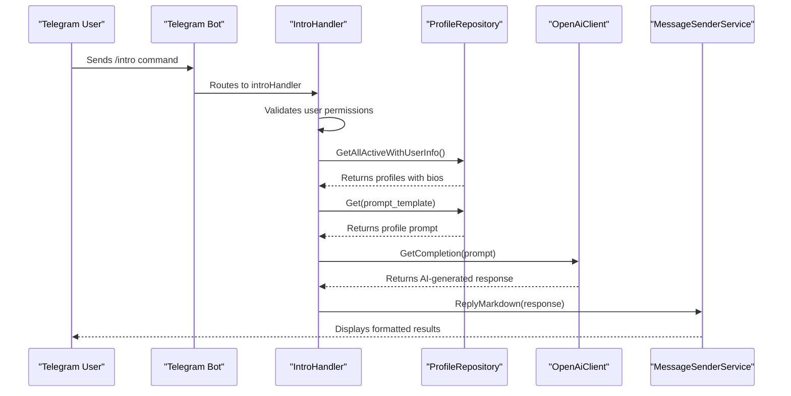
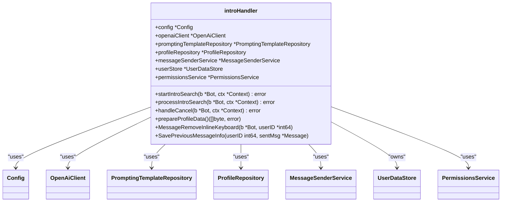
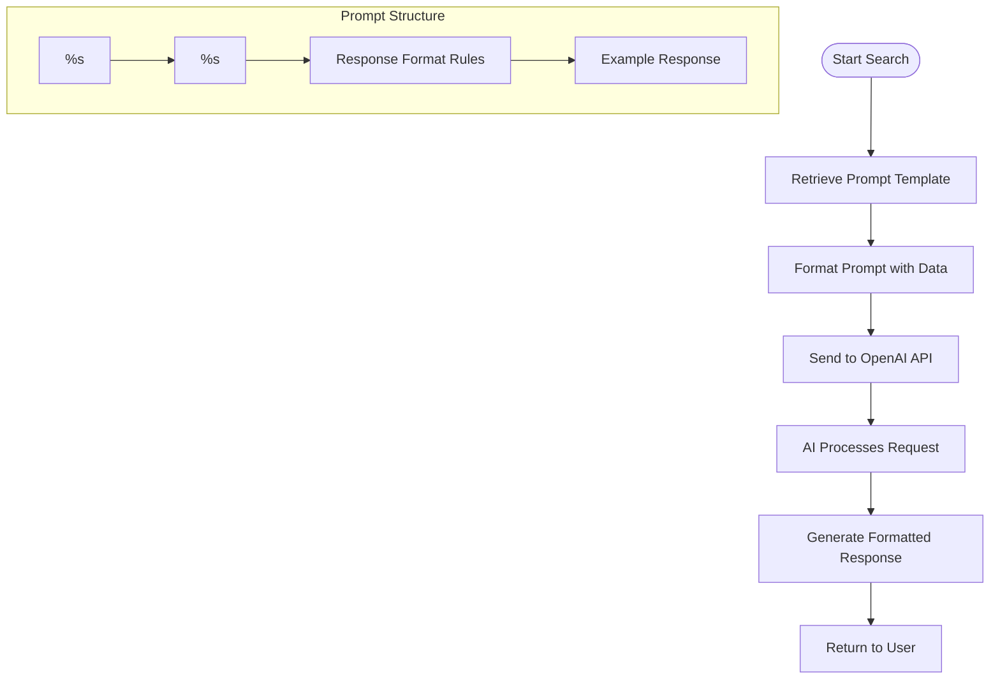
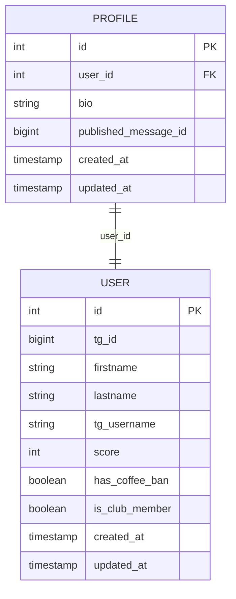

# Profile Search

<cite>
**Referenced Files in This Document**   
- [intro_handler.go](file://internal/handlers/privatehandlers/intro_handler.go) - *Updated in commit 63fee724519bc00e2d47f977cd4db421ca79c506*
- [profile_repository.go](file://internal/database/repositories/profile_repository.go) - *Updated in commit 63fee724519bc00e2d47f977cd4db421ca79c506*
- [openai_client.go](file://internal/clients/openai_client.go)
- [config.go](file://internal/config/config.go)
</cite>

## Update Summary
**Changes Made**   
- Updated method name references from `GetAllWithUsers` to `GetAllActiveWithUserInfo` across documentation
- Corrected profile retrieval logic to reflect filtering for active club members only
- Updated section sources to reflect actual file paths and line ranges from codebase
- Removed reference to non-existent `profile_prompt.go` file
- Added clarification on active member filtering criteria in profile data retrieval

## Table of Contents
1. [Introduction](#introduction)
2. [Core Components](#core-components)
3. [Architecture Overview](#architecture-overview)
4. [Detailed Component Analysis](#detailed-component-analysis)
5. [Search Query Processing](#search-query-processing)
6. [Prompt Engineering and AI Integration](#prompt-engineering-and-ai-integration)
7. [Profile Data Retrieval Strategy](#profile-data-retrieval-strategy)
8. [Result Ranking and Response Formatting](#result-ranking-and-response-formatting)
9. [Configuration Options](#configuration-options)
10. [Common Issues and Solutions](#common-issues-and-solutions)
11. [Performance Considerations](#performance-considerations)
12. [Conclusion](#conclusion)

## Introduction
The Profile Search feature in evocoders-bot-go enables users to perform natural language queries against member introductions within the Evocoders community. This AI-powered functionality allows users to search for profiles based on skills, interests, or other attributes using conversational queries. The system leverages OpenAI's language models to semantically understand search intent and retrieve relevant profiles from the database. This document provides a comprehensive technical overview of the implementation, covering the handler logic, prompt engineering, data retrieval mechanisms, and integration points that make this intelligent search possible.

## Core Components
The Profile Search functionality is built around several key components that work together to process user queries and return relevant results. These include the intro handler for managing user interactions, the OpenAI client for semantic understanding, the profile repository for data access, and the prompting template system for structured AI communication.

**Section sources**
- [intro_handler.go](file://internal/handlers/privatehandlers/intro_handler.go#L37-L67)
- [openai_client.go](file://internal/clients/openai_client.go#L15-L20)
- [profile_repository.go](file://internal/database/repositories/profile_repository.go#L15-L20)

## Architecture Overview
The Profile Search architecture follows a request-response pattern where user input is processed through multiple layers of abstraction before returning formatted results. The flow begins with the Telegram bot receiving a search query, which triggers the intro handler to orchestrate the search process.

**Diagram sources**
- [intro_handler.go](file://internal/handlers/privatehandlers/intro_handler.go#L247-L340)
- [profile_repository.go](file://internal/database/repositories/profile_repository.go#L265-L285)
- [openai_client.go](file://internal/clients/openai_client.go#L58-L70)

## Detailed Component Analysis

### Intro Handler Analysis
The intro handler serves as the entry point for profile search functionality, managing the conversation state and coordinating between various services to fulfill search requests.

**Diagram sources**
- [intro_handler.go](file://internal/handlers/privatehandlers/intro_handler.go#L37-L67)

**Section sources**
- [intro_handler.go](file://internal/handlers/privatehandlers/intro_handler.go#L37-L341)

## Search Query Processing
The search query processing begins when a user invokes the `/intro` command. The system validates that the request comes from a private chat and that the user is a club member before proceeding. Once validated, the handler enters a conversation state to process the user's search query.

When a query is received, the system implements concurrency control using a user store to prevent multiple simultaneous requests from the same user. It also provides cancellation functionality through both the `/cancel` command and an inline button, allowing users to terminate long-running searches. The handler uses context cancellation to stop ongoing OpenAI API calls when a search is cancelled.

**Section sources**
- [intro_handler.go](file://internal/handlers/privatehandlers/intro_handler.go#L100-L150)

## Prompt Engineering and AI Integration
The AI-powered search relies heavily on carefully engineered prompts that guide the language model in interpreting user queries and retrieving relevant profiles. The prompt structure is retrieved from the database at runtime through the prompting template repository.

**Section sources**
- [intro_handler.go](file://internal/handlers/privatehandlers/intro_handler.go#L289-L305)
- [profile_repository.go](file://internal/database/repositories/profile_repository.go#L265-L285)

The prompt template defines strict formatting rules, including using third-level headers for names, providing Telegram username links when available, and limiting biography descriptions to two sentences. It also includes a fallback message when no relevant profiles are found and encourages users to create or update their own profiles.

## Profile Data Retrieval Strategy
The system retrieves profile data through the profile repository, which executes a SQL query to fetch all profiles with associated user information. The query specifically filters for profiles that have non-empty bios, published message IDs, and belong to users who are active club members.

The data is structured as a JSON array containing key profile information: ID, first name, last name, username, bio, and message ID. This structured data is then embedded within the AI prompt, allowing the language model to analyze and search through the biographical content.

**Diagram sources**
- [profile_repository.go](file://internal/database/repositories/profile_repository.go#L265-L285)

**Section sources**
- [profile_repository.go](file://internal/database/repositories/profile_repository.go#L265-L285)
- [intro_handler.go](file://internal/handlers/privatehandlers/intro_handler.go#L320-L325)

## Result Ranking and Response Formatting
The AI model is responsible for ranking and selecting the most relevant profiles based on the user's query. By default, it returns up to five of the most relevant matches, though this can be influenced by the user's request. The model analyzes the semantic meaning of both the query and profile bios to determine relevance rather than relying on keyword matching.

The response is formatted in Markdown according to the specifications in the prompt template. Each matched profile is presented with the member's name as a third-level header, followed by their Telegram username (if available) as a mention, and a concise summary of their bio. The system ensures consistent formatting across all responses, making it easy for users to scan and identify relevant profiles.

**Section sources**
- [intro_handler.go](file://internal/handlers/privatehandlers/intro_handler.go#L335-L340)

## Configuration Options
The Profile Search functionality is configured through environment variables that are loaded into the application configuration. Key settings include the OpenAI API key, which authenticates requests to the AI service, and various Telegram topic IDs that define where profile information is stored and displayed.

The system uses the `o3-mini` model from OpenAI for generating responses, as specified in the client configuration. This model selection balances cost, speed, and quality for the profile search use case. The configuration also includes settings for the intro topic ID, which is used to generate links to the introduction thread in responses.

**Section sources**
- [config.go](file://internal/config/config.go#L15-L319)
- [openai_client.go](file://internal/clients/openai_client.go#L58-L70)

## Common Issues and Solutions

### Irrelevant Results
Sometimes the AI may return profiles that don't precisely match the search criteria. This can occur when the model interprets queries too broadly or when profile bios lack specific details. To improve relevance, users should provide more specific queries with clear criteria.

### API Rate Limits
The OpenAI API has rate limits that can affect search performance during peak usage. The system handles this by implementing proper error handling and user feedback when API calls fail. For production environments with high traffic, consider implementing request queuing or caching mechanisms.

### Slow Responses
Search responses may take several seconds due to the AI processing time. The system addresses this by sending a typing indicator to the user and allowing cancellation of long-running requests. For optimization, ensure the OpenAI API key has sufficient quota and consider upgrading to faster models if response time becomes a critical issue.

**Section sources**
- [intro_handler.go](file://internal/handlers/privatehandlers/intro_handler.go#L247-L340)
- [openai_client.go](file://internal/clients/openai_client.go#L58-L70)

## Performance Considerations
As the user base grows, the profile search functionality may face performance challenges. Currently, the system retrieves all active profiles with bios for each search request, which could become inefficient with thousands of members. For scaling, consider implementing database-level filtering or caching frequently accessed profile data.

The AI processing time is typically the main bottleneck in the search workflow. Each request requires the entire dataset to be sent to the OpenAI API, which limits parallelization opportunities. Future improvements could include pre-processing profiles into embeddings for vector-based similarity search, reducing the amount of data sent to the AI model.

Network latency between the application server and both Telegram and OpenAI APIs also contributes to overall response time. Deploying the application in a region close to these services can help minimize latency. Additionally, monitoring API usage and optimizing prompt length can reduce costs and improve throughput.

**Section sources**
- [profile_repository.go](file://internal/database/repositories/profile_repository.go#L265-L285)
- [intro_handler.go](file://internal/handlers/privatehandlers/intro_handler.go#L289-L340)

## Conclusion
The Profile Search feature in evocoders-bot-go demonstrates an effective integration of AI-powered natural language processing with traditional database operations. By leveraging OpenAI's language models, the system provides users with an intuitive way to discover community members based on their introductions. The architecture balances functionality with maintainability, using clear separation of concerns between components. While the current implementation works well for moderate user bases, future enhancements could focus on performance optimization and more sophisticated search capabilities through vector embeddings and caching strategies.