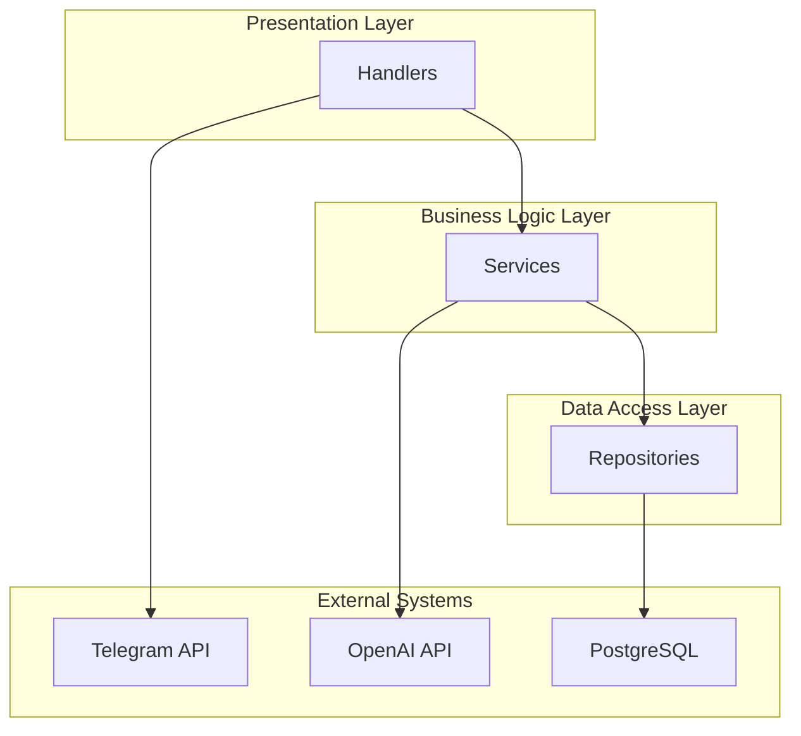
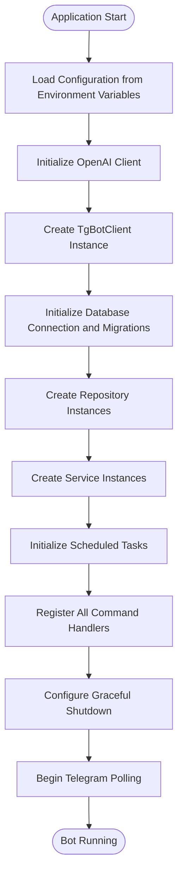
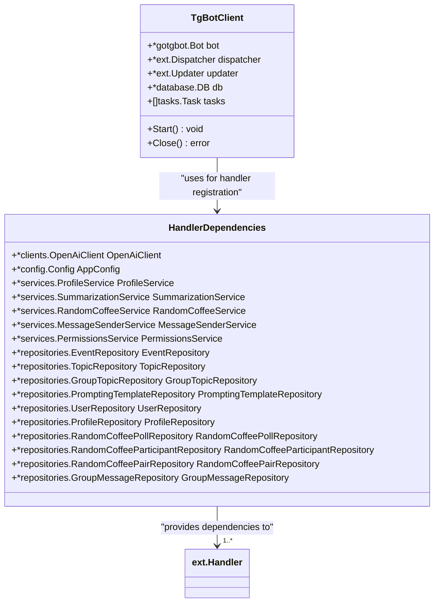

# Project Overview

<cite>
**Referenced Files in This Document**   
- [main.go](file://main.go)
- [internal/bot/bot.go](file://internal/bot/bot.go)
- [internal/config/config.go](file://internal/config/config.go)
- [internal/clients/openai_client.go](file://internal/clients/openai_client.go)
- [internal/handlers/privatehandlers/profile_handler.go](file://internal/handlers/privatehandlers/profile_handler.go)
- [internal/handlers/privatehandlers/content_handler.go](file://internal/handlers/privatehandlers/content_handler.go)
- [internal/handlers/privatehandlers/tools_handler.go](file://internal/handlers/privatehandlers/tools_handler.go)
- [internal/handlers/adminhandlers/testhandlers/try_summarize_handler.go](file://internal/handlers/adminhandlers/testhandlers/try_summarize_handler.go)
- [internal/services/random_coffee_service.go](file://internal/services/random_coffee_service.go)
- [internal/tasks/random_coffee_poll_task.go](file://internal/tasks/random_coffee_poll_task.go)
- [internal/tasks/random_coffee_pairs_task.go](file://internal/tasks/random_coffee_pairs_task.go)
- [internal/database/migrations/implementations/20250609_add_random_coffee_pairs_table.go](file://internal/database/migrations/implementations/20250609_add_random_coffee_pairs_table.go)
- [internal/database/repositories/prompting_templates_repository.go](file://internal/database/repositories/prompting_templates_repository.go)
- [internal/database/repositories/group_topic_repository.go](file://internal/database/repositories/group_topic_repository.go)
- [internal/services/summarization_service.go](file://internal/services/summarization_service.go)
</cite>

## Table of Contents
1. [Introduction](#introduction)
2. [Core Functionality](#core-functionality)
3. [High-Level Architecture](#high-level-architecture)
4. [Main Component Initialization](#main-component-initialization)
5. [User Interaction Examples](#user-interaction-examples)
6. [Component Relationships](#component-relationships)
7. [API Integrations](#api-integrations)

## Introduction
The evocoders-bot-go project is a Telegram bot designed for community management within the Evocoders Club. This comprehensive system provides AI-powered search capabilities, daily chat summarization, random coffee pairings, and profile management to enhance community engagement and organization. The bot serves as a central hub for moderating discussions, providing information, and fostering connections among club members through automated processes and intelligent interactions.

## Core Functionality
The Evocoders Telegram Bot delivers several key features that support community management and member engagement. The AI-powered search functionality enables users to find relevant information through commands like `/tool` for AI tools, `/content` for general content, and `/intro` for member introductions. Daily summarization automatically generates summaries of chat conversations, either on a scheduled basis or manually triggered by administrators using the `/summarize` command. The random coffee feature facilitates weekly meetings by automatically posting participation polls and generating pairs of members to connect. Profile management allows users to create, edit, and publish personal profiles containing biographical information, which can be searched by other members. Additional features include event management for tracking community events, thread management for moderating discussions, and utility commands like `/help` for usage guidance.

**Section sources**
- [internal/handlers/privatehandlers/tools_handler.go](file://internal/handlers/privatehandlers/tools_handler.go#L67-L108)
- [internal/handlers/privatehandlers/content_handler.go](file://internal/handlers/privatehandlers/content_handler.go#L67-L108)
- [internal/handlers/adminhandlers/testhandlers/try_summarize_handler.go](file://internal/handlers/adminhandlers/testhandlers/try_summarize_handler.go#L41-L74)
- [internal/services/random_coffee_service.go](file://internal/services/random_coffee_service.go#L0-L52)

## High-Level Architecture
The bot follows a layered architectural design with clear separation of concerns. The system is organized into handlers, services, and repositories, each with distinct responsibilities. Handlers manage user interactions and command processing, services contain business logic and coordinate operations, and repositories handle data persistence and retrieval. This layered approach enables clean separation of concerns, making the codebase maintainable and testable. The architecture supports both private chat interactions with individual users and group chat operations within the community. The system also incorporates scheduled tasks for automated functionality like daily summarization and random coffee pairings, which run independently of user interactions.

**Diagram sources **
- [internal/bot/bot.go](file://internal/bot/bot.go#L25-L43)
- [internal/bot/bot.go](file://internal/bot/bot.go#L75-L91)

## Main Component Initialization
The main.go file serves as the entry point for the application, orchestrating the initialization of all core components. The process begins by loading configuration from environment variables using the config.LoadConfig() function. Next, the OpenAI client is initialized to enable AI-powered features. The TgBotClient is then created, which sets up the Telegram bot instance, dispatcher for handling updates, and database connection. During initialization, the bot client creates instances of all required repositories for data access, services for business logic, and scheduled tasks for automated operations. A HandlerDependencies struct is populated with all necessary dependencies and passed to each handler during registration. The graceful shutdown mechanism is configured to handle termination signals, ensuring proper cleanup of resources when the application stops.

**Diagram sources **
- [main.go](file://main.go#L0-L52)
- [internal/bot/bot.go](file://internal/bot/bot.go#L0-L384)

## User Interaction Examples
Users interact with the bot through specific commands in private chat. The `/profile` command initiates a conversation for managing personal profiles, allowing users to view their own profile, edit biographical information, or search for other members' profiles. When a user enters `/content`, the bot prompts for a search query and uses AI to find relevant information from designated topics. Similarly, the `/tool` command enables searching for AI tools based on user queries. The conversation flow for these commands follows a state-based pattern where the bot guides users through a series of steps, maintaining context using a UserDataStore. For example, when editing a profile, the bot presents a menu of options and transitions between states to collect new information. The system also supports callback queries for interactive elements like buttons, allowing users to navigate menus and confirm actions without typing commands.

**Section sources**
- [internal/handlers/privatehandlers/profile_handler.go](file://internal/handlers/privatehandlers/profile_handler.go#L95-L120)
- [internal/handlers/privatehandlers/content_handler.go](file://internal/handlers/privatehandlers/content_handler.go#L67-L108)
- [internal/handlers/privatehandlers/tools_handler.go](file://internal/handlers/privatehandlers/tools_handler.go#L67-L108)

## Component Relationships
The TgBotClient serves as the central coordinator, maintaining references to the bot instance, dispatcher, updater, database connection, and scheduled tasks. The HandlerDependencies struct acts as a dependency injection container, providing handlers with access to services and repositories without requiring direct imports. This design promotes loose coupling and makes testing easier. The relationship between components follows a unidirectional flow where handlers call services, services use repositories for data access, and repositories interact with the database. The graceful shutdown mechanism, configured in main.go, listens for termination signals and triggers the bot client's Close method, which stops all scheduled tasks and closes the database connection in an orderly fashion.

**Diagram sources **
- [internal/bot/bot.go](file://internal/bot/bot.go#L46-L52)
- [internal/bot/bot.go](file://internal/bot/bot.go#L25-L43)

## API Integrations
The bot integrates with two primary external APIs: Telegram and OpenAI. The Telegram integration uses the gotgbot/v2 library to handle bot operations, receiving updates through long polling and sending messages, polls, and other content to chats. The bot requires specific permissions in the Telegram supergroup, including the ability to pin messages and delete messages for moderation purposes. The OpenAI integration enables AI-powered features through the OpenAiClient, which uses the official OpenAI Go SDK to access chat completions and embedding models. The OpenAiClient provides methods for generating text completions and creating embeddings for semantic search. Configuration for both APIs is managed through environment variables, allowing for secure and flexible deployment across different environments.

**Section sources**
- [main.go](file://main.go#L0-L52)
- [internal/clients/openai_client.go](file://internal/clients/openai_client.go#L0-L49)
- [internal/bot/bot.go](file://internal/bot/bot.go#L0-L384)