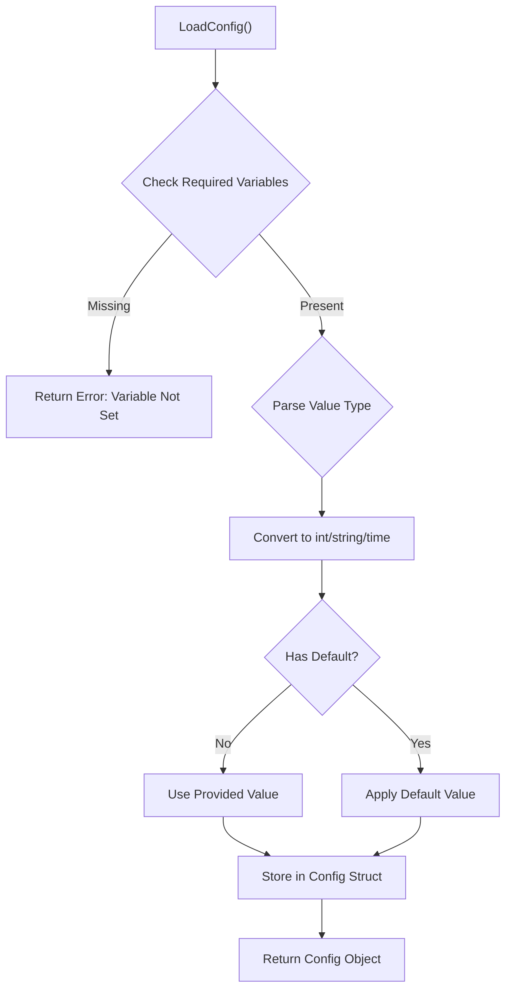
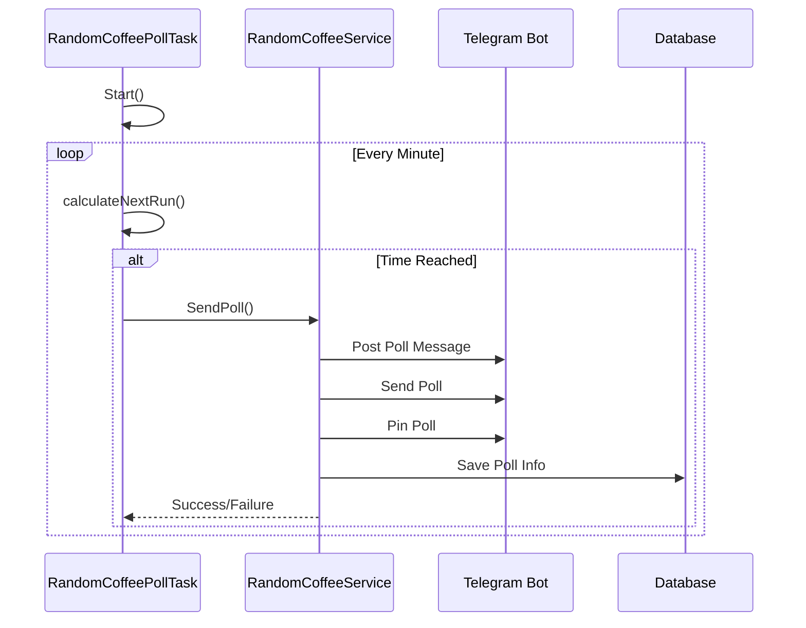
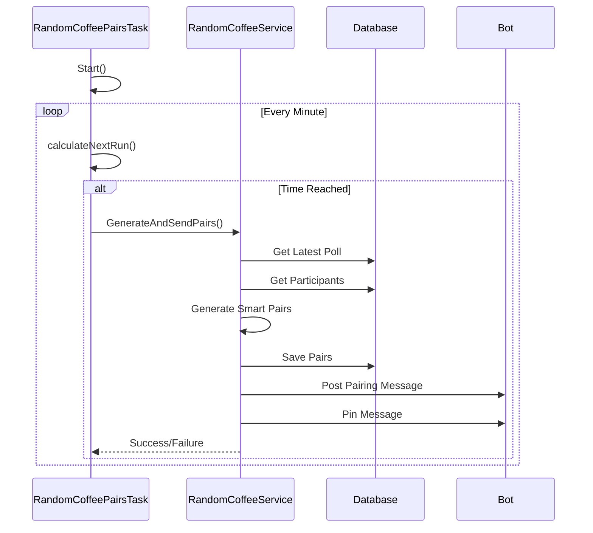

# Configuration Options

<cite>
**Referenced Files in This Document**   
- [config.go](file://internal/config/config.go)
- [random_coffee_poll_task.go](file://internal/tasks/random_coffee_poll_task.go)
- [random_coffee_pairs_task.go](file://internal/tasks/random_coffee_pairs_task.go)
- [random_coffee_service.go](file://internal/services/random_coffee_service.go)
- [README.md](file://README.md)
</cite>

## Table of Contents
1. [Introduction](#introduction)
2. [Configuration Loading Mechanism](#configuration-loading-mechanism)
3. [Random Coffee Poll Configuration](#random-coffee-poll-configuration)
4. [Random Coffee Pairs Generation Configuration](#random-coffee-pairs-generation-configuration)
5. [Feature Toggle Options](#feature-toggle-options)
6. [Practical Configuration Examples](#practical-configuration-examples)
7. [Poll Message Customization](#poll-message-customization)
8. [Common Configuration Issues and Troubleshooting](#common-configuration-issues-and-troubleshooting)
9. [Advanced Configuration Tips](#advanced-configuration-tips)
10. [Conclusion](#conclusion)

## Introduction
The Random Coffee System in the Evocoders Telegram Bot enables automated weekly coffee meetings between community members. This document details all configuration options that control the system's behavior, including scheduling, feature toggles, and customization settings. The configuration is managed through environment variables that are loaded into a Config struct at runtime. Two primary tasks—random_coffee_poll_task and random_coffee_pairs_task—use these configuration values to schedule and execute the weekly workflow of polling members for participation and generating participant pairs.

**Section sources**
- [config.go](file://internal/config/config.go#L11-L43)
- [README.md](file://README.md#L113-L139)

## Configuration Loading Mechanism
The configuration system loads settings from environment variables into a structured Config object. The LoadConfig function in config.go processes environment variables, converts them to appropriate data types, and applies default values when optional variables are not specified. All Random Coffee-related configuration options follow the naming convention TG_EVO_BOT_RANDOM_COFFEE_* and are grouped within the Config struct under the Random Coffee Feature section. The system validates required fields and returns descriptive error messages for invalid configurations, ensuring robust startup behavior.



**Diagram sources**
- [config.go](file://internal/config/config.go#L50-L318)

**Section sources**
- [config.go](file://internal/config/config.go#L50-L318)

## Random Coffee Poll Configuration
The poll scheduling configuration controls when the participation poll is posted to the community. Three key settings determine the poll's timing and visibility:

- **TG_EVO_BOT_RANDOM_COFFEE_POLL_TASK_ENABLED**: Feature toggle that enables or disables the automated poll posting (default: true)
- **TG_EVO_BOT_RANDOM_COFFEE_POLL_TIME**: Time of day in 24-hour UTC format when the poll should be posted (default: 14:00)
- **TG_EVO_BOT_RANDOM_COFFEE_POLL_DAY**: Day of the week when the poll should be posted (default: friday)

The random_coffee_poll_task uses these values to calculate the next execution time and schedule the poll accordingly. The task runs continuously, checking every minute against the target time and day. When the scheduled time arrives, the task triggers the SendPoll method in the RandomCoffeeService, which creates and posts the poll to the designated topic.



**Diagram sources**
- [random_coffee_poll_task.go](file://internal/tasks/random_coffee_poll_task.go#L30-L105)
- [random_coffee_service.go](file://internal/services/random_coffee_service.go#L46-L90)

**Section sources**
- [config.go](file://internal/config/config.go#L34-L37)
- [random_coffee_poll_task.go](file://internal/tasks/random_coffee_poll_task.go#L30-L105)

## Random Coffee Pairs Generation Configuration
The pairs generation configuration controls when participant pairs are automatically created and announced. Similar to the poll configuration, three settings determine the pairing workflow:

- **TG_EVO_BOT_RANDOM_COFFEE_PAIRS_TASK_ENABLED**: Feature toggle that enables or disables automated pair generation (default: true)
- **TG_EVO_BOT_RANDOM_COFFEE_PAIRS_TIME**: Time of day in 24-hour UTC format for pair generation (default: 12:00)
- **TG_EVO_BOT_RANDOM_COFFEE_PAIRS_DAY**: Day of the week for pair generation (default: monday)

The random_coffee_pairs_task uses these configuration values to schedule the pairing process. When the scheduled time arrives, the task calls GenerateAndSendPairs in the RandomCoffeeService. This method retrieves the latest poll results, applies smart pairing logic that considers previous pairings, generates the pairs, and posts the results to the community. The system also supports manual pairing through the /pair_meetings admin command.



**Diagram sources**
- [random_coffee_pairs_task.go](file://internal/tasks/random_coffee_pairs_task.go#L30-L101)
- [random_coffee_service.go](file://internal/services/random_coffee_service.go#L92-L150)

**Section sources**
- [config.go](file://internal/config/config.go#L40-L43)
- [random_coffee_pairs_task.go](file://internal/tasks/random_coffee_pairs_task.go#L30-L101)

## Feature Toggle Options
The Random Coffee system provides feature toggle options that allow administrators to enable or disable specific functionality without redeploying the application. These boolean configuration options default to true when not specified, ensuring the features are active by default:

- **RandomCoffeePollTaskEnabled**: Controls whether the weekly participation poll is automatically posted
- **RandomCoffeePairsTaskEnabled**: Controls whether pairs are automatically generated and announced

These toggles provide operational flexibility, allowing administrators to temporarily disable automated workflows for maintenance, testing, or special circumstances. When disabled, the corresponding tasks log their status and skip execution, but the functionality can still be accessed manually through admin commands. This design supports both automated and manual operation modes within the same codebase.

**Section sources**
- [config.go](file://internal/config/config.go#L33-L34)
- [random_coffee_poll_task.go](file://internal/tasks/random_coffee_poll_task.go#L38-L42)
- [random_coffee_pairs_task.go](file://internal/tasks/random_coffee_pairs_task.go#L38-L42)

## Practical Configuration Examples
The following examples demonstrate practical configuration setups for different community needs and time zones:

### Standard Weekly Setup (UTC)
```bash
TG_EVO_BOT_RANDOM_COFFEE_POLL_DAY=friday
TG_EVO_BOT_RANDOM_COFFEE_POLL_TIME=14:00
TG_EVO_BOT_RANDOM_COFFEE_PAIRS_DAY=monday
TG_EVO_BOT_RANDOM_COFFEE_PAIRS_TIME=12:00
```
This configuration posts the poll on Friday at 2 PM UTC and generates pairs on Monday at 12 PM UTC, giving members the weekend to respond.

### European Community (UTC+1)
```bash
TG_EVO_BOT_RANDOM_COFFEE_POLL_DAY=thursday
TG_EVO_BOT_RANDOM_COFFEE_POLL_TIME=23:00
TG_EVO_BOT_RANDOM_COFFEE_PAIRS_DAY=monday
TG_EVO_BOT_RANDOM_COFFEE_PAIRS_TIME=11:00
```
For a primarily European community, the poll is posted on Thursday at 11 PM UTC (Friday 12 AM CET), appearing as the first post of the week, with pairs generated Monday at 11 AM UTC (12 PM CET).

### North American Community (UTC-5)
```bash
TG_EVO_BOT_RANDOM_COFFEE_POLL_DAY=friday
TG_EVO_BOT_RANDOM_COFFEE_POLL_TIME=05:00
TG_EVO_BOT_RANDOM_COFFEE_PAIRS_DAY=monday
TG_EVO_BOT_RANDOM_COFFEE_PAIRS_TIME=17:00
```
For a North American audience, the poll appears on Friday at 5 AM UTC (midnight EST), and pairs are generated Monday at 5 PM UTC (12 PM EST), allowing time for coordination during the workday.

### Bi-weekly Setup
```bash
TG_EVO_BOT_RANDOM_COFFEE_POLL_DAY=monday
TG_EVO_BOT_RANDOM_COFFEE_POLL_TIME=09:00
TG_EVO_BOT_RANDOM_COFFEE_PAIRS_DAY=wednesday
TG_EVO_BOT_RANDOM_COFFEE_PAIRS_TIME=10:00
TG_EVO_BOT_RANDOM_COFFEE_POLL_TASK_ENABLED=true
TG_EVO_BOT_RANDOM_COFFEE_PAIRS_TASK_ENABLED=true
```
This configuration supports a bi-weekly rhythm with polls on Mondays and pairings on Wednesdays, providing more time for members to coordinate meetings.

**Section sources**
- [config.go](file://internal/config/config.go#L33-L43)
- [README.md](file://README.md#L128-L139)

## Poll Message Customization
While the core poll message text is hardcoded in the RandomCoffeeService, it can be customized by modifying the service implementation. The current message includes:

- A greeting and introduction to the Random Coffee event
- A link to the participation rules
- An instruction to vote in the poll below

The message uses HTML formatting with bold text and inline links. To customize the message, administrators would need to modify the SendPoll method in random_coffee_service.go. Future enhancements could externalize this text to configuration or database storage for easier customization without code changes. The poll question and answer options are also defined in the service and can be modified to change the tone or language of the interaction.

**Section sources**
- [random_coffee_service.go](file://internal/services/random_coffee_service.go#L46-L65)

## Common Configuration Issues and Troubleshooting
Several common configuration issues can affect the Random Coffee system's operation:

### Timezone Mismatches
The most frequent issue occurs when administrators expect local time behavior but the system operates in UTC. To troubleshoot:
1. Verify all time settings are in UTC
2. Convert local time preferences to UTC equivalents
3. Test the configuration and observe actual execution times
4. Adjust settings accordingly

### Invalid Day or Time Formats
The system validates day names (case-insensitive) and 24-hour time format:
- Valid days: sunday, monday, tuesday, wednesday, thursday, friday, saturday
- Valid time format: HH:MM (24-hour, e.g., 14:00, 03:30)

Error messages clearly indicate invalid values, helping administrators correct configuration mistakes.

### Missing Required Configuration
The system validates required fields at startup:
- TG_EVO_BOT_RANDOM_COFFEE_TOPIC_ID is required
- Database connection must be valid
- Supergroup chat ID must be specified

Startup errors provide specific guidance on which variables are missing or invalid.

### Validation Techniques
To ensure proper configuration:
1. Check application logs for startup messages confirming task scheduling
2. Verify the "Starting random coffee poll task" log entry shows expected time and day
3. Monitor the system for one cycle to confirm expected behavior
4. Use the manual /pair_meetings command to test pairing functionality independently of scheduling

**Section sources**
- [config.go](file://internal/config/config.go#L201-L291)
- [random_coffee_poll_task.go](file://internal/tasks/random_coffee_poll_task.go#L38-L42)
- [random_coffee_pairs_task.go](file://internal/tasks/random_coffee_pairs_task.go#L38-L42)

## Advanced Configuration Tips
For administrators seeking to optimize their Random Coffee implementation:

### Monitoring and Automation
- Integrate with monitoring tools to alert on task failures
- Set up log aggregation to track pairing history and participation rates
- Create dashboards showing weekly participation trends
- Automate configuration updates through CI/CD pipelines

### Pairing Algorithm Considerations
The system uses smart pairing logic that considers previous pairings to maximize diversity:
- Participants are never paired with the same person twice in succession
- The algorithm prioritizes participants who haven't been paired recently
- Unpaired participants are carried forward to increase their chances

### Performance Optimization
For large communities:
- Ensure database indexes on poll and participant tables
- Monitor execution time of pairing algorithms
- Consider adjusting the polling interval in tasks if system resources are constrained
- Use connection pooling for database operations

### Backup and Recovery
- Regularly backup the random_coffee_pairs table to preserve pairing history
- Document manual recovery procedures for when automated tasks fail
- Test configuration changes in a staging environment when possible

**Section sources**
- [random_coffee_service.go](file://internal/services/random_coffee_service.go#L300-L450)
- [config.go](file://internal/config/config.go#L11-L43)

## Conclusion
The Random Coffee system's configuration options provide flexible control over the automated pairing workflow. By understanding the environment variables, scheduling mechanics, and feature toggles, administrators can customize the system to meet their community's needs. The clear default values and validation messages make initial setup straightforward, while the separation of poll scheduling and pair generation allows for fine-tuned control over the weekly rhythm. With proper configuration and monitoring, the system can enhance community engagement through regular, serendipitous connections between members.