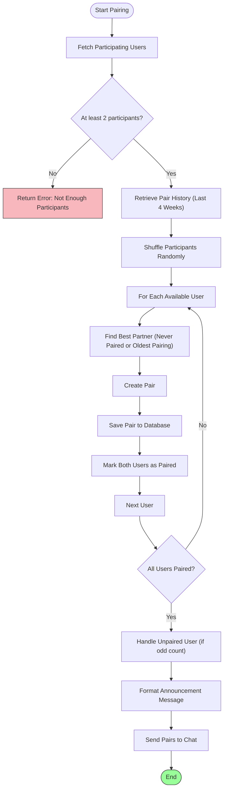
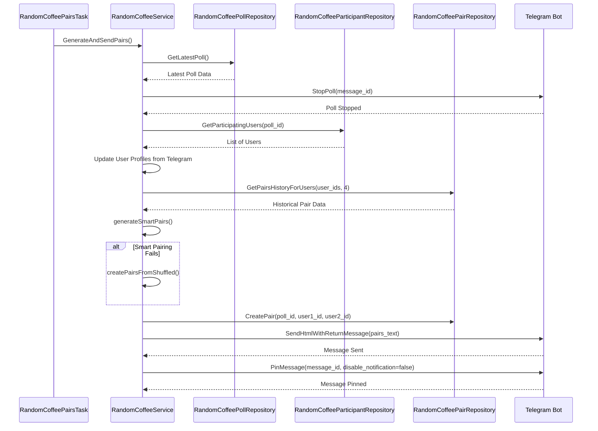

# Pairing Algorithm

<cite>
**Referenced Files in This Document**   
- [random_coffee_service.go](file://internal/services/random_coffee_service.go)
- [random_coffee_pair_repository.go](file://internal/database/repositories/random_coffee_pair_repository.go)
- [random_coffee_participant_repository.go](file://internal/database/repositories/random_coffee_participant_repository.go)
- [random_coffee_poll_repository.go](file://internal/database/repositories/random_coffee_poll_repository.go)
- [random_coffee_pairs_task.go](file://internal/tasks/random_coffee_pairs_task.go)
- [config.go](file://internal/config/config.go)
</cite>

## Table of Contents
1. [Introduction](#introduction)
2. [Core Components](#core-components)
3. [Pairing Algorithm Logic](#pairing-algorithm-logic)
4. [Execution Flow](#execution-flow)
5. [Constraints and Rules](#constraints-and-rules)
6. [Handling Edge Cases](#handling-edge-cases)
7. [Performance Considerations](#performance-considerations)
8. [Troubleshooting Guide](#troubleshooting-guide)
9. [Conclusion](#conclusion)

## Introduction
The Pairing Algorithm is a core component of the Random Coffee System, designed to foster community engagement by automatically pairing participants for virtual coffee meetings. This document details the implementation of the pairing logic within the `RandomCoffeeService`, which ensures optimal pair selection while avoiding repeat combinations based on historical data. The algorithm prioritizes fairness, diversity, and user experience by leveraging past pairing records stored in the `RandomCoffeePairRepository`. It operates under specific constraints such as preventing self-pairing, minimizing repeated pairings, and handling odd participant counts gracefully. The process is triggered by a scheduled task and includes transactional integrity during pair creation and announcement.

**Section sources**
- [random_coffee_service.go](file://internal/services/random_coffee_service.go#L1-L50)

## Core Components

The pairing system consists of several key components that work together to manage participant data, generate pairs, and schedule execution:

- **RandomCoffeeService**: Orchestrates the entire pairing process, including fetching participants, applying the smart pairing algorithm, and sending results.
- **RandomCoffeePairRepository**: Stores and retrieves historical pairing data to prevent recent repeats.
- **RandomCoffeeParticipantRepository**: Manages participant registration status for each poll cycle.
- **RandomCoffeePollRepository**: Tracks poll instances and their associated metadata (e.g., week start date).
- **RandomCoffeePairsTask**: Schedules the automated execution of pair generation at configured intervals.

These components are initialized with dependency injection and interact through well-defined interfaces, ensuring modularity and testability.

**Section sources**
- [random_coffee_service.go](file://internal/services/random_coffee_service.go#L17-L27)
- [random_coffee_pair_repository.go](file://internal/database/repositories/random_coffee_pair_repository.go#L16-L18)
- [random_coffee_participant_repository.go](file://internal/database/repositories/random_coffee_participant_repository.go#L15-L17)
- [random_coffee_poll_repository.go](file://internal/database/repositories/random_coffee_poll_repository.go#L17-L19)
- [random_coffee_pairs_task.go](file://internal/tasks/random_coffee_pairs_task.go#L10-L14)

## Pairing Algorithm Logic

The core of the system lies in the `generateSmartPairs` method, which implements a history-aware pairing strategy. The algorithm follows these steps:

1. **Fetch Participants**: Retrieves all users who responded "Yes" to the latest Random Coffee poll via `GetParticipatingUsers`.
2. **Retrieve Pair History**: Queries the `RandomCoffeePairRepository` for past pairings over the last four weeks using `GetPairsHistoryForUsers`.
3. **Shuffle Participants**: Randomly shuffles the participant list to ensure fairness in selection order.
4. **Optimal Pair Selection**: For each available user, the algorithm searches for the best possible partner:
   - Prefers users who have never been paired before.
   - If all potential partners have prior pairings, selects the one with the oldest (least recent) pairing.
5. **Create Pairs**: Forms pairs based on optimal matches and stores them in the database via `CreatePair`.

If the smart pairing fails (e.g., due to an error in history lookup), the system falls back to a simple random shuffle method implemented in `createPairsFromShuffled`.

**Diagram sources**
- [random_coffee_service.go](file://internal/services/random_coffee_service.go#L300-L400)
- [random_coffee_pair_repository.go](file://internal/database/repositories/random_coffee_pair_repository.go#L50-L100)

**Section sources**
- [random_coffee_service.go](file://internal/services/random_coffee_service.go#L300-L400)
- [random_coffee_pair_repository.go](file://internal/database/repositories/random_coffee_pair_repository.go#L50-L100)

## Execution Flow

The pairing process is initiated by the `RandomCoffeePairsTask`, which runs on a scheduled basis according to configuration settings. The execution flow is as follows:

1. **Task Scheduling**: The `RandomCoffeePairsTask` calculates the next run time using `calculateNextRun`, based on `RandomCoffeePairsDay` and `RandomCoffeePairsTime` from the config.
2. **Poll Retrieval**: When triggered, `GenerateAndSendPairs` retrieves the latest poll via `GetLatestPoll`.
3. **Poll Termination**: Stops the active poll using Telegram Bot API to finalize participant list.
4. **Participant Sync**: Updates user profile information (username, first/last name) from Telegram to ensure accuracy.
5. **Pair Generation**: Calls `generateSmartPairs` to create optimal pairs.
6. **Result Announcement**: Formats and sends the pairing results to the designated chat topic, then pins the message.

**Diagram sources**
- [random_coffee_pairs_task.go](file://internal/tasks/random_coffee_pairs_task.go#L45-L90)
- [random_coffee_service.go](file://internal/services/random_coffee_service.go#L200-L300)

**Section sources**
- [random_coffee_pairs_task.go](file://internal/tasks/random_coffee_pairs_task.go#L45-L90)
- [random_coffee_service.go](file://internal/services/random_coffee_service.go#L200-L300)

## Constraints and Rules

The pairing algorithm enforces several constraints to ensure fairness and usability:

- **Minimum Participants**: Requires at least two participants; otherwise, returns an error.
- **No Self-Pairing**: Prevented inherently by the pairing logic since each user appears only once in the participant list.
- **Avoid Recent Repeats**: Uses historical data from the last four polls to minimize repeat pairings.
- **Balanced Distribution**: Prioritizes users who have never been paired or were paired the longest time ago.
- **Ordered Storage**: When saving pairs, the system ensures `user1_id < user2_id` to maintain consistent key ordering in the database.

These rules are enforced through both business logic and database constraints, ensuring data integrity and predictable behavior.

**Section sources**
- [random_coffee_service.go](file://internal/services/random_coffee_service.go#L300-L400)
- [random_coffee_pair_repository.go](file://internal/database/repositories/random_coffee_pair_repository.go#L30-L50)

## Handling Edge Cases

The system includes robust handling for various edge cases:

- **Odd Participant Count**: One user will remain unpaired and is highlighted in the announcement message with a note that they are "looking for company."
- **Low Participation**: If fewer than two users participate, pair generation is aborted with a descriptive error.
- **Failed Smart Pairing**: If the history-based algorithm encounters an error, it falls back to a random pairing method.
- **User Profile Updates**: During pairing, the system synchronizes user data (username, name) from Telegram to reflect current information.
- **Database Errors**: All repository operations include error logging and graceful degradation (e.g., continuing without DB save if repository is nil).

These mechanisms ensure the system remains resilient under varying conditions and maintains a positive user experience.

**Section sources**
- [random_coffee_service.go](file://internal/services/random_coffee_service.go#L250-L300)
- [random_coffee_service.go](file://internal/services/random_coffee_service.go#L350-L370)

## Performance Considerations

For large communities, the following performance aspects should be considered:

- **History Query Scope**: The system limits historical lookups to the last four polls, preventing excessive database load.
- **Efficient Lookups**: The `GetPairsHistoryForUsers` query uses indexed fields (`poll_id`, `user1_id`, `user2_id`) for fast retrieval.
- **Batch Operations**: Participant and pair data are retrieved in bulk rather than individual queries.
- **Caching Opportunity**: Future improvements could include caching recent pair history to reduce database round-trips.
- **Scalability**: The algorithm runs in O(n²) time in the worst case but is optimized by early termination when a "never paired" match is found.

For very large groups (>100 participants), consider increasing the history window or introducing tiered pairing strategies.

**Section sources**
- [random_coffee_pair_repository.go](file://internal/database/repositories/random_coffee_pair_repository.go#L50-L100)
- [random_coffee_service.go](file://internal/services/random_coffee_service.go#L300-L400)

## Troubleshooting Guide

Common issues and their solutions:

- **No Pairs Generated**: Check if at least two users participated. Verify poll status and ensure the poll was properly stopped.
- **Repeated Pairs**: Confirm that `GetPairsHistoryForUsers` is returning correct data. Check if the history window (last 4 polls) is sufficient.
- **Missing User Info**: Ensure `UpdateTelegramUsername` and related methods are working; verify Telegram API access.
- **Scheduled Task Not Running**: Validate `RandomCoffeePairsTaskEnabled`, `RandomCoffeePairsTime`, and `RandomCoffeePairsDay` in config.
- **Database Errors**: Check connection health and table schema integrity, particularly foreign key relationships in `random_coffee_pairs`.

Enable logging to trace execution flow and identify failure points in the pairing pipeline.

**Section sources**
- [random_coffee_service.go](file://internal/services/random_coffee_service.go#L200-L300)
- [random_coffee_pairs_task.go](file://internal/tasks/random_coffee_pairs_task.go#L45-L90)
- [config.go](file://internal/config/config.go#L200-L250)

## Conclusion

The Pairing Algorithm effectively balances automation with social intelligence by leveraging historical data to create meaningful connections while avoiding repetition. Its modular design allows for easy maintenance and future enhancements, such as introducing preference-based matching or integrating machine learning models for compatibility scoring. The fallback mechanism ensures reliability, and the scheduled execution model provides consistency for community members. By adhering to clear constraints and handling edge cases gracefully, the system delivers a robust and user-friendly experience for fostering connections within the community.