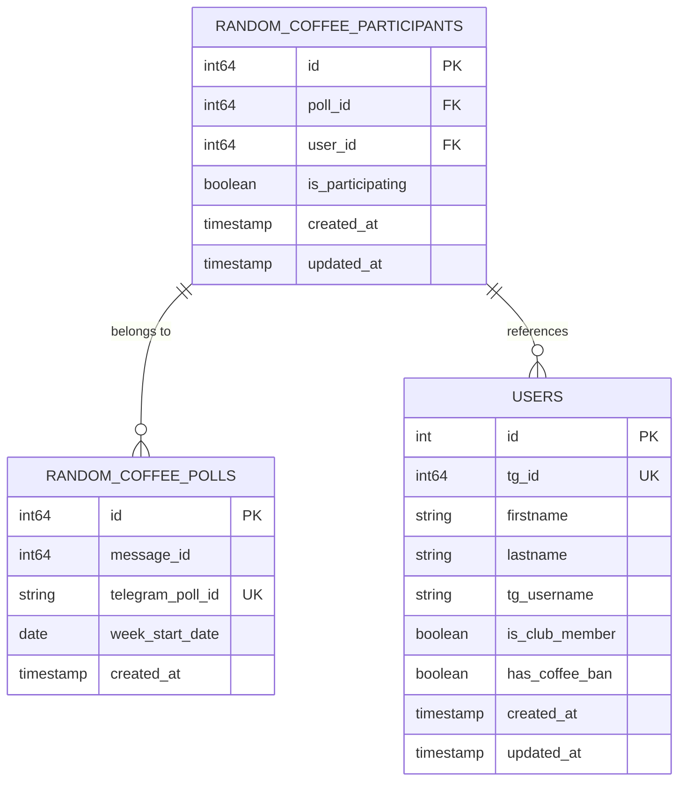
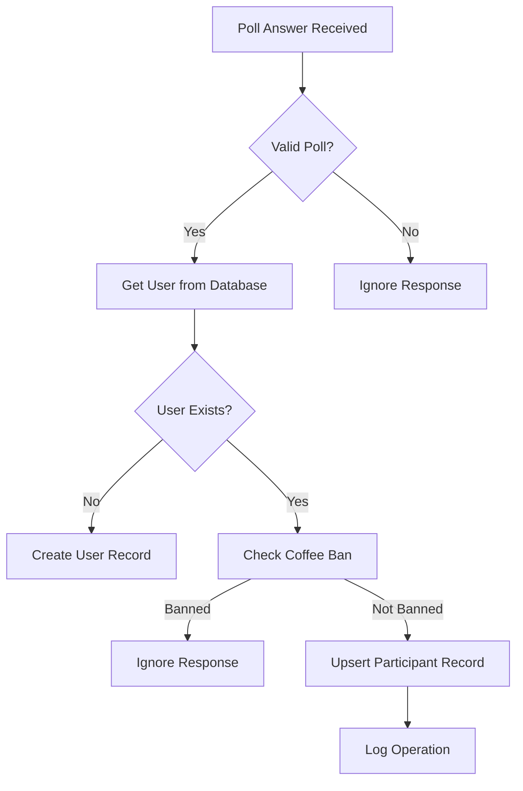
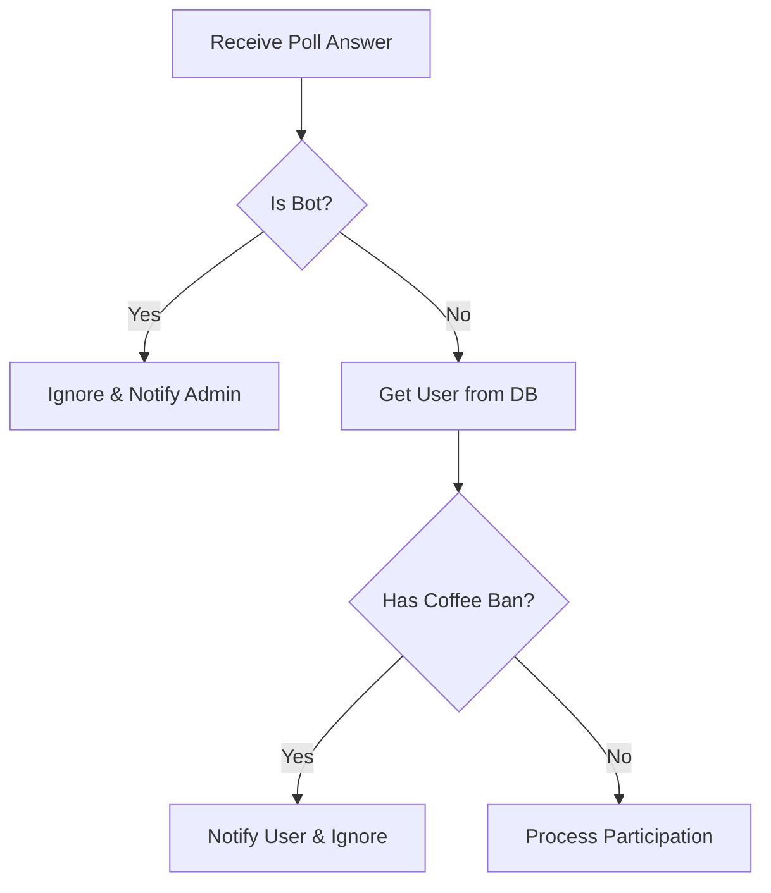
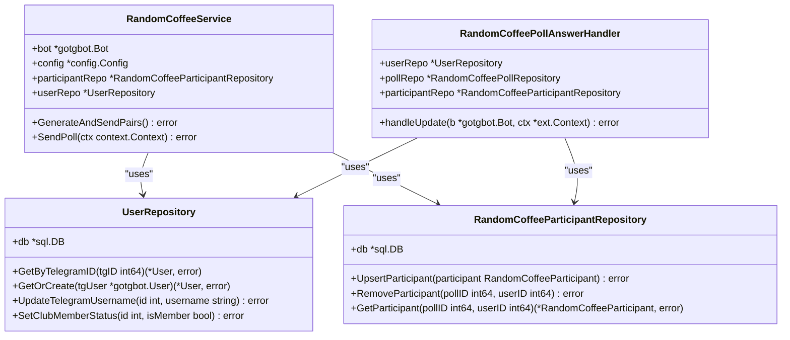

# Participant Tracking

<cite>
**Referenced Files in This Document**   
- [random_coffee_participant_repository.go](file://internal/database/repositories/random_coffee_participant_repository.go)
- [random_coffee_poll_answer_handler.go](file://internal/handlers/grouphandlers/random_coffee_poll_answer_handler.go)
- [random_coffee_service.go](file://internal/services/random_coffee_service.go)
- [user_repository.go](file://internal/database/repositories/user_repository.go)
- [random_coffee_poll_repository.go](file://internal/database/repositories/random_coffee_poll_repository.go)
- [20250602_add_random_coffee_poll_tables.go](file://internal/database/migrations/implementations/20250602_add_random_coffee_poll_tables.go)
</cite>

## Table of Contents
1. [Introduction](#introduction)
2. [Data Model](#data-model)
3. [Participant Registration](#participant-registration)
4. [Eligibility Validation](#eligibility-validation)
5. [Integration with User Repository](#integration-with-user-repository)
6. [Edge Case Handling](#edge-case-handling)
7. [Telegram API Limitations and Mitigation](#telegram-api-limitations-and-mitigation)
8. [Querying Participation History](#querying-participation-history)
9. [Audit Logging](#audit-logging)
10. [Conclusion](#conclusion)

## Introduction
The Participant Tracking mechanism in the Random Coffee System manages user participation in weekly coffee pairing events through a structured database and service layer. This system captures user responses to Telegram polls, validates eligibility, and maintains a persistent record of participation status. The core functionality revolves around the `RandomCoffeeParticipantRepository`, which interfaces with the database to store and retrieve participant data, ensuring accurate tracking throughout the event lifecycle.

**Section sources**
- [random_coffee_participant_repository.go](file://internal/database/repositories/random_coffee_participant_repository.go#L1-L86)

## Data Model
The participant data model is designed to track individual responses to Random Coffee polls with temporal and relational integrity. Each participant record is linked to a specific poll and user, capturing their intent to participate along with timestamps for audit purposes.



**Diagram sources**
- [20250602_add_random_coffee_poll_tables.go](file://internal/database/migrations/implementations/20250602_add_random_coffee_poll_tables.go#L1-L110)
- [random_coffee_participant_repository.go](file://internal/database/repositories/random_coffee_participant_repository.go#L9-L16)
- [random_coffee_poll_repository.go](file://internal/database/repositories/random_coffee_poll_repository.go#L9-L16)
- [user_repository.go](file://internal/database/repositories/user_repository.go#L9-L20)

## Participant Registration
Participants are registered through the `RandomCoffeeParticipantRepository` when users respond to Telegram polls. The system uses an upsert operation to handle both new responses and updates to existing ones, ensuring that only the most recent vote is recorded.



The `UpsertParticipant` method in the repository handles both insertion and updates using PostgreSQL's `ON CONFLICT` clause, which ensures data consistency when users change their votes. When a user retracts their vote (deletes their poll response), the `RemoveParticipant` method deletes the corresponding record.

**Section sources**
- [random_coffee_participant_repository.go](file://internal/database/repositories/random_coffee_participant_repository.go#L25-L56)
- [random_coffee_poll_answer_handler.go](file://internal/handlers/grouphandlers/random_coffee_poll_answer_handler.go#L45-L85)

## Eligibility Validation
The system validates participant eligibility through multiple checks before recording their response. The primary validation occurs in the `RandomCoffeePollAnswerHandler`, which ensures that only eligible users can participate in the Random Coffee event.

Eligibility criteria include:
- **Bot exclusion**: Automated accounts are prevented from participating
- **Coffee ban status**: Users with `has_coffee_ban = true` cannot participate
- **Club membership**: Only users with `is_club_member = true` are eligible

When an ineligible user attempts to participate, the system logs the event and sends a notification message explaining why participation is denied. This validation occurs in real-time as poll answers are received, preventing invalid entries from entering the system.



**Section sources**
- [random_coffee_poll_answer_handler.go](file://internal/handlers/grouphandlers/random_coffee_poll_answer_handler.go#L30-L65)

## Integration with User Repository
The participant tracking system integrates closely with the `UserRepository` to maintain accurate user information and validate membership status. This integration occurs at multiple points in the workflow:

1. **User creation/retrieval**: When a new poll response is received, the system calls `GetOrCreate` on the `UserRepository` to ensure the user exists in the database
2. **Profile synchronization**: During pair generation, the system verifies and updates user profile information (username, first name, last name) by comparing database records with current Telegram API data
3. **Membership validation**: The `is_club_member` field is checked during both poll response processing and pair generation to ensure only active members participate

The integration uses a dependency injection pattern, with the `RandomCoffeeService` and `RandomCoffeePollAnswerHandler` receiving references to the `UserRepository` during initialization. This allows for seamless data access while maintaining separation of concerns between service layers.



**Diagram sources**
- [random_coffee_service.go](file://internal/services/random_coffee_service.go#L17-L27)
- [random_coffee_poll_answer_handler.go](file://internal/handlers/grouphandlers/random_coffee_poll_answer_handler.go#L10-L20)
- [user_repository.go](file://internal/database/repositories/user_repository.go#L16-L25)
- [random_coffee_participant_repository.go](file://internal/database/repositories/random_coffee_participant_repository.go#L18-L20)

**Section sources**
- [random_coffee_service.go](file://internal/services/random_coffee_service.go#L17-L27)
- [random_coffee_poll_answer_handler.go](file://internal/handlers/grouphandlers/random_coffee_poll_answer_handler.go#L10-L20)
- [user_repository.go](file://internal/database/repositories/user_repository.go#L16-L25)

## Edge Case Handling
The system implements robust handling for various edge cases that can occur in the Telegram environment:

### Deleted Messages and Vote Retraction
When a user deletes their poll response, Telegram sends a poll answer update with an empty `OptionIds` array. The system interprets this as vote retraction and removes the participant record:

```go
if len(pollAnswer.OptionIds) == 0 { // Vote retracted
    err = h.participantRepo.RemoveParticipant(retrievedPoll.ID, int64(internalUser.ID))
}
```

### User Information Changes
The system detects and updates changes to user information (username, first name, last name) during the pair generation process. This ensures that the database reflects current user data even if profiles have changed since the initial poll response.

### Poll Synchronization
The system uses the `telegram_poll_id` field to uniquely identify polls, preventing issues that could arise from message ID conflicts or poll recreation. This field is indexed with a unique constraint to ensure data integrity.

### Handling Missing Polls
When a poll answer is received for a poll not tracked by the system (e.g., an ad-hoc poll created by an admin), the handler gracefully ignores the event without error, logging the occurrence for monitoring purposes.

**Section sources**
- [random_coffee_poll_answer_handler.go](file://internal/handlers/grouphandlers/random_coffee_poll_answer_handler.go#L75-L85)
- [random_coffee_service.go](file://internal/services/random_coffee_service.go#L200-L250)

## Telegram API Limitations and Mitigation
The system faces several limitations inherent to the Telegram Bot API, which are addressed through specific mitigation strategies:

### Poll Answer Latency
Telegram may deliver poll answer updates with delays. The system mitigates this by:
- Using database transactions to ensure data consistency
- Implementing idempotent operations that can safely handle duplicate or out-of-order updates
- Relying on the `telegram_poll_id` rather than message state for poll identification

### Limited Poll Metadata
Telegram provides minimal metadata with poll answers. The system compensates by:
- Storing comprehensive poll information in the local database upon poll creation
- Using the `week_start_date` field to associate polls with specific weeks, enabling historical analysis
- Maintaining a mapping between Telegram's `poll.Id` and internal poll records

### Message Deletion Detection
The system cannot directly detect when a user deletes their entire message history. Instead, it relies on the poll answer retraction mechanism, which is triggered when users remove their vote. This provides a reliable signal for participation withdrawal.

### Bot Limitations
Telegram bots cannot see messages from users who haven't interacted with them. The system addresses this by:
- Requiring users to interact with the bot (via poll response) before being considered for participation
- Using the `GetOrCreate` method to ensure users are registered in the database upon first interaction

**Section sources**
- [random_coffee_poll_answer_handler.go](file://internal/handlers/grouphandlers/random_coffee_poll_answer_handler.go#L30-L85)
- [random_coffee_poll_repository.go](file://internal/database/repositories/random_coffee_poll_repository.go#L30-L45)

## Querying Participation History
The system provides several methods for querying participation history through the `RandomCoffeeParticipantRepository` and related services:

### Individual Participant Lookup
The `GetParticipant` method allows retrieval of a specific user's participation status for a given poll:

```go
func (r *RandomCoffeeParticipantRepository) GetParticipant(pollID int64, userID int64) (*RandomCoffeeParticipant, error)
```

### Group Participation Retrieval
The `GetParticipatingUsers` method returns all users participating in a specific poll, joining with the users table to provide complete profile information:

```go
func (r *RandomCoffeeParticipantRepository) GetParticipatingUsers(pollID int64) ([]User, error)
```

### Historical Analysis
By combining data from the `random_coffee_polls`, `random_coffee_participants`, and `random_coffee_pairs` tables, administrators can perform historical analysis of participation patterns, including:
- Weekly participation rates
- User engagement over time
- Pairing history and frequency

These queries support administrative decision-making and help identify trends in community engagement.

**Section sources**
- [random_coffee_participant_repository.go](file://internal/database/repositories/random_coffee_participant_repository.go#L44-L86)
- [random_coffee_service.go](file://internal/services/random_coffee_service.go#L150-L160)

## Audit Logging
The system implements comprehensive audit logging to ensure transparency and support troubleshooting:

### Database-Level Auditing
- The `created_at` and `updated_at` timestamps in the `random_coffee_participants` table provide a complete history of when participation records were created or modified
- A database trigger automatically updates the `updated_at` field on every modification, ensuring accurate tracking regardless of application logic

### Application-Level Logging
The system logs key events with descriptive messages, including:
- Participant registration and removal
- User information updates
- Pair generation and distribution
- Error conditions and validation failures

Log entries include contextual information such as poll IDs, user IDs, and timestamps, enabling detailed forensic analysis when needed.

### Administrative Notifications
The system sends targeted notifications in specific scenarios:
- Banned users attempting to participate
- Bot accounts attempting to vote
- Critical errors in poll processing

These notifications are sent to the configured admin user, ensuring that potential issues are promptly addressed.

**Section sources**
- [random_coffee_participant_repository.go](file://internal/database/migrations/implementations/20250602_add_random_coffee_poll_tables.go#L50-L60)
- [random_coffee_poll_answer_handler.go](file://internal/handlers/grouphandlers/random_coffee_poll_answer_handler.go#L60-L70)
- [random_coffee_service.go](file://internal/services/random_coffee_service.go#L200-L250)

## Conclusion
The Participant Tracking mechanism in the Random Coffee System provides a robust, scalable solution for managing user participation in weekly pairing events. By leveraging a well-structured data model, comprehensive validation, and thoughtful handling of edge cases, the system ensures accurate tracking of participant data while maintaining data integrity. The integration with the user repository enables sophisticated eligibility checks and profile synchronization, while the audit logging and querying capabilities provide transparency and support administrative oversight. Despite Telegram API limitations, the system implements effective mitigation strategies that ensure reliable operation in a real-world messaging environment.