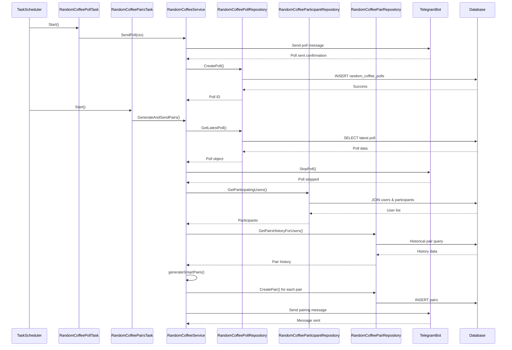
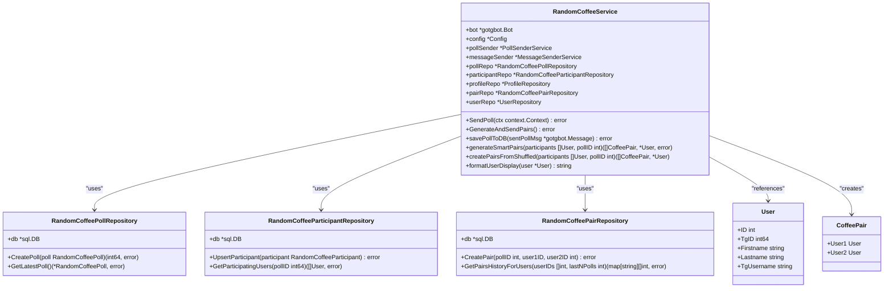
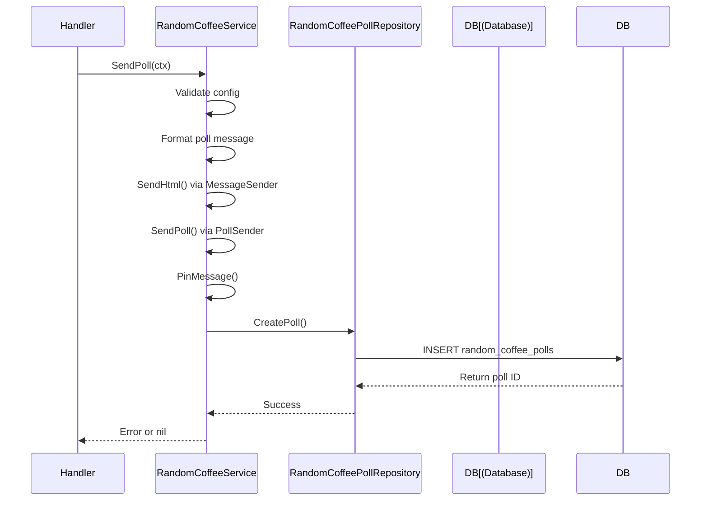
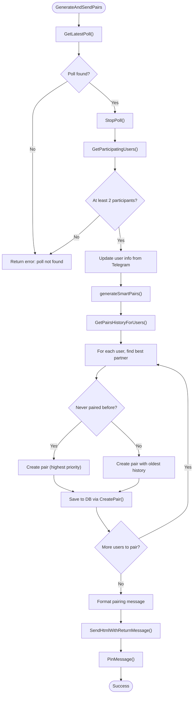
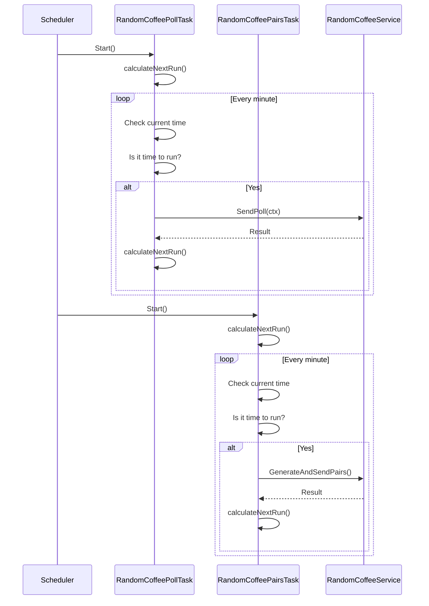

# Random Coffee System

<cite>
**Referenced Files in This Document**   
- [random_coffee_service.go](file://internal/services/random_coffee_service.go)
- [random_coffee_poll_task.go](file://internal/tasks/random_coffee_poll_task.go)
- [random_coffee_pairs_task.go](file://internal/tasks/random_coffee_pairs_task.go)
- [random_coffee_poll_repository.go](file://internal/database/repositories/random_coffee_poll_repository.go)
- [random_coffee_participant_repository.go](file://internal/database/repositories/random_coffee_participant_repository.go)
- [random_coffee_pair_repository.go](file://internal/database/repositories/random_coffee_pair_repository.go)
- [config.go](file://internal/config/config.go)
</cite>

## Table of Contents
1. [Introduction](#introduction)
2. [Project Structure](#project-structure)
3. [Core Components](#core-components)
4. [Architecture Overview](#architecture-overview)
5. [Detailed Component Analysis](#detailed-component-analysis)
6. [Dependency Analysis](#dependency-analysis)
7. [Performance Considerations](#performance-considerations)
8. [Troubleshooting Guide](#troubleshooting-guide)
9. [Conclusion](#conclusion)

## Introduction
The Random Coffee System in evocoders-bot-go is a feature designed to foster community engagement by automatically pairing participants for virtual coffee meetings on a weekly basis. This document provides a comprehensive analysis of the system's implementation, focusing on the automated poll workflow, participant tracking, and smart pairing algorithm. The system leverages scheduled tasks to initiate polls, collect responses, and generate pairs while considering historical pairings to maximize diversity. It integrates with Telegram's API for user interaction and uses a PostgreSQL database to persist state across executions. The design emphasizes reliability, maintainability, and user experience, making it accessible to both beginners and experienced developers.

## Project Structure
The Random Coffee System is organized into a modular architecture with clear separation of concerns across service, task, repository, and configuration layers. The core functionality resides in the `internal/services` and `internal/tasks` directories, while data persistence is handled by repositories in `internal/database/repositories`. Configuration parameters are centralized in `internal/config`, enabling easy customization without code changes.

```mermaid
graph TD
subgraph "Service Layer"
RandomCoffeeService[RandomCoffeeService]
end
subgraph "Task Layer"
PollTask[RandomCoffeePollTask]
PairsTask[RandomCoffeePairsTask]
end
subgraph "Repository Layer"
PollRepo[RandomCoffeePollRepository]
ParticipantRepo[RandomCoffeeParticipantRepository]
PairRepo[RandomCoffeePairRepository]
end
subgraph "Configuration"
Config[Config]
end
PollTask --> RandomCoffeeService : "triggers"
PairsTask --> RandomCoffeeService : "triggers"
RandomCoffeeService --> PollRepo : "uses"
RandomCoffeeService --> ParticipantRepo : "uses"
RandomCoffeeService --> PairRepo : "uses"
RandomCoffeeService --> Config : "reads"
Config --> PollTask : "configures"
Config --> PairsTask : "configures"
```

**Diagram sources**
- [random_coffee_service.go](file://internal/services/random_coffee_service.go#L1-L50)
- [random_coffee_poll_task.go](file://internal/tasks/random_coffee_poll_task.go#L1-L15)
- [random_coffee_pairs_task.go](file://internal/tasks/random_coffee_pairs_task.go#L1-L15)
- [config.go](file://internal/config/config.go#L1-L10)

**Section sources**
- [random_coffee_service.go](file://internal/services/random_coffee_service.go#L1-L50)
- [random_coffee_poll_task.go](file://internal/tasks/random_coffee_poll_task.go#L1-L15)
- [random_coffee_pairs_task.go](file://internal/tasks/random_coffee_pairs_task.go#L1-L15)

## Core Components
The Random Coffee System consists of three primary components: the `RandomCoffeeService` that orchestrates the workflow, the `RandomCoffeePollTask` that triggers weekly polls, and the `RandomCoffeePairsTask` that generates and sends participant pairings. These components work in tandem with repository implementations to manage database interactions for polls, participants, and historical pairs. The service layer abstracts business logic while the task layer handles scheduling, creating a clean separation between timing concerns and application logic.

**Section sources**
- [random_coffee_service.go](file://internal/services/random_coffee_service.go#L1-L50)
- [random_coffee_poll_task.go](file://internal/tasks/random_coffee_poll_task.go#L1-L15)
- [random_coffee_pairs_task.go](file://internal/tasks/random_coffee_pairs_task.go#L1-L15)

## Architecture Overview
The system follows a layered architecture where scheduled tasks invoke service methods, which in turn interact with repository components to persist and retrieve data. The workflow begins with the poll task sending a Telegram poll to gauge participation interest, followed by the pairs task generating matches based on responses. The architecture ensures that each component has a single responsibility, promoting testability and maintainability.



**Diagram sources**
- [random_coffee_poll_task.go](file://internal/tasks/random_coffee_poll_task.go#L48-L91)
- [random_coffee_pairs_task.go](file://internal/tasks/random_coffee_pairs_task.go#L47-L87)
- [random_coffee_service.go](file://internal/services/random_coffee_service.go#L100-L300)

## Detailed Component Analysis

### Random Coffee Service Analysis
The `RandomCoffeeService` is the central orchestrator of the Random Coffee workflow, coordinating between Telegram interactions and database operations. It handles two main workflows: sending participation polls and generating participant pairs.

#### For Object-Oriented Components:


**Diagram sources**
- [random_coffee_service.go](file://internal/services/random_coffee_service.go#L1-L50)
- [random_coffee_poll_repository.go](file://internal/database/repositories/random_coffee_poll_repository.go#L1-L10)
- [random_coffee_participant_repository.go](file://internal/database/repositories/random_coffee_participant_repository.go#L1-L10)
- [random_coffee_pair_repository.go](file://internal/database/repositories/random_coffee_pair_repository.go#L1-L10)

#### For API/Service Components:


**Diagram sources**
- [random_coffee_service.go](file://internal/services/random_coffee_service.go#L52-L100)
- [random_coffee_poll_repository.go](file://internal/database/repositories/random_coffee_poll_repository.go#L1-L20)

#### For Complex Logic Components:


**Diagram sources**
- [random_coffee_service.go](file://internal/services/random_coffee_service.go#L200-L350)
- [random_coffee_pair_repository.go](file://internal/database/repositories/random_coffee_pair_repository.go#L50-L80)

**Section sources**
- [random_coffee_service.go](file://internal/services/random_coffee_service.go#L1-L480)
- [random_coffee_poll_repository.go](file://internal/database/repositories/random_coffee_poll_repository.go#L1-L30)
- [random_coffee_participant_repository.go](file://internal/database/repositories/random_coffee_participant_repository.go#L1-L30)

### Scheduled Tasks Analysis
The system uses two scheduled tasks to automate the weekly workflow: one for initiating polls and another for generating pairs. These tasks run independently but coordinate through shared state in the database.

#### For API/Service Components:


**Diagram sources**
- [random_coffee_poll_task.go](file://internal/tasks/random_coffee_poll_task.go#L48-L91)
- [random_coffee_pairs_task.go](file://internal/tasks/random_coffee_pairs_task.go#L47-L87)

**Section sources**
- [random_coffee_poll_task.go](file://internal/tasks/random_coffee_poll_task.go#L1-L105)
- [random_coffee_pairs_task.go](file://internal/tasks/random_coffee_pairs_task.go#L1-L101)

## Dependency Analysis
The Random Coffee System exhibits a well-defined dependency graph with clear boundaries between components. The service layer depends on repository implementations for data persistence, while task components depend on the service for business logic execution. Configuration parameters flow from the config package to both tasks and services, enabling runtime customization.

```mermaid
graph TD
Config[Config] --> RandomCoffeePollTask : "configures schedule"
Config --> RandomCoffeePairsTask : "configures schedule"
Config --> RandomCoffeeService : "provides parameters"
RandomCoffeePollTask --> RandomCoffeeService : "calls SendPoll"
RandomCoffeePairsTask --> RandomCoffeeService : "calls GenerateAndSendPairs"
RandomCoffeeService --> RandomCoffeePollRepository : "creates polls"
RandomCoffeeService --> RandomCoffeeParticipantRepository : "manages participants"
RandomCoffeeService --> RandomCoffeePairRepository : "creates historical pairs"
RandomCoffeeService --> MessageSenderService : "sends messages"
RandomCoffeeService --> PollSenderService : "sends polls"
RandomCoffeePollRepository --> Database : "CRUD operations"
RandomCoffeeParticipantRepository --> Database : "CRUD operations"
RandomCoffeePairRepository --> Database : "CRUD operations"
```

**Diagram sources**
- [random_coffee_service.go](file://internal/services/random_coffee_service.go#L1-L50)
- [random_coffee_poll_task.go](file://internal/tasks/random_coffee_poll_task.go#L1-L15)
- [random_coffee_pairs_task.go](file://internal/tasks/random_coffee_pairs_task.go#L1-L15)
- [config.go](file://internal/config/config.go#L1-L10)

**Section sources**
- [random_coffee_service.go](file://internal/services/random_coffee_service.go#L1-L50)
- [random_coffee_poll_task.go](file://internal/tasks/random_coffee_poll_task.go#L1-L15)
- [random_coffee_pairs_task.go](file://internal/tasks/random_coffee_pairs_task.go#L1-L15)
- [config.go](file://internal/config/config.go#L1-L10)

## Performance Considerations
The system is designed with performance in mind, using efficient database queries and minimizing external API calls. The pairing algorithm has O(n²) complexity in the worst case but is optimized by limiting historical lookups to the last four polls. Database operations use prepared statements and batch processing where appropriate. The tasks run on a one-minute polling interval, which provides sufficient precision for daily scheduling while minimizing CPU usage. All long-running operations are executed in goroutines to prevent blocking the main event loop.

## Troubleshooting Guide
Common issues in the Random Coffee System typically involve configuration errors, database connectivity problems, or Telegram API limitations. The most frequent issues and their solutions include:

- **Poll not sending**: Verify that `SuperGroupChatID` and `RandomCoffeeTopicID` are correctly configured in the config file. Check that the bot has permission to send messages in the specified chat and topic.

- **Participants not being tracked**: Ensure the `random_coffee_participants` table exists and has the correct schema. Verify that poll answers are being processed by the `random_coffee_poll_answer_handler`.

- **Duplicate pairs**: The smart pairing algorithm considers history from the last four polls, but if users consistently participate, repeats may occur. This is expected behavior when the participant pool is small.

- **Unpaired participants**: When the number of participants is odd, one user will always remain unpaired. The system handles this gracefully by identifying the unpaired user in the announcement message.

- **Database connection issues**: Check that the database connection string is correct and that the migrations have been applied successfully, particularly `20250602_add_random_coffee_poll_tables.go` and `20250609_add_random_coffee_pairs_table.go`.

**Section sources**
- [random_coffee_service.go](file://internal/services/random_coffee_service.go#L1-L480)
- [random_coffee_poll_repository.go](file://internal/database/repositories/random_coffee_poll_repository.go#L1-L30)
- [random_coffee_participant_repository.go](file://internal/database/repositories/random_coffee_participant_repository.go#L1-L30)
- [20250609_add_random_coffee_pairs_table.go](file://internal/database/migrations/implementations/20250609_add_random_coffee_pairs_table.go#L1-L38)

## Conclusion
The Random Coffee System in evocoders-bot-go demonstrates a robust implementation of automated community engagement through scheduled tasks, intelligent pairing algorithms, and seamless integration with Telegram. By separating concerns across service, task, and repository layers, the system achieves high maintainability and testability. The smart pairing algorithm enhances user experience by minimizing repeat pairings, while comprehensive error handling ensures reliability. Configuration options provide flexibility for different deployment scenarios, and the modular design allows for future enhancements such as preference-based matching or analytics reporting.