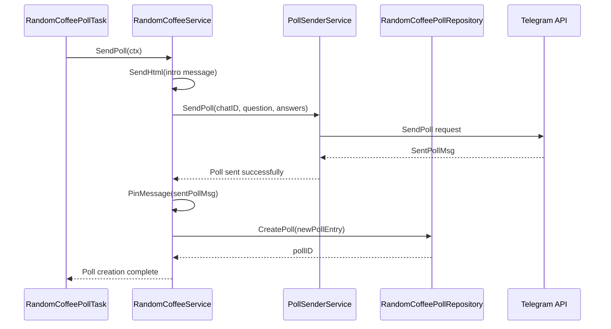
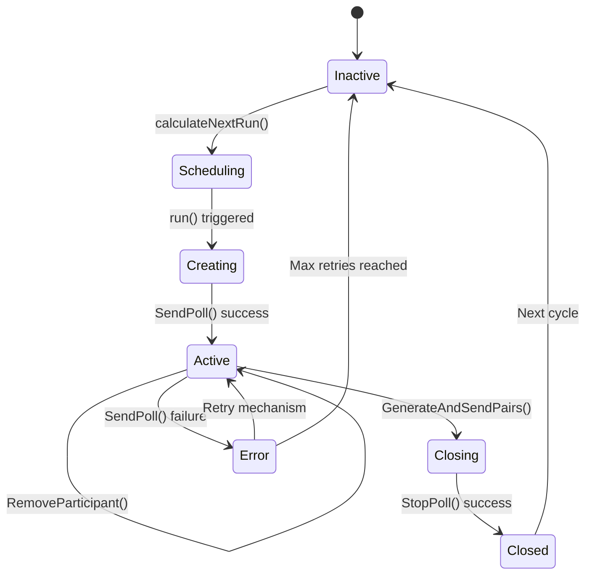
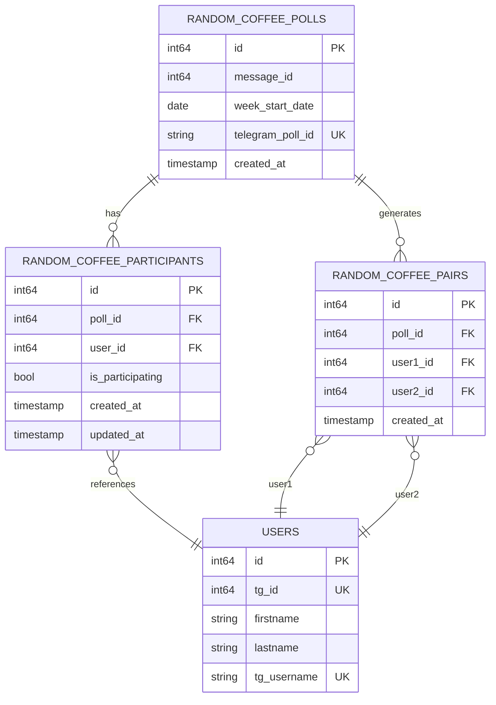
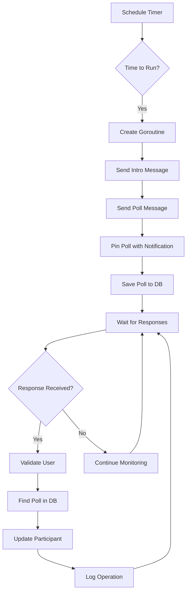

# Weekly Poll Workflow

<cite>
**Referenced Files in This Document**   
- [random_coffee_poll_task.go](file://internal/tasks/random_coffee_poll_task.go)
- [random_coffee_service.go](file://internal/services/random_coffee_service.go)
- [random_coffee_poll_repository.go](file://internal/database/repositories/random_coffee_poll_repository.go)
- [random_coffee_participant_repository.go](file://internal/database/repositories/random_coffee_participant_repository.go)
- [poll_answer_handler.go](file://internal/handlers/grouphandlers/poll_answer_handler.go)
- [randomcofee_poll_answers_service.go](file://internal/services/grouphandlersservices/randomcofee_poll_answers_service.go)
- [20250602_add_random_coffee_poll_tables.go](file://internal/database/migrations/implementations/20250602_add_random_coffee_poll_tables.go)
- [20250609_add_random_coffee_pairs_table.go](file://internal/database/migrations/implementations/20250609_add_random_coffee_pairs_table.go)
</cite>

## Update Summary
**Changes Made**   
- Updated User Response Handling section to reflect removal of supergroup chat check
- Added new section sources for poll_answer_handler.go and randomcofee_poll_answers_service.go
- Removed outdated information about message origin validation
- Updated diagram sources to reflect current file structure
- Enhanced error handling description with updated validation logic

## Table of Contents
1. [Introduction](#introduction)
2. [Poll Creation and Scheduling](#poll-creation-and-scheduling)
3. [Poll Sending and Database Storage](#poll-sending-and-database-storage)
4. [User Response Handling](#user-response-handling)
5. [State Management and Poll Lifecycle](#state-management-and-poll-lifecycle)
6. [Database Schema and Data Models](#database-schema-and-data-models)
7. [Error Handling and Resilience](#error-handling-and-resilience)
8. [Concurrency and Message Delivery](#concurrency-and-message-delivery)
9. [Troubleshooting Common Issues](#troubleshooting-common-issues)
10. [Conclusion](#conclusion)

## Introduction
The Weekly Poll Workflow is a core component of the Random Coffee System that automates the creation and management of weekly participation polls in a Telegram group. This workflow enables community members to indicate their availability for coffee pairings each week through a structured poll system. The process begins with a scheduled task that automatically creates a new poll at a predefined time each week, continues with the collection and validation of user responses, and concludes with the storage of participation data in a database for subsequent pairing operations. This document provides a comprehensive analysis of the end-to-end workflow, detailing how the system ensures reliable poll delivery, handles user interactions, maintains data integrity, and addresses potential failure scenarios. The workflow demonstrates a well-architected approach to automated community engagement, combining scheduling, messaging, database operations, and error handling in a cohesive system.

## Poll Creation and Scheduling
The Weekly Poll Workflow begins with the `random_coffee_poll_task`, which is responsible for scheduling and triggering the creation of weekly polls at predetermined intervals. This task operates as a long-running goroutine that uses a ticker to check the current time against the scheduled poll time at one-minute intervals. The scheduling logic is implemented in the `calculateNextRun` method of the `RandomCoffeePollTask` struct, which determines the next occurrence based on configuration parameters for the target weekday, hour, and minute in UTC time. When the current time exceeds the scheduled run time, the task invokes the `SendPoll` method of the `RandomCoffeeService` to initiate poll creation. The task runs asynchronously within a goroutine to prevent blocking the main application thread, ensuring that the bot remains responsive to other events while maintaining the poll schedule. Configuration for the task includes a boolean flag `RandomCoffeePollTaskEnabled` that allows administrators to disable the automatic polling functionality when needed, providing operational flexibility for maintenance or special circumstances.

**Section sources**
- [random_coffee_poll_task.go](file://internal/tasks/random_coffee_poll_task.go#L0-L91)

## Poll Sending and Database Storage
Once triggered by the scheduler, the `RandomCoffeeService` handles the creation and posting of the poll in the designated Telegram group. The service first sends a regular message with HTML formatting that includes a link to the Random Coffee rules and an invitation to participate in the poll. This message is posted in a specific topic within the group, identified by the `RandomCoffeeTopicID` configuration parameter. Following the introductory message, the service creates and sends an actual poll using the Telegram Bot API, with two response options: "Да! 🤗" (Yes!) and "Не в этот раз 💁🏽" (Not this time). The poll is configured as non-anonymous to enable participant tracking and is posted in the same topic as the introductory message. After successful poll creation, the system automatically pins the poll message to the topic with notification to ensure maximum visibility among group members. The final step in this process is storing the poll metadata in the database through the `savePollToDB` method, which creates a database entry containing the Telegram message ID, poll ID, and the calculated start date of the week for which the poll is valid.

**Diagram sources**
- [random_coffee_service.go](file://internal/services/random_coffee_service.go#L54-L172)
- [random_coffee_poll_repository.go](file://internal/database/repositories/random_coffee_poll_repository.go#L0-L47)

## User Response Handling
User interactions with the weekly poll are managed by the `poll_answer_handler`, which listens for poll answer events from the Telegram Bot API and processes them accordingly. When a user submits or changes their response to the poll, the handler receives a `PollAnswer` update containing the user's ID, the poll ID, and the selected option(s). The handler first performs validation checks to ensure the responding user is not a bot and has not been banned from participating in Random Coffee events. It then retrieves the internal user ID from the database using the `GetOrCreate` method of the `UserRepository`, establishing a mapping between the Telegram user and the system's internal user representation. The handler queries the `RandomCoffeePollRepository` to find the corresponding poll in the database using the Telegram poll ID, ensuring that only responses to active Random Coffee polls are processed. Based on the user's selection, the handler either creates a new participation record or updates an existing one in the `random_coffee_participants` table, with the `UpsertParticipant` method handling both insertion and update operations through a database upsert pattern that prevents duplicate entries.

The handler has been updated to remove the check for message originating from a supergroup chat, as this validation was deemed redundant given that poll answers are inherently tied to the specific Telegram group context. This refactoring simplifies the handler logic while maintaining security through other validation layers.

**Section sources**
- [poll_answer_handler.go](file://internal/handlers/grouphandlers/poll_answer_handler.go#L0-L33)
- [randomcofee_poll_answers_service.go](file://internal/services/grouphandlersservices/randomcofee_poll_answers_service.go#L0-L116)
- [random_coffee_participant_repository.go](file://internal/database/repositories/random_coffee_participant_repository.go#L0-L42)

## State Management and Poll Lifecycle
The Weekly Poll Workflow implements a clear state lifecycle that tracks the poll from creation through response collection to eventual closure and pairing. When a new poll is created, it enters an "active" state where users can submit their participation preferences. This state persists for a configurable period, typically one week, during which the system continuously accepts and processes responses. Each user response triggers a state transition in the participant record, with the `is_participating` field being set to true for affirmative responses ("Да! 🤗") and false for negative responses ("Не в этот раз 💁🏽"). Users can change their responses multiple times during the active period, with each update overwriting the previous state in the database. When a user retracts their vote entirely, the system removes their participation record from the database using the `RemoveParticipant` method. The poll transitions to a "closed" state when the `random_coffee_pairs_task` executes and calls the `StopPoll` method on the Telegram poll, which prevents further responses and finalizes the participation data. This state transition is critical for ensuring data consistency when generating coffee pairs, as it establishes a definitive cutoff point for participation.

**Diagram sources**
- [random_coffee_poll_task.go](file://internal/tasks/random_coffee_poll_task.go#L48-L91)
- [random_coffee_service.go](file://internal/services/random_coffee_service.go#L174-L295)

## Database Schema and Data Models
The Weekly Poll Workflow relies on a well-defined database schema that captures poll metadata, participant responses, and historical pairing information. The primary entity is the `random_coffee_polls` table, which stores information about each weekly poll including the Telegram message ID, the start date of the week, and the unique Telegram poll ID. This table serves as the anchor point for all poll-related data and establishes a foreign key relationship with the `random_coffee_participants` table. The participants table contains records for each user who responds to a poll, with fields for the poll ID, user ID, and a boolean indicating whether they are participating. The table includes a composite unique constraint on `poll_id` and `user_id` to prevent duplicate entries and uses the `ON CONFLICT` clause in SQL to implement upsert behavior. Additionally, the system includes a `random_coffee_pairs` table that stores the generated coffee pairings, with foreign key references to both the poll and user tables to maintain referential integrity. These tables are created and managed through database migrations that ensure schema consistency across deployments.

**Diagram sources**
- [20250602_add_random_coffee_poll_tables.go](file://internal/database/migrations/implementations/20250602_add_random_coffee_poll_tables.go#L0-L55)
- [20250609_add_random_coffee_pairs_table.go](file://internal/database/migrations/implementations/20250609_add_random_coffee_pairs_table.go#L0-L38)

## Error Handling and Resilience
The Weekly Poll Workflow incorporates comprehensive error handling mechanisms to ensure reliability and resilience in the face of various failure scenarios. The `random_coffee_poll_task` wraps the poll creation process in a context with a 5-minute timeout, preventing the operation from hanging indefinitely if the Telegram API is unresponsive. Errors during poll creation are logged with descriptive messages that include the error type and relevant identifiers, enabling effective monitoring and debugging. The handler for user responses is designed to be fault-tolerant, returning `nil` instead of propagating errors when database operations fail, which prevents a single failed response from disrupting the entire bot operation. The system also includes validation checks that prevent bots and banned users from participating, with appropriate notifications sent to affected users or administrators. When storing poll data, the repository checks for nil references before attempting database operations, avoiding potential panic conditions. The upsert operation for participant records uses PostgreSQL's `ON CONFLICT` clause to handle race conditions gracefully, ensuring data consistency even when multiple responses are processed simultaneously.

**Section sources**
- [random_coffee_poll_task.go](file://internal/tasks/random_coffee_poll_task.go#L48-L91)
- [random_coffee_poll_answer_handler.go](file://internal/handlers/grouphandlers/random_coffee_poll_answer_handler.go#L0-L126)
- [random_coffee_poll_repository.go](file://internal/database/repositories/random_coffee_poll_repository.go#L0-L47)

## Concurrency and Message Delivery
The Weekly Poll Workflow is designed with concurrency and message delivery guarantees in mind, ensuring reliable operation in a distributed environment. The scheduling task uses a goroutine to execute poll creation asynchronously, allowing the main application loop to continue processing other events without blocking. This concurrent design enables the system to handle multiple operations simultaneously while maintaining the integrity of the poll schedule. The use of database transactions and atomic operations ensures that participant records are updated consistently, even when multiple users respond to the poll at nearly the same time. The upsert pattern in the `UpsertParticipant` method provides a race-condition-free way to handle concurrent updates to the same participant record. Message delivery to Telegram is handled through the `PollSenderService`, which includes built-in logging and error reporting to monitor the success of API calls. The system also implements a pinning mechanism with notification for the poll message, ensuring that it receives maximum visibility within the Telegram group and increasing the likelihood that users will see and respond to it.

**Diagram sources**
- [random_coffee_poll_task.go](file://internal/tasks/random_coffee_poll_task.go#L48-L91)
- [random_coffee_service.go](file://internal/services/random_coffee_service.go#L54-L172)

## Troubleshooting Common Issues
Several common issues can arise in the Weekly Poll Workflow, particularly related to bot downtime during critical operations. If the bot is offline when the scheduled poll time arrives, the `random_coffee_poll_task` will miss that poll cycle, as the ticker-based scheduler does not have built-in catch-up functionality for missed executions. To mitigate this risk, administrators can manually trigger poll creation using the `try_create_coffee_pool_handler` test handler, which provides a command interface for on-demand poll generation. Another potential issue is the failure to send the poll due to incorrect configuration, such as an invalid `SuperGroupChatID` or `RandomCoffeeTopicID`, which would result in an error being logged and the poll creation being skipped. Database connectivity issues could prevent the storage of poll metadata or participant responses, though the system is designed to continue operating by logging errors without crashing. In cases where the poll message fails to send, the system does not implement automatic retries, relying instead on manual intervention through the test handlers. Monitoring the application logs for error messages related to poll creation, message sending, or database operations is essential for maintaining the reliability of the workflow.

**Section sources**
- [random_coffee_poll_task.go](file://internal/tasks/random_coffee_poll_task.go#L0-L91)
- [random_coffee_service.go](file://internal/services/random_coffee_service.go#L0-L172)
- [random_coffee_poll_answer_handler.go](file://internal/handlers/grouphandlers/random_coffee_poll_answer_handler.go#L0-L126)

## Conclusion
The Weekly Poll Workflow represents a robust and well-structured system for automating community engagement in the Random Coffee initiative. By combining scheduled task execution, Telegram API integration, database persistence, and comprehensive error handling, the workflow ensures a reliable and consistent user experience for weekly participation tracking. The architecture demonstrates thoughtful design decisions, including the separation of concerns between scheduling, service logic, and data access layers, as well as the implementation of resilient patterns for handling concurrent user interactions. The use of database upsert operations prevents duplicate entries and race conditions, while the clear state transitions provide a predictable lifecycle for poll management. For beginners, the system offers a straightforward interface through Telegram polls, while advanced users can appreciate the underlying complexity of the concurrency model and message delivery guarantees. The inclusion of test handlers and manual override capabilities provides operational flexibility and simplifies troubleshooting, making the system both powerful and maintainable. This workflow serves as an excellent example of how automated processes can enhance community engagement while maintaining data integrity and system reliability.