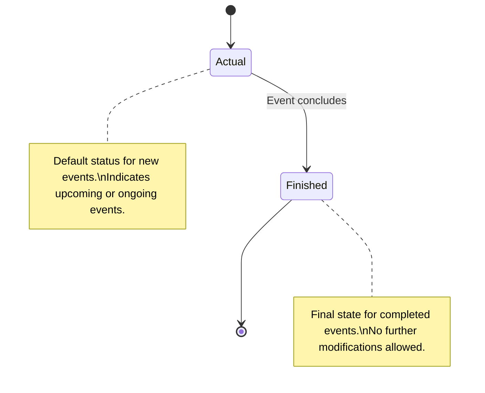
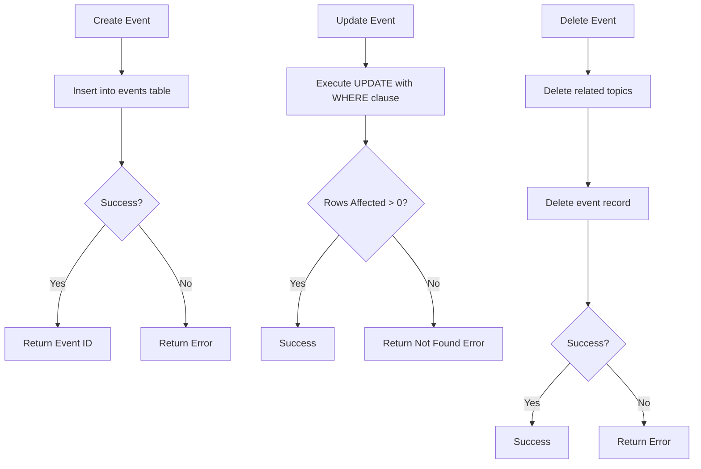
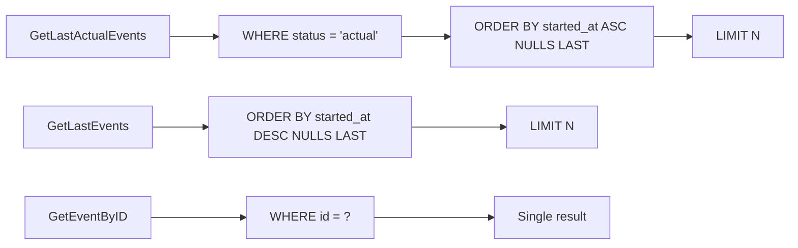
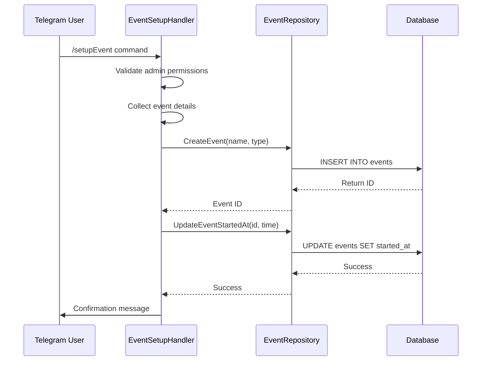
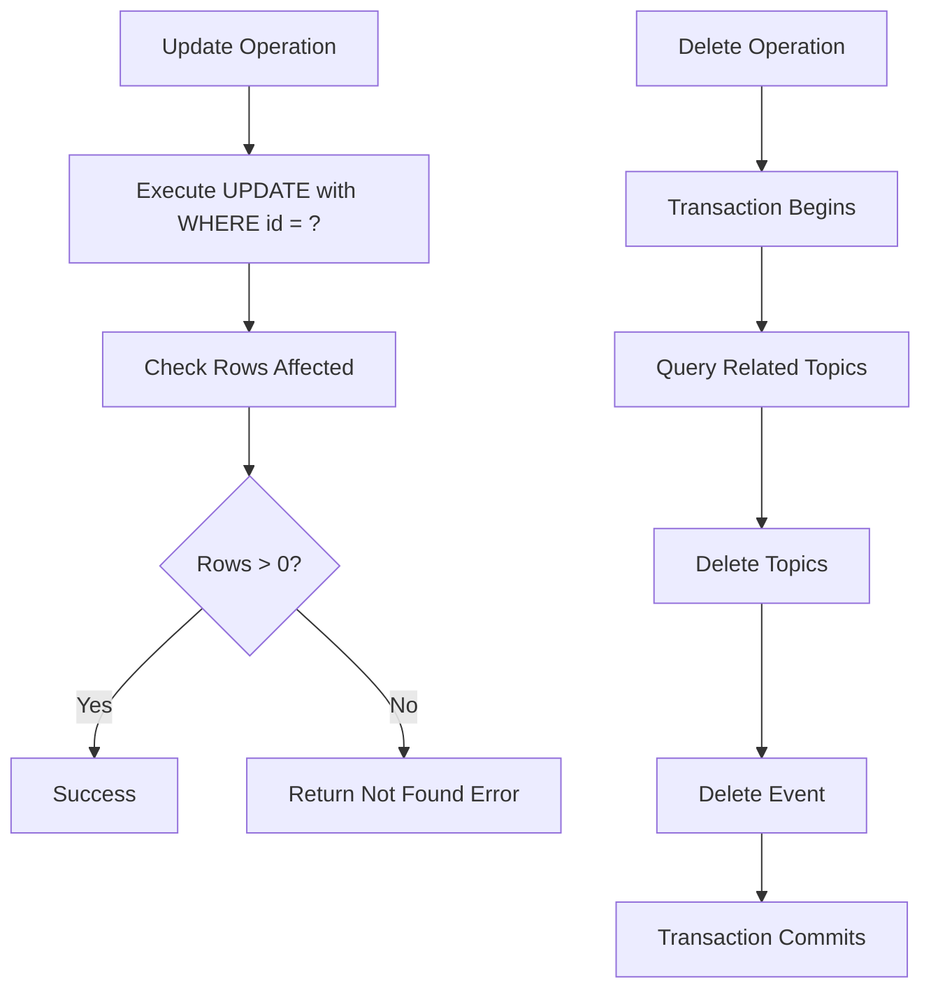

# Event Repository

<cite>
**Referenced Files in This Document**   
- [event_repository.go](file://internal/database/repositories/event_repository.go)
- [db_constants.go](file://internal/constants/db_constants.go)
- [event_edit_handler.go](file://internal/handlers/adminhandlers/eventhandlers/event_edit_handler.go)
- [event_setup_handler.go](file://internal/handlers/adminhandlers/eventhandlers/event_setup_handler.go)
- [events_handler.go](file://internal/handlers/privatehandlers/events_handler.go)
- [event_formatters.go](file://internal/formatters/event_formatters.go)
- [group_topic_repository.go](file://internal/database/repositories/group_topic_repository.go)
- [20250403_rename_contents_to_events.go](file://internal/database/migrations/implementations/20250403_rename_contents_to_events.go)
- [20250917_add_group_topics_table.go](file://internal/database/migrations/implementations/20250917_add_group_topics_table.go)
</cite>

## Table of Contents
1. [Introduction](#introduction)
2. [Domain Model](#domain-model)
3. [Event Lifecycle and Status Management](#event-lifecycle-and-status-management)
4. [Core Operations](#core-operations)
5. [Filtering and Retrieval](#filtering-and-retrieval)
6. [Relationships with Group Topics and Users](#relationships-with-group-topics-and-users)
7. [Public Interfaces and Usage Examples](#public-interfaces-and-usage-examples)
8. [Concurrency and Data Integrity](#concurrency-and-data-integrity)
9. [Performance Considerations](#performance-considerations)
10. [Troubleshooting Guide](#troubleshooting-guide)

## Introduction

The Event Repository component in evocoders-bot-go provides a data access layer for managing event entities within the application. It encapsulates all database operations related to events, serving as the primary interface between business logic and persistent storage. This repository supports full CRUD operations, status transitions, and integration with related entities such as group topics and user profiles. The implementation follows a clean separation of concerns, with dedicated methods for event creation, modification, retrieval, and deletion. Events are central to the platform's functionality, representing various types of community gatherings including club calls, meetups, workshops, reading clubs, and conferences.

**Section sources**
- [event_repository.go](file://internal/database/repositories/event_repository.go#L1-L252)

## Domain Model

The Event entity represents a structured data model for community events within the system. Each event contains essential metadata including a unique identifier, name, type, status, and temporal information. The domain model is implemented as a Go struct with explicit field definitions that map directly to database columns.

```mermaid
classDiagram
class Event {
+int ID
+string Name
+string Type
+string Status
+*time.Time StartedAt
+time.Time CreatedAt
+time.Time UpdatedAt
}
note right of Event
Core event entity with temporal\nand categorical attributes.\nStartedAt is optional (pointer).
end note
```

**Diagram sources**
- [event_repository.go](file://internal/database/repositories/event_repository.go#L12-L20)

The `Event` struct includes six fields:
- **ID**: Unique integer identifier (primary key)
- **Name**: Human-readable title of the event
- **Type**: Categorical classification from a predefined set
- **Status**: Current lifecycle state (actual or finished)
- **StartedAt**: Optional timestamp indicating when the event begins
- **CreatedAt/UpdatedAt**: Audit timestamps for record creation and modification

Event types are strongly typed using the `EventType` enum, which includes values like `club-call`, `meetup`, `workshop`, `reading-club`, and `conference`. This ensures data consistency and enables type-specific formatting and behavior in the application.

**Section sources**
- [event_repository.go](file://internal/database/repositories/event_repository.go#L12-L20)
- [db_constants.go](file://internal/constants/db_constants.go#L3-L15)

## Event Lifecycle and Status Management

Events progress through a simple but effective lifecycle model defined by their status field. The repository supports explicit status transitions that reflect the natural progression of events from planning to completion.



**Diagram sources**
- [db_constants.go](file://internal/constants/db_constants.go#L23-L28)

The repository provides dedicated methods for status management:
- `CreateEvent` and `CreateEventWithStartedAt` initialize events with `actual` status by default
- `UpdateEventStatus` allows explicit transition to `finished` status
- No reverse transition is supported (from finished to actual)

This unidirectional state transition ensures data integrity and prevents logical inconsistencies in event tracking. The status system enables efficient filtering of current versus historical events across the application.

**Section sources**
- [event_repository.go](file://internal/database/repositories/event_repository.go#L139-L154)
- [db_constants.go](file://internal/constants/db_constants.go#L23-L28)

## Core Operations

The Event Repository implements a comprehensive set of operations for event management, following REST-like semantics for data manipulation.



**Diagram sources**
- [event_repository.go](file://internal/database/repositories/event_repository.go#L45-L252)

Key operations include:
- **Creation**: `CreateEvent` and `CreateEventWithStartedAt` insert new records with automatic ID generation
- **Update**: Methods like `UpdateEventName`, `UpdateEventType`, and `UpdateEventStartedAt` modify specific fields
- **Deletion**: `DeleteEvent` performs cascading removal of related topics before removing the event itself

All update operations automatically refresh the `UpdatedAt` timestamp and include row count validation to detect non-existent records.

**Section sources**
- [event_repository.go](file://internal/database/repositories/event_repository.go#L45-L252)

## Filtering and Retrieval

The repository provides multiple retrieval methods optimized for different use cases, with appropriate sorting and limiting strategies.



**Diagram sources**
- [event_repository.go](file://internal/database/repositories/event_repository.go#L75-L137)

Two primary retrieval patterns exist:
- `GetLastActualEvents(limit)` fetches upcoming/ongoing events sorted chronologically (ascending), prioritizing events with defined start times
- `GetLastEvents(limit)` retrieves recent events by creation/modification time (descending)

The `NULLS LAST` clause ensures events without start dates appear after scheduled events in results. This design supports both chronological presentation of upcoming events and recency-based listing of recent activity.

**Section sources**
- [event_repository.go](file://internal/database/repositories/event_repository.go#L75-L137)

## Relationships with Group Topics and Users

Events maintain hierarchical relationships with group topics, which in turn are associated with users. This creates a three-tier structure for community content organization.

```mermaid
erDiagram
EVENT {
int id PK
string name
string type
string status
timestamptz started_at
}
GROUP_TOPIC {
int id PK
bigint topic_id
string name
}
EVENT ||--o{ GROUP_TOPIC : "has"
note as "Relationship Notes"
One event can have multiple group topics.\nEach topic belongs to exactly one event.\nUsers contribute topics through profile associations.
end note
```

**Diagram sources**
- [event_repository.go](file://internal/database/repositories/event_repository.go#L225-L252)
- [group_topic_repository.go](file://internal/database/repositories/group_topic_repository.go#L1-L147)
- [20250403_rename_contents_to_events.go](file://internal/database/migrations/implementations/20250403_rename_contents_to_events.go#L1-L114)

The relationship is implemented through foreign key constraints:
- Events table was migrated from "contents" to "events" with proper FK constraints
- Topics table references events via `event_id` foreign key
- Cascading deletion ensures data consistency when removing events

This structure enables rich content organization where each event serves as a container for multiple discussion topics contributed by community members.

**Section sources**
- [event_repository.go](file://internal/database/repositories/event_repository.go#L225-L252)
- [group_topic_repository.go](file://internal/database/repositories/group_topic_repository.go#L1-L147)
- [20250403_rename_contents_to_events.go](file://internal/database/migrations/implementations/20250403_rename_contents_to_events.go#L1-L114)
- [20250917_add_group_topics_table.go](file://internal/database/migrations/implementations/20250917_add_group_topics_table.go#L1-L38)

## Public Interfaces and Usage Examples

The repository exposes a clean, method-based interface that is consumed by various handlers throughout the application. These interfaces follow consistent patterns for error handling and data validation.



**Diagram sources**
- [event_setup_handler.go](file://internal/handlers/adminhandlers/eventhandlers/event_setup_handler.go#L1-L357)
- [event_repository.go](file://internal/database/repositories/event_repository.go#L45-L65)

Practical usage examples include:
- **Admin event creation**: The `event_setup_handler` guides administrators through a conversation to create new events
- **Event listing**: The `events_handler` retrieves actual events for display to club members
- **Admin editing**: The `event_edit_handler` allows modification of existing event properties

Formatting functions in `event_formatters.go` transform raw event data into user-friendly messages with appropriate emojis and time formatting, including countdowns for upcoming events.

**Section sources**
- [event_setup_handler.go](file://internal/handlers/adminhandlers/eventhandlers/event_setup_handler.go#L1-L357)
- [events_handler.go](file://internal/handlers/privatehandlers/events_handler.go#L1-L78)
- [event_edit_handler.go](file://internal/handlers/adminhandlers/eventhandlers/event_edit_handler.go#L1-L538)
- [event_formatters.go](file://internal/formatters/event_formatters.go#L1-L217)

## Concurrency and Data Integrity

The repository implements several mechanisms to ensure data consistency and handle potential concurrency issues during event updates.



**Diagram sources**
- [event_repository.go](file://internal/database/repositories/event_repository.go#L105-L252)

Key integrity features:
- **Row count validation**: All update and delete operations verify `RowsAffected()` to detect non-existent records
- **Cascading operations**: Event deletion first removes related topics in application logic before deleting the event
- **Atomic transactions**: The migration system uses transactions to ensure schema changes are atomic
- **Foreign key constraints**: Database-level constraints maintain referential integrity

While the current implementation doesn't use explicit database transactions for regular operations, the use of `RowsAffected()` checks provides protection against stale data updates and ensures operations fail predictably when targeting non-existent records.

**Section sources**
- [event_repository.go](file://internal/database/repositories/event_repository.go#L105-L252)
- [20250403_rename_contents_to_events.go](file://internal/database/migrations/implementations/20250403_rename_contents_to_events.go#L1-L114)

## Performance Considerations

The repository design incorporates several performance optimizations for efficient data access patterns.

**Query Efficiency**
- Indexed access by primary key (`GetEventByID`)
- Indexed filtering by status (`GetLastActualEvents`)
- Sorted retrieval with appropriate indexing on `started_at` and `created_at`
- Limited result sets to prevent excessive data transfer

**Data Access Patterns**
- Minimal query complexity with single-table operations
- Efficient scanning with proper `NULLS LAST` handling
- Connection reuse through the injected `*sql.DB` instance
- Prepared statements via `QueryRow` and `Query` methods

The sorting strategy in retrieval methods is particularly noteworthy: `GetLastActualEvents` uses `ORDER BY started_at ASC NULLS LAST` to prioritize scheduled events while placing unscheduled ones at the end, creating a logical presentation order for users.

**Section sources**
- [event_repository.go](file://internal/database/repositories/event_repository.go#L75-L137)

## Troubleshooting Guide

This section addresses common issues encountered when working with the Event Repository and provides resolution strategies.

**Common Issues and Solutions**

| Issue | Cause | Resolution Strategy |
|------|------|-------------------|
| "No event found with ID X to update" | Attempting to modify non-existent event | Verify event ID exists using `GetEventByID` before update operations |
| Foreign key constraint violation | Attempting to create topic with invalid event_id | Ensure event exists before creating related topics |
| Duplicate event creation | Race condition in event setup | Implement application-level locking or use database constraints |
| NULL values in started_at affecting sort order | Misunderstanding of NULLS LAST behavior | Account for NULL values in client-side sorting if needed |
| Cascading delete failures | Transaction rollback during topic deletion | Check error handling in `DeleteEvent` method and ensure proper rollback |

**Error Handling Best Practices**
- Always check for `sql.ErrNoRows` when retrieving single records
- Validate input parameters before repository calls
- Handle transaction failures in migration operations
- Monitor row counts in update/delete operations
- Implement proper logging for debugging

The repository's comprehensive error wrapping with `fmt.Errorf` and contextual information (using `utils.GetCurrentTypeName()`) facilitates debugging by providing clear error messages with method context.

**Section sources**
- [event_repository.go](file://internal/database/repositories/event_repository.go#L45-L252)
- [event_edit_handler.go](file://internal/handlers/adminhandlers/eventhandlers/event_edit_handler.go#L1-L538)
- [event_setup_handler.go](file://internal/handlers/adminhandlers/eventhandlers/event_setup_handler.go#L1-L357)