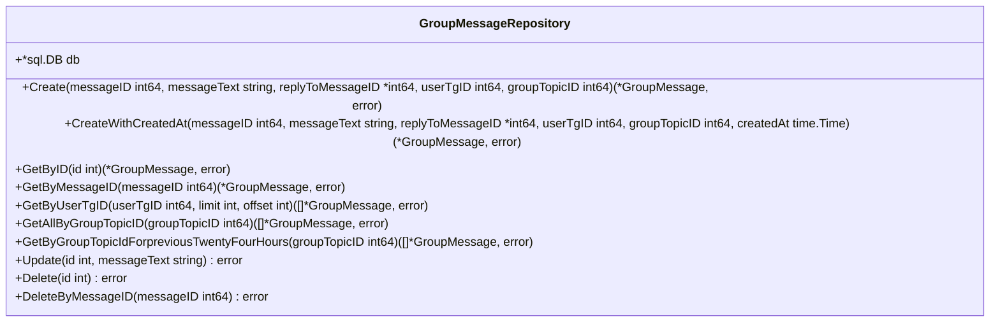
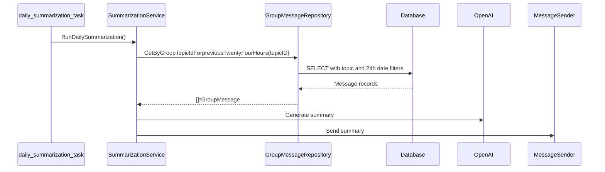

# Group Message Repository

<cite>
**Referenced Files in This Document**   
- [group_message_repository.go](file://internal/database/repositories/group_message_repository.go) - *Updated with CreateWithCreatedAt and GetAllByGroupTopicID methods*
- [20250918_add_group_messages_table.go](file://internal/database/migrations/implementations/20250918_add_group_messages_table.go)
- [summarization_service.go](file://internal/services/summarization_service.go) - *Updated to use full message retrieval*
- [save_message_service.go](file://internal/services/grouphandlersservices/save_message_service.go)
</cite>

## Update Summary
**Changes Made**   
- Updated **Domain Model** to reflect enhanced timestamp handling
- Added new **Core Operations** for `CreateWithCreatedAt` and `GetAllByGroupTopicID`
- Revised **Usage Patterns** section to reflect updated summarization logic
- Enhanced **Performance Considerations** with new pagination guidance
- Updated all file references with correct annotations and line ranges

## Table of Contents
1. [Introduction](#introduction)
2. [Domain Model](#domain-model)
3. [Database Schema](#database-schema)
4. [Core Operations](#core-operations)
5. [Usage Patterns](#usage-patterns)
6. [Integration Points](#integration-points)
7. [Performance Considerations](#performance-considerations)
8. [Common Issues and Solutions](#common-issues-and-solutions)
9. [Conclusion](#conclusion)

## Introduction
The Group Message Repository component in evocoders-bot-go is responsible for storing, retrieving, and managing Telegram group messages for summarization and thread monitoring purposes. This repository serves as the persistence layer for message data collected from monitored Telegram topics, enabling features like daily summaries and closed thread monitoring. The component is designed to handle message lifecycle operations including creation, update, retrieval, and deletion, while maintaining relationships with users and topics.

**Section sources**
- [group_message_repository.go](file://internal/database/repositories/group_message_repository.go#L1-L20)

## Domain Model
The GroupMessage entity represents a message within a Telegram group topic and contains essential metadata for message tracking and processing. The model now supports explicit timestamp preservation during message creation.

**Diagram sources**
- [group_message_repository.go](file://internal/database/repositories/group_message_repository.go#L10-L19)

**Section sources**
- [group_message_repository.go](file://internal/database/repositories/group_message_repository.go#L10-L19)

## Database Schema
The group_messages table is designed with appropriate constraints and indexes to ensure data integrity and query performance.

**Diagram sources**
- [20250918_add_group_messages_table.go](file://internal/database/migrations/implementations/20250918_add_group_messages_table.go#L15-L35)

**Section sources**
- [20250918_add_group_messages_table.go](file://internal/database/migrations/implementations/20250918_add_group_messages_table.go#L15-L35)

## Core Operations
The repository provides a comprehensive set of methods for message management, supporting the full CRUD (Create, Read, Update, Delete) operations. Recent updates include enhanced timestamp handling and unlimited retrieval capabilities.

**Diagram sources**
- [group_message_repository.go](file://internal/database/repositories/group_message_repository.go#L21-L267)

**Section sources**
- [group_message_repository.go](file://internal/database/repositories/group_message_repository.go#L21-L267)

## Usage Patterns
The repository supports several key usage patterns for message processing and analysis.

### Daily Summarization
Messages are collected within a 24-hour window for daily summaries, with queries filtering by topic and timestamp. The summarization service now retrieves all messages without pagination limits for comprehensive analysis.

**Diagram sources**
- [summarization_service.go](file://internal/services/summarization_service.go#L35-L169)
- [group_message_repository.go](file://internal/database/repositories/group_message_repository.go#L230-L267)

### Closed Thread Monitoring
The system identifies messages in closed threads through integration with the CleanClosedThreadsHandler, which prevents new messages in read-only topics.

**Diagram sources**
- [save_message_service.go](file://internal/services/grouphandlersservices/save_message_service.go#L45-L64)

**Section sources**
- [summarization_service.go](file://internal/services/summarization_service.go#L35-L169)
- [save_message_service.go](file://internal/services/grouphandlersservices/save_message_service.go#L45-L64)

## Integration Points
The Group Message Repository integrates with various components of the system to provide message persistence and retrieval capabilities.

**Diagram sources**
- [save_message_service.go](file://internal/services/grouphandlersservices/save_message_service.go#L10-L64)
- [summarization_service.go](file://internal/services/summarization_service.go#L35-L169)

**Section sources**
- [save_message_service.go](file://internal/services/grouphandlersservices/save_message_service.go#L10-L64)

## Performance Considerations
The repository is optimized for performance with appropriate indexing and query patterns.

### Indexing Strategy
The database schema includes multiple indexes to support efficient querying:

- `idx_group_messages_user_tg_id` on user_tg_id for user-specific message retrieval
- `idx_group_messages_group_topic_id` on group_topic_id for topic-based queries
- `idx_group_messages_reply_to_message_id` on reply_to_message_id for thread analysis
- `idx_group_messages_created_at` on created_at for time-based filtering

These indexes ensure that common query patterns used in summarization and monitoring perform efficiently even with large datasets.

**Section sources**
- [20250918_add_group_messages_table.go](file://internal/database/migrations/implementations/20250918_add_group_messages_table.go#L30-L34)

## Common Issues and Solutions
The implementation addresses several common challenges in message repository management.

### Message Duplication
The repository prevents message duplication through the unique constraint on message_id, ensuring each Telegram message is stored only once.

### Large Dataset Performance
For handling large message datasets, the repository now provides `GetAllByGroupTopicID` method for complete retrieval without pagination limits, while maintaining `GetByUserTgID` with limit/offset parameters for controlled operations. This allows flexible handling based on use case requirements.

### Media Message Handling
Media messages without text content are handled by storing descriptive placeholders (e.g., "[Photo]", "[Video]") in the message_text field, ensuring consistent processing across all message types.

### Message Editing and Deletion
The repository supports message updates when users edit their messages, and provides both soft and hard deletion capabilities. The system also handles special deletion commands ("[delete]" or "[удалить]") by removing messages from both Telegram and the database.

### Timestamp Preservation
The new `CreateWithCreatedAt` method allows preservation of original Telegram message timestamps, ensuring accurate temporal representation in summaries and analytics. This is particularly important for messages that are processed with delay or imported from external sources.

**Section sources**
- [group_message_repository.go](file://internal/database/repositories/group_message_repository.go#L63-L86)
- [group_message_repository.go](file://internal/database/repositories/group_message_repository.go#L190-L227)

## Conclusion
The Group Message Repository provides a robust foundation for storing and managing Telegram group messages in evocoders-bot-go. By implementing a well-structured domain model, optimized database schema, and comprehensive API—including recent enhancements for timestamp preservation and complete message retrieval—the repository effectively supports key features like daily summarization and thread monitoring. The component demonstrates thoughtful design considerations for performance, data integrity, and integration with other system components, making it a critical piece of the bot's functionality.