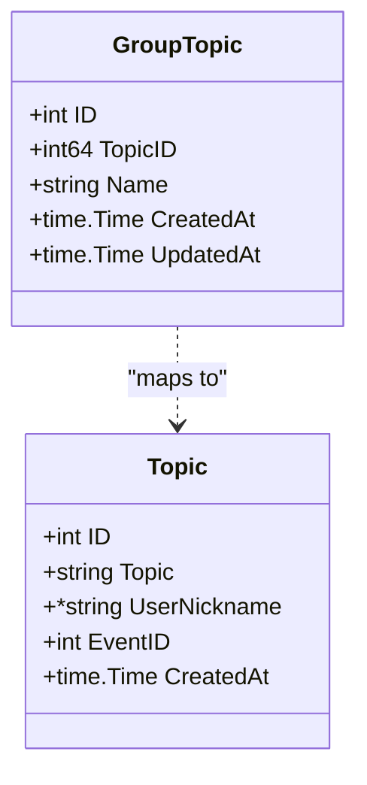
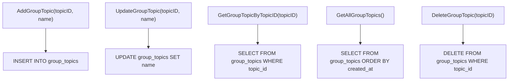
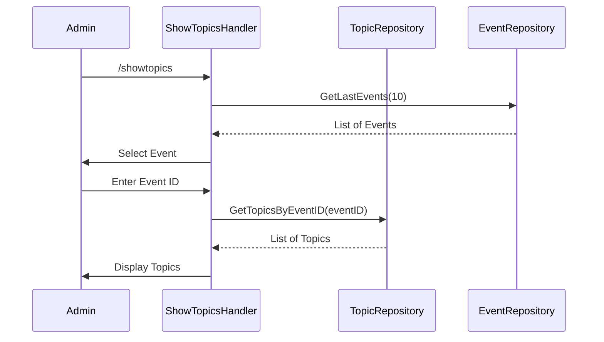
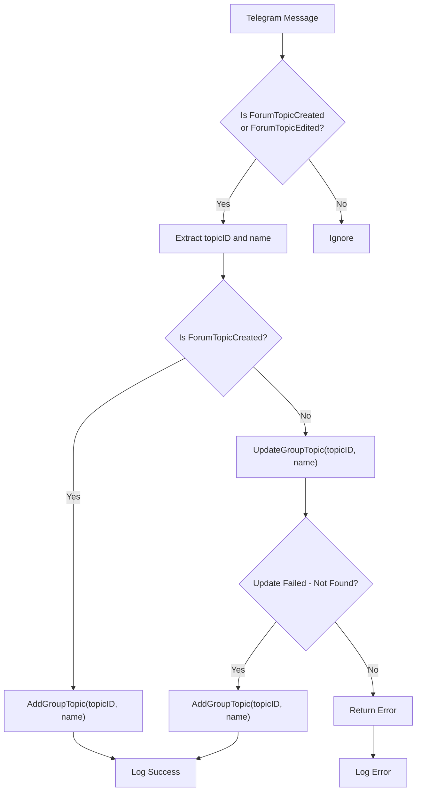

# Group Topic Repository

<cite>
**Referenced Files in This Document**   
- [group_topic_repository.go](file://internal/database/repositories/group_topic_repository.go)
- [topic_repository.go](file://internal/database/repositories/topic_repository.go)
- [save_topics_handler.go](file://internal/handlers/grouphandlers/save_topics_handler.go)
- [show_topics_handler.go](file://internal/handlers/adminhandlers/show_topics_handler.go)
</cite>

## Table of Contents
1. [Introduction](#introduction)
2. [Core Domain Models](#core-domain-models)
3. [Group Topic Repository Implementation](#group-topic-repository-implementation)
4. [Topic Repository and Event Mapping](#topic-repository-and-event-mapping)
5. [Event-Driven Topic Management](#event-driven-topic-management)
6. [Administrative Topic Operations](#administrative-topic-operations)
7. [Data Consistency and Synchronization](#data-consistency-and-synchronization)
8. [Error Handling and Robustness](#error-handling-and-robustness)
9. [Usage Patterns and Integration](#usage-patterns-and-integration)
10. [Conclusion](#conclusion)

## Introduction

The Group Topic Repository in evocoders-bot-go is a critical component responsible for managing forum topics within a Telegram supergroup. It enables persistent storage, retrieval, and update of topic metadata such as title, ID, and timestamps, ensuring that the bot maintains an accurate representation of the group's discussion threads. This documentation details the implementation of the `GroupTopicRepository`, its interaction with Telegram's API through event handlers, and its relationship with other domain entities like events and user topics. The system supports automated topic synchronization, administrative management, and integration with broader application workflows.

**Section sources**
- [group_topic_repository.go](file://internal/database/repositories/group_topic_repository.go#L1-L147)
- [save_topics_handler.go](file://internal/handlers/grouphandlers/save_topics_handler.go#L1-L116)

## Core Domain Models

The system employs two primary domain models for topic management: `GroupTopic` and `Topic`. The `GroupTopic` entity represents a forum thread in the Telegram supergroup, storing essential metadata including the Telegram-assigned `TopicID`, the thread's `Name`, and creation/update timestamps. This model is specifically designed to mirror the structure of Telegram's forum topics and is used for tracking active discussion threads within the group.

In contrast, the `Topic` entity represents a user-submitted topic associated with a specific event, containing the topic text, an optional user nickname, and a reference to the related `EventID`. This distinction allows the system to separate the management of forum threads (GroupTopic) from user-generated content (Topic), enabling flexible mapping between discussions and events.

**Diagram sources**
- [group_topic_repository.go](file://internal/database/repositories/group_topic_repository.go#L10-L16)
- [topic_repository.go](file://internal/database/repositories/topic_repository.go#L11-L17)

**Section sources**
- [group_topic_repository.go](file://internal/database/repositories/group_topic_repository.go#L10-L16)
- [topic_repository.go](file://internal/database/repositories/topic_repository.go#L11-L17)

## Group Topic Repository Implementation

The `GroupTopicRepository` provides a comprehensive interface for managing forum topic records in the database. It offers methods to add, update, retrieve, list, and delete group topics, all operating on the `group_topics` table. The `AddGroupTopic` method inserts a new record when a forum topic is created, returning the full `GroupTopic` object with database-generated fields. The `UpdateGroupTopic` method allows renaming of existing topics, automatically updating the `UpdatedAt` timestamp.

Retrieval operations include `GetGroupTopicByTopicID` for fetching a specific topic by its Telegram ID and `GetAllGroupTopics` for retrieving all tracked topics in chronological order. Deletion is handled by `DeleteGroupTopic`, which removes a topic by its `TopicID` and validates that the operation affected at least one row, ensuring data integrity. All methods include comprehensive error handling with contextual error messages that include the calling method's name via `utils.GetCurrentTypeName()`.

**Diagram sources**
- [group_topic_repository.go](file://internal/database/repositories/group_topic_repository.go#L25-L147)

**Section sources**
- [group_topic_repository.go](file://internal/database/repositories/group_topic_repository.go#L25-L147)

## Topic Repository and Event Mapping

The `TopicRepository` manages user-submitted topics linked to specific events, providing methods to create topics, retrieve all topics for an event, fetch a topic by ID, and delete topics. The `CreateTopic` method inserts a new topic with its associated event and user information, returning the generated database ID. The `GetTopicsByEventID` method retrieves all topics for a given event, ordered by creation time, which is essential for displaying chronological discussion lists.

This repository plays a crucial role in the event-topic alignment system, allowing administrators to view and manage topics associated with specific events. The `DeleteTopic` method includes robust error handling, logging issues with row count verification while still proceeding if the logical operation succeeded. The relationship between `GroupTopic` and `Topic` is indirect but significant: while `GroupTopic` tracks the forum structure, `Topic` entities represent the content mapped to events, with potential synchronization between the two systems.

**Diagram sources**
- [topic_repository.go](file://internal/database/repositories/topic_repository.go#L25-L114)
- [show_topics_handler.go](file://internal/handlers/adminhandlers/show_topics_handler.go#L1-L354)

**Section sources**
- [topic_repository.go](file://internal/database/repositories/topic_repository.go#L25-L114)
- [show_topics_handler.go](file://internal/handlers/adminhandlers/show_topics_handler.go#L1-L354)

## Event-Driven Topic Management

Topic synchronization is driven by Telegram events through the `SaveTopicsHandler`, which listens for `ForumTopicCreated` and `ForumTopicEdited` messages. When a new forum topic is created, the handler extracts the `MessageThreadId` and topic name, then persists it using `AddGroupTopic`. For edited topics, it attempts to update the existing record, with fallback logic to create the topic if it doesn't exist—handling edge cases where topic creation events might be missed.

The handler includes comprehensive logging for monitoring and debugging, capturing both the Telegram event details and database operation outcomes. It operates only in non-private chats, filtering out irrelevant messages. This event-driven approach ensures real-time synchronization between the Telegram group's state and the application's database, maintaining data consistency without requiring periodic polling.

**Diagram sources**
- [save_topics_handler.go](file://internal/handlers/grouphandlers/save_topics_handler.go#L1-L116)

**Section sources**
- [save_topics_handler.go](file://internal/handlers/grouphandlers/save_topics_handler.go#L1-L116)

## Administrative Topic Operations

Administrators can manage topics through the `ShowTopicsHandler`, which implements a stateful conversation flow for viewing and deleting topics associated with events. The process begins with `/showtopics`, prompting the admin to select an event from the most recent 10 events. After event selection, the system retrieves and displays all topics for that event using `FormatHtmlTopicListForAdmin`.

The handler then enters a deletion state, allowing the admin to input a topic ID for removal. Before deletion, it verifies that the topic belongs to the selected event, preventing accidental deletion of topics from other events. Upon successful deletion, it refreshes and displays the updated topic list, allowing for multiple deletions in a single session. The conversation supports cancellation at any point via the `/cancel` command or cancel button.

**Section sources**
- [show_topics_handler.go](file://internal/handlers/adminhandlers/show_topics_handler.go#L1-L354)

## Data Consistency and Synchronization

The system maintains data consistency through several mechanisms. The `SaveTopicsHandler`'s fallback logic—creating a topic if an update fails due to non-existence—ensures that topics are eventually consistent even if creation events are missed. Database constraints defined in migration files (e.g., `20250917_add_group_topics_table.go`) enforce data integrity at the schema level.

Timestamps (`CreatedAt`, `UpdatedAt`) provide temporal context for topics, while the separation of `GroupTopic` (forum structure) and `Topic` (event content) allows independent evolution of discussion threads and event topics. The system could be extended to track closure status by adding an `IsActive` boolean to `GroupTopic`, enabling identification of closed threads for cleanup operations.

**Section sources**
- [group_topic_repository.go](file://internal/database/repositories/group_topic_repository.go#L10-L16)
- [database/migrations/implementations/20250917_add_group_topics_table.go](file://internal/database/migrations/implementations/20250917_add_group_topics_table.go)

## Error Handling and Robustness

The repositories implement robust error handling with contextual error wrapping using `fmt.Errorf` and `utils.GetCurrentTypeName()`, making debugging easier by identifying the source method. The `GroupTopicRepository` methods distinguish between `sql.ErrNoRows` (expected when a topic doesn't exist) and other database errors, allowing for appropriate recovery strategies.

The `SaveTopicsHandler` demonstrates defensive programming by handling the case where a topic edit occurs before the creation is recorded, falling back to creation. The `TopicRepository`'s `DeleteTopic` method gracefully handles row count verification issues, proceeding with success if the logical operation completed. All error messages are logged with sufficient context for monitoring and troubleshooting.

**Section sources**
- [group_topic_repository.go](file://internal/database/repositories/group_topic_repository.go#L25-L147)
- [topic_repository.go](file://internal/database/repositories/topic_repository.go#L25-L114)
- [save_topics_handler.go](file://internal/handlers/grouphandlers/save_topics_handler.go#L1-L116)

## Usage Patterns and Integration

Key usage patterns include automatic topic registration upon creation, administrative topic management for content moderation, and event-topic alignment for structured discussions. The `GroupTopicRepository` is integrated into the message processing pipeline through `SaveTopicsHandler`, ensuring real-time updates. The `TopicRepository` supports administrative workflows through `ShowTopicsHandler`, enabling content curation.

For identifying closed threads, the system could query `GroupTopic` records and cross-reference with Telegram's API to detect closed status, then trigger cleanup operations. Mapping topics to events currently occurs through separate `Topic` entities, but could be enhanced by adding an `EventID` field to `GroupTopic` for direct association. The repository interfaces are designed for dependency injection, with handlers receiving repository instances through constructor injection.

**Section sources**
- [group_topic_repository.go](file://internal/database/repositories/group_topic_repository.go#L25-L147)
- [topic_repository.go](file://internal/database/repositories/topic_repository.go#L25-L114)
- [save_topics_handler.go](file://internal/handlers/grouphandlers/save_topics_handler.go#L1-L116)
- [show_topics_handler.go](file://internal/handlers/adminhandlers/show_topics_handler.go#L1-L354)

## Conclusion

The Group Topic Repository system in evocoders-bot-go provides a robust foundation for managing Telegram forum topics with comprehensive CRUD operations, event-driven synchronization, and administrative controls. The clear separation between `GroupTopic` (forum structure) and `Topic` (event content) enables flexible topic management while maintaining data integrity. With its comprehensive error handling, logging, and state management, the system effectively handles the challenges of synchronizing with Telegram's real-time API while providing administrators with powerful tools for content management. Future enhancements could include explicit closure status tracking and direct event mapping to further strengthen the relationship between forum discussions and organized events.