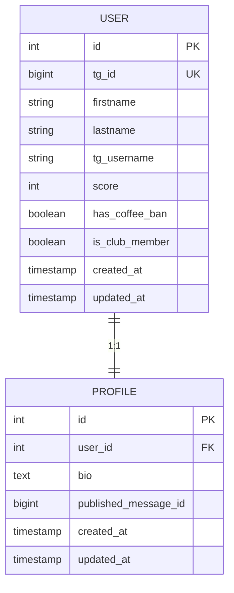
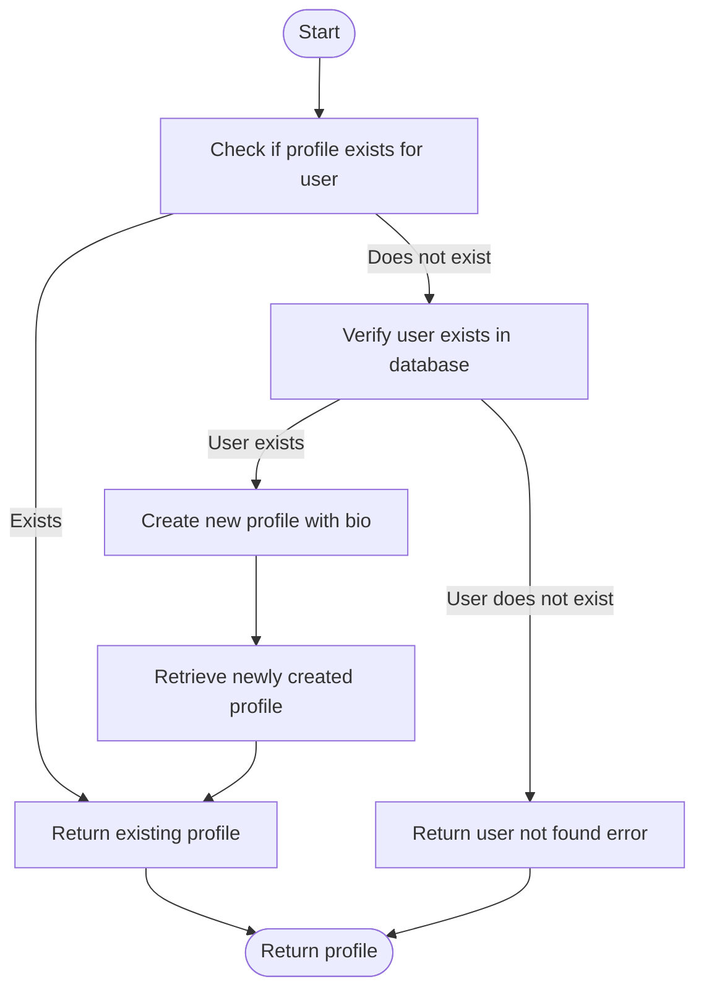
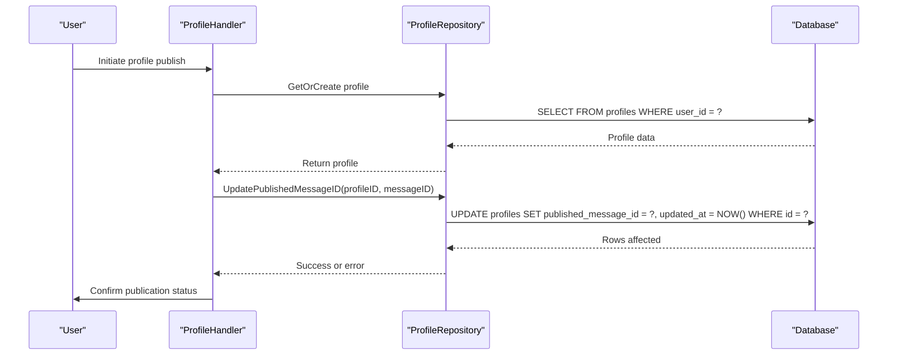
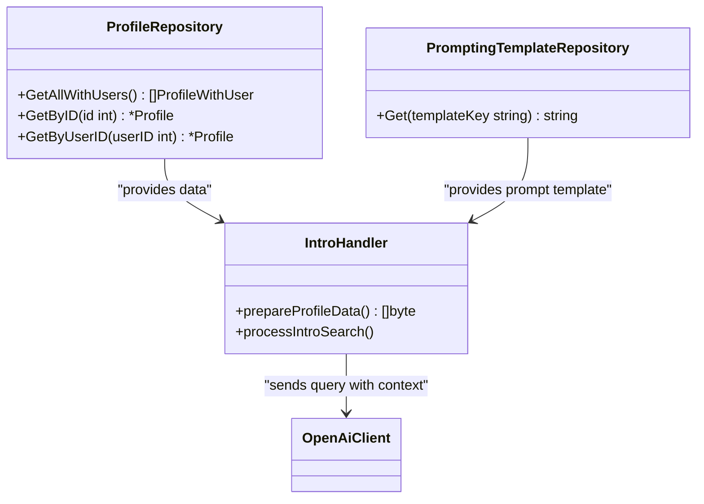

# Profile Repository

<cite>
**Referenced Files in This Document**   
- [profile_repository.go](file://internal/database/repositories/profile_repository.go)
- [user_repository.go](file://internal/database/repositories/user_repository.go)
- [profile_handler.go](file://internal/handlers/privatehandlers/profile_handler.go)
- [intro_handler.go](file://internal/handlers/privatehandlers/intro_handler.go)
- [profile_service.go](file://internal/services/profile_service.go)
- [profile_formaters.go](file://internal/formatters/profile_formaters.go)
- [20250519_add_users_and_profiles_tables.go](file://internal/database/migrations/implementations/20250519_add_users_and_profiles_tables.go)
- [20250520_add_published_message_id_to_profiles.go](file://internal/database/migrations/implementations/20250520_add_published_message_id_to_profiles.go)
- [20250807_add_profile_search_prompt.go](file://internal/database/migrations/implementations/20250807_add_profile_search_prompt.go)
- [profile_prompt.go](file://internal/database/prompts/profile_prompt.go)
- [prompting_templates_repository.go](file://internal/database/repositories/prompting_templates_repository.go)
</cite>

## Table of Contents
1. [Introduction](#introduction)
2. [Domain Model](#domain-model)
3. [Profile Creation and Retrieval](#profile-creation-and-retrieval)
4. [Profile Publishing and Status Management](#profile-publishing-and-status-management)
5. [Full-Text Search and AI-Powered Querying](#full-text-search-and-ai-powered-querying)
6. [Usage Patterns and Command Integration](#usage-patterns-and-command-integration)
7. [Error Handling and Data Integrity](#error-handling-and-data-integrity)
8. [Performance Considerations](#performance-considerations)
9. [Conclusion](#conclusion)

## Introduction
The Profile Repository component in evocoders-bot-go manages user profile data within the EvoCoders community bot. It provides a robust system for creating, retrieving, updating, and publishing user profiles, with integration into AI-powered search capabilities. The repository serves as a central data access layer between the application logic and the PostgreSQL database, ensuring consistent data handling across the bot's features. This documentation details the implementation of profile management, including the domain model, core operations, and integration with user-facing commands such as /profile and /intro.

**Section sources**
- [profile_repository.go](file://internal/database/repositories/profile_repository.go#L1-L20)

## Domain Model
The Profile Repository implements a domain model centered around the Profile entity, which is linked to the User entity through a one-to-one relationship. The Profile entity contains essential information about a user's professional identity within the community, including their biography and publication status. The User entity stores fundamental user information such as Telegram identifiers, names, and account status.



**Diagram sources**
- [20250519_add_users_and_profiles_tables.go](file://internal/database/migrations/implementations/20250519_add_users_and_profiles_tables.go#L1-L119)
- [20250520_add_published_message_id_to_profiles.go](file://internal/database/migrations/implementations/20250520_add_published_message_id_to_profiles.go#L1-L83)

## Profile Creation and Retrieval
The Profile Repository provides multiple methods for creating and retrieving profile records. The `Create` method inserts a new profile into the database with a specified user ID and biography, returning the generated profile ID. For retrieval, the repository offers `GetByID` to fetch a profile by its unique identifier and `GetByUserID` to retrieve a profile associated with a specific user. The repository also implements convenience methods like `GetOrCreate` and `GetOrCreateWithBio` that attempt to retrieve an existing profile and create one if it doesn't exist.



**Diagram sources**
- [profile_repository.go](file://internal/database/repositories/profile_repository.go#L100-L150)
- [user_repository.go](file://internal/database/repositories/user_repository.go#L300-L350)

## Profile Publishing and Status Management
The Profile Repository includes functionality for managing the publication status of profiles through the `UpdatePublishedMessageID` method. This method updates the `published_message_id` field in the profiles table, which stores the Telegram message ID where the profile has been published in the "Intro" channel. This feature enables the bot to track published profiles and update them when changes occur. The repository also provides an `Update` method that supports dynamic field updates, allowing specific profile attributes to be modified without affecting others.



**Diagram sources**
- [profile_repository.go](file://internal/database/repositories/profile_repository.go#L150-L180)
- [profile_handler.go](file://internal/handlers/privatehandlers/profile_handler.go#L500-L600)

## Full-Text Search and AI-Powered Querying
The Profile Repository supports full-text search capabilities through integration with AI-powered querying. The `GetAllWithUsers` method retrieves all profiles with their associated user information, filtering for profiles with non-empty biographies. This data is formatted as JSON and provided to the OpenAI API through a structured prompt template. The search functionality is implemented in the `intro_handler.go` file, which uses the profile data to generate context for AI responses to user queries.



**Diagram sources**
- [profile_repository.go](file://internal/database/repositories/profile_repository.go#L240-L280)
- [intro_handler.go](file://internal/handlers/privatehandlers/intro_handler.go#L150-L250)
- [profile_prompt.go](file://internal/database/prompts/profile_prompt.go#L1-L37)

## Usage Patterns and Command Integration
The Profile Repository is integrated into the bot's command structure through handlers that respond to user interactions. The `/profile` command triggers the profile management interface, allowing users to view and edit their profiles. The `/intro` command initiates AI-powered searches across all profiles. When a user edits their profile information, the `saveUserField` and `saveProfileField` methods in the profile handler update the corresponding fields in the database through the repository's update methods.

```mermaid
flowchart LR
A[/profile command] --> B[ProfileHandler]
C[/intro command] --> D[IntroHandler]
B --> E[ProfileRepository]
D --> E
E --> F[(Database)]
B --> G[UserRepository]
G --> F
D --> H[PromptingTemplateRepository]
H --> F
```

**Diagram sources**
- [profile_handler.go](file://internal/handlers/privatehandlers/profile_handler.go#L100-L200)
- [intro_handler.go](file://internal/handlers/privatehandlers/intro_handler.go#L50-L100)

## Error Handling and Data Integrity
The Profile Repository implements comprehensive error handling to maintain data integrity. Methods return specific error types such as `sql.ErrNoRows` when a requested record is not found, allowing calling code to handle these cases appropriately. The repository uses parameterized queries to prevent SQL injection attacks and employs transaction patterns in related migration code to ensure atomic operations. The `Update` method includes validation to prevent updates with no fields, and all update operations include `updated_at` timestamp updates to track modifications.

**Section sources**
- [profile_repository.go](file://internal/database/repositories/profile_repository.go#L50-L100)
- [20250519_add_users_and_profiles_tables.go](file://internal/database/migrations/implementations/20250519_add_users_and_profiles_tables.go#L50-L100)

## Performance Considerations
The Profile Repository includes several performance optimizations. The database schema includes an index on the `user_id` column in the profiles table to accelerate lookups by user ID. The `GetAllWithUsers` method filters results to include only profiles with non-empty biographies, reducing data transfer and processing overhead. For AI-powered searches, the repository provides a JSON-formatted dataset that minimizes the number of database queries required to gather profile information. The use of prepared statements and connection pooling through the underlying database driver further enhances performance.

**Section sources**
- [20250519_add_users_and_profiles_tables.go](file://internal/database/migrations/implementations/20250519_add_users_and_profiles_tables.go#L80-L90)
- [profile_repository.go](file://internal/database/repositories/profile_repository.go#L240-L260)

## Conclusion
The Profile Repository component provides a robust foundation for managing user profiles within the evocoders-bot-go application. By implementing a clean separation between data access and business logic, it enables reliable profile management operations while supporting advanced features like AI-powered search. The repository's design emphasizes data integrity, performance, and ease of integration with the bot's command structure. Its methods for profile creation, retrieval, and status management form the backbone of the user profile system, enabling community members to share their professional identities and discover others with similar interests.